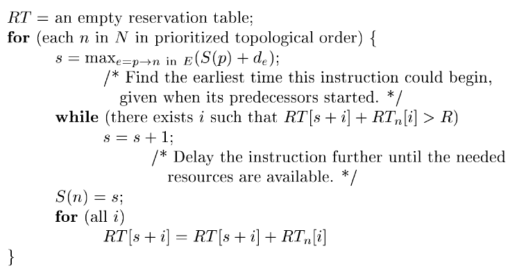
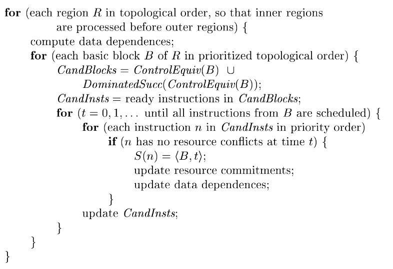
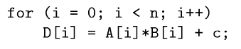
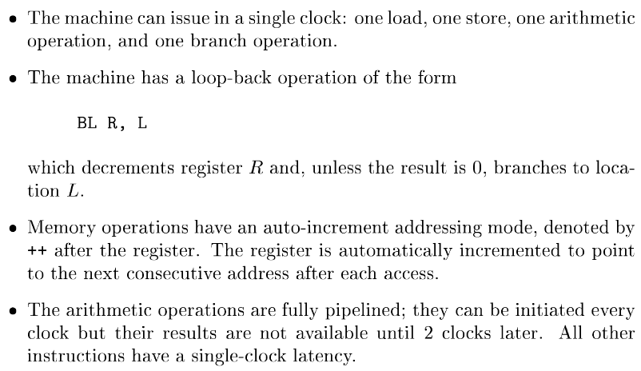
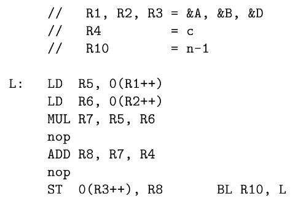
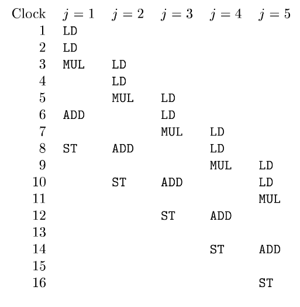
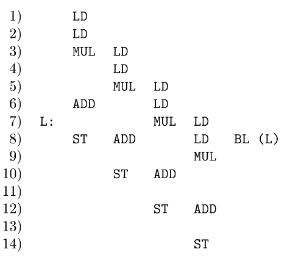

# 第10章 指令级并行性

关注四个问题：

1. 程序中潜在的并行性  
2. 处理器上可用的并行性  
3. 从原来的顺序程序中抽取并行性的能力  
4. 在给定的指令调度约束之下，找到最好的并行调度方案的能力

非数值应用通常可并行性较差，因为它们依赖于数据的分支来执行；而数值应用通常可并行性较好，结构中的元素上的数值运算通常是独立的。 

## 处理器体系结构

指令级并行：考虑在一个时钟周期内发射多条指令的处理器。同时也包括那些采用流水线架构的处理器。  
即使一个处理器每一个周期只能发送一条指令，但仍然可能有多条指令同时在各自的阶段上运行。  
可以由硬件来管理流水线中指令的依赖关系；在一些低功耗设备中，也使用软件编译器来管理，通过插入合适的 no-op 指令。
可同时执行的指令数量=指令发送宽度 x 流水线中平均阶段数目。  
多发送的指令可以由软件来确定，即 VLIW（非常长指令字）；也可以由硬件来管理，即超标量机器。

编译器可以通过把相互独立的指令放的比较接近，来优化指令调度器的执行。

## 代码调度约束

代码调度要遵守下面三种约束：

1. 控制依赖约束。所有原始程序中执行的运算，都必须在优化后的程序中执行到。  
2. 数据依赖约束。优化后的程序中，运算必须和原始程序中相应的运算生成相同的结果。  
3. 资源约束。调度不能超额使用机器上的资源。

约束保证了执行的结果，但由于改变了运算顺序，执行时某一点的内存状态可能会和原本顺序执行时的状态不一致。

### 数据依赖

通常而言，读不会影响变量之间的数据依赖，只有关系到写时，我们才需要考虑数据依赖。包括以下几个类别：

1. 真依赖：写之后读。  
2. 反依赖：读之后写。  
3. 输出依赖：写之后写。

后两种依赖被称为存储相关的依赖，可以通过把值放在不同的位置来消除这种依赖。  
数据依赖不可能在编译时期完全确定（由于指针）。通常我们只关心它们是否可能指向同一个内存位置，而不是具体访问哪个位置。

数组的数据依赖分析：通常考虑访问的下标的模式。  
指针别名分析：两个指针指向同一个对象。  
过程间分析：采用引用传递的语言，通常要分析是否同一个变量被当作两个或多个不同的参数传递。

### 寄存器分配与代码调度

在中间表示中，我们使用了无限多的伪寄存器。这样做能很精确地生成数据依赖，并以此优化。  
但当将这些寄存器映射到有限的物理寄存器时，这些映射会人为的生成存储依赖，限制了指令的并行性。  
反过来，并行执行要求存放同时计算出来的值，导致产生了更多的存储需求。  
这意味着，降低寄存器使用数量，和最大化指令级并行性，这两个目标之间存在冲突。

如果先进行寄存器分配，即使用尽量少的寄存器完成程序任务，那么可能会影响程序中的可并行性。  
如果先进行代码调度，即尽可能发掘程序中的可并行性，那么可能会使用过多的寄存器，导致寄存器使用溢出，不得不保存到内存上，降低整体运行效率。

要解决这两个目标的顺序问题，通常要考虑被编译程序的特性。  
对于非数值应用，并没有特别多能并行的地方，仅使用少量寄存器专门用于保存中间临时结果即可。对于这类应用，通常是先伪非临时变量分配寄存器，然后进行代码调度，最后再对临时变量分配寄存器。  
对于数值应用，则需要层次化地从内到外处理每一层循环。在每一层内进行指令调度，然后分配寄存器，再进行指令调度。在考虑同一个层循环内的多个内部循环时，还需要考虑同一个变量被多个内层循环分配到不同寄存器的情况，采用重命名的方式减少这类寄存器之间的复制。

### 投机执行

如果我们知道一条指令可能会执行，且有空闲的资源来“免费”执行这个指令，那我们就可以投机性地先执行这条指令。  
如果指令 i2 的指令依赖于指令 i1 的结果，称指令 i2 是控制依赖于指令 i1。

内存加载通常是能从投机执行中获利的，通常内存加载指令的执行时延较长，而使用到的地址又可以提前知道。  
但如果内存位置非法，可能会导致异常。
我们关注下面这几类于内存加载有关的投机执行。

预取指令：向处理器表明，该程序可能很快就要使用特定内存字，以便在实际使用数据前将其从内存移动到高速缓存。  
毒药位：投机性地将内存中的数据加载到寄存器文件。对于寄存器，设置一个毒药位表示，该投机加载是否访问了非法的位置。当遇到该类非法访问时，处理器先不抛出异常，而是只有毒药位的寄存器被实际读取时才抛出。  
带断言的执行：类似普通指令，但带有一个额外的断言运算分量。只有该断言被满足时指令才会执行。这类指令通常用于，将拥有控制依赖关系的指令替换为只有数据依赖关系的指令。这类代码减少了预测错误，但代价是，即使最后不需要执行带断言的指令，这些指令仍然需要被获取并解码。

一个带断言执行的例子。下面展示了原本的存在控制依赖关系的指令，以及采用断言执行替代的版本。

```cpp
if (a == 0) {
    b = c+d;
}

ADD R3, R4, R5
CMOVZ R2, R3, R1
```

### 基本的机器模型

一个机器 $M = <R, T>$ 由一个运算类型的集合 T， 和代表硬件资源的向量 $R = \lbrack r_1, r_2, \dots \rbrack$ 组成，其中 $r_i$ 表示第 i 种资源的可用单元的数量。  
每条指令具有一组输入运算分量、一组输出运算分量和一个资源需求。输入分量有对应的输入延时，代表该输入值必须在何时可用；输出分量有对应的输出延时，表明输出结果什么时候可用。  
每个指令 t 所需要的资源可以对应地建立为一个二维的资源预约表。$RT_t[i, j]$ 表示指令 t 在发出 i 周期后，需要占用资源 j 的数量。

## 基本块调度

### 数据依赖图

数据依赖图 $G=<N, E>$，其中 N 表示基本块种机器指令的运算，E 为有向边集合，表示运算之间的数据依赖约束。  
构造如下

1. N 中的每个运算 n 都存在一个资源预约表$RT_n$。 
2. E 中的每一条边 e 有一个时延标号 $d_e$。表示，目标节点必须在源节点发出后，至少 $d_e$ 个周期后才能发出。

### 列表调度方法

算法：采用带有优先级的拓扑排序（数据依赖图中不可能有环）。根据每个节点以及其之前已调度的节点之间的数据依赖约束，计算出该节点能被执行的最早时间。再根据资源预约表，检验该节点所需要的资源是否得到满足。最终将该节点安排在最早的能够获取足够资源的时间位置上。   
节点在最终不一定按照其被访问的顺序调度，但它会被尽可能早地放置在调度方案中。

其算法流程如下：



### 带优先级的拓扑排序

性质

1. 若没有资源约束，则最短的调度方案可以根据关键路径给出（即数据依赖图中的最长路径）。根据这一性质，可以将优先级设置为节点的高度，即从该节点出发的最长路径的长度。  
2. 如果所有运算独立，那么调度方案仅受到资源数量的限制。需要关注哪些数量较少但使用较多的资源，即关注最大的资源使用/可用资源数量这一比值。使用该值来估算资源的关键程度，使用更多关键资源的运算应该被设置更高的优先级。    
3. 最后我们考虑源代码中的运算顺序。在原本代码中先进行的运算拥有更高的优先级。

## 全局代码调度

考虑把一些指令跨基本块移动。  
要求满足以下两个要求：

1. 原程序中执行的指令必须都在优化后的程序中执行到。  
2. 投机执行的额外指令不能产生副作用。

B 支配 B'：从控制流图的入口，到达基本块 B' 的所有路径都经过 B。  
B 反向支配 B'：从 B' 到控制流图的出口的所有路径都经过 B。  
当 B 支配 B' 且B' 反向支配 B 时，称两者是控制等价的。这意味着，这其中一个基本块执行与否等价于另一个基本块。

考虑代码的向上移动，将一条指令从块 src 向前移动到 dst。这样的移动不能违背数据依赖关系。  
若两个块是控制等价的，则恰好运行一次；若 src 不反向支配 dst，则意味着存在原本不执行该指令的路径执行了该指令，要求该指令的执行不能有副作用；若 dst 不支配 src，则存在路径应该执行该指令但没有执行的，需要插入额外的被移动指令的拷贝。

考虑代码的向下移动。同样有 src 块和 dst 块。  
若 src 不支配 dst，则可能执行了额外的运算。被向下移动的指令通常为带有副作用的写指令，通常采用复制 src-dst 块的方式，或采用带断言的指令替换原指令的方式，来规避这个问题。  
若 dst 不反向支配 src，则可能遗漏了应该执行的运算，需要插入额外的补偿代码。

### 全局调度算法

基于区域的调度：支持两类移动方式

1. 将运算向上移动到控制等价的基本块。  
2. 将运算向上移动一个分支，移动到一个支配前驱中。

下图是其算法流程



循环展开：在上述调度算法中，循环中的迭代是代码移动的界限。可以采用循环展开的方式，增加可调度的并行性。  
相邻压缩：在上述调度算法之后，考虑那些需要引入补偿指令的移动。通常，这包括把一个迭代开始处的计算移动到上一次迭代的结尾，或把运算从第一个迭代移动到循环外。

### 动态调度器

当目标机器存在动态调度器时，静态调度器的主要功能是，尽可能保证延时高的指令被尽早被动态调度器获知。  
比如通过提前放置数据预取指令，减少告诉缓存脱靶带来的问题。

## 软件流水线化

关注对循环的调度，充分利用各个迭代中的并行性。

下面是一个例子：



我们假设目标机器具有如下特性



其对应的串行版本的翻译后代码如下



循环展开能提高硬件的利用率，但同时也会增加最终生成代码的大小。而软件流水线化能在优化资源使用的同时保持生成代码的简介。  
下面是一个例子，我们首先将原本的迭代展开 5 次，从中可以发现，7-8 与 9-10 执行的运算是一样的，且分别来源于其前面的四个迭代。



基于上述观察，我们可以将其流水线化为如下形态。其中 7-8 行即为流水线化的部分。



在这一设计中，我们可以将整个循环当作一个 8 阶段的流水线，每两个时钟周期启动一个新的迭代。  
注意到，对于单次迭代而言，上述流水线化的结果并不是最优的。

软件流水线化的主要目标是，使长时间运行的循环吞吐量最大（其拥有一个较小的流水线稳定状态）；次要目标是，使生成的代码保持合理的大小。

### 约束

资源约束：考虑可用资源的数量与每一轮迭代使用的资源数量。稳定状态的资源预约表被称为模数资源预约表。如果一个稳定状态的资源使用能够被满足，那么在序言和尾声中的资源也能被满足。  
数据依赖约束：考虑跨迭代的数据依赖。我们需要区分同一个运算在不同迭代中的实例。

上述两个约束均限制了流水线的吞吐。

