# 第12章 过程间分析

为什么需要过程间分析：过程内分析过于保守地假设，被调用的过程有可能改变其所有可见变量的状态，并产生副作用。

## 基本概念

### 调用图

调用图：指示过程间的调用关系的图。其满足：

1. 程序中的每个过程都是一个节点。  
2. 每一个调用点都有一个节点。调用点即程序中那些调用某个过程的位置。  
3. 如果调用点 c 调用了程序 p ，则存在一条从 c 指向 p 的边。

当程序对过程的调用是静态的，每个调用点均能唯一确定其调用的过程，那么就恰好有一条边指向该过程。  
在使用了过程参数或函数指针的程序中，对过程的调用需要到具体运行时刻才能确定，且实际上每次调用的过程有可能不一样，那么此时一个调用点可能指向不同的过程节点。对于面向对象的虚函数调用也是同理。

### 过程间相关

各个过程的行为与其被调用时所在的上下文是相关的。

可以粗略地将调用和返回语句看作 goto，将过程组装成一个超级控制流图，然后使用前面几章提到过程内分析方法来分析。这被称作上下文无关分析法。  
在这一转化中，需要添加调用和返回相关的控制转移，以及用于传递参数和返回值的赋值语句。

然而，上下文无关分析法难以找出与每次调用相关的性质，减少了可能的优化空间。而采用过程间相关分析法，能区分每次调用的上下文结果，找出更多的可能优化。

### 调用串

一个调用的上下文是通过整个调用栈中的内容来定义的。栈中各个调用点组成的串称为调用串。  
调用串的长度可能是不受限制的，通常我们选择不同的精确度。当仅使用调用串中最直接的 k 个调用点来分析上下文时，被称作 k-界限上下文分析技术。从这个意义上，上下文无关分析是 k=0 时的特例。  
另一个可行的方法，是对无环的调用串进行完全的上下文分析。

基于克隆的上下文相关分析：对每个感兴趣的上下文进行一次克隆，那么就可以对克隆后的调用图进行上下文无关分析。实际实现时，可以不实际进行代码克隆，而是用高效的内部表示来跟踪各个克隆版本的分析结果。

基于摘要的上下文相关分析：基于区域的分析技术的扩展。每个过程被刻画为一个简要的描述/摘要，以避免重复分析。  
对于没有递归的情况，整个程序被建模成一个有向图。类似区域分析中，外层-内层区域的关系。但与之不同的是，一个内部过程可能嵌套在多个外部过程内。  
包含自底向上（总结过程效果）和自顶向下（传播和调用者有关的信息，计算被调用者的结果）两个过程。  
对于存在递归的情况，采用求解不动点的方式来处理。首先找出调用图中的强联通分量，在自底向上时，只有一个强连通分量的所有后继都被分析完才考虑当前的。对于非平凡的强连通分量（即非单个节点），迭代地计算传递函数直到过程收敛。

## 过程见分析的应用场景

虚方法调用：在对虚方法调用的地方，通过过程间分析确定一些变量的类型，这样就可以明确地知道其在上下文中指向的是哪一个实际方法，进行内联并移除类型检查。  
指针别名分析：分析出多个指针之间是否可能互为别名，以减少可能的数据依赖关联，提高优化粒度。  
并行化：减少可疑的数据依赖关系，提升可寻找的并行性。  
检测软件错误和漏洞：比如检查跨越程序边界的代码之间的一致性（锁的使用，中断的屏蔽和重新启用）。

## 数据流的一种逻辑表示方法

### Datalog 简介

Datalog 是形如 Prolog 表示方法的语言。  
Datalog 的元素是形如 $p(X_1, X_2, \dots, X_n)$ 的原子。  
其中，p 是一个断言，表示一类语句；$x_i$ 是变量或常量的项。  
参数都是常量的断言被称为基础原子。每个基础原子表达一个特定的事实，其值要么为真要么为假。  
通常我们把断言表示成关系，即令该断言取真值的基础原子的表。

在 Datalog 中，我们使用规则来表示逻辑推断，以及如何完成对正确的事实的计算。  
一个规则的形式为：$H:-B_1 \& B_2 \& \dots \& B_n$。  
其中 H 和 $B_i$ 是字面值，即原子或原子的否定形态（我们使用在一个原子前加 NOT 的方式来表示其否定形式）。其中 H 不能是否定形式。  
H 是规则的头而 $B_i$ 组成了规则的体。每个 $B_i$ 有时被称为规则的子目标。  
符号 $:-$ 可读为如果。该规则的含义为，如果规则体为真，则规则头也为真。  
一个 Datalog 程序是一组规则的集合。此外，我们还在程序中应用两个规则：所有变量以大写字母开头；其他元素则以数字或小写字母开头。

Datalog 中程序的断言可以分为两类。  
EDB 断言，外延数据库断言，指那些事先定义的断言。  
IDB 断言，内涵数据库断言，只能通过规则来定义。

### Datalog 程序的运行

在 Datalog 程序的运行过程中，首先假设所有的 IDB 关系为空，重复运营规则不断推导出新的事实，直到推导过程收敛。这一算法与第 9 章中的迭代算法是类似的。

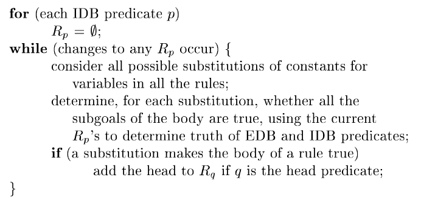

我们可以使用增量计算的方法提高上述算法的执行效率。增量计算基于一个性质：在第 i 轮被新发现的事实必须满足，它是对规则进行替换的结果，且它的至少一个子目标是在第 i-1 轮被发现的事实。  
我们可以在断言 P 中引入一个新断言 newP，表示该断言只对迭代中上一轮新发现的 p 的事实成立。  
我们把原本的每一个规则都替换为一组规则，其中每一个新规则为原来的规则中选择一个 IDB 规则 P 替换为新的 newP。同时我们把规则头 H 替换为 newH。这样得到的规则具有增量的形式。  
修改后的执行算法如下：

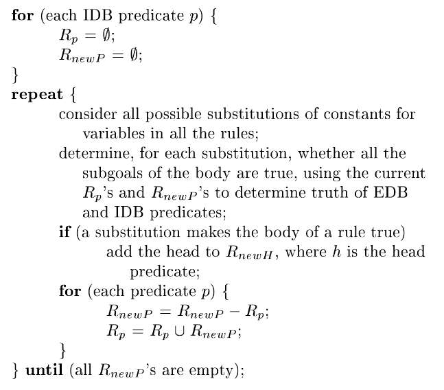

### Datalog 程序规则的限制

安全规则：出现在规则头中的任何变量都必须出现在规则体中。且该变量所在的子目标必须是一个普通的 IDB 或 EDB 原子。  
变量不能仅出现在一个否定原子或比较运算符中。  
这样限制是为了防止推导出无穷多个事实。

可分层的 Datalog 程序：我们必须能把 IDB 断言分解为多个层次。具体而言，对于一个规则头断言 p，如果其规则体中出现 NOT q 的形式，那么 q 要么是一个 EDB 断言，要么是一个层次低于 p 的 IDB 断言。  
这一限制，要求把程序的递归定义和否定定义分开。  
这一规则主要是为了保证求解的迭代算法能够收敛。

## 指针分析算法

关注问题：一对给定的指针是否可能互为别名。这需要我们求解每个指针可能指向哪些对象。

我们考虑拥有以下功能的指针模型（该模型类似 Java 语言规范中的模型）

1. 程序变量的类型可以为“指向 T 的指针”或“指向 T 的引用”。其中 T 是一个类型。这些变量可以静态，也可以位于运行时刻栈中。称为变量。  
2. 存在一个对象的堆。虽有变量都指向堆中的对象。称为堆对象。  
3. 一个堆对象可以有多个字段。一个字段的值可以是指向一个堆对象的引用，但不能是指向变量的。

算法关注的是基于包含的分析，即语句 `v = w` 使变量 v 指向 w 所指向的所有对象，但反过来不成立。  
在控制流无关分析中，赋值不会杀死任何指向关系，而只会生成更多的指向关系。

### Datalog 表示方法

我们考虑如下的四种可能影响指针的语句：

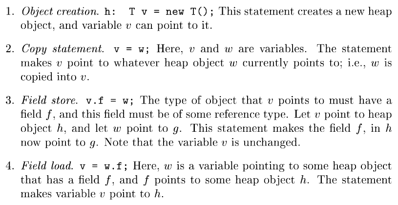

相对应的，我们需要计算如下两个 IDB 断言

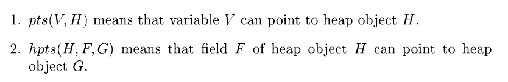

EDB 的确定只需要根据程序本身即可，因为是控制流无关分析。我们只需要确定程序中是否存在某种形式的指针相关语句。  
我们可以写出如下的 Datalog 规则

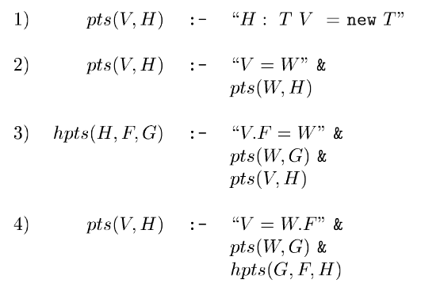

接下来我们考虑类型信息。在 Java 中，变量只能指向和它的声明类型相兼容的类型。  
据此，我们可以引入三个 EDB 断言，来将类型信息引入我们的分析中。这些 EDB 断言也都可以通过分析程序本身得到。

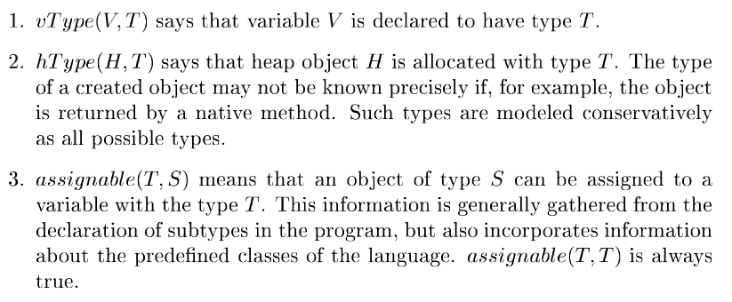

引入类型后，规则可以进一步精确化为

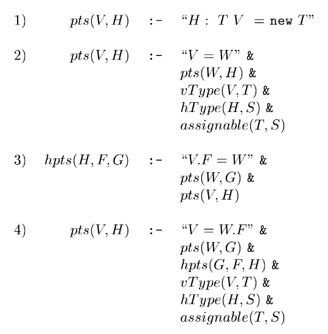

## 上下文无关的过程间分析

一个形如 `x = y.n(z)` 的方法调用，对指针关系的影响可以有如下三个方面：

1. 确定接收对象 y 的类型。  
2. 在对应 n 的过程中，对 this 和 z 两个形式参数的确定。  
3. 返回对象的类型。

为了在过程间进行上下文无关分析，我们需要引入三个新的 EDB 断言

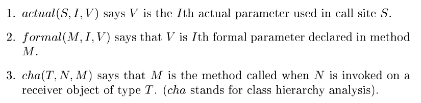

在该 EDB 断言之上，我们能构建出如下发现调用图的 Datalog 程序。

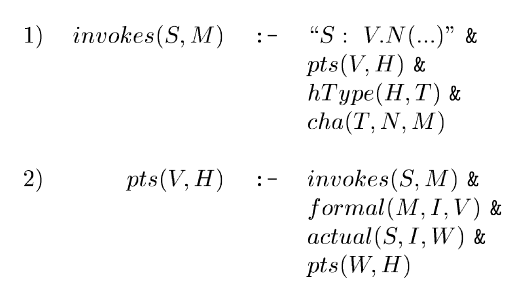

将该 Datalog 程序与前面的规则相结合，就可以得到上下文无关的指针相关性分析。

## 上下文相关指针分析

在该场景下运用摘要的分析方式是困难的，因为该摘要必须包括该函数和所有被调用者可能做出的所有更新的影响。上下文环境的数量可能可以按照指数级来增长。  
本节讨论基于克隆的上下文分析技术。  
逻辑上，处理上下文相关性，在运用克隆技术后，可以对克隆得到的调用图直接应用上下文无关分析法。  
为了表示指数量级的上下文，我们引入二分决策图 BDD 来表示这些信息。

类似前面对可能的递归造成的环的处理，我们求出调用图中的强连通分量，并且删去每个强连通分量中内部的调用点。

我们引入一个新的 CSinvokes 来表示在考虑上下文信息时，调用的断言。  
定义 CSinvokes(S, C, M, D) 为真的条件为，在上下文 C 的调用点 S 中调用了方法 M 的上下文 D。

对应的 Datalog 规则修改如下（这里没有考虑类型安全）

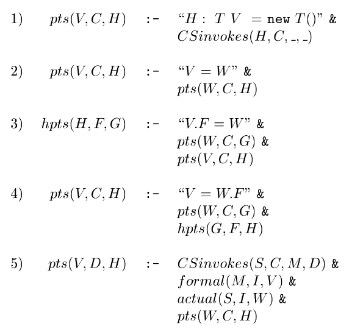

该方法存在的一些问题：  
堆对象通过其调用点来命名，这一命名本身不具有上下文相关性。可能存在同一个调用点被多次创建对象的情况（如在工厂方法中）。  
对象的相关性问题：考虑在某个程序调用点上，一个变量可能指向两个不同的接收对象，这两个接收对象内部的字段又指向不同的对象；这两个层次的对象之间是存在关联性的。

## 使用 BDD 的 Datalog 实现

二分决策图 BDD 使用图来表示布尔函数。  
这是一个带根的 DAG 图，其中每个内部与一个函数的变量有关，作为其标号。图的底边有两个叶子 0 和 1 表示最终得到的取值。  
每个内部节点有两条出边，低边表示取 0 ，高边表示取 1。对于给定的变量的一组赋值，我们使用这组赋值来指导我们在图中的前进方向。  
当无论走哪条路径，经过的参考变量的顺序都相同时，我们称该 BDD 为排序 BDD。

简化 BDD 的方法：  

1. 短路：如果一个节点 N 的两条出边都指向同一个节点 M，那么可以直接删去节点 N ，将原本指向 N 的边改为指向 M 。  
2. 节点合并：如果节点 N 和 M 的低边都指向同一个节点，高边也都指向同一个节点，那么可以将 N 和 M 两个节点合并。

我们也可以相反地运用上述方法，给图中添加新的节点。

我们使用布尔变量将关系转化为 BDD 中的取值。  
对于关系 r(A, B)，我们可以编码 A 和 B，然后组合成一个二进制串。 BDD 图中 0 和 1 的结果决定对应的关系是否成立。

接下来使用 BDD 实现关系运算

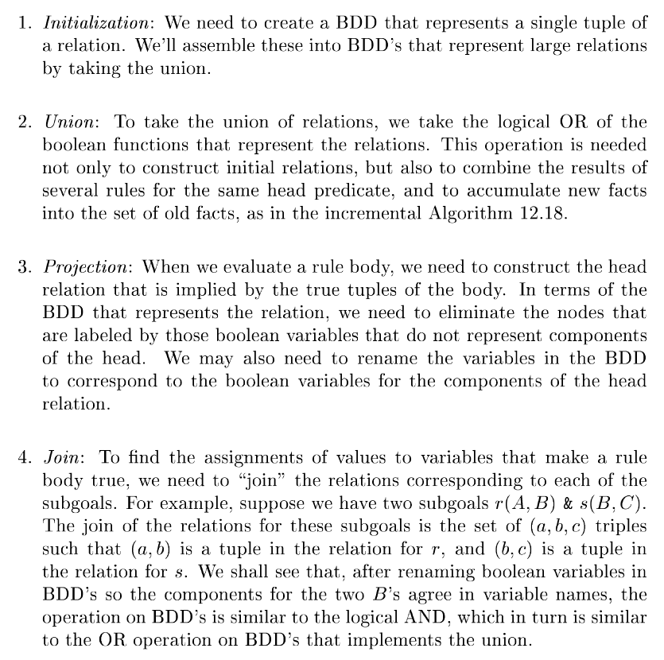

