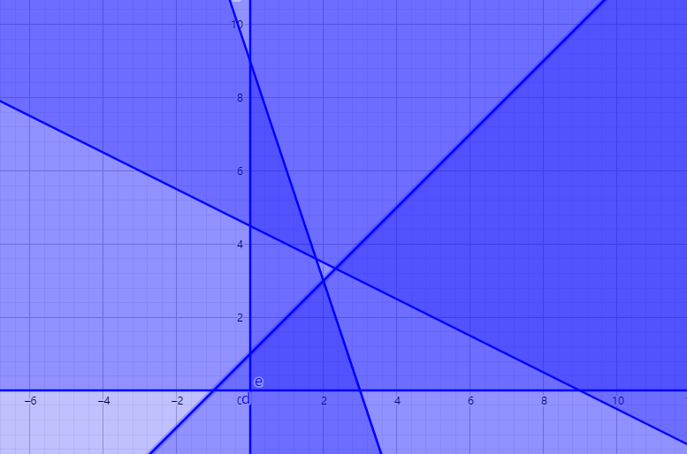
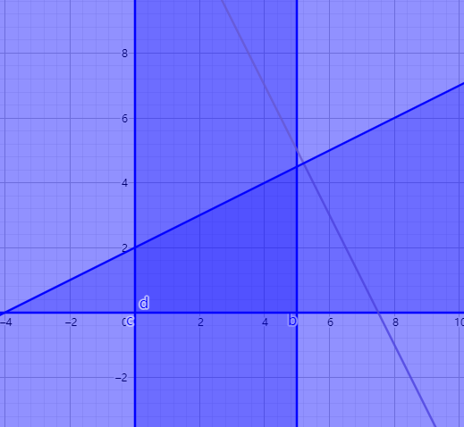
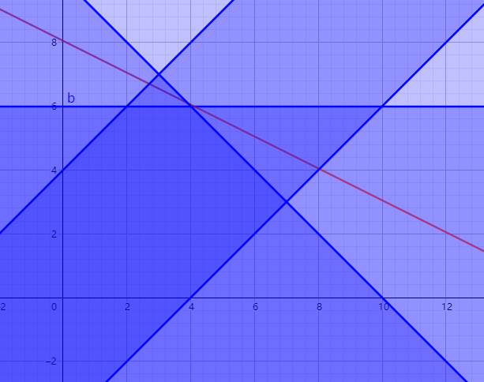

# 第六次作业

## 6.2
设使用三种咖啡豆的数量分别为 $x_1, x_2, x_3$（单位kg），则有如下建模：

$$
\begin{aligned}
\min z &= 20x_1 + 28x_2+ 18x_3 \\
x1 + x2 + x3 &= 1000 \\
75x_1+85x_2+60x_3 &\ge 75000\\
86x_1+88x_2+75x_3 &\ge 80000\\
0 \le x_1 &\le 500 \\
0 \le x_2 &\le 600\\
0 \le x_3 &\le 400
\end{aligned}
$$

## 6.4(5)
设 $x_1 = x, x_2 = y$，转化后有下列形式

$$
\begin{aligned}
y &\le x + 1 \\
y &\le -3x + 9\\
y &\ge -\frac 1 2 x + \frac 9 2\\
x &\ge 0\\
y &\ge 0\\
y &= \frac 3 2 x - \frac 1 2 z
\end{aligned}
$$
目标是最大化 z，作图如下：

由图可知没有可行解。

## 6.6
(1).设 $x = x_1, y = x_2$，变换得到

$$
\begin{aligned}
y &\le \frac 1 2 x + 2 \\
x &\le 5 \\
x &\ge 0 \\
y &\ge 0 \\
y &= -2x + z\\ 
\end{aligned}
$$
目标是最大化 $z$，作图如下：

可得 $z$ 的最大值为 $x=5,y=\frac 9 2$ 时取得，即 $z = \frac {29} 2$  
(2).标准形为

$$\begin{aligned}
\min z &=-2x_1-x_2 \\
-x_1+2x_2+x_3 &=4 \\
x_1+x_4&=5\\
x_1,x_2,x_3,x_4 &\ge 0
\end{aligned}
$$

$A = \begin{bmatrix}-1 & 2 & 1 & 0 \\ 1 & 0 & 0 & 1\end{bmatrix} = (P_1,P_2,P_3,P_4)$

下面分别讨论所有可能的基  
取基 $(P_1, P_2)$时，对应的可行解为 $(5, \frac 9 2, 0, 0)$，此时 $z=-\frac {29} 2$，对应图上的点为 $(5, \frac 9 2)$  
取基 $(P_1, P_3)$时，对应的可行解为 $(5, 0, 9, 0)$，此时 $z = -10$，对应图上的点为 $(5, 0)$  
取基 $(P_1, P_4)$ 时，无对应的可行解  
取 $(P_2, P_3)$ 时，不是基  
取基 $(P_2, P_4)$ 时，对应的可行解为 $(0, 2, 0, 5)$，此时 $z = -2$，对应图上的点为 $(0, 2)$  
取基 $(P_3, P_4)$ 时，对应的可行解为 $(0, 0, 4, 5)$ ，此时 $z = 0$，对应图上的点为 $(0, 0)$  
综上所述，最优解为 $(0, \frac 9 2, 0, 0)$

## 6.8
图解法：  
设 $x = x_1, y = x_2$，得到

$$\begin{aligned}
y &\le x + 4\\
y &\le 6\\
y &\le -x + 10\\
y &\ge x-4\\
y &= -\frac 1 2 x + \frac 1 2 z
\end{aligned}$$
目标是最大化 z。图示如下：

可得 $z$ 的最大值在 $x=4,y=6$ 时取得，最大的 $z=16$。

单纯形法：首先化为标准形式如下：

$$\begin{aligned}
\min z &= -x_1-2x_2 \\
-x_1+x_2+x_3 &= 4 \\
x_2+x_4 &= 6 \\
x_1+x_2+x_5 &= 10\\
x_1-x_2+x_6 &= 4
\end{aligned}$$

单纯形表如下：

从上到下，对应在图中的点分别为 $(0,0),(0,4),(2,6),(4,6)$

## 6.10(1)
先转化为标准形如下：

$$\begin{aligned}
\min z &= -2x_1+x_2-x_3\\
2x_1+x_2 +x_4&= 10\\
-4x_1-2x_2+3x_3 +x_5&= 10\\
x_1-2x_2+x_3 +x_6&= 14
\end{aligned}$$

单纯形表如下：

故最优解为取 $(x_1,x_2,x_3)=(4.8,0.4,10),z=-19.2$。

## 6.13
注意到该单纯性表中 $x_1$ 对应的那一列上，$x_1$ 的 $\lambda$ 为 0 且 $x_1$ 并不是基变量，那么这意味着，取 $(x_1,x_2,x_3,x_4)=(a,a+2,0,-3)$其中 a 为任意满足 $x_1$ 取值范围的值时，其最优化的解均为 2。所以有无穷多个最优解。

## 6.14
原线性规划的对偶形式为

$$\begin{aligned}
\min z &= 6y_1-5y_2-4y_3 \\
y_1-y_2+2y_3 &\ge 3 \\
y_1+2y_2+y_3 &\ge -2 \\
-y_1-y_2-3y_3 &\ge 1\\
-y_1+y_3 &\ge 4\\
y_1,y_2 &\ge 0,y_3任意
\end{aligned}$$
