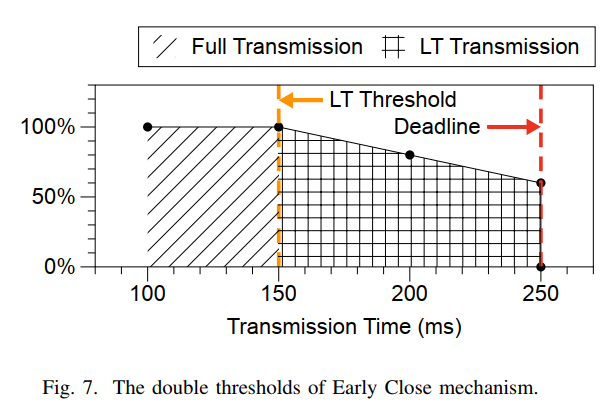

# Boosting Distributed Machine Learning Training Through Loss-tolerant Transmission Protocol
[ARXIV 2305.04279]

## Goal
在分布式机器学习任务下，通过容忍一部分数据包丢失，提高吞吐率并解决 long-tail latency 问题。

## Overview
key-idea：为接收端设置两个阈值，一个是接受区间，一个是接受截止时间。前者保证通信质量，后者解决 long-tail latency 问题。

在 PS 架构中，aggregation 是多对一容易出现 incast 问题，所以需要上述 loss-tolerant protocol；broadcase 是一对多则不需要，使用普通的传输协议即可。  
使用 bubble-filling 解决由于切割浮点数带来的错误。其实就是 padding。

基于 UDP 架构，参考了 BBR 的拥塞控制算法，即使用 probe 的方式主动测量时延和带宽。  
将包分为 critical packet 和 normal packet 来分别指定优先级，前者保证送达，后者允许丢失。

## Other
non-congestion packet loss 是否真的影响很大？这一现象的出现频次如何？
