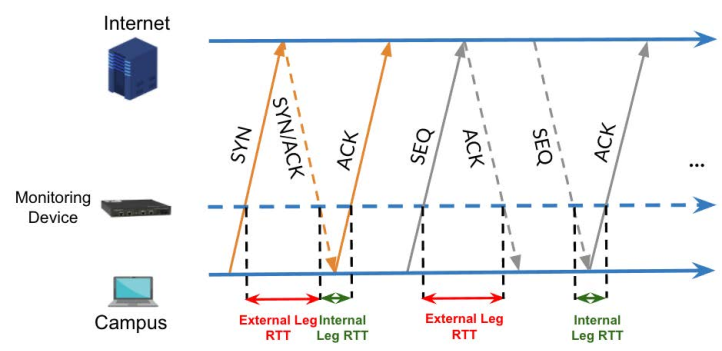
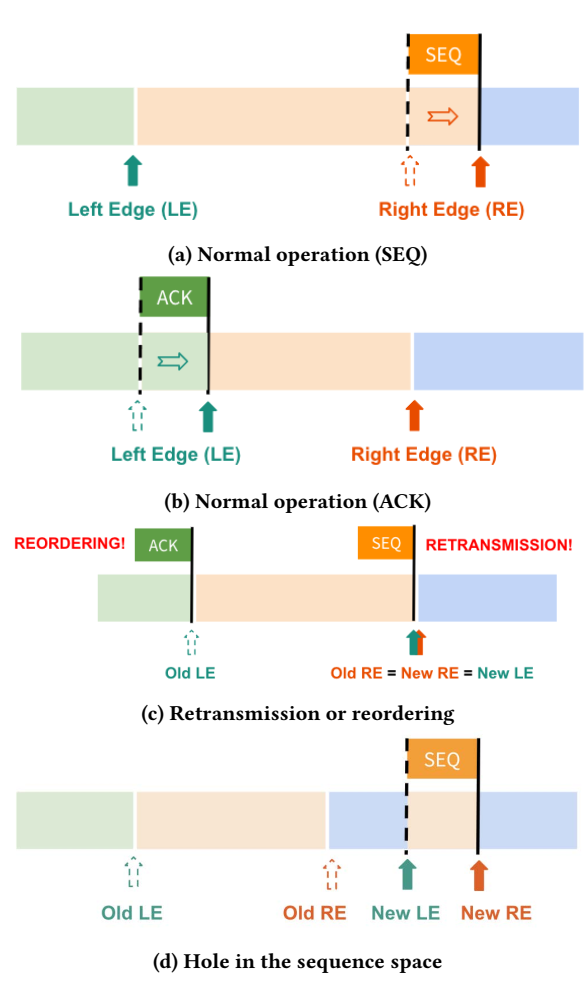

# Continuous In-Network Round-Trip Time Monitoring
[SIGCOMM 2022]

## Goal
monitor RTT continuously, automate detect network event

## Overview
only track packets that can generate useful RTT sample  
P4 prototype of a tofino switch  

monitor pair of TCP flow

track valid measurement ranges

lazy eviction with a second chance and recirculation  
completely ignore SYN and SYN-ACK packet (to avoid SYN flooding attacks)

## Extension
