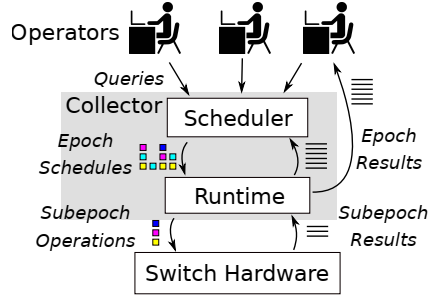

# Dynamic Scheduling of Approximate Telemetry Queries
[NSDI 2022]

## Goal
resource schedular  
approximation and scheduling algorithm -> reduce hardware resource usage of users' queries  
more robust to traffic dynamic and can execute dynamic workload. achieve the accuracy and latency of queries' requirement of

## Overview
telemetry systems must manage finite switch hardware processing resources while adapting to varying numbers and types of queries as well as varying traffic composition.

key contributions:

* Time-division approximation method: query operations do not need to run all the time.  
* adaptive scheduling algorithm: leverages time-division approximation to execute operations, balance between multiple high-level goals  
* Evaluation in a functional hardware prototype: implement DynATOS, a telemetry operation scheduling system

conclusion:  
time-division approximation is more robust than sketches to changes in traffic dynamics while offering a similar accuracy, overhead tradeoff space

ideal telemetry system requirements:

* query diversity  
* approximate execution: tradeoff of accuracy and resource requirements  
* traffic dynamics  

three components: Scheduler, Runtime, Switch Hardware  

## Extension
