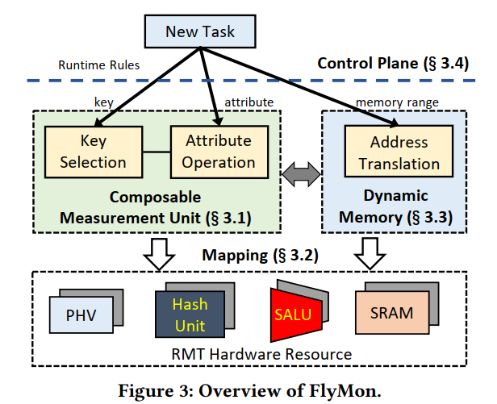
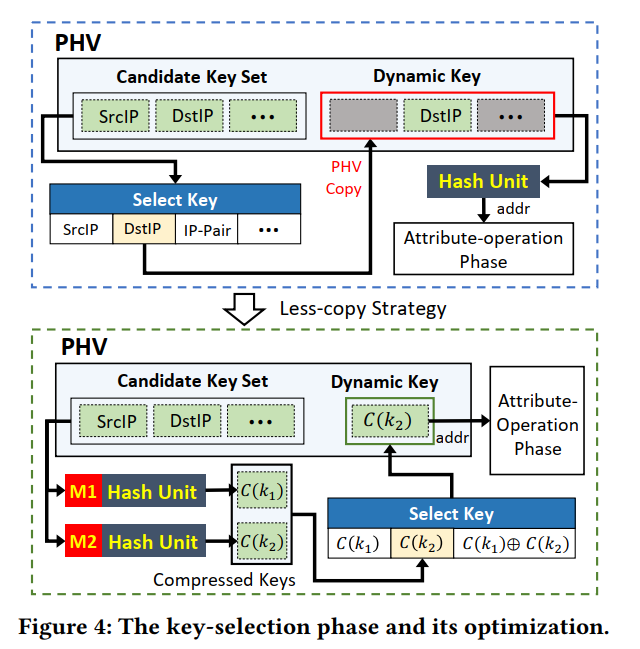
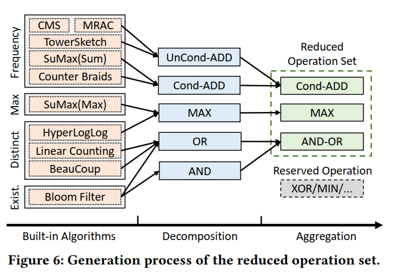

# FlyMon Enabling On-the-Fly Task Reconfiguration for Network Measurement
[SIGCOMM 2022]

## Goal
在 P4 可编程交换机交换机上实现 on-the-fly 的任务重配置，避免服务中断。

## Overview
key-idea： 将现有的广泛部署的若干测量任务抽象为 flow key 和 flow attribute，或者说 match-action。将动作统一，在交换机上实现这些动作（比如对 flow key 的哈希和使用 SALU 进行的动作），然后通过虚拟化的方式实时调整实际在执行的动作。

Composable Measurement Unit：将各个测量模块实现在交换机上，通过软件的形式在执行期将这些模块组装形成完整的测量流水线。分为 key-selection phase 和 attribute-operation phase。

key-selection phase：  
对哈希的处理：不同的测量任务可能需要组合不同的 packet-header 信息形成 flow-key，为避免每次部署新任务都要重新配置哈希，这里预处理所有可能的哈希情况，然后通过软件的形式做选择。可以认为是在默认的哈希找地址的过程上，又前置了一个哈希函数，将前一个哈希函数的结果作为后一个哈希函数的 key。由于组合的情况很多，交换机资源可能不能支持所有的，由于在交换机的每个阶段可以使用一次 SALU，所以使用异或的方式组合两种哈希，以获得更小的资源消耗和更广泛的表达。  
less-copy stategy：对哈希结果进行有损压缩以减小内存占用。为了减轻由此带来的哈希冲突增加，支持将一些重量的任务提前使用 filter 拆分成小任务来处理。

attribute-operation phase:  
使用这里主要的问题是，可以预置给 SALU 的运算符数量是有限的。解决办法是，首先在编译层将测量算法解码成 data-plane operation 和 control-plane analysis，只有前者是需要实现在交换机上的；然后是将一些可以合并的算子合并，比如 bit-wise AND 和 bit-wise OR。

在部署 CMU 到可编程交换机上时也有值得注意的地方。首先是，参考 CPU 流水线中阶段重叠的办法，将 CMU 组装成 CMU Group 来部署。由于不同阶段着重使用的硬件资源类型不一样，采用流水线的方法能很好地利用硬件资源。

动态内存分配：这里其实有点类似虚拟内存。由于可编程交换机分配的内存在运行时刻不能改变，所以为了达到 on-the-fly reconfiguration，给分配的内存增加了一层虚拟化。当然这也就牵涉到了内存地址翻译的设计问题。

## Other
感觉还是有一定局限性的，这个工作是对现有的一些测量工作的算法进行了分析，实际上是在算法层面再加了一层抽象，让软件来决定在运行时如何组装这些功能形成完整的运行时流水线。如果遇到新的算法可能需要重新设计。