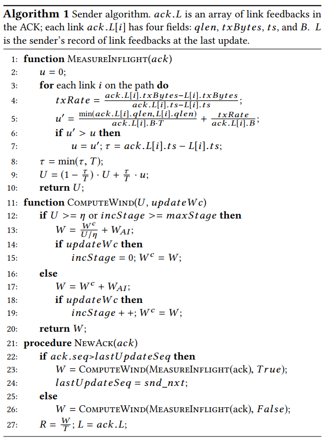
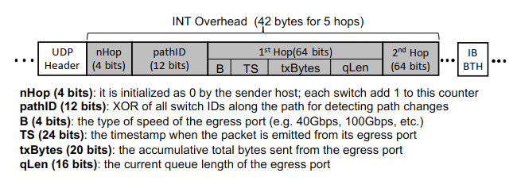
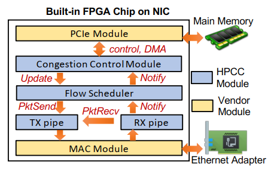

# HPCC High Precision Congestion Control
[SIGCOMM 2019]

## Goal
利用 In-network Telemetry INT 技术，设计一种在数据中心使用的拥塞控制 CC 算法，在满足低延迟、高带宽和高稳定性的同时，易于部署（不需要对网络拓扑的先验知识，少量的需要调整的参数，使用商业交换机和网卡中提供的 INT 功能）且保证公平。

## Overview
key idea: 传统拥塞控制算法被动地通过收包和先验知识获知链路状况，然后再作出决策，这不能很好地对链路发生的变化作出迅速的反应（比如出现拥塞后要快速降低发包率，链路空闲时应该快速提高发送速率等）。利用 INT 技术在发送时将交换机信息附加到包头，再通过 ACK 送回发送端，使得发送端能够准确地得知链路信息作出调整。

HPCC 是 window-based 的 CC ，且控制的是 inflight bytes 的数量而不是发送速率，这样能有效地避免在网络中已经发生拥塞时仍向链路中发送更多的包。这同时也是考虑到了，当出现拥塞时，INT 信息返回 host 端同样也会出现延迟，有效避免了基于速率的算法在信息返回前发送过多数据包的问题。  

由于存在估计误差和特殊情况，如果发送端对每一个返回的 ACK 中的 INT 都作出反应的话会导致 overreaction，使得算法不稳定。一个直白的想法是，我们记录那些每一次窗口大小发生变化时第一个发送的包，并仅对这些包返回的 ACK 中的 INT 信息作出反应。但这样一来，我们更新窗口的频率就变成了 per-RTT，无法处理紧急情况（failure, incast）。HPCC 将 per-ACK 和 per-RTT 这两种策略结合起来，定义了一个参考窗口大小在 per-RTT 更新。具体的算法流程如下：

HPCC 的 packet format

HPCC 在端系统上的实现（使用了板载 FPGA 的网卡）

## Other
文中提到了一个观察：由于需要随机内存访问，在硬件上实现 TCP 类似的拥塞控制算法是很复杂的（主要是由于 sliding window 需要支持对任意位置丢包的重传）。
