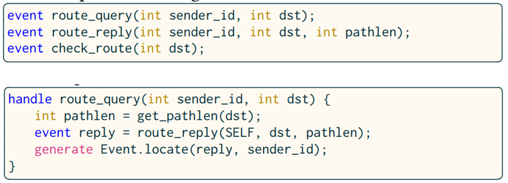
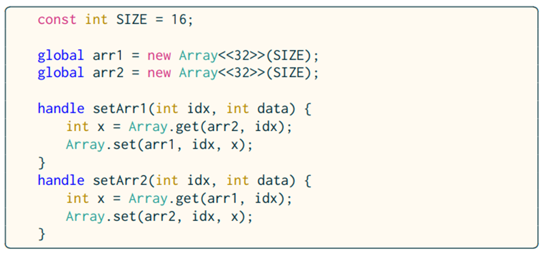
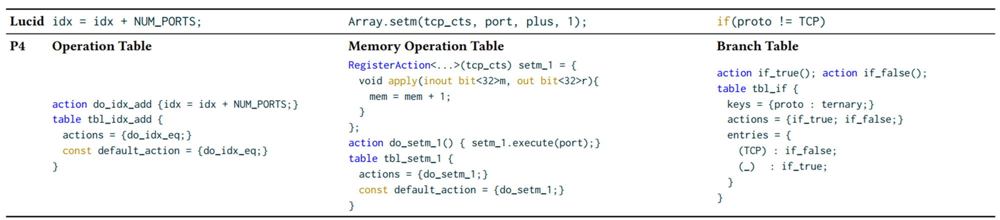

# Lucid A Language for Control in the Data Plane
[SIGCOMM 2016]

## Challenges

* Expressing control logic in packet processing abstractions (disjoint and low level primitive such as parser, match-action unit and packet recirculation)  
* Strict limitation of operating on persistent state (registers)  
* The data-plane language is hard to debug  

## Overview

Lucid: Event and handler  

* Event: carries user-specific data  
* Handler: define the computation

Time and locations  
Arrays

> correct-by-construction approach: domain-specific syntactic constraints, and a novel type system.

Packet-driven: break control tasks down into atomic operations driven by the arrival of packets

### Integrated data-plane control

Low-latency-control matters.  
Packet-driven control operations  

> Break control tasks down into atomic operations driven by the arrival of packets  
> Recirculate packets to implement control logic

Scheduled place and time via switch’s engine

> Place: multicast engines, etc.
> Time: PFC packets

Complexity

### Implementation

Event-driven programming  
Data-plane event scheduler  

Operating with persistent state  
Goal  

* Quickly identify invalid programs and show source-level error message  

Constraints:  

> A single return statement of an if statement containing one return in each branch  
> Each variable is used at most once per expression  
> Only ALU-supported operators are used  

Well-ordered programs  

> Data accesses in every handler follow the same order as in global

Type-and-effect system

> Each ordered variable is associated with a stage

## Limitation

* Only targets the Intel Tofino  
* State sharing across pipelines (one ingress and egress pipeline per 16 ports)  
* Lack abstraction for PISA processor’s TCAM-based match-action table  
* Compute-bound tasks  
* Data-plane integrated control -> recirculation overhead

