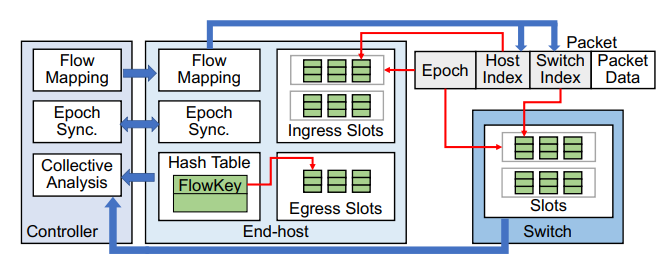

# OmniMon Re-architecting Network Telemetry with Resource Efficiency and Full Accuracy
[SIGCOMM 2020]

## Goal
实现一种同时满足 resource efficiency 和 full accuracy 的网络测量系统。同时注意 consistency 和 accountability 的一致性问题。

## Overview
key idea: 将传统的测量功能模块化分散到不同的网络硬件上（end-host, switch 和 controller）

对于每一个流在 end-host 端生成 host index。由 controller 统一生成标号并下发给 end-host 保证不会冲突。switch index 也是类似的，但是由于 switch 资源限制无法为每个流分配，所以是共享的，但是 controller 要尽量保证合理的分配标号使得后续解方程的时候有解。

时钟同步与一致性保证：无法做到所有硬件上时钟完全一致，可能导致同一个包的信息被聚合到不同的 epoch 中（还需要考虑延迟和重传的包）。解决办法是，首先每个包携带一个 epoch 信息保证会在同一个 epoch 内处理。当一个 end-host 的本地时钟触发 epoch 更新后，立刻通知 controller，controller 也将更新信息下发到所有其他 end-host。switch 不做 epoch 本地更新触发。如果机器规模很大，可以将 controller 升级为一个两层的树结构。

通过 switch 信息解唯一方程：基于数据中心的流量特点，大量简化方程中的参数，使得基本上不会出现无解或多解的情况。

## Other
数据中心的流量特点：流量具有本地性，即大部分的流量被限制在一个机架或集群中；得益于拥塞控制算法，丢包实际上出现的次数很少，且在一个区域内的丢包通常倾向于出现在一台交换机上。
