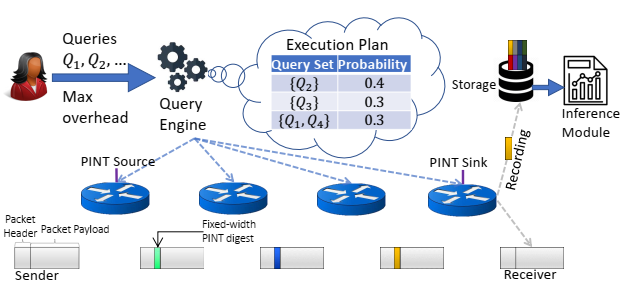

# PINT-Probabilistic In-band Network Telemetry

[SIGCOMM 20]

## Goal
network telemetry in-band, bounds the amount of information added to each packet  
reduce the overhead of INT

## Overview
basic idea: collecting all values (per packet, per switch) pose an exssesive and unnecessary overhead.

Aggregation operations:

* per-packet aggregation  
* static per-flow aggregation  
* dynamic per-flow aggregation

use bit-budget to make the network flow to operate without being aware of the telemetry queries and path length

PINT allows the operator to specify multiple queries that should run concurrently and a *global bit-budget*.  
PINT add a *digest* to each packet as a short bitstring whose length is equal to the lenght of global bit-budget.

each query instantiate: encoding module, recording module, interface module.  
encoding runs on the switches and modifies the digest of packet.  
PINT remains transparent to both sender and receiver.

challnge: bit constraints, switch coordination, switch constraints (limit support for arithmetic operations) 

switch coordination - global hash function  
distrubuted encoding schemes - reduce the number of packet needed to collect the telemetry information -> fully distributed without communication  
compression techniques - reduce the number of bits required to represent numeric values  
probabilistic techniques - reduce the bit-overhead on packets, eg Reservoir Sampling algorithm -> some of algorithms are approximate  
sketching algorithm - no need to store all the incoming digest in Recording Module

* Baseline theme  
* XOR theme

## Extension