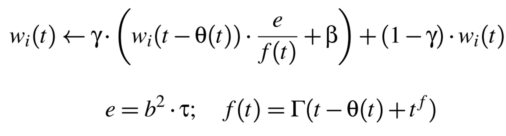
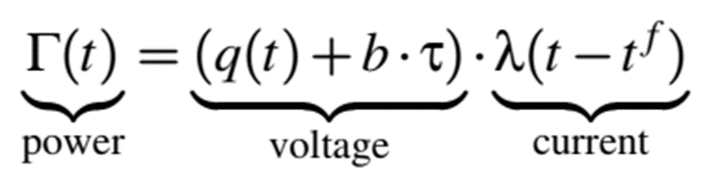

# PowerTCP-Pushing the Performance Limits of Datacenter Networks

[NSDI 2022]

## Goal
instantaneously react to changes in network  
well-suited in dynamic network environments  

## Overview
power = voltage $\times$ current  
voltage: react to absolute network state, equilibrium, slow reaction  
current: react to variation, unstable with no equilibrium, fast reaction  

in this paper: 
Voltage = BDP (bandwidth-delay product) + queue bytes  
current = Total rate ( sum of q-gradient and q drain rate)

a single bottleneck link model

measurement: in-band network telemetry (INT)

$\theta-$PowerTCP: use RTT and RTT-gradient with legacy, non-programmable switches

## Extension
Model extensionability  
competition within different congestion algorithm
