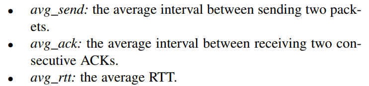
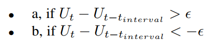

# QTCP Adaptive Congestion Control with Reinforcement Learning
[TNSE 2018]

## Goal
将强化学习算法引入 TCP 拥塞控制。

## Overview
key idea：让强化学习的 agent 在每一个时刻根据当前环境，对 cwnd 的修改作出选择（增加，减少，保持不变）。与传统方法相比，引入强化学习能够在不需要先验知识的条件下，对未知的/新出现的/特征变化的网络环境适应得更好（cognitive radio network, dynamic spectrum access link）。

action：只有三种，+10,-1 和 0 。state：选取了以下三个环境状态作为环境输入（均为被动测得的数据）

为了防止出现扰动，每隔 t 时间才进行一次环境信息统计 + agent action，让前一个动作拥有足够的时间发挥其效果，使其在环境中展现出来。  
定义 $Utility = \alpha \times \log(\texttt{throughput}) - \delta\times\log(\texttt{RTT})$。奖励为这个函数关于时间的差分（即在执行动作之后，这个效能函数是更大了还是更小了。

直接使用 Q-Learning 会导致 Q-table 状态数过多，学习训练效率低。采用基于 Kanerva coding 的 Function approximation 的方式，在状态空间内选取若干个点作为代表，每个点拥有一个作用范围，在其作用范围内的状态点能够用来更新该采样点的值，而一个状态的 Q-value 则与作用范围包括了该点的所有代表点有关。  
传统的 Kanerva 算法采样可能不均匀，可能出现，需要重点关注的地方代表点过少而不重要的空间代表点过多的情况。朴素的解决办法是，周期性地对采样点过滤并生成新的采样点，但这样可能会丢弃在那些废弃点中的重要信息，而引入新点的无信息参数会导致效果下降，需要更多轮次的学习。  
这里引入了 Hot zone 和 Cold zone 的概念，将足够多的代表点分配到两张图上（hot zone 数量较少而 cold zone 数量较多），仅有 Hot zone 负责 Q-Table 的更新，但是反馈是同时在两张图上操作的。当需要对采样点的选取优化时，将 hot zone 中不优的点移入 cold zone，同时从 cold zone 中替换出等量的好点。

## Other

* 与 INT 或者其它主动测量手段结合，更好地对网络环境建模  
* 改为让 RL 控制发送速率 / in-flight bytes 数量而不是窗口大小，比 cwnd 更为直接。
* 