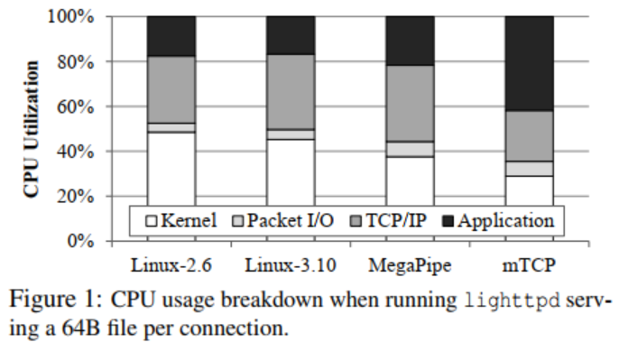
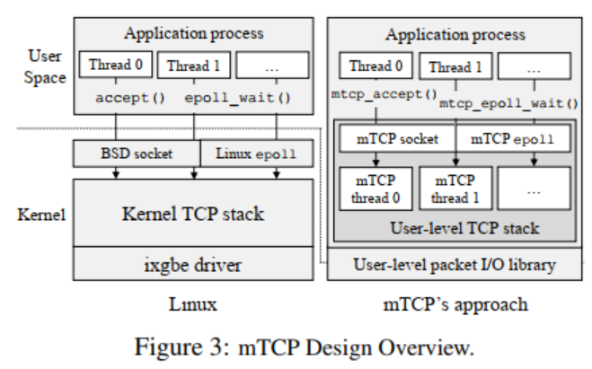
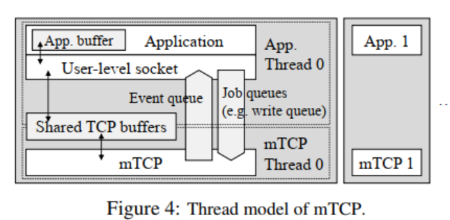
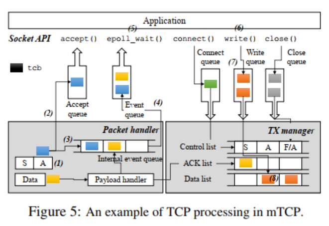
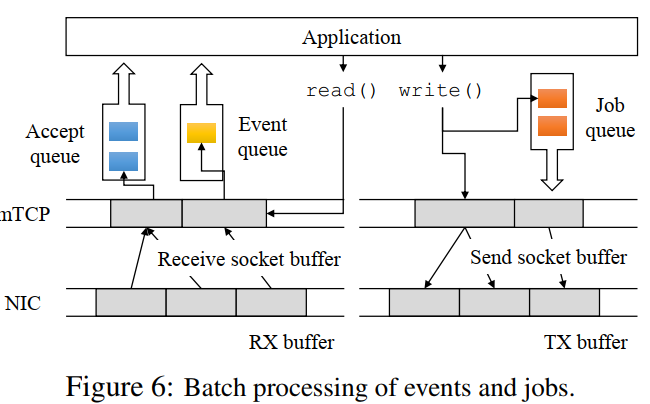

# mTCP: A Highly Scalable User-level TCP Stack for Multicore Systems

[nsdi14]

## Abstract
user-level TCP stack

adoptation:

1. multiple expensive system call -> single shared memory reference
2. flow-level aggregation
3. batched packet I/O

25x - latest Linux TCP stack
3x - best-performing research system

## Introduction
short TCP connections dominate the number of TCP flows ( < 32kb - over 90%, < 4kb - more than half )  
prior studies: requires significant modifications within the kernel and re-written of existing applications.

goal:

1. multicore scalability of the TCP stack
2. ease of use
3. ease of deployment

key approach: amortize the context-switch overhead over a batch of packet-level and socket-level events ( requires a careful design ).

## Background and Motivation

Limitations of the Kernel's TCP Stack

1. lack of connection locality (multi-thread app - one port - contend for a lock - significant performance degradation; kernel code and data-needed app run on diff cpu )
2. shared file descriptor space (file descriptor - overhead of going through the Linux Virtual File System )
3. inefficient packet processing (batch - not full-fledged TCP stack - not fully incorporated into the kernel )
4. heavy system call overhead (many short-lived concurrent connections - frequent user/kernel mode switching - frequent system call - processor state pollution and performance penalties )

Benefits of user-level TCP

Linux and MegaPipe: low efficient of CPU usage.

## Design

TCP stack in the user level:

highest level: App -> mTCP library (socket API, event-driven programming interface)  
user-level TCP stack: as a thread on each CPU core. mTCP thread directly transmits and receives packets to and from the NIC using custom packet I/O library.

### User-level packet I/O library:

mTCP extends the PacketShader I/O engine (PSIO) to support an efficient event-driven packet I/O interface.  
PSIO: amortuze the overhead of system call and context switches throughout the entire system.  
packets reveived and transmitted in batches.

### User-level TCP stack

naturally eliminates many system calls.

a separate TCP thread  
app and mTCP communication: via shared TCP buffer (access granted only through the library functions, for safety)  
app places a request to a job queue to modify the shared data (multiple request, batched)  
challenges: managing concurrent data structure and context switch between the application and the mTCP thread (much larger than the system call)

#### Basic TCP Processing

queue, signal

#### Lock-free, Per-core Data Structure
minimize inter-core contention between the mTCP threads: localize all resources in each core.

thread mapping and flow-level core affinity:  
a). packet I/O layer -> evenly distribute TCP connection workloads across available CPU cores with RSS -> reduces the TCP scalability problem to each core  
b). one TCP thread for each app thread, co-locate in the same physical CPU core (cache friendly)

Multi-core and cache-friendly data structures:  
important data structure local to each TCP thread (eg. flow hash table, socket id manager, and the pool of tcb and socket buffers)  
reduce sharing across threads and CPU cores, high parallelism  
for data structures must be shared: local to each core, lock-free data structure, single-producer and single-consumer queue  
keep frequently accessd ds small, aligned cache line - maximize benifit of the CPU cache  
memory allocation/deallocation: per-core memory poll for tcbs and socket buffers, huge pages (reduce TLB misses)

Efficient TCP timer management:  
two types of timers: a) a sorted list, for coarse-grained timers. b) a hash table, for fine-grained timers.

### Batched Event Handling

use queue in both RX and TX directions, transparently enables batch processing.

### Optimizing for Short-lived Connections
Priority-based packet queueing:  
control packets mostly small size -> be delayed for a while, for large number of data packet.  
prioritize control: seperate list. a control list and a data list -> prevent short connections from being delayed by other long connections.

Lightweight connection setup:  
pre-allocate large memory space and manage them in user level

## Application Programming Interface
provide: a socket API and an event-driven programming interface.

User-level socket API:  
BSD-like  
allows parallel socket creation from multiple threads (avoid lock contention)  
socket(): return any available fd number instead of the minimun available fd

Applications:  
trade-off:   
a). shared memory space -> limited protection (bugs in the application can corrupt the TCP stack)  
b). socket fd (not the minimum available fd)  
c). moving the TCP stack will also bypass all existing kernel services, such as the firewall and packet scheduling
