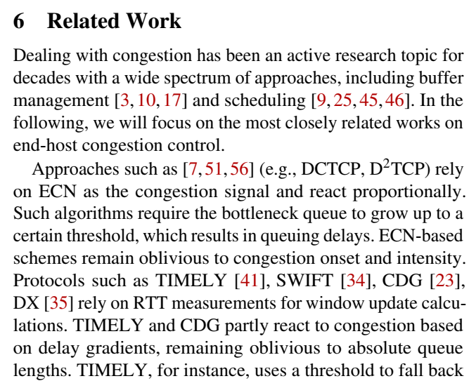

# 可能需要读的paper

## 带宽测量
### [NSDI 2021] Fast and Light Bandwidth Testing for Internet Users
使用更少带宽、测量时间和服务器的 BTS。

### [NSDI 2018] Distributed Network Monitoring and Debugging with SwitchPointer
网络情况监控与调试系统。在每一个 switch 不仅保存用于监控功能的信息，而且保存指向终端中保存着通信信息的指针。

### [SIGCOMM 2020] PINT: Probabilistic In-band Network Telemetry
在多个网络 packet 中编码需要的测量信息，减少因网络测量带来的额外开销。

### [NSDI 2022] Dynamic Scheduling of Approximate Telemetry Queries
智能应对网络动态变化的测量方法  
telemetry systems ought to decide on their own and at runtime when and for how long to execute the set of active queries on the data plane

### [NSDI 2021] LightGuardian: A Full-Visibility, Lightweight, In-band Telemetry System Using Sketchlets

### [SIGCOMM 2022] Continuous in-network round-trip time monitoring
这个更多的是 RTT 测量，不过既然 RTT 对带宽测量应该也有影响，故列在这里  
an inline, real-time, and continuous RTT measurement system that can enable automated detection of network events and adapt (e.g., routing, scheduling, marking, or dropping traffic) inside the network

## 拥塞控制
### [RFC8257] DCTCP
专用于数据中心 Data-Center 的 TCP 拥塞控制协议。

### [NSDI 2022] POWERTCP: Pushing the Performance Limits of Datacenter Networks
也是专用于数据中心的 TCP 拥塞控制协议。通过 in-band network telemetry 实时反应网络情况的变化，同时避免吞吐量下降。  
well-suited for dynamic network environments and bursty traffic patterns  
in both traditional datacenter topologies and emerging reconfigurable datacenters

这篇文章还贴心地总结了拥塞控制的相关工作，并按照方法进行了分类。

### [NSDI 2022] Backpressure Flow Control
BFC provides per-hop per-flow flow control, but with bounded state, constant-time switch operations, and careful use of buffers and queues.  
Tofino2

### [NSDI 2018] Copa: Practical Delay-Based Congestion Control for the Internet
an end-to-end congestion control algorithm

### [NSDI 2021] Breaking the Transience-Equilibrium Nexus: A New Approach to Datacenter Packet Transport
A congestion control algorithm to achieve good behaviour without rich congestion signaling or packet schedualing support from the network

### [SIGCOMM 2022] Elasticity detection: a building block for internet congestion control
Congestion Control, Elasticity Detection

### [SIGCOMM 2022] Starvation in end-to-end congestion control
Starvation

### [SRDS 2014] End-to-End Congestion Control for Content-Based Networks
an equation-based flow-control algorithm that reacts to congestion in a manner similar to and compatible with TCP.

### [SIGCOMM 2021] Congestion detection in lossless networks
看起来是拥塞状态的 detection，可能有用

### [SIGCOMM 2021] ACC: automatic ECN tuning for high-speed datacenter networks
an automatic run-time optimization scheme  
dynamically adjust the marking threshold at each switch

## 智能硬件相关

### [NSDI 2022] FlexTOE: Flexible TCP Offload with Fine-Grained Parallelism
focuses on data-path off load of established connections  
SmartNIC and fine-grained data-path parallelism

## queue
DCQCN
TIMELY
HPCC
