# 3. Untyped Arithmetic Expressions

Tools for a small language of numbers and booleans.  
introduction of several fundamental concepts: abstract syntax, inductive definitions and proofs, evaluation, and the modeling of run-time errors.

## Syntax

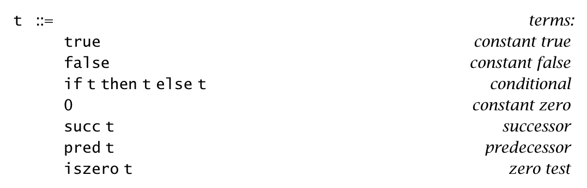

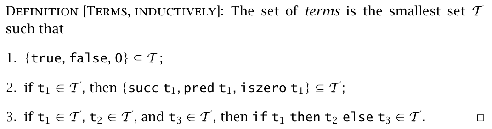

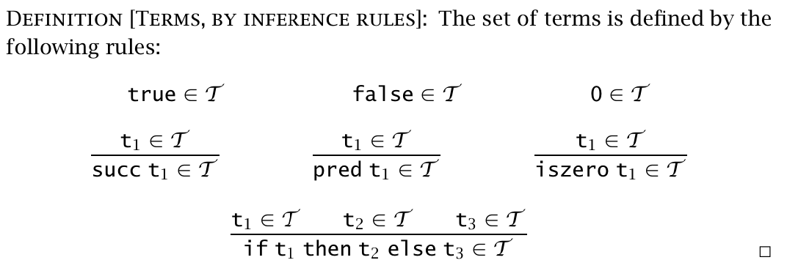

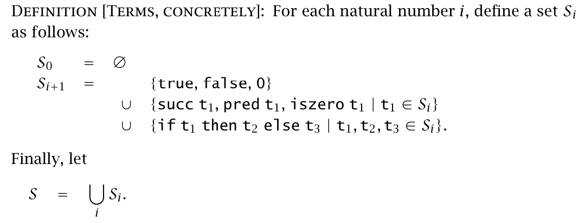

## Induction on terms

after definition of terms, we can perform inductions on terms.  
we can give inductive definitions of functions over the set of terms, and we can give inductive proofs of properties of terms.

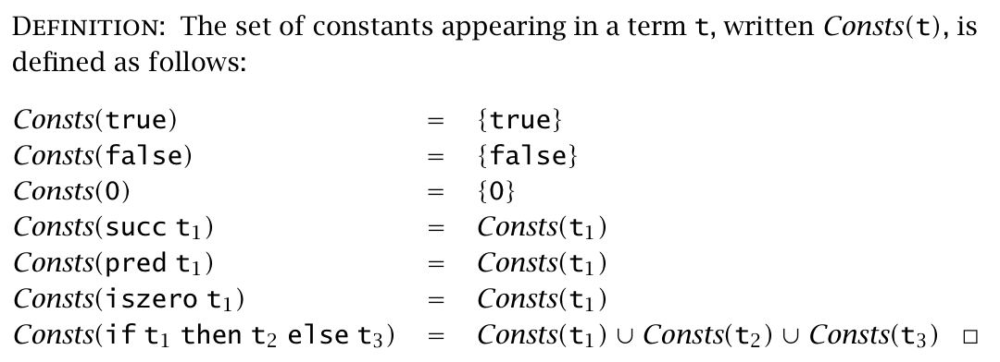

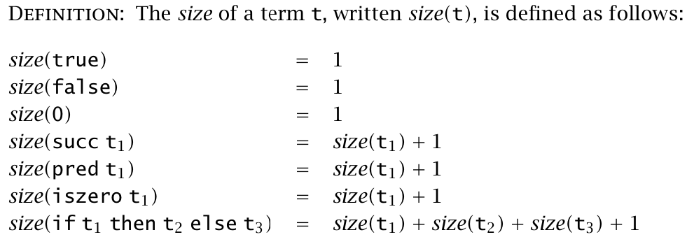

general method

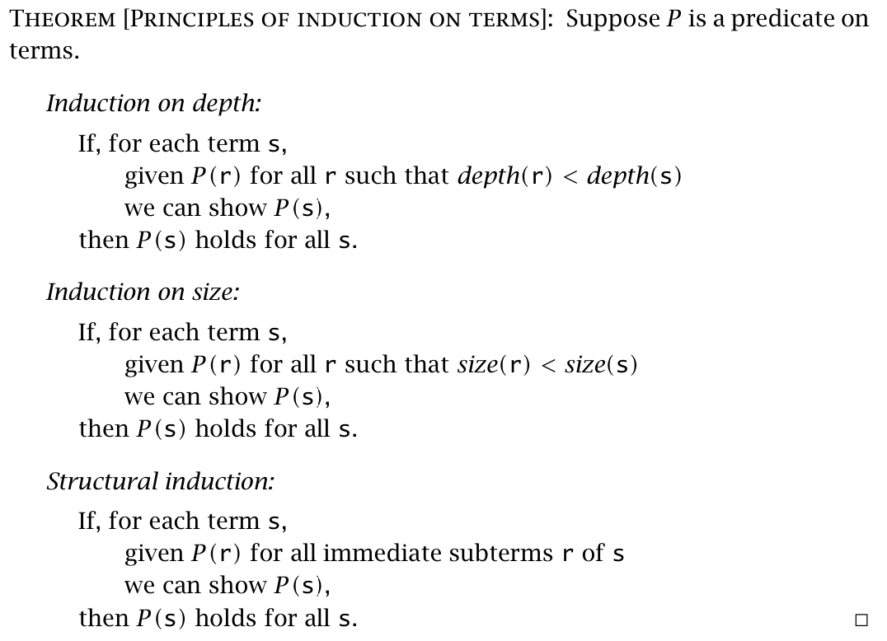

as the proof is general, somtimes we simply write "by induction of t". That is enough.

## Semantic styles

semantics: how terms are evaluated.

three basic approaches to formalizing semantics:

* Operational semantics: define a simple abstract machine to specify the behaviour of a language. "abstract" means to use the languages' terms as its machine code. For simple languages, a state of the machine is just a term, and the machine's behavior is defined by a transition function.  
* Denotational semantics: finding a collection of semantic domains and then defining an interpretation function mapping terms into elements of these domains.   
* Axiomatic semantics: take the laws themselves as the definition of the language.

## Evaluation

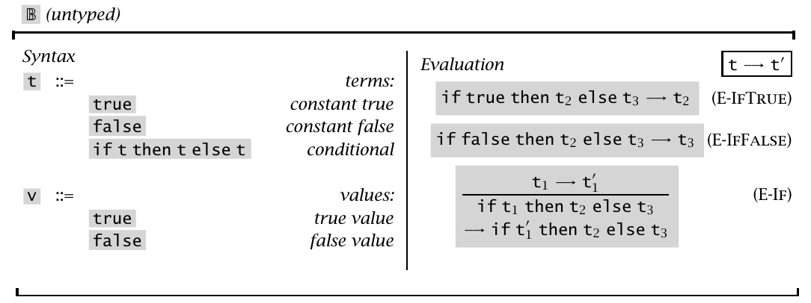

the E-IfTrue and E-IfFalse rules tell what to do when recursively perform the evaluation rules and reach the end.(computation rules)  
the E-If rule helps determine where the work is to be done.(congruence rule)   

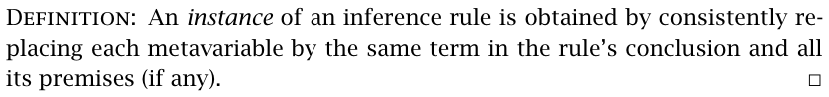

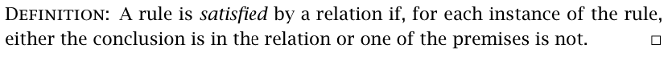

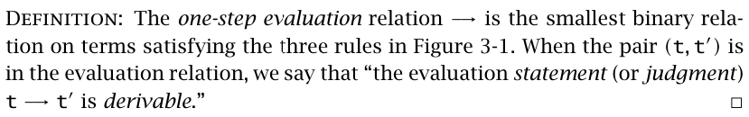

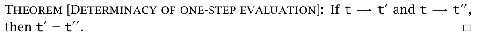

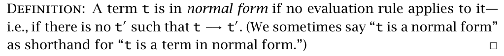

Every value is in normal form. It t is in normal form, then t is a value.

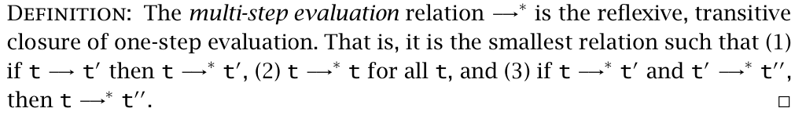

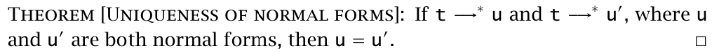

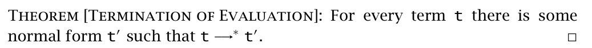

Adding arithmetic expressions to it.

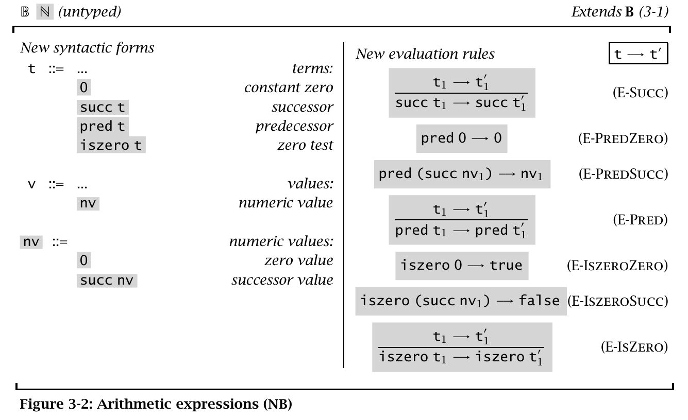

Notice that the form 'nv' is different from v.  
This gives us that 'succ true' is invalid. We call such terms *stuck*.

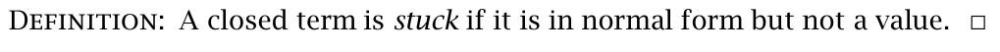

It characterizes the situations where the operational semantics does not know what to do because the program has reached a "meaningless state."

There is another way to formalizing meaningless states of the abstraction machine: introduce a specific term "wrong" and augment the operational semantics with rules that explicitly generate wrong in all the situations where the present semantics gets stuck.  
Here is the additional term definitions and evaluation relations.

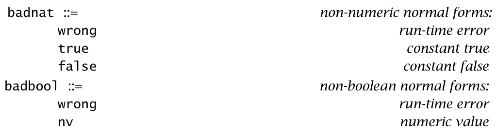

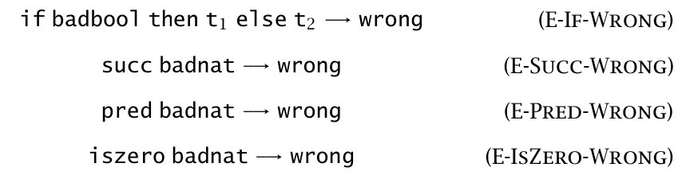
