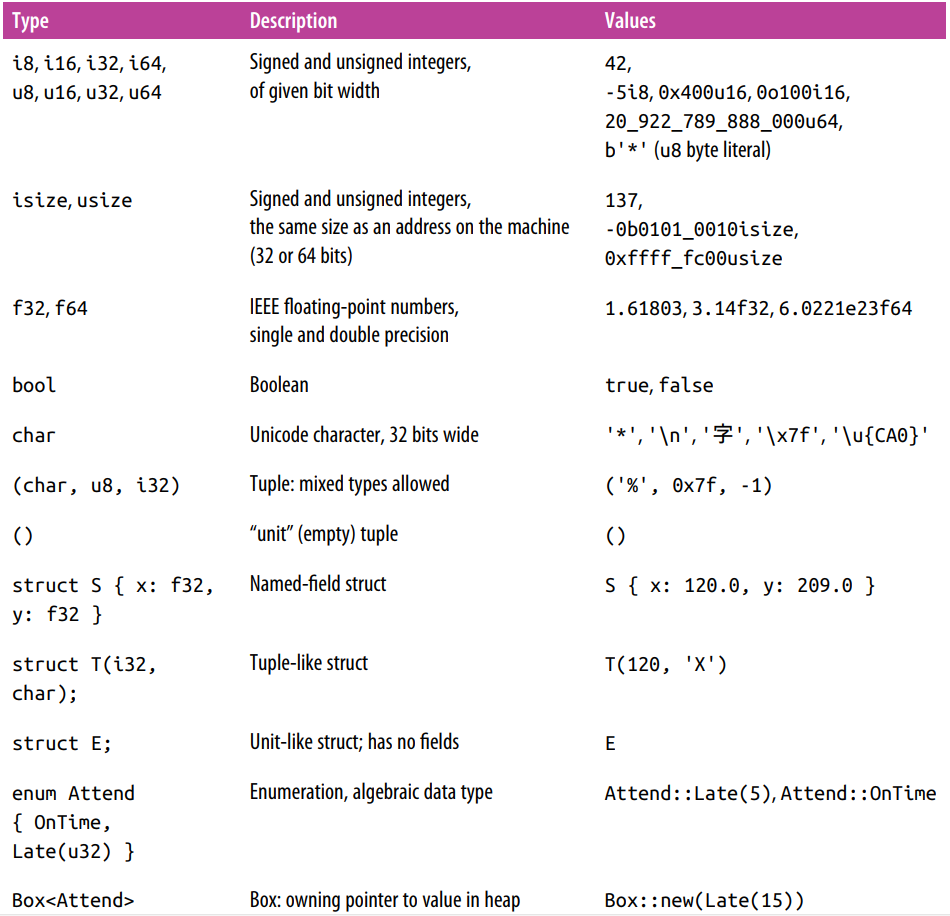
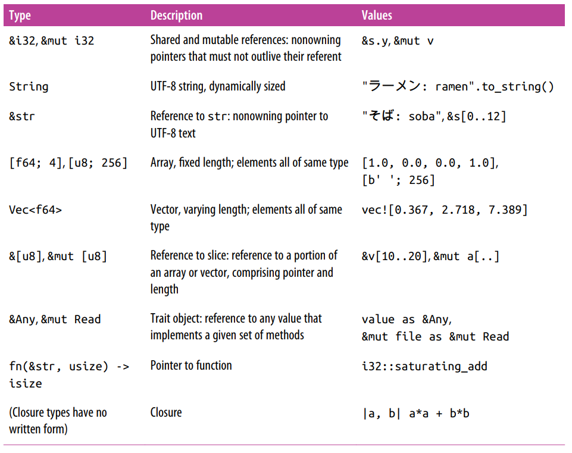

# 第 3 章 基本类型

`Rust` 的类型服务于 3 个目的：安全（检查类型，防止错误），效率（对内存进行不同颗粒度的控制），简介。`Rust` 采用**事先编译**的方法，并且是静态类型的语言，不需要实际运行就可以检查所有可能的运行路径。  
`Rust` 要求在写代码的时候进行规划，要写出函数的参数、返回值的类型、结构体成员的类型。`Rust` 提供了推断和泛型两个特性来辅助我们，前者能根据上下文进行类型推断而不需要显式地写出，后者允许通用的函数目的和实现能够适用于任何符合标准的集合。  
以下是 rust 中的类型

## 机器类型
### 整数类型
Rust 中的整数类型有以下几个特点

1. Rust 中要求数值类型必须写出位宽以及其表现形式，比如 `i32, u16` 等等，比较特殊的是 `isize, usize` 与机器上内存地址的宽度相同。
2. Rust 将字符和数值类型区别对待，`char` 既不是 `u8` 也不是 `i8`，这点与 C, C++ 均不同。
3. Rust 要求数组索引必须是 `usize` 值。
4. Rust 会在调试构建时检查算术运算中是否有整数溢出，如果有会抛出诧异。如果一定要使用整数溢出，需要使用类似 `x.wrapping_add(y)` 这样的写法。
5. Rust 中的整数字面量可以加上后缀来指定类型，比如 `42u8` 是一个 `u8` 值。若不包含后缀，Rust 会根据上下文推断出最合适的。当有若个可能的推断时，对于某些情况 Rust 会有默认行为，如若可能的类型包括 `i32` 那么 Rust 会默认其为 `i32`，否则会报错（歧义）。
6. Rust 提供字节字面量，即用类字符字面量表示的 `u8` 值，如 `b'X'` 表示一个值为 `X` 的 ASCII 编码的 `u8` 值。这里只能是 ASCII 字符，下表展示了几个需要转义的字符。对于难写或难读的字符，还可以使用 `b'xHH'` 形式，其中 `HH` 是 16 进制的。
7. 使用 `as` 操作符来进行整数类型转换。
8. Rust 对整数也提供了很多方法，具体可以参考 Rust 文档。

### 浮点类型
Rust 支持 IEEE 标准的单双精度浮点类型。浮点字面量由整数部分、小数部分、指数和类型后缀组成，除了整数部分均是可选的，但后三者必须有其中之一（否则无法与整数字面量区分）。小数部分可以仅有小数点，如 `5.` 是一个合法的浮点常量。  
Rust 会对没有类型后缀的浮点数推断类型，如果两种均有可能则默认为 `f64`。Rust 将整数字面量与浮点字面量当作两种不同的类型，两者不会互相推断。  
在 `std::f32, std::f64` 两个标准库中定义了 IEEE 要求的特殊值，比如 `INFINITY, NEG_INFINITY, NAN, MIN, MAX`，模块 `std::f32::consts, std::f64::consts` 给i共了很多有用的数学常数。  
Rust 对浮点类型提供了若干方法，具体可以参考 Rust 文档。

> 不论是整数类型还是浮点类型，Rust 不会作任何形式的隐式转换，诸如将 i32 数传入 f64 为参数的函数、甚至 i16 为参数的函数这些行为都是会导致错误的。

### 布尔类型
Rust 的布尔类型 bool 提供 true 和 false 两个值。但 Rust 不允许将字符、整数、浮点或指针隐式地转化成 bool，控制表达式的条件以及逻辑运算符的操作数都要求必须是 bool 表达式。  
`as` 操作可以将 bool 转化成整数类型，但反过来不成立。

### 字符类型
Rust 中字符类型 char 以 32 位值的方式表示单个 Unicode 字符，同时对字符串或文本流使用 UTF-8 编码。`String` 将其文本表示为一个 UTF-8 字节的序列。  
Rust 只支持在其 char 中保存符合 Unicode 标准的字符，Rust 会使用类型系统以及动态检查来保证 char 的值始终在许可的范围内。  
char 类型不会与整数类型进行隐式转换，但可以用 `as` 显示转换；另一方面 `u8` 是唯一能通过 `as` 转换到 `char` 的整数值，如果需要转换 `u32` 的话需要使用标准库函数 `std::char::from_u32` 将 `u32` 转换为 `Option<char>` 值。  
标准库中为字符提供了若干方法，具体可以参考 Rust 文档。

## 元组
元组由若干不同类型的值组成，其写法为类似 `let t = (a, b, c)`，然后使用 `t.0, t.1` 这样的方式访问其中的元素。

> 与数组不同的地方：  
> 每个元素可以是不同的类型  
> 只能使用常量作为索引，所以比如 `t.i` 或 `t[i]` 这样的写法是不允许的。

元组可以认为是一种极度简化的结构体类型，更利于表达合适的程序逻辑。  
当不存在有意义的值而上下文要求某种类型时，Rust 会返回零元组 `()`。  
在元组的最后一个括号增加逗号不影响元组的解析。

## 指针类型
Rust 包括三种指针类型：引用、Box 和不安全指针。

引用： `&String` 类型的值就是一个对 `String` 值的引用，引用可以指向任何地方的任何值，可以是栈上或者堆上。`&x` 表示产生一个对 `x` 的引用，或用 Rust 语言来表述是借用了一个对 `x` 的引用。而对于一个引用 r，用 `*r` 表示 r 指向的值。  
与 C 语言中不同的是，Rust 中引用永远不会是空值，在安全的 Rust 代码中根本不会产生空引用，且 Rust 引用默认不可修改。如果需要修改，要使用 `&mut T` 来声明。

Box：是 Rust 在堆上分配一个值的最简单方式，如 `Box::new(t);`。后续会与转移配合解释这方面的内容。

不安全指针：形式为 `*mut T` 和 `*const T`，实际上就是 C 和 C++ 中的指针。这类指针的使用是不安全的，仅能在 `unsafe` 块中使用。

## 数组、向量和切片