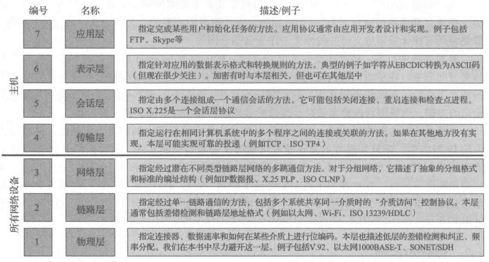
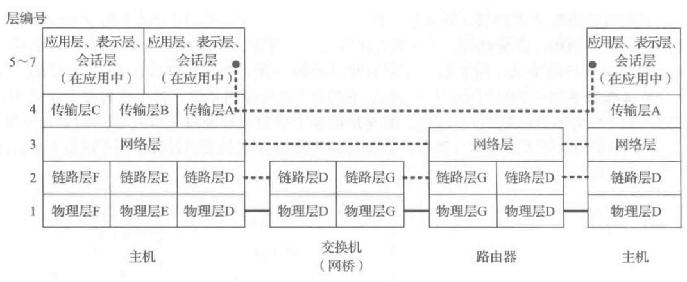
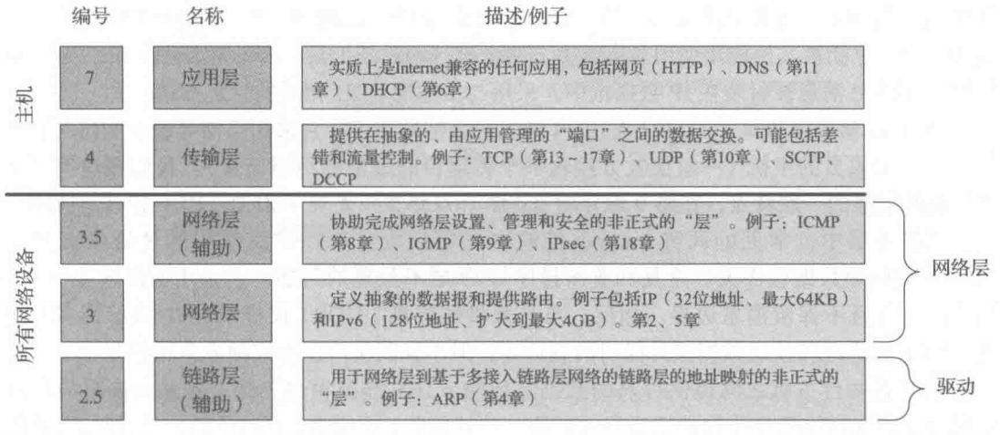

# 第1章 概述
体系结构（协议和物理）实际上是一组设计决策，涉及支持哪些特点和在哪里实现这些特点。  
设计一个体系结构更多的是艺术而不是科学。

## 体系结构原则
Internet 的设计指导：Internet 体系结构应将多种网络互连起来。  
以下是一些二级目标：

* 通信在网络或网关失效时必须能够继续  
* 必须支持多种类型的通信服务  
* 必须兼容多种网络  
* 允许对资源的分布式管理  
* 经济有效  
* 允许低能力主机的连接  
* 使用的资源是可统计的

### 分组、连接和数据报
与传统的电话交换网络中的物理连接相对，分组交换思想允许数据在网络中多路复用，在多个交换设备之间传输。  
网络更有弹性，且基于统计复用可以更好地利用网络链路和交换设备。  
分组交换机使用缓存或队列来以FIFO方式处理不同来源的混合流量，这一方式很容易实现统计复用，简单有效但可预测性有限。  
与之相对，时分复用和静态复用等替代性技术为每个连接保留一定的时间或其他资源，有更好的可预测性，但网络带宽利用率低。  
虚电路抽象要求在每个交换机中为每个连接存储一些信息或状态，分组仅携带少量额外信息，提供到某个状态表的索引。在正式的数据交换前，流状态就已经建立。这种网络被称为面向连接的。

无论是建立在线路还是交换的基础上，面向连接的网络是多年来最流行的联网方式。  
数据报是另一种可选方案，将有关来源和最终目的地的所有识别信息包含在分组中（而不是分组交换机）。  
更大的数据报，但可用于建立无连接的网络。  
早期 Internet 设计者选择接受数据报的模式，这一决定对协议族的其它部分有深远影响。

### 端到端论点和命运共享
这里讨论的问题是：对于较大的系统，应该在何位置实现某个功能。  
在 TCP/IP 协议族的设计中，一个重要原则是端到端论点：这一观点认为，只有涉及通信系统的应用程序和最终用户，其正确性和完整性才可能得到实现。  
重要功能（如差错控制，加密，交付确认）通常不会在大型系统的低层实现，但是低层可以实现方便端系统工作的功能并最终可能改善性能。  
低层功能不应以完美为目标，因为对应用程序的需求作出完美推测是不可能的。  
命运共享则是建议将所有必要的状态放到通信端点，这些状态用于维护一个活动的通信关联。  
今天 Internet 的话题依然是：哪些功能在网络中实现，哪些功能不在网络中实现。

### 差错控制和流量控制
对于少数位出错的情况，关注使用数学代码检测和修复差错，这一任务在网络中执行；而当更多的损坏发生时，整个分组通常被重新发送或重新传输（在线路交换或虚电路交换网络中，重传在网络内部进行，这对那些对交付顺序严格要求的应用是有用的）。  
帧中继和 Internet 协议则采用另一种称为尽力而为的服务，网络不会花费很大的努力来确保数据在没有差错或缺陷的情况下交付。

## 设计与实现
对协议体系结构与实现体系结构加以区分。

### 分层
每层只负责通信的一个方面，允许开发人员分别实现系统的不同部分。  
开放系统互联标准 OSI 模型（7层），TCP/IP （5层）  

我们主要关心其中的网络层。

### 复用、分解与封装
分层体系结构的优点：协议复用。允许多种协议共存于同一基础设施中，也允许相同协议对象的多个实例同时存在。  
协议数据单元 PDU。这一单元的对象（分组，消息）被低层携带，也就是在相邻低层的封装。  
第 N-1 层的标识符在第 N 层的分解过程中用于决定正确的接受协议或程序。 
封装的本质：将上层的数据看成不透明、无需解释的信息。

分层的另一个优点：并不是所有的网络设备都需要实现所有层。

## TCP/IP 协议族结构和协议
下图展示了ARPANET 参考模型的分层

## Internet、内联网和外联网
Metcalfe 定律：计算机网络价值大致与连接的端系统数量的平方成正比。  
内联网：由商业机构或其它企业来运行，大多数情况下，内联网提供的访问资源只供特定企业的成员使用。用户使用虚拟专用网 VPN 连接到内联网，而 VPN 负责保证授权，通常由隧道实现。  
外联网：供合作伙伴或其它相关公司通过 Internet 访问，也与 VPN 有关，还涉及到企业防火墙。

## 设计应用
包括：客户机/服务器模式和对等模式。
