# Introduction

## Definition

A distributed system can be characterized as a collection of mostly autonomous processors communicating over a communication network.

Features:

* No common physical clock  
* No shared memory  
* Geographical separation  
* Autonomy and heterogeneity

## Relation to computer system components

Each computer has a memory-processing unit and the computers are connected by a communication network.

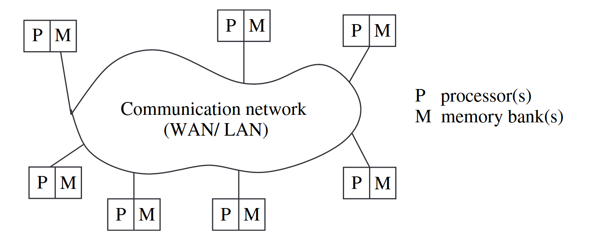

Interaction of the software components at each processor.

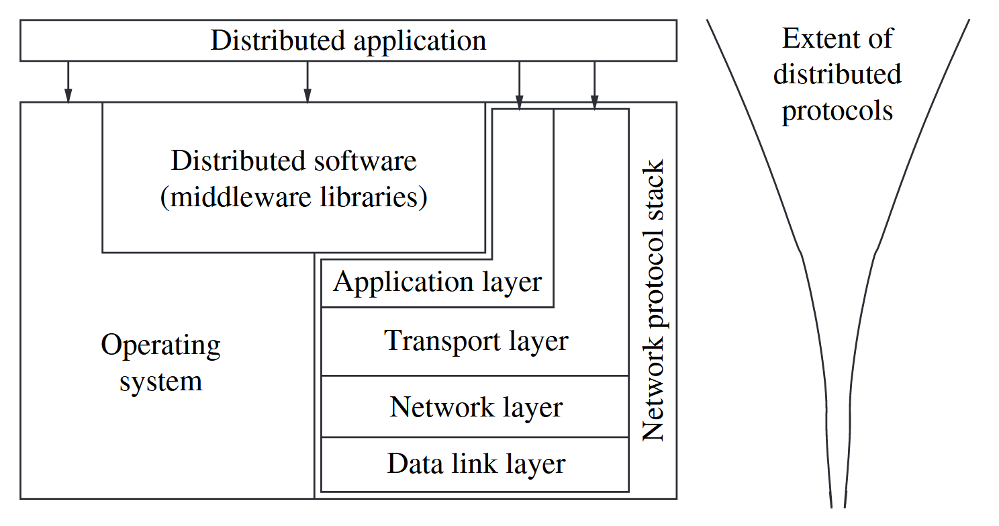

Common functions library: Remote procedure call(RPC), Object Management Group’s (OMG) common object request broker architecture (CORBA), DCOM (distributed component object model), Java, and RMI (remote method invocation), the message-passing interface (MPI).

> The RPC mechanism conceptually works like a local procedure call, with the difference that the procedure code may reside on a remote machine, and the RPC software sends a message across the network to invoke the remote procedure. It then awaits a reply, after which the procedure call completes from the perspective of the program that invoked it.

## Motivation

* Inherently distributed computations: many applications are geographically distant.  
* Resource sharing: Fully replicated of some resources at all the sites is nerther practical nor cost-effective. Further, placing at a single site may be a bottleneck.  
* Access to geographically remote data and resources: too large or too sensitive  
* Enhanced reliability: availability, integrity, fault-tolerance.  
* Increased performance/cost ratio  
* Scalability  
* Modularity and incremental expandability: heterogeneous processors running the same middleware algorithms.

## Relation to parallel multiprocessor/multicomputer systems

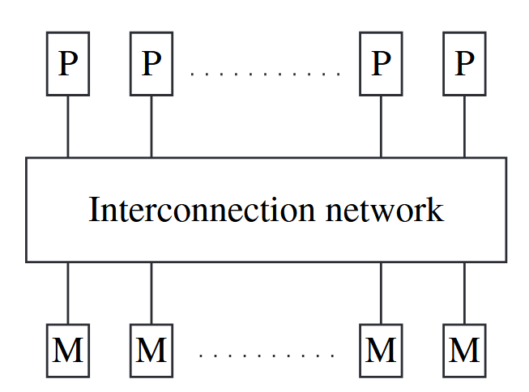

*Multiprocessor system*: direct access to shared memory, common address space, corresponds to a uniform memory access (UMA) architecture (access latency from any processor is the same).  
The interconnection network to access the memory may be a bus, although for greater efficiency, it is usually a *multistage switch* with a symmetric and regular design.

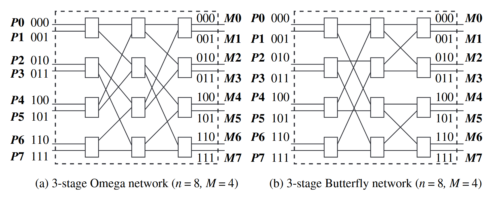

Each 2x2 switch: allows data on either of the two input wires to be switched to the upper or the lower output wire.  
A n-input and n-output network uses log n stages and log n bits for addressing. At stage k uses only the kth bit. Down at clock speed in hardware. Recursivly constructed multi-stage networks.  

**Omega network**

Interconnection function: a link exsis between output $i$ of a stage and the input $j$ to the next stage should follow:

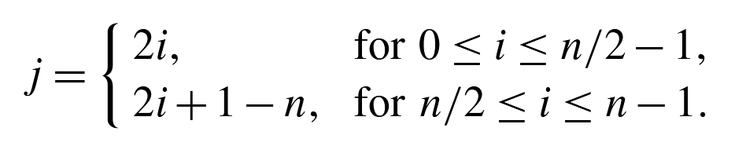

Routing function: The routing function from input line $i$ to output line $j$ considers only $j$ and the stage number $s$, where $s \in [0, \log_2n − 1]$ . In a stage s switch, if the $s + 1th$ MSB (most significant bit) of $j$ is 0, the data is routed to the upper output wire, otherwise it is routed to the lower output wire.

**Butterfly network**

Interconnection function: depending on $n$ and the stage number $s$. A swicth denoted by the tuple $(x, s), x \in [0, M-1], s \in[0, \log_2 n-1], M = n/2$. There is a edge from switch $(x, s)$ to switch $(y, s+1)$ if

* $x=y$
* or $x\ XOR\ y$ has exactly one 1 bit, which is in the $(s+1)th$ MSB.

For stage s, apply the rule above for $M/2^s$ switches.

Routing function: In a stage $s$ switch, if the $s + 1th$ MSB of $j$ is 0, the data is routed to the upper output wire, otherwise it is routed to the lower output wire.

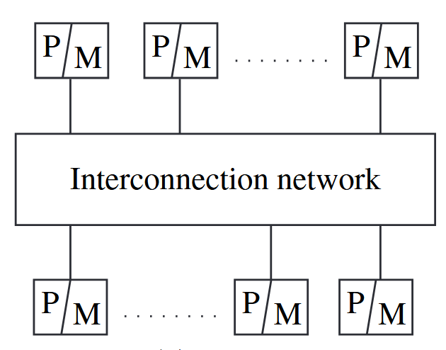

*Multicomputer parrallel system*: do not have direct access to shared memory, non-uniform memory access (NUMA) architecture.  
processors configured in regular and symmetrical topologies such as an array or mesh, ring, torus, cube, and hypercube.

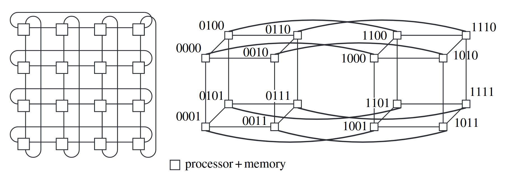

* Mesh: a $k \times k$ contains $k^2$ processors. Using Manhattan grid to route.  
* Hypercube: a k-dimensional hypercube has $2^k$ processors. Using Hamming distance to measure distance. Routing is done hop-by-hop. At any hop, the message can be sent along any dimension corresponding to the bit position in which the current node’s address and the destination address differ. Multiple routes between any pairs of nodes, which provides fault-tolerance.

*Array processors*: a class of parallel computers that are physically co-located, are very tightly coupled, and have a common system clock (may not share memory).

The distinction of UMA and NUMA is important becouse of variable and unpredictable latencies in accesing memory/communication.

**Flynn's taxonomy**

(i) whether the processors execute the same or different instruction streams at the same time  
(ii) whether or not the processors processed the same (identical) data at the same time

* Single instruction stream, single data stream(SISD): von Neumann paradigm with a single CPU, and a single memory unit connected by a system bus.  
* Single instruction stream, multiple data stream(SIMD): operations on large arrays and matrices.  
* Multiple instruction stream, single data stream(MISD): specialized mode of operation with limited but niche applications, e.g., visualization.  
* Multiple instruction stream, multiple data stream(MIMD): operation in distributed systems as well as in the vast majority of parallel systems.

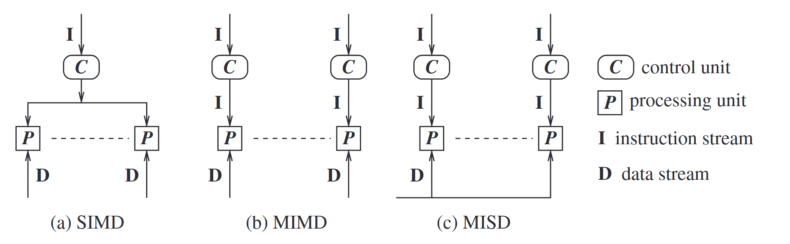

**Coupling**: interdependency and binding and/or homogeneity among the modules.  
**Parallelism or speedup of a program on a specific system**: a measure of the relative speedup of a specific program, on a given machine. The speedup depends on the number of processors and the mapping of the code to the processors.  
**Parallelism within a parallel/distributed program**: measure of the percentage of time that all the processors are executing CPU instructions productively, as opposed to waiting for communication (either via shared memory or message-passing) operations to complete.  
**Concurrency of a program**: a broader term that means roughly the same as parallelism of a program, but is used in the context of distributed programs. The parallelism/concurrency in a parallel/distributed program can be measured by the ratio of the number of local (non-communication and non-shared memory access) operations to the total number of operations, including the communication or shared memory access operations.  
**Granularity of a program**: The ratio of the amount of computation to the amount of communication within the parallel/distributed program.  

* network operating system: running on loosely coupled processors, which are themselves running loosely coupled software (heterogenous)  
* distributed operating system: running on loosely coupled processors, which are running tightly coupled software (homogenous like middleware)  
* multiprocessor operating system: running on tightly coupled processors, which are themselves running tightly coupled software

## Message-passing systems versus shared memory systems

It is easier to program using shared memory than by message passing.  
communication via message-passing can be simulated by communication via shared memory and vice-versa.

## Primitives for distributed communication

Send() and Recieve()

* Synchronous primitives: Send() primitive completes only after the invoking processor learns that the other corresponding Receive primitive has also been invoked and that the receive operation has been completed.  
* Asynchronous primitives: if control returns back to the invoking process after the data item to be sent has been copied out of the user-specified buffer.  
* Blocking primitives: if control returns to the invoking process after the processing for the primitive (whether in synchronous or asynchronous mode) completes.  
* Non-blocking primitives: if control returns back to the invoking process immediately after invocation, even though the operation has not completed.

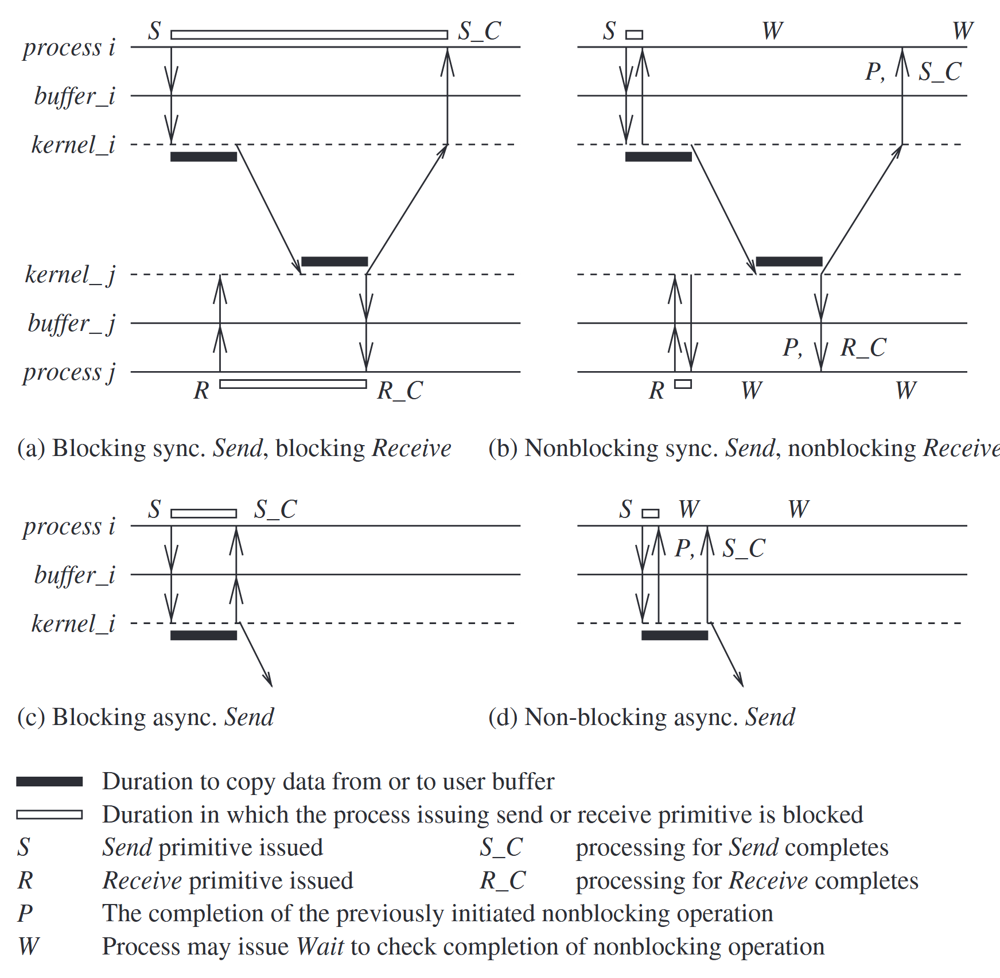

*synchronous versus asynchronous processors*: Processor synchrony indicates that all the processors execute in lock-step with their clocks synchronized.  
Such synchronous is not attainable in a distributed system, what is more generally indicated is that for a large granularity of code, usually termed as a step, the processors are synchronized.  
Using barrier synchronozation to ensure.

## Synchronous versus asynchronous executions

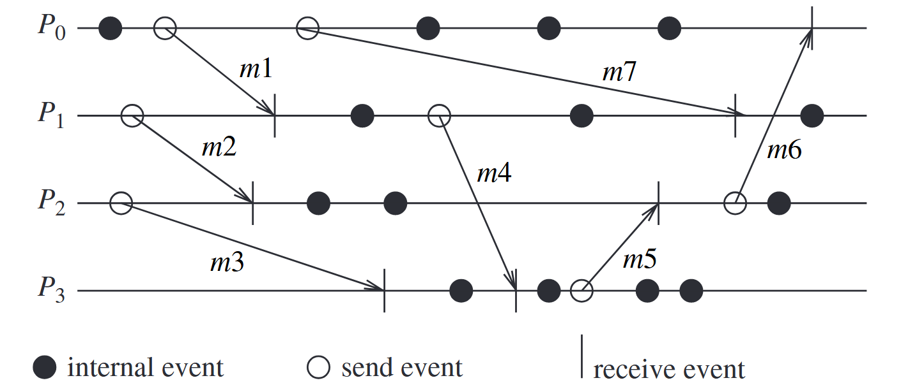

asynchronous execution: (i) there is no processor synchrony and there is no bound on the drift rate of processor clocks, (ii) message delays (transmission + propagation times) are finite but unbounded, and (iii) there is no upper bound on the time taken by a process to execute a step.  

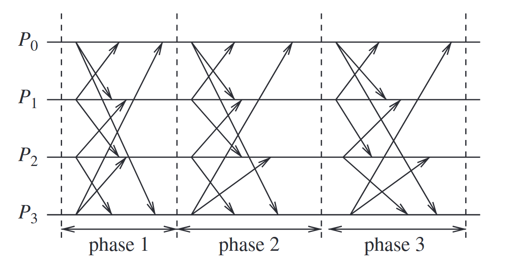

synchronous execution: (i) processors are synchronized and the clock drift rate between any two processors is bounded, (ii) message delivery (transmission + delivery) times are such that they occur in one logical step or round, and (iii) there is a known upper bound on the time taken by a process to execute a step.

It is hard to truly build a completely synchronous system(eg bouned time of message delivered).  
Thus, synchronous execution is an abstraction that needs to be provided to the programs.  
*virtually synchronous execution*: processors are allowed to have an asynchronous execution for a period of time and then they synchronize.

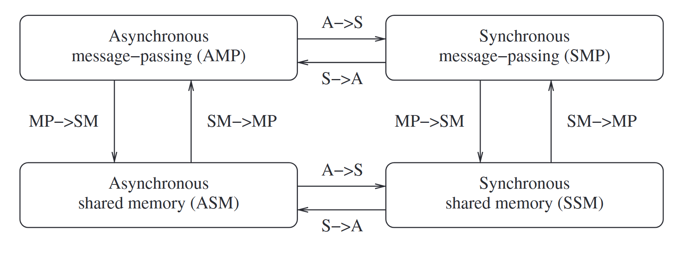

all four classes are equivalent in terms of “computability” – what can and cannot be computed – in failure-free systems.

## Design issues and challenges

**Distributed systems challenges from a system perspective**

* Communication:remote procedure call (RPC), remote object invocation (ROI), message-oriented communication versus stream-oriented communication.  
* Processes: management of processes and threads at clients/servers; code migration; and the design of software and mobile agents.  
* Naming: Devising easy to use and robust schemes for names, identifiers, and addresses. Espesially in mobile sytstem.  
* Synchronization: Mechanisms for synchronization or coordination among the processes. Mutual exclusion, leader election, physical clocks, global state recording algorithms.  
* Data storage and access: accessing the data in a fast and scalable manner across the network.  
* Consistency and replication: To avoid bottlenecks, to provide fast access to data, and to provide scalability. issues of managing the replicas, and dealing with consistency among the replicas/caches in a distributed setting.  
* Fault tolerance: Process resilience, reliable communication, distributed commit, checkpointing and recovery, agreement and consensus, failure detection, and self-stabilization.  
* Security: cryptography, secure channels, access control, key management – generation and distribution, authorization, and secure group management.  
* Applications Programming Interface (API) and transparency: for the ease of use and wider adoption of the distributed systems services by non-technical users.  
* Scalability and modularity: replication, caching and cache management, and asynchronous processing.

**Algorithmic challenges in distributed computing**

* Designing useful execution models and frameworks  
* Dynamic distributed graph algorithms and distributed routing algorithms  
* Time and global state in a distributed system  
* Synchronization/coordination mechanisms: Physical clock synchronization, Leader election, Mutual exclusion, Deadlock detection and resolution, Termination detection, Garbage collection  
* Group communication, multicast, and ordered message delivery  
* Monitoring distributed events and predicates  
* Distributed program design and verification tools  
* Debugging distributed programs  
* Data replication, consistency models, and caching  
* World Wide Web design – caching, searching, scheduling  
* Distributed shared memory abstraction: Wait-free algorithms, Mutual exclusion, Register constructions, Consistency models  
* Reliable and fault-tolerant distributed systems: Consensus algorithms, Replication and replica management, Voting and quorum systems, Distributed databases and distributed commit, Self-stabilizing systems, Checkpointing and recovery algorithms, Failure detectors  
* Load balancing  
* Real-time scheduling  
* Performance

**Applications of distributed computing and newer challenges**

* Mobile systems  
* Sensor networks  
* Ubiquitous or pervasive computing  
* Peer-to-peer computing  
* Publish-subscribe, content distribution, and multimedia  
* Distributed agents  
* Distributed data mining  
* Grid computing  
* Security in distributed systems
