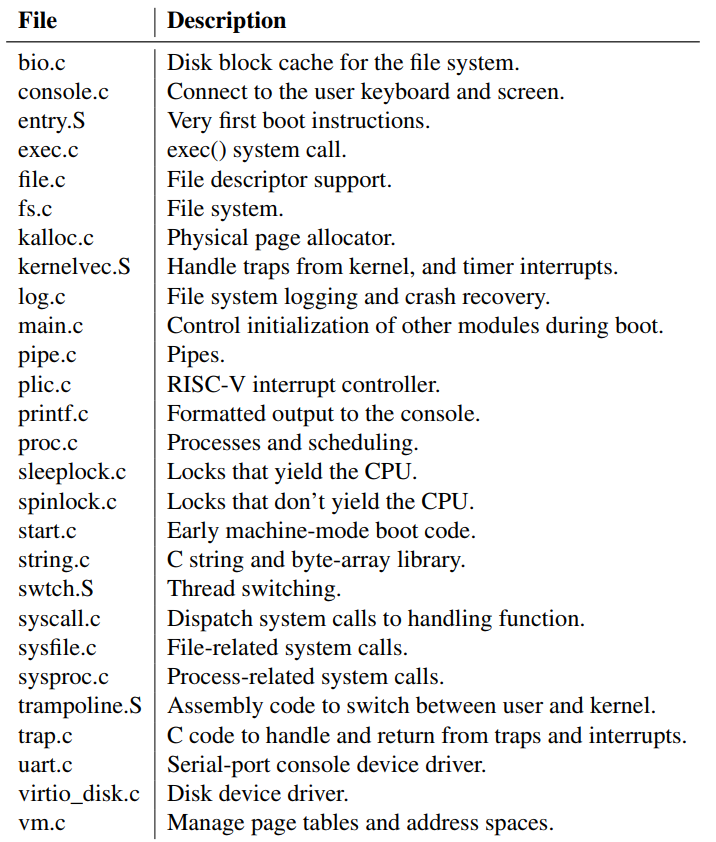
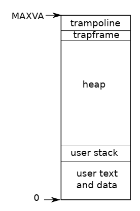

# Chapter 2 Operating system organization

对操作系统的关键要求是要能支持同时处理多个活动，操作系统必须安排多个进程分享系统资源，比如即使进程数超过了 CPU 核数，操作系统也必须保证每个进程都得到运行的机会。同时，操作系统还需要对不同进程隔离，防止一个进程出现错误时影响其它进程甚至内核本身。  
具体到 xv6 系统本身，它的很多特性是为多核 RISC-V 特化设计的，同时是 LP64 的（即 C 中的 long 和 pointer 都是 64 位的）

## Abstracting physical resources
为实现进程之间的隔离，禁止应用程序直接访问硬件资源而仅允许访问由操作系统服务提供的抽象是很有帮助的。  
同样地，unix 透明地交替分配系统资源到各个进程，负责保存和恢复状态，使得进程并不会意识到正在与其它进程分享时间。

## User mode, supervisor mode, and system calls
CPU 在进程隔离方面提供了硬件层面的帮助，以 RISC-V 为例，RISC-V 有三种 CPU 运行指令的模式： machine mode, supervisor mode, and user mode。  
在 machine mode 中，运行的指令拥有全部的特权，这一模式通常用于配置计算机，xv6 在 machine mode 中运行一小段程序，然后就会切换到 supervisor mode。  
在 supervisor mode 中， CPU 能够运行一些特权指令（比如允许或屏蔽终端，访问包含页表头的寄存器等）。在 user mode 时不允许运行这些特权指令。运行在 user mode 的应用被称为运行在 user space，对应的运行在 supervisor mode 则成为运行在 kernel space 。内核 kernel 通常是唯一允许运行在 kernel space 的应用。  
若应用程序想要使用内核服务，应用程序必须申请转换到内核态，然后由内核态来决定是否授权进行系统调用。CPU 通常为内核态与用户态的切换提供了特别指令（如 RISC-V 中提供指令 `ecall`）。注意到是由 kernel 来决定切换到 supervisor mode 的进入点，这是出于安全的考虑。

## Kernel organization
一个关于内核设计的重要抉择是，要将操作系统的哪些部分放到 supervisor mode 运行。一种可能的设计是将整个操作系统都放到内核中 monolithic kernel，这种方法在设计上很简单直接，但对操作系统本身的代码质量有很高要求，一旦内核出错就会出问题；另一种设计则是最小化运行在 supervisor mode 的部分 microkernel。 xv6 采用的是前者。

## Code: xv6 organization

xv6 kernel 相关代码

## Process overview
xv6 中的隔离单元被称为进程 process，这一抽象能够防止一个进程破坏或窃取内核或其它进程的内存内容。  
内核必须小心地实现进程隔离，以防止进程利用其中的漏洞破坏隔离。内核在实现隔离上使用了许多技术，比如 user/supervisor mode flag、地址空间和时间片。  
进程抽象为每一个程序提供了一个其完全私有整个机器的假象，比如整个私有的地址空间。xv6 使用页表来为每一个进程提供单独的地址空间，RISC-V 提供了从虚拟地址到物理地址的翻译。  
下图简要展示了 xv6 虚拟地址模型。

每个进程有两个栈，用户栈 user stack 和内核栈 kernel stack 。当进程运行在用户态时，仅使用用户栈且此时内核栈为空；当进程进入内核态时（进行系统调用或者发生终端时），内核代码则运行在内核态，此时用户态仍然保存着数据，但处于未激活状态。内核栈与用户栈是分离且保护的，使得就算用户栈被破坏后内核代码仍可以正常运行。  
kernel 使用结构 `proc` 来维护每一个进程的若干数据和状态。`p->state` 指明进程的状态（已分配，准备运行，运行中，等待 I/O，退出），`p->pagetable`持有着进程的页表，与 RISC-V 硬件要求保持一致。
