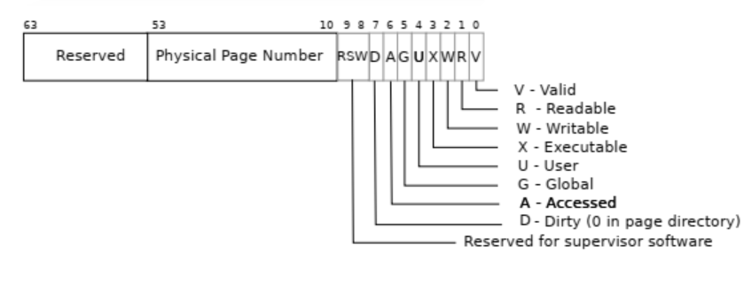
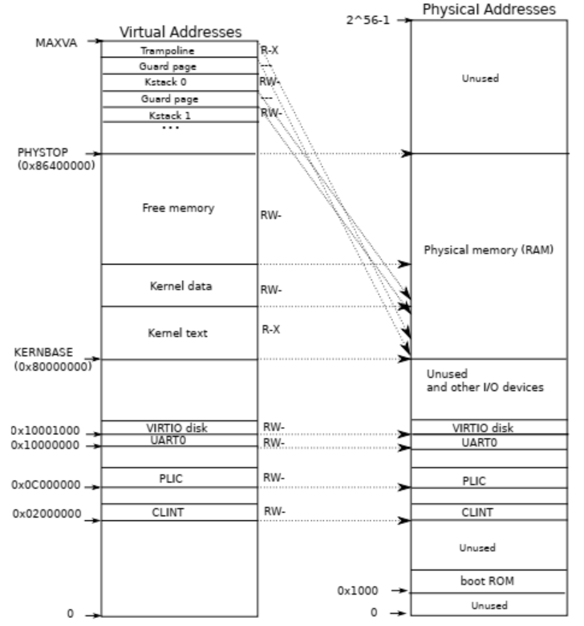

# Chapter 3 Page tables

页表 page table 是操作系统为每个进程提供隔离且私有的地址空间的重要技术。同时，页表还允许 xv6 将同样的内存映射到不同的地址空间。

## Paging hardware
xv6 基于 Sv39 RISC-V，这意味着 xv6 仅使用了 64 位虚拟地址中的 39 位，并且 RISC-V 的页表为 $2^{27}$ 项 page table entries PTE。每一个 PTE 都包含一个 44 位的物理页号 physical page number PPN。地址的硬件转换器从虚拟地址的 39 位中取出高位的 27 位，在页表中找到对应的 PTE，然后用 PTE 中包含的 44 位与虚拟地址的后 12 位组合出 56 位的物理地址。注意到页 page 的大小是 4096 。  
实际的 xv6 页表是分级页表，总共分为 3 级，每级使用 27 位中的 9 位用于定位。由于每页有 4096 位，故每页能保存 512 条 PTE，这正好对应分级页表树中每一级的 9 位。  
若三级页表中的任意一项并不存在，翻译硬件会返回一个页表异常 page-fault exception，然后交由 kernel 来决定如何处理。三级页表的处理能够很大程度上节省页表所占的空间，因为由应用程序对虚拟地址的使用情况来看，通常有很大一部分的地址空间是空闲的，此时就不需要保留对应的页表项。  
每一条 PTE 有若干标记 flag 来标注这一条页表被允许如何使用。`PTE_V` 指示当该页是否存在，`PTE_R` 指示该页是否可读， `PTE_W` 指示该页是否可写，`PTE_X` 指示该页上的内容是否可以被解释为指令并执行，`PTE_U` 指示该页是否允许用户态指令访问。

为了让硬件翻译器使用页表，内核必须把第一级页表的物理地址放到寄存器 `satp` 中。

## Kernel address space
xv6 为每一个进程维护了一个页表，特别地，为 kernel 的地址空间维护了一个单独的页表。这一页表被单独设计为能方便地在可预测的虚拟地址上访问物理内存和多种多样的硬件资源。  
QEMU 模拟的计算机包括一个从地址 `0x80000000` 开始的 RAM，最高可以达到 `0x86400000`，即 xv6 所称的 `PHYSTOP`。 QEMU 将 I/O 设备映射到 `0x80000000`以下的地址。在很多方面 kernel 都使用的是直接映射，比如 kernel 本身是从地址 `KERNBASE=0x80000000` 开始的，这样设计能很大程度上简化 kernel 的设计。下面是一个简单的图示。

同样也需要注意到，仍然有一部分的 kernel 虚拟地址并不是直接映射的。`trampoline page`被映射到虚拟地址的顶端，并且一个有趣的事实是，这一页面同时也被映射到所有用户页表的同一虚拟地址。这意味着物理地址中的页可以被映射到多个不同的虚拟地址。`kernel stack` 是每个进程都独自拥有一份的，并且注意到每个 `kernel stack` 都被未映射保护页保护起来，以防止内核栈溢出。

## Physical memory allocation
内核需要负责在运行时分配和回收物理内存。它使用一个链表来维护哪些页是空闲的，这一数据结构存储在这些空闲页表本身中。

## Process address space
每个进程都有私有的页表，当 xv6 在进程间切换时也就同时会切换页表。当进程向 xv6 申请更多内存空间时，xv6 会首先调用 kalloc 来分配物理页，然后为相关进程的页表添加 PTE 并设置 flag。尽管实际上进程使用的物理内存大概率是不连续的，进程在虚拟地址空间中依然将其看作连续的。
