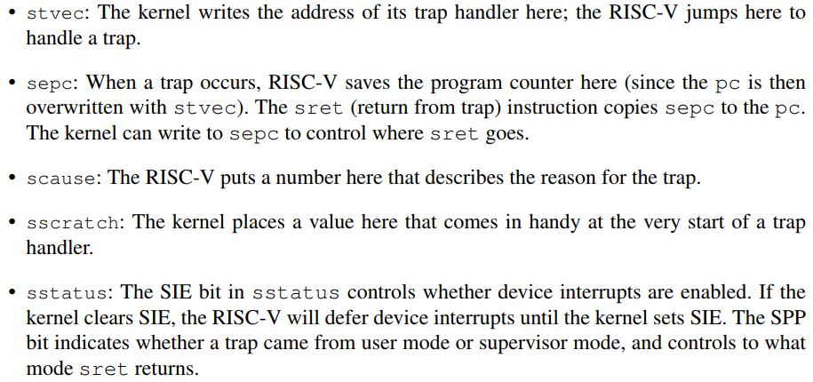

# Chapter 4 Traps and system calls

在三种情况下，CPU 会将当前执行的命令放到一旁，强制进行控制转换来执行一些特殊动作。

1. 系统调用。用户程序使用 `ecall` 指令来要求内核执行系统操作。
2. 异常。通常是指令进行了非法操作，比如除 0 错误或访问非法页面。
3. 设备中断。设备发送信号要求处理器注意，比如磁盘设备完成了读写操作。

我们使用陷阱 trap 来统一描述上述三种情况。我们总是希望 trap 是透明进行的，这意味着被 trap 打断的进程不会意识到 trap 执行的过程。通常的执行过程是，trap 强制控制流进入内核，内核保存寄存器等进程的状态信息以便恢复，内核执行合适的处理程序，内核恢复原状态，返回中断的地方继续执行。  
xv6 内核处理所有的 trap，并将处理方法分为四个阶段：RISC-V CPU 执行硬件动作，由汇编代码组成的指向 kernel C 代码的向量，基于 C 的 trap 处理程序决定做什么，以及一个关于系统调用和硬件驱动设备的例程。xv6 将 trap 细分为用户空间 trap、内核空间 trap 和时间中断 time interrupt ，并为三个部分提供了分离的汇编向量和 C 处理程序。

## RISC-V trap machinery
RISC-V CPU 提供了若干关于 trap 的控制寄存器，下面是其中比较重要的几个。

上面的这些寄存器都仅能在 supervisor mode 下访存，不能在 user mode 下读写。有一套等价的寄存器在 machine mode 中，不过 xv6 仅在处理时间中断的一些特殊情况下会使用到。  
在多核处理器中，每个 CPU 都独立拥有一组上述处理器，这意味着在某些时刻可以有超过一个 trap 在被处理。  
当需要处理 trap 时，RISC-V CPU 会进行下列步骤（除时间中断以外）

1. If the trap is a device interrupt, and the sstatus SIE bit is clear, don’t do any of the following.
2. Disable interrupts by clearing SIE.
3. Copy the pc to sepc.
4. Save the current mode (user or supervisor) in the SPP bit in sstatus.
5. Set scause to reflect the trap’s cause.
6. Set the mode to supervisor.
7. Copy stvec to the pc.
8. Start executing at the new pc.

值得注意的一点是，CPU 本身并不会切换到内核页表，不会切换到内核栈，不会保存除 pc 以外的任何寄存器。这些工作是由内核来完成的。让 CPU 做尽可能少的工作，这种设计能让内核在处理不同 trap 时更加灵活。

## Traps from user space
从高层次描述来自 user space 的 trap 是这样的：陷入 trap 的时候先后经过 `uservec` 和 `usertrap`，而返回的时候依次经过 `usertrapret` 和 `userret`。  
从用户空间陷入 trap 是更具有挑战的。由于 RISC-V 硬件并不会切换页表，所以用户页表必须包含 `uservec` 的映射，其中包括了 `stvec` 应该指向的陷阱指令向量。`uservec` 必须切换 `satp` 指向内核页表，而为了保证在切换前后指令能连续执行，这要求 `uservec` 在用户空间和内核空间指向同样的位置。  
xv6 使用 `trampline page` 来满足上述要求。这一 `trampline page` 中包含了 `uservec` ，并且 xv6 将这一页面映射到内核和所有用户的虚拟地址空间的同一位置。  
当 `uservec` 开始运行后，需要将所有的 32 个寄存器的信息保存并记录保存的地址。RISC-V 提供了 `sscratch` 这一寄存器来帮助这一动作，使用指令 `csrrw` 交换 `sscratch` 和 `a0` 两个寄存器的内容，而在进入用户空间前，内核就已经提前将 `sscratch` 的内容指向一个每个进程都独有一份的 `trapframe` 页面，然后 `a0` 就可以作为地址指针保存所有的寄存器信息到 `trapframe` 中。进程的 `p->trapframe`也指向这一页面，不过是基于物理地址的，以方便内核访问其中的内容。随后 `uservec` 切换 `satp` 为内核页表，控制流进入 `usertrap`。  
`usertrap` 根据引发 trap 的原因来分别进行处理，比如系统调用 system call，硬件中断 devintr，或是异常，最后一种情况时内核会直接杀死用户进程。  
随后开始返回过程。首先是 `usertrapret`，这一过程准备 RISC-V 控制寄存器，为之后的用户 trap 作准备。然后控制流进入 `userret` 恢复进程上下文以及页表。

## Traps from kernel space
类似 user space，处理内核中的 trap 也会经过 `kernelvec`，`kerneltrap` 和 `kerneltrapret` 、`kernelret` 过程，不过由于 xv6 本身就在内核中，所以相关的处理会有些许不同。  
`kernelvec` 将寄存器存放在引起中断的内核线程的栈中，这在 trap 导致切换到另一内核线程时很重要。然后跳转到 `kerneltrap` 中。`kerneltrap` 负责处理硬件中断和异常，后者通常意味着 xv6 内核的错误，操作系统会立即中止并抛出 panic。  
如果引起 `kerneltrap` 的是一个时间中断，并且内核线程正在运行而不是调度线程 schedular thread 正在运行，`kerneltrap` 会调用 `yield` 释放 CPU 来让其它进程运行。当 `kerneltrap` 运行完毕后，恢复被中断的状态继续运行。

## Page-fault exceptions
xv6 对于异常的处理是非常无聊的：对于用户空间造成的异常，内核直接会结束发生错误的进程；对于内核造成的异常，xv6 系统会抛出 panic 停止运行。而现实中的操作系统对于异常的处理会更加复杂。  
以页面处理为例，许多操作系统会使用异常来实现页的写时复制 copy-on-write。当进行 `fork` 操作时，与 xv6 将内存中的内容真实地复制到新的地址，现代操作系统会让父子进程先以只读的方式映射到同样的物理地址空间。而当其中一个需要修改内容时，由于程序尝试对一个只读页面进行修改，CPU 会抛出一个页错误 page-fault。以 RISC-V 为例，RISC-V 定义了三种不同的页错误：load page fault, store page fault, instruction page fault。作为对页错误的处理，内核会将原本只读的页面复制出来一份，让父子进程分别映射到不同的页面，同时将页面更新为可读写，再返回引发异常的进程继续执行。  
另一个典型的例子是延迟分配。当进程调用 `sbrk` 向要求内核更多内存时，内核仅仅至少分配一个空页，并将其设置为不可访问，使得当进程真的要访问这些地址时触发一个页异常，内核处理页异常时再将实际的物理地址分配。由于大部分应用都会申请超过自己真正所需的内存，所以内核的这一技巧很有效果。  
还有一个例子是将页面映射到磁盘上，这通常发生在程序所需的内存超过了物理内存限制时。内核会将一部分内存内容复制到磁盘上备份，并且将相应的页标记为不可用，当进程确实需要访问这一部分内容时，就会触发一个页错误。内核捕捉到这个错误，选择在内存中的某些页与在磁盘上的页作交换，然后更新页标记，再返回原进程。
