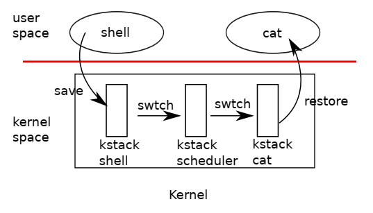

# Chapter 7 Scheduling

任何操作系统都会尝试运行比 CPU 核数更多数量的进程，所以一个如何在让进程分享 CPU 时间的调度方案就显得尤为重要。理想的情况是，操作系统的这些调度对进程完全透明，进程认为自己完全使用 CPU 及其相关硬件资源。

## Multiplexing
xv6 会在两种情况下将 CPU 的使用权从一个进程移交到另一个进程。其一是 xv6 的 sleep 和 wakeup 技术，这一技术使用情况有进程等待设备 I/O， 等待子进程中止，或者是单纯的等待在 sleep 系统调用中。其二是 xv6 会周期性地强制占用 CPU 时间长地进程交出使用权。

## Code: Context switching
下图简要展示了从一个进程切换到另一个进程的过程。首先是一个从旧进程的用户到旧进程的内核的过程（可能是系统调用或者中断），然后是切换到当前 CPU 的调度进程，再是切换到新的进程的内核，最后是通过 trap ret 返回到新进程的用户态。xv6 对于每一个 CPU 安排了一个独有的调度进程，因为如果直接使用旧进程的 kernel stack 并不安全（可能其它 CPU 在此时唤醒该进程，导致两个核同时使用同一个 kernel stack，出现混乱）。

