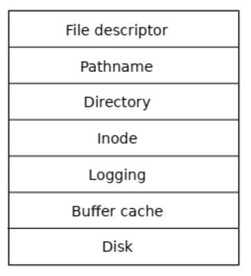
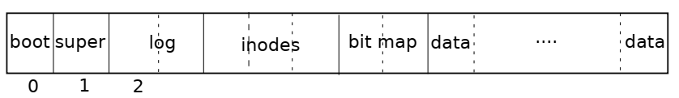
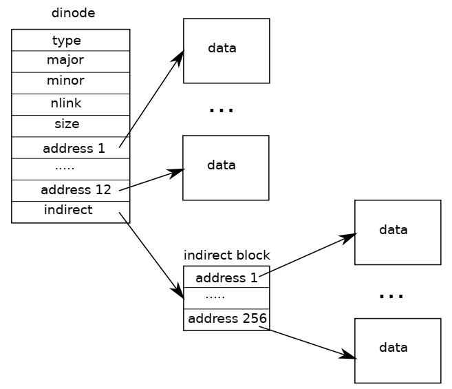

# Chapter 8 File system

文件系统用于管理和存储数据，支持在用户和应用程序之间分享数据。

文件系统通常会碰到以下几种挑战：

* 需要一种存储在磁盘上的数据结构来描述文件目录树，记录磁盘块与文件内容的关系，以及磁盘空闲块的位置。
* 文件系统必须支持崩溃恢复，即当因电源等问题出现崩溃后，文件系统能够在重启后正常工作。这其中的挑战在于，崩溃可能发生在一系列更新中间，导致文件系统的数据结构不完整或不合法。
* 多进程并发读写的问题。
* 由于读写磁盘总是要比读写内存慢，所以文件系统一般需要在内存中维护一个活动块的缓存。

## Overview
xv6 的文件系统实现由以下 7 层组成。



其中，每层的功能分工如下：

* Disk 层在 virtio hard drive 上读写块数据
* buffer cache 层对磁盘块建立缓存，并对所有访问磁盘的操作进行同步，保证在任意时刻仅有一个内核进程能修改某一个特定块的数据
* logging 层为更高的层级提供对一组 update 打包成一个 transaction 的功能，保证所有的操作都是原子化的，防止崩溃引发问题
* inode 层为每一个文件提供了独有的 inode number 以及保存文件数据的若干块位置
* directory 层将每一个文件夹组织成一个特殊的 inode，由若干条目组成，每一个条目包括一个 i-number 和文件的名字
* pathname 层将文件夹组织为层级结构，并通过递归的方式来索引路径
* file descriptor 层将若干 unix 资源（如管道 pipe, device 设备）在文件系统上抽象。

xv6 的文件系统将磁盘分成了下面几个部分，划分的最小单位为块 block。



* block0 通常用于启动操作系统，文件系统不会使用这部分的数据。
* block1 被称为 superblock，存储文件系统的元数据 metadata ，包括块的大小、数据块的个数、inode 的个数，log 中块的数量。这部分还包括一个被称为 mkfs 的程序，用于构建一个初始的文件系统。
* bit map 标记后面的每一个 data block 是否已经被占用。

## Buffer cache layer
这一层要做的工作有两个：其一是同步对磁盘块的访问，保证内存中每个块的拷贝都是唯一的，并且一次只能有一个内核进程访问这个拷贝；其二是将频繁访问的块缓存到内存中。  
buffer cache 提供的最主要的两个接口是 `bread` 和 `bwrite`，前者持有一个包括若干块的拷贝的 buf，可以在内存中读写；后者将合适的被修改的块写回到磁盘上。当内核使用完一个 buffer 后，必须显式的通过 `brelse` 来释放。buffer cache 对每一个 buf 都维护了一个 sleep lock 以保证访问的互斥性。  
buffer cache 中 buffer 的数量是有限的，这意味着如果文件系统要求一个当前不在缓冲区内的块时，它必须选择回收一个当前持有着另一个块的 buffer。xv6 使用的调度算法是 LRU(least recently used)。  
在实现上，buffer cache 基于一个双向链表，

## Logging layer
这一层主要用于解决崩溃恢复的问题。xv6 使用了一种简单的日志 log 的形式，即 xv6 的系统调用不会直接操作磁盘上的文件系统数据结构，而是将它想要执行的操作描述在 log 中；操作系统将所有需要做的事情全部记录好之后，它再写入一个特殊的 commit 表明 log 中已经包括了完整的操作步骤。然后，才会将数据修改进相关的结构中。当所有的写都完成后，log 会被清空，以等待进行下一次的操作。  
如果系统崩溃发生，重启后，文件系统会运行恢复程序。恢复程序首先检查 log。如果 log 是完整的，那么就执行其中的操作；否则是不完整的，那么就忽略其中的任何内容。当需要的操作执行完后，恢复程序清空 log，然后交回控制流。

## Log design
log 在磁盘中的位置是固定的，它一般由一个 header block 和一系列 logged blocks 组成。header block 包括一个指明每一个 logged blocks 的数组，以及包括的 logged blocks 的数量 count，这个数量如果是 0 则说明这个 log 中没有需要操作的动作，否则就表明有一个完整的操作序列。xv6 保证只有在将所有动作写入 log 后才会更新 count 的值，以确保恢复的原子性。  
为了同时满足多个进程对文件系统的读写，log 系统可以将来自不同进程的磁盘操作聚合，这意味着一次 commit 可能包括若干个 system call。同时，为防止同一个 system call 的操作被拆分到多个 commit 中，log 系统仅在当前没有 system call 的时候才进行 commit 。  
将多个 transaction 打包一起 commit 的方法即是 group commit 。这一方法能有效降低读写花费，因为一些固定的时间消耗被均摊给每一个原来的 transaction 了。  
xv6 中 log 的大小是有限的，这意味着系统调用操作使用的空间不能超过提供的 log 的大小。有两种情况可能会涉及到对大量块的写，一种是大文件的写操作，另一种是 unlink 操作。对于前者，xv6 的 write 系统调用会将大文件的写拆分成几个小的写操作，以适应 log 的大小限制；对于后者，对一个大文件进行 unlink 操作可能会涉及到修改许多的 bitmap 和一个 inode，不过由于 xv6 的设计中只有一个 bitmap 块，所以一般这不会成为问题。

## Block allocator
文件和目录结构都是存储在磁盘块中的，为此我们也需要一个用于分配和管理块的 block allocator。  
xv6 的 block allocator 在磁盘上管理着一个标记是否空闲的 bitmap。mkfs 程序就是初始化其中与预先需要使用到的 block0, block1, log, inode,bitmap 等相关的块的信息。  
这一结构提供了两个函数 `balloc` 和 `bfree` 用于分配和回收块。为防止出现竞争情况，任意时刻仅允许最多一个进程使用 bitmap，但是由于 buffer cache 已经保证了这一点，所以这里并不需要加锁保护。

## Inode layer
在 xv6 的语境中，inode 有两个意思。一是指磁盘上的包含一个文件的大小以及数据块信息的编号 on-disk inode，二是指前一结构在内存中的拷贝以及内核所需要的其它信息。  
对于 on-disk inode，一般会包装成磁盘上连续的 inode blocks。每一个 inode 大小是固定的，并且有一个唯一的 i-number 来标记。这一结构在 `struct dinode` 中定义，其中的 type 指明这个 inode 是文件 file、目录 directory 还是特殊文件（比如设备 device）。当 type 为 0 时说明这个 inode 为空。nlink 记录这个 inode 被多少目录项引用，以便于判断这个 inode 以及其关联的文件数据块是否可以被释放。size 记录这个文件中包含的内容的大小。addr 记录包含文件内容的块的编号。  
内核会将活跃的 inode 保留在内存中，结构 `struct inode` 是上文所述 `dinode` 在内存中的拷贝。当且仅当有 C 指针引用了某个 inode 时，内核才会将 inode 保存在内存中。一旦引用数为 0 ，内核就会将其从内存中清理出去。使用 `iget` 和 `iput` 两个函数来维护指针对 inode 引用的计数。`iget` 返回一个 `inode` 指针，并且保证在执行相关的 `iput` 之前，这一指针始终是合法的。任何代码都可以同时合法地访问 `iget` 返回地这一 `inode` 指针，所以可能同时有多个指针指向同一个 inode。 `iget` 返回的指针可能并不包含有效内容（ `valid==0`），所以需要用`ilock`从磁盘中读取内容。一个典型的调用过程如下：

```c
ip = iget(dev, inum);
ilock(ip);
...examine and modify ip->xxx
iunlock(ip);
iput(ip);
```

inode cache 的主要工作是将不同进程对 inode 的访问同步，cache 功能反而是排在其后的。值得指出的是，inode cache 是直写 write-through 的，即任何时刻 inode cache 中的内容被修改都会立刻通过 `iupdate` 写入到磁盘中。

dinode 结构中，对文件块的存储如下：



其中在 inode 本结构体中就存储了 NDIRECT 块数据的地址，这部分被称为 direct block；剩下的通过 indirect 连接到一个外部块，这个块中能够存储 256 个数据块的地址，这部分被称为 indirect block。bmap() 函数为操作这些块提供了一个更高层的抽象，它负责获取 inode 中第 n 块的地址：当 $bn < NDIRECT$ 时，直接返回 `ip->addr[bn]`，若不存在则使用 `balloc` 分配一个；否则就通过间接查询的方式跳转到 `indirect block` 查询。

## Directory layer
在内部实现上，一个目录 directory 与文件是相似的，它的 inode type 是 T_DIR，它的数据则是若干目录条目 directory entries。每一个条目都是一个 `struct dirent`，其中包括文件名和 inode 编号

## File descriptor layer
unix 标准的一大特征是，大部分的 unix 资源都是用文件表示的，filee descriptor layer 是实现这一功能的主要 layer。xv6 为每一个进程准备了独有的已打开文件的表格，或者说文件描述符表。这些内容保存在 `struct file` 中，每一次调用 open 时就会创建一个新的结构。如果有多个进程同时独立地打开同一个文件，就会创建不同的独立的实例，每一个都拥有独立的读写偏移。另一方面，一个单独的 open file（即同一个 struct file）可以出现在一个或多个进程的文件表中多次（如使用 dup，或者 fork 出子进程共享）。文件可以被打开为读、写或同时读写，这一标记由 `readable` 和 `writeable` 维护。  
系统中所有被打开的文件都会在全局文件描述符表 `ftable` 中标记。

##  Real world
现代操作系统的 buffer cache 比 xv6 中更加复杂，但提供的也是同样了两个功能：访问同步和缓存 cache。xv6 的 buffer cache 使用了简单的 LRU 替换规则，真实世界的操作系统通常则会使用更复杂的调度方式，以获得更好的效率和公平性。  
xv6 的 logging 系统也是低效的，比如它不能在有 system call 的同时进行 commit，另外需要对整个块进行 log （即使只有少量 bit 被修改了）。现代操作系统在这些方面都有所改进。  
log 系统并不是让系统支持错误恢复的唯一方式。早期的文件系统使用了线性扫描的方式（比如 unix 中的 fsck 程序），在重启的时候扫描所有的文件、目录和 block, inode 的空闲链表，发现任何不一致的地方，然后尝试进行修复。这一方法的问题在于，扫描较大的文件需要花费大量时间，并且不是所有的问题都能得到修复。与之相比，使用 log 的方式进行系统恢复速度更快，而且由于保证了操作的原子性，错误一般都是可以修复的。  
xv6 对于磁盘错误的处理很简单，如果磁盘出现错误，xv6 会直接进入 panic。现代操作系统会更精细地实现这一部分，以保证当磁盘失效的时候，系统的其它部分仍然能正常使用。  
xv6 的文件系统仅能在单磁盘上操作，并且要求其容量不能发生变化。现代操作系统在这一方面也做了很多改进，比如使用 RAID 技术，或者支持文件系统的扩容或缩减。这是使用固定大小 inode 的 xv6 不能做到的。  
xv6 的文件系统还缺少很多现代操作系统文件系统的特性，比如快照 snapshot 和增量式备份 incremental backup。
