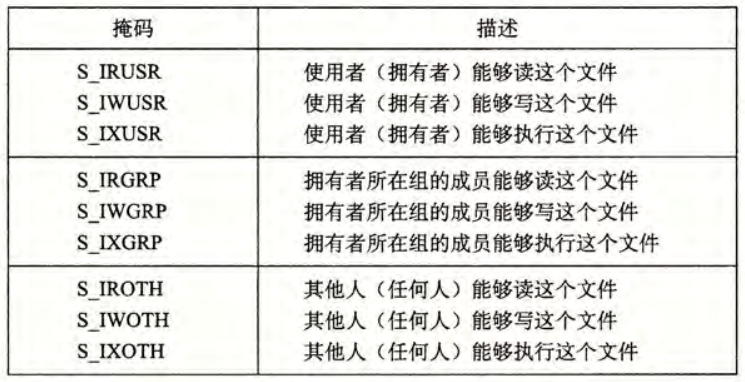
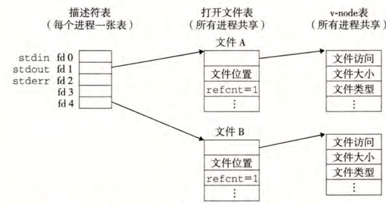

# 第10章 系统级IO

## `Unix I/O`
在 `Linux` 系统中，所有的 IO 设备都被模型化为文件，而对这些设备的输入输出都被模型化为对文件的读和写。得益于这一映射方式，`Linux` 内核使用简单而低级的应用接口 `Unix IO`来统一执行所有的输入和输出。

* 当应用程序要打开文件时，向内核申请要访问的 IO 设备，内核会返回一个负整数**描述符**来标识文件。`Linux shell` 创建进程时会默认打开三个文件，标准输入0，标准输出1，和错误输出2。
* 对于每个文件，内核维护一个文件位置，标识从文件开头起始的字节偏移量，初始为 0 。应用程序可以通过 `seek` 操作来显式地设置这个偏移位置。
* 读写操作就是在内存和文件之间数据的复制。
* 当要关闭文件时，内核会释放相关的数据结构。无论一个进程以何种方式结束，内核都会关闭所有它打开的文件并释放相关的内存资源。

## 文件
每个 `Linux` 文件都有一个类型来表明它在系统中的角色。

* 普通文件：包含任意数据。尽管应用程序常常区分文本文件和二进制文件，但对内核而言，二者没有区别。
* 目录：包含一组**链接**，其中每个链接都将一个**文件名**映射到一个文件，这个文件可能是另一个目录。每个目录至少包含两个条目，一个是 `.` 指向自身，另一个是 `..` 指向父目录。
* 套接字：用于与另一个进程进行跨网络通信。

其它文件类型包括命名通道、符号链接、块设备等，这里不再讨论。  
`Linux` 内核将所有的文件组织成**目录层次结构**，形式上看，这是一棵以 `/` 为根的树。

## 打开和关闭文件
进程调用 `open` 函数来打开一个已存在的文件或创建一个新文件，其定义为：

```c
int open(char *filename, int flags, mode_t mode);
```

该函数将 `filename` 转化为对应的文件描述符，并返回描述符数字，这一数字总是当前进程没有使用的最小描述符。`flags` 参数指明进程打算如何访问这个文件，具体有：`O_RDONLY` 只读，`O_WRONLY`只写，`O_RDWR`可读可写。这一参数也可以是更多参数的或，为写提供额外的指示，这些参数有：`O_CREAT`若文件不存在则创建一个新的空文件，`O_TRUNC`若文件已存在则截断它，`O_APPEND`在每次写操作前设置文件位置到文件的结尾处。`mode` 参数指定咯新文件的访问权限位，具体定义如下表。



进程调用 `close` 关闭打开的文件，传入的参数为对应的文件描述符。

## 读写文件
基础地，可以通过 `read()` 和 `write()` 函数来进行文件读写。也可以使用 RIO 包中的相关函数进行读写。

## 读取文件元数据
使用 `stat` 和 `fstat` 能检索关于文件的信息（元数据）。前者以文件名作为输入，而后者以文件描述符作为输入。

## 读取目录内容
使用 `readdir` 系列函数来读取目录内容。

## 共享文件
`Linux` 内核使用三个相关的数据结构来表示打开的文件，图示如下。



* 描述符表：每个进程独立，用于通过文件描述符索引打开的文件。
* 打开文件表：是所有进程共享的，这一表项中包括：当前的文件位置，引用计数（即指向该表项的文件表中表项的个数），以及指向`v-node`表中对应表项的指针。关闭一个文件描述符时，内核会维护对应文件表中的引用计数，当这个数值减少到 0 时，内核会删除这个文件表表项。
* `v-node` 表：是所有进程共享的，包含 `stat`结构中的大多数信息。

需要指出的是，多个描述符可以通过不同的文件表表项来引用同一个文件，这其中的关键是，每个描述符都有自己独立的文件位置，这意味着对不同的描述符的读操作可以从文件的不同位置获取数据。   
这也能很方便地解释在 `fork` 时父子进程地行为。当调用 `fork` 时，子进程会复制父进程地描述符，得到一份副本，两者会共享相同的打开文件集合表，因此也就会共享相同的文件位置。

## IO 重定向
使用 `dup2(int oldfd, int newfd)` 函数来重定向，这一函数复制描述符表项 `oldfd` 到 `newfd`，覆盖`newfd` 原来的内容，若原来 `newfd` 已经打开，`dup2` 会在复制前关闭 `newfd`。

## 标准 IO
C语言定义了一组高级的输入输出函数，即标准 IO 库。这一方法将打开的文件模型化为流，使程序员能在更高层次的抽象上工作。