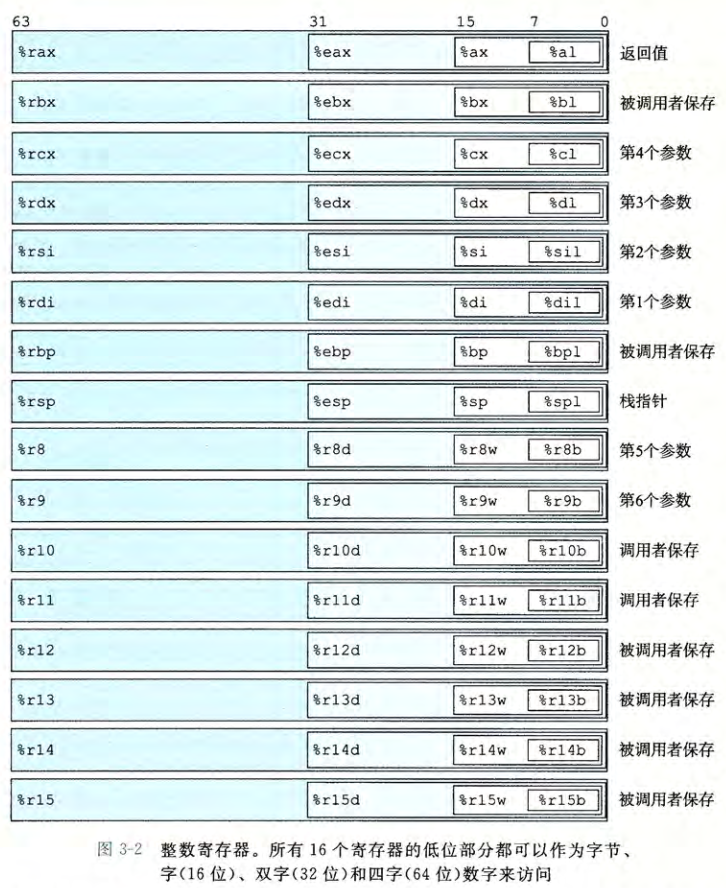
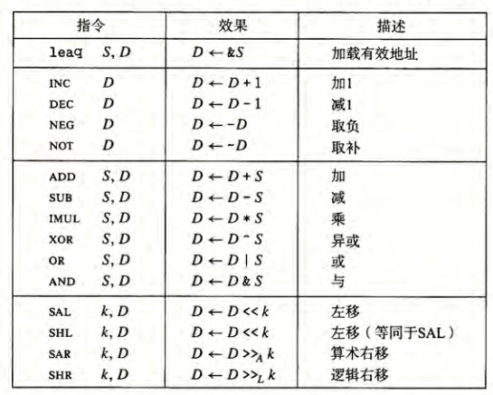
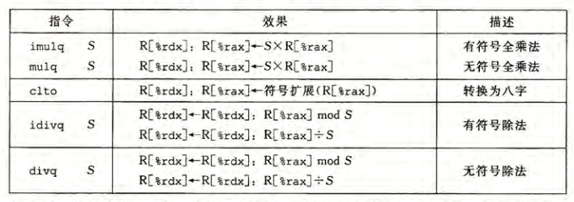
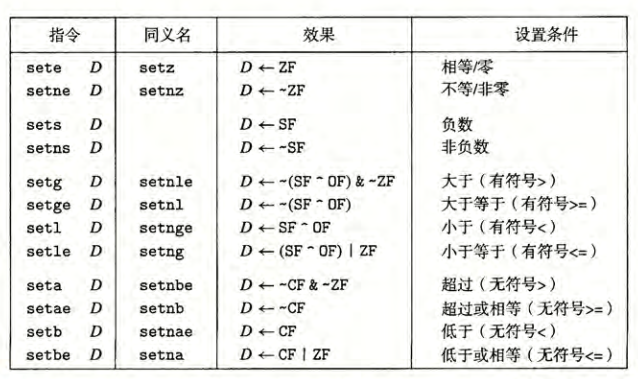
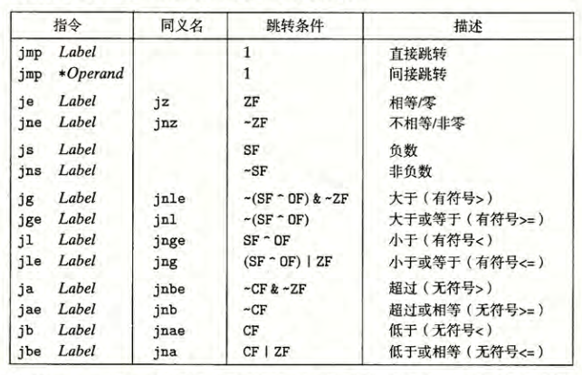
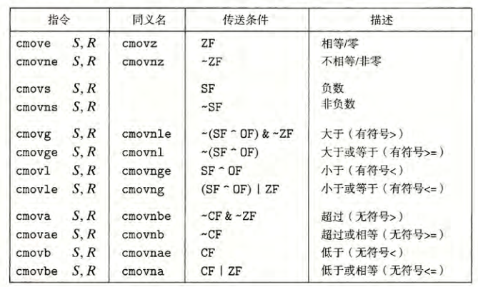
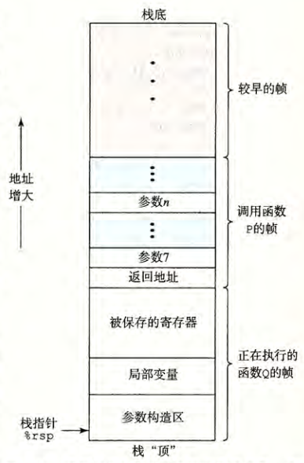
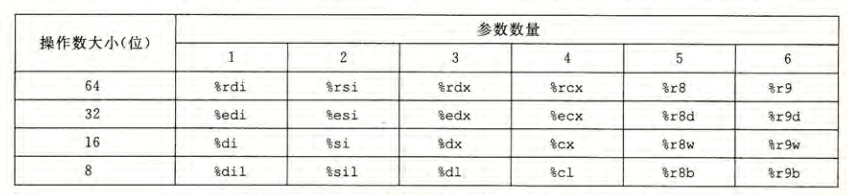

# 第3章 程序的机器级表示

## 机器代码的一些简单操作
使用 `-S` 选项可以让 `gcc` 生成汇编代码。使用 `-C` 选项生成二进制代码文件`.o`。  
反汇编器可以根据机器代码产生类似汇编代码的格式。在 `linux` 中一般使用 `objdump`，即 `objdump -d filename`。  

> 关于及其代码及反汇编表示：
> `x86-84`的指令长度从1到15字节不等，根据使用的频繁程度赋予对应的字节长度。  
> 从某个给定位置开始，字节解码成机器码是唯一的。  
> 反汇编器根据机器代码中的字节序列来确定汇编代码，不需要访问源代码或原汇编代码。  
> 以`.`开头的都是指导汇编器和连接器工作的伪指令，通常可以忽略。

## 数据格式与操作
称8位数据类型为字节`byte`，16位数据类型为字`word`，32位数据类型为双字`double words`，64位数据类型为四字`quad words`。  
大部分 GCC 生成的汇编代码指令都有一个字符后缀，来表示操作数的大小，如`movb,movw,movl,movq`分别传输字节、字、双字和四字。

### 寄存器
一个 `x86-64` 的中央处理单元包括一组16分存储64位值的*通用目的寄存器*，用来存储整数数据和指针。

使用不同的指令可以操作寄存器中不同的低位字节。

> 注：当生成小于 8 字节结果的指令以寄存器作为目标时，寄存器剩下的字节会如何变化与操作数大小有关：  
> 若生成的是1字节或者2字节的数，则剩下的字节保持原样。  
> 若生成的是4字节的数，则会把高位的4个字节置为0。

### 操作数指示符
操作数分为三种：立即数，寄存器和内存。  
立即数用来表示常规值，其书写方式是`$`后根标准 C 表示法表示的整数。注意到不同的指令允许的立即数的范围不同，汇编器会自动选择最紧凑的方式进行编码。  
寄存器则是表示寄存器中存储的内容，用$r_a$表示任意寄存器$a$，用引用$R[r_a]$表示它的值。  
内存引用是根据计算出来的地址访问某个内存位置，在这里我们将内存看作一个很大的字节数组。  
通常用$Imm(r_b, r_i, s)$来这一通用形式来寻址。其中$Imm$表示立即数偏移，$r_b$ 是基址寄存器，$r_i$ 是变址寄存器，$s$是比例因子且只能为$1,2,4,8$，最终的地址计算为 $Imm + R[r_b] + R[r_i] \times s$。注意 $r_b$ 和 $r_i$ 都必须是 64 位寄存器。

### 数据传输指令
使用指令 `mov* A B` 将 A 中的内容移动到 B 中，其中 `*` 根据移动操作的大小不同进行选择。  
通常，`mov`指令只会更新目的操作数指定的寄存器字节或内存位置，但例外`movl`当以寄存器为目的时，会把该寄存器的高 4 字节设置为 0。  
`mov` 指令的两个地址不能同时是内存地址。如果需要将一个值从内存的某个位置移动到另一个，需要先使用一次`mov`加载到寄存器中，再移动到内存中。  
特殊指令`movabsq`以任意64位立即数作为源操作数，且只能以寄存器为目的。常规的`movq`指令只能以32位补码的立即数作为源操作数，然后把这个值的符号扩展到高位。  
`movz`和`movs`两类指令是在从较小的源复制到较大的目的时使用，其中`movz`把剩余的字节填充为0，而`movs`把剩余的字节填充为最高符号位。

> 并不存在`movzlq`这一指令，因为`movl`已经能将高4字节设置为 0。  
> 特殊指令`cltq`没有操作数，直接将`%eax`符号扩展到`%rax`。等价于`movslq %eax, %rax`。

### 栈操作
指令`pushq`将数据压入程序栈中，而指令`popq`从程序栈中弹出数据。这两条指令操作的都是栈指针`%rsp`。

## 算术和逻辑操作
总览

指令`leaq`本来是用来计算内存位置的，但由于其可以简单地进行一些算术运算，所以很多时候编译器会将其用于算术。  
所有的二元操作均是以第一个操作数为源操作数，第二个操作数为目的操作数。例如`subq %rax, %rdx`的解释为：将`%rdx`中的数减去`%rax`中的数，结果存放到`%rdx`中。  
移位操作的第一个操作数`k`可以是立即数，也可以是存放在寄存器`%cl`中的数（只能为`%cl`）。当移动$\omega$位长的数据时，只会取寄存器`%cl`的低$m$位参与运算，其中$2 ^ m = \omega$。例如当`%cl`中的值是$0xFF$时，`salb`会移动 7 位，`salw`会移动15位，`sall`会移动31位，`salq`会移动63位。

### 特殊的算术操作
称16字节的数为八字`oct word`，Intel 提供了产生两个 64 位数字的全128位乘法以及整数除法的相关指令。

注意到指令`imulq`有两种形式：当其有两个操作数时，执行的是64位乘法；当只有一个操作数时，执行的是128位乘法。  
对于除法，不论有无符号都将`%rdx`作为高64位、`%rax`作为低64位组成被除数，将指令的操作数作为除数，并将最终的商存放在`%rax`中，将余数存放在`%rdx`中。

> 特殊指令`cqto`，读出`%rax`的符号位并复制到`%rdx`的所有位。

## 控制
### 条件码
CPU维护了一组单个位的条件码寄存器，用于描述最近的算术或者逻辑操作的属性。

> 常用条件码：  
> CF：进位标志。最高位是否发生了进位，用于判断无符号数的溢出。  
> ZF：零标志。最近操作的结果是否为 0 。  
> SF：符号标志。最近操作的结果是否是负数。  
> OF：溢出标志。最近的操作是否导致了补码溢出（正溢出和负溢出）

`leaq`指令用于进行地址计算所以不会改变任何条件码。对于逻辑运算，进位标志和溢出标志会设置为 0。对于移位操作，进位标志将设置为最后一个被移除的标志，溢出标志会设置为 0 。`inc`和`dec`指令会设置溢出和零标志，但不会改变进位标志。  
使用 `cmp`和`test`两组指令可以仅修改条件码而不进行运算，其中`cmp`等价于`sub`，而`test`则等价于`and`。

> `test`的典型用法：  
> 两个操作数相同。通常用于与 0 进行比较。  
> 一个操作数是掩码，用于指示哪些位应该被测试。

条件码通常不是直接读取的，而是通过间接的方式参与程序，共有三种方式。这三类方式在命名上有着相似的规则。  
其一是根据条件码的某种组合设置指定字节。这是通过 `set` 指令组完成的。

其二是跳转指令，通过`jmp`指令组和标签实现跳转。值得注意的是，`jmp`跳转指令既可以以给定的标号作为跳转目标，也可以从内存或者寄存器中读取跳转目标。前者称为直接跳转，后者则称为间接跳转。

> 当执行 PC 相对寻址时，程序计数器的值是跳转指令后面的那条指令的地址，而不是跳转指令本身的地址。这在计算相对跳转时需要格外注意。

> 在很多时候，我们可以看到`jg`等指令后面常常跟着 `rep`然后才是`ret`。根据 AMD 的说法，当`jg`类似指令不发生跳转时，若后面直接跟着`ret`会使处理器不能预测`ret`指令的目的。故建议添加`rep`作为一个空指令。

其三是条件传送。根据条件码判断是否执行传送，在现代处理器的流水线架构下，这一方式在某些情况下尤为高效。

> 条件传送指令的目的只能是寄存器。汇编器可以从目标寄存器的名字推断出传送的操作数长度，所以无需在指令中指明。

### 跳转表
在 C 语言中，使用`switch`来实现跳转相关功能。而在汇编中，对应语句会翻译为间接跳转。具体来说，会生成一个只读的跳转地址表，当进行跳转时，只需要进行一次计算再根据结果进行一次跳转。这样能够更快地实现多重分支。

## 过程
过程将代码封装，用一组指定地参数和一个可选的返回值实现某种功能。同时，过程可以在程序的不同地方调用以实现复用。

> 通常，与过程相关的机器级机制包括：  
> 传递控制：从过程 P 进入到过程 Q，要将程序计数器设置为 Q 的起始地址，而返回时要设置为 P 调用 Q 的后一条语句的地址。  
> 传递数据：过程 P 要能向 Q 传递若干个数据，而 Q 可以向 P 返回一个数据。  
> 分配和释放内存：过程 Q 在开始时可能需要对局部变量分配空间，而在返回时，又要释放空间。

### 运行时栈
在 `x86-64`中，栈向低地址方向增长，栈指针`%rsp`指向栈顶元素。  
当过程需要的存储空间超过寄存器能够存储的大小时，就会在栈上分配空间，这部分称为栈帧。

### 转移控制
指令`call`和`ret`分别负责发起过程调用和从调用中返回。同跳转一样，`call`指令也有直接跳转和间接跳转两种。  
`call`指令将返回地址压入栈中，然后跳转到调用的过程的第一条指令。而`ret`指令则从栈中弹出要返回的地址，然后返回。

### 数据传送
`x86-64`中最多通过寄存器传递 6 个整型参数，更多的参数则需要依靠栈来传递。  
具体来说，假设有 $n (n \ge 7)$个参数需要传递，前 6 个参数通过寄存器传递，超过的部分按照序号压入栈中，参数 7 位于栈顶。在栈中的数据都需要向 8 字节对齐。

返回值则通常是通过寄存器 `%rax` 传送。

### 寄存器
为确保被调用者不会覆盖调用者稍后需要使用的寄存器值，`x86-64`设定寄存器`%rbx,%rbp,%r12-%r15`为被调用者保存寄存器，即当过程 P 调用过程 Q 时，Q必须保证这些寄存器中的值在 Q 返回的时候与调用的时候一致，若 Q 需要用到这些寄存器，则必须先把原值压到栈中，返回时再取出旧值。  
剩下的寄存器除了`%rsp`是栈指针外，均为调用者保存器，这意味着任何函数将都可以修改且不用关心后果。那么若 P 在调用 Q 后仍想使用原来里面的数值，就必须在调用 Q 之前自己保存好这些寄存器中的值。

## 数组
C 中的数组操作在汇编中大部分翻译为内存操作，从这里就可以看出`x86-64`定义的地址计算的便利之处。  
对于多维数组，编译器在处理时先要计算偏移量。  
编译器对于定长数组的寻址通常可以通过很聪明的指针操作来避免多次地址运算。当允许优化时，GCC 能够识别出程序访问多维数组的元素的步长，然后生成避免乘法的代码来加速运算。

## 异质数据结构——结构和联合
需要指出的是，不论是结构`struct`还是联合`union`都是 C 语言支持的，机器代码中不包含相关的声明。C 语言编译器在翻译的时候会将相关内容直接翻译为地址计算，并通过指令名字进行区分。  
对于结构，指向结构的指针就是结构第一个字节的地址。C 语言维护其中每个字段的字节偏移，在访问的时候进行地址计算。  
对于联合，C 语言同样维护对应的字节偏移。

### 数据对齐
无论数据是否对齐，`x86-64`硬件都应该能够正常工作。但一般而言，建议将数据对齐以提高内存系统的性能。  
对齐原则：任何 K 字节的基本对象的地址都必须是 K 的倍数。编译器在汇编代码中会放入命令以指定全局数据所需的对齐，如`.align 8`保证它后面的数据的起始地址是 8 的倍数。  
若代码中包含结构，编译器则可能会在字段中插入间隙以保证每个结构元素都满足对齐的要求。此外，结构本身对它的起始地址也有一些对齐要求。当结构作为数组存在时，编译器还需要考虑在结构尾部填充以使得数组中的每个元素都满足对齐要求。