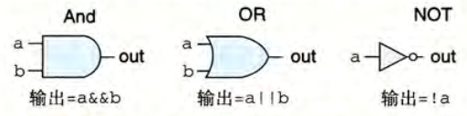

# 第4章 处理器体系结构

## `Y86-64` 指令集体系结构
### 程序员可见的状态
在 `Y86-64` 中定义有 15 个程序寄存器，每个寄存器存储一个 64 位的字。其中 `%rsp` 被用来记录入栈、出栈、调用和返回指令，作为栈指针，其它寄存器没有固定的含义。  
定义 ZF（零）,SF（符号） 和 OF（溢出） 三个一位的条件码，保存最近的算术或者逻辑信息。程序计数器 PC 存放当前正在执行指令的地址。  
使用虚拟地址来引用内存位置，即把内存认为是一个很大的字节数组。  
状态码 `Stat` 用于表明程序执行的总体状态，即是正常运行还是出现异常（如某条指令尝试读取非法的内存地址）。


### `Y86-64` 指令及其编码
`Y86-64`的指令集基本上是 `x86-64` 的子集，仅包含 8 字节的整数操作。下面是一些细节。

`movq` 指令被拆成了四个不同的指令：`irmovq,rrmovq,mrmovq,rmmovq`，前缀用于显式地指出源和目的地格式：立即数`i`，寄存器`r`和内存`m`。  
内存引用方式都是简单的基址和偏移量形式。不支持第二变址寄存器和任何寄存器值的伸缩，不允许从一个内存地址直接传送到另一个内存地址，不允许将立即数直接传送到内存。  
四个整数操作指令：`addq, subq, andq, xorq`。仅支持对寄存器数据进行操作，并能设置三个条件码。  
七个跳转指令：`jmp, jle, jl, je, jne, jge, jg`。条件与 `x86-64` 中一致。  
六个条件传送指令：`cmovle, cmovl, cmove, cmovne, cmovge, cmovg`。指令格式与 `rrmovq` 一样。  
`call` 指令将返回地址入栈，并跳转到目的地址。与之相配的`ret`指令从调用中返回。  
`pushq` 与 `popq` 实现入栈和出栈。  
`hall` 指令停止指令的执行。在 `x86-64` 中，对应的指令为 `hlt`，应用程序不允许使用这条指令，因为它会导致整个系统暂停运行。而在 `Y86-64` 中，`halt` 指令会导致处理器停止，并将状态码设置为 `HLT`。


每条指令需要 1 到 10 个字节不等的空间，其中第一个字节表明指令的类型。这一字节又分为两部分：高 4 位表示代码，低 4 位表示功能。代码给出指令所在的指令组，而功能则是指出具体是该指令组中的哪一个。


15 个寄存器也有对应的标识符，从 0 到 `0xE`。当需要指明不应访问任何寄存器时，用 `0xF` 来表示。


> 关于指令的补充说明：  
> 有些指令有附加的寄存器字节，称为 `rA, rB`，而只需要一个寄存器作为操作数的指令将另一个寄存器设置为 `0xF`。  
> 有些指令需要一个附加的 8 字节常数字，如 `irmovq` 的立即数数据、`rmmovq` 和 `mrmovq` 的地址指示符的偏移量以及分支指令和调用指令的目的地址。  
> 分支和调用指令的目的是一个绝对地址，而不是 `x86-64` 中的相对寻址方式。  
> 所有整数采用小端法编码。

`Y86-64` 指令集满足唯一解释。

### 异常
这里指的是状态码 `Stat`，它描述的是程序执行的总体状态。具体的可能值及意思如下。


当遇到异常时，我们简单地让处理器停止执行。但在更完善的设计中，处理器会调用一个异常处理程序。

### 有关 `pushq` 和 `popq` 的特殊情况
这两个指令都会对栈指针进行操作，但如果是 `pushq %rsp` 或者 `popq %rsp` ，会压入哪个值呢？  
`Y86-64` 采用与 `x86-64` 一致的规定，即对于 `pushq %rsp`，放入的是 `%rsp` 的原值（在执行 -8 之前的值）；而 `popq %rsp` 则是把 pop 出的值放到 `%rsp` 中。

## 逻辑设计和硬件控制语言 HCL

逻辑门是数字电路的基本计算单元。在 C 语言中用`&&,||,~`来表示，而不是用 `&,|,~`，因为逻辑门只对单个位的数进行操作，而不是整个字。下图中只给出了两个输入的版本，但 $n$ 路输入也是很常见的。  
逻辑门被认为是活动的，即一旦一个门的输入变化了，它的输出在很短的时间内也会相应地发生变化。



将很多逻辑门组合成一个网，就可以构建计算块，也称组合电路。

> 组合电路网的限制：  
> 每个逻辑门地输入必须连接到以下三个选项之一：系统输入（主输入），某个存储单元的输出，某个逻辑门的输出。  
> 两个或多个逻辑门的输出不能连接在一起。否则会导致线上的信号矛盾，可能导致不合法电压或电路故障。  
> 网必须是无环的。形成回路可能会导致歧义。

HCL 表达式能很清楚地表明组合逻辑电路与 C 语言中地逻辑表达式的对应之处。  
在 HCL 中，所有字级的信号都声明为 `int` ，不需要指定字的大小。 HCL 允许比较字是否相等，比如`bool Eq = (A == B);`，这里 A 和 B 都是 `int` 型的，比较判断则延用了 C 的定义。  
如下图所示，在画字级电路的时候，用中等粗度的线来表示携带字的每个位的线路，而用虚线表示布尔信号结果。


在 HCL 中，采用情况表达式来描述多路复用函数，其通用格式如下：

```json
[
    select1 : expr1;
    select2 : expr2;
    ...
    selectk : exprk;
]
```

在这个表达式中，前面的 `select` 用于指明什么时候应该选择这种情况，后面 `expr` 则指明应该得到的值。  
与 C 中 `switch` 语句不同的是，这里不要求选择表达式之间互斥。在逻辑上，这些选择表达式是顺序求值的，且第一个值为 1 的情况会被选中。  
当然在实际的硬件多路复用器中，信号必须是互斥的。

算术逻辑单元（ALU）是一种很重要的逻辑电路。它有三个输入：A 和 B 两个数据输入，以及一个控制输入。根据控制输入的设置，电路会对数据输入执行不同的算术或逻辑计算。  
可以看到，在下图中的 ALU 支持的四个操作分别对应 `Y86-64` 指令集支持的四种不同的整数操作。注意减法的操作数顺序，与 `subq` 指令的参数顺序一致。


有时需要判定某个信号是否属于一类信号，这时可以采用集合关系，其通用格式为 `iexpr in {iexpr1, iexpr2, ..., iexprk}`，其中每个 `iexpr` 都是一个整数表达式。

### 存储器与时钟
组合电路不存储任何信息，若加入存储信息的设备，就产生了时序电路。时钟是一个控制存储设备的周期性信号，它决定了什么时候把新值加入到设备中。

> 两类常见的存储器设备：  
> 时钟存储器（寄存器）：存储单个位或者字，并由时钟信号来控制寄存器是否加载输入的值。  
> 随机访问存储器（内存）：存储多个字，并由地址来决定读或者写哪个字。常见的具体例子有：处理器的虚拟内存系统，寄存器文件。

注意到寄存器这个名词在硬件和机器级编程时，其代表的意思有细微的差别。在硬件中，寄存器直接将它的输入输出线与电路的其他部分相连。而在机器级编程中，寄存器指的是 CPU 能够通过寄存器 ID 寻址的字，这些字通常都存储在寄存器文件中。为避免歧义，通常称前者为“硬件寄存器”，后者为“程序寄存器”。

硬件寄存器的工作方式：大多数时候，它保持稳定状态，产生与其当前状态相同的输出。而寄存器的输入与时钟跳变有关，当时钟是低电位时，寄存器不会关心输入的信号；但当时钟跳转到高电位时，寄存器会把输入信号加载进来，并更新输出信号。  
寄存器可以作为电路不同部分的组合逻辑之间的屏障，因为其只有在时钟跳变上升时，才把值从输入传送到输出。`Y86-64` 处理器用时钟寄存器保存程序计数器（PC）、条件代码（CC）和程序状态（Stat）。

随机访问存储器一般允许多个读和写操作，这里以某种寄存器文件为例。在下图所示的寄存器文件中，电路可以同时读取两个程序寄存器的值，并更新第三个寄存器的状态。每个端口都有一个地址输入（表示要操作哪个位置）和一个数据线（表示要输入的数据或者读出数据）。


寄存器文件是一个时序电路。在读出时，可以看作是输入一个地址，输出该地址上的寄存器的值。而在写入时，与时钟存储器一样，由时钟来控制何时会把输入的字存储到对应地址的寄存器上。  
若同时对一个寄存器读和写，会在读的地址看到从旧值到新值的转变，具体情况与电路设计有关。

一个更为抽象的随机访问存储器模型如下：

