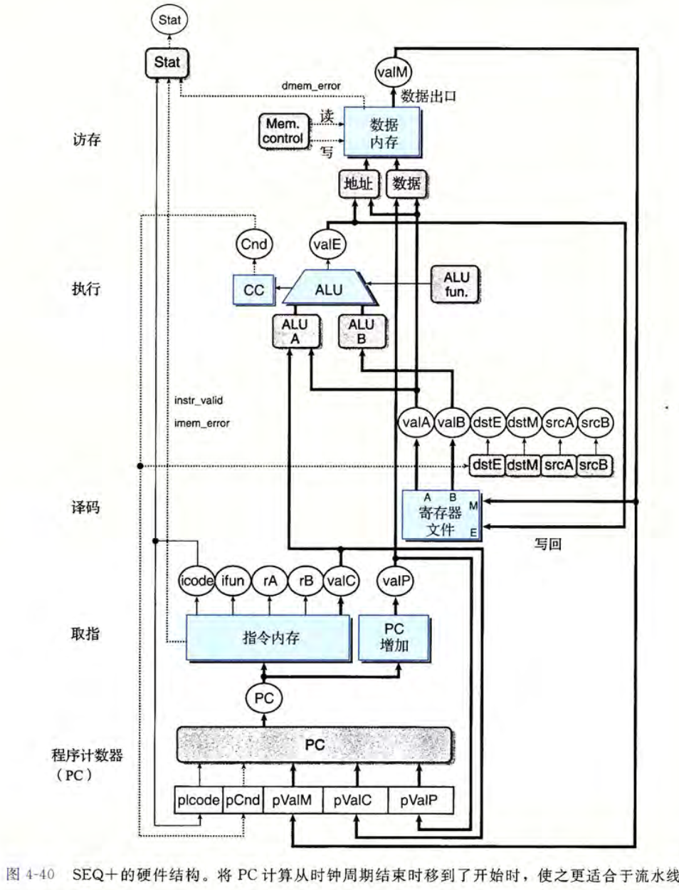
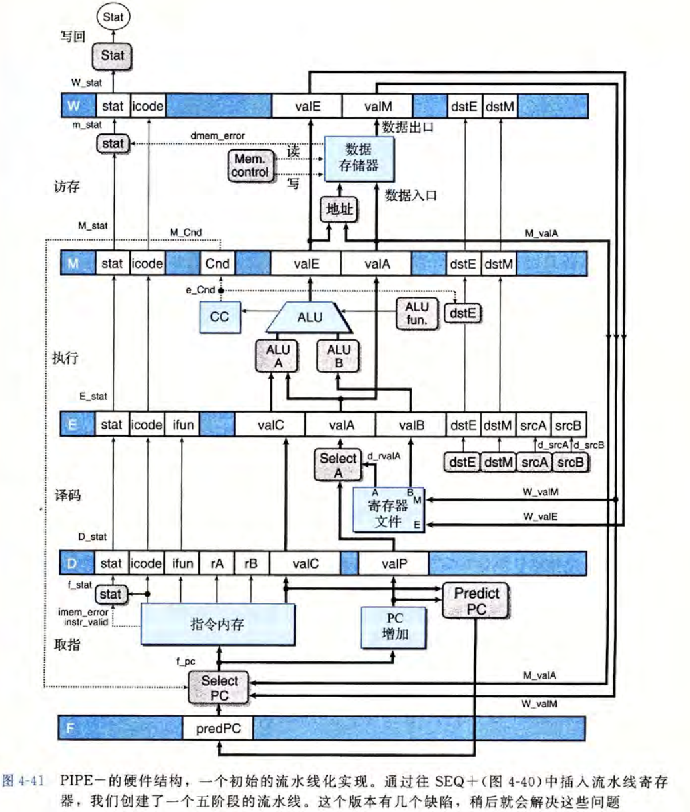
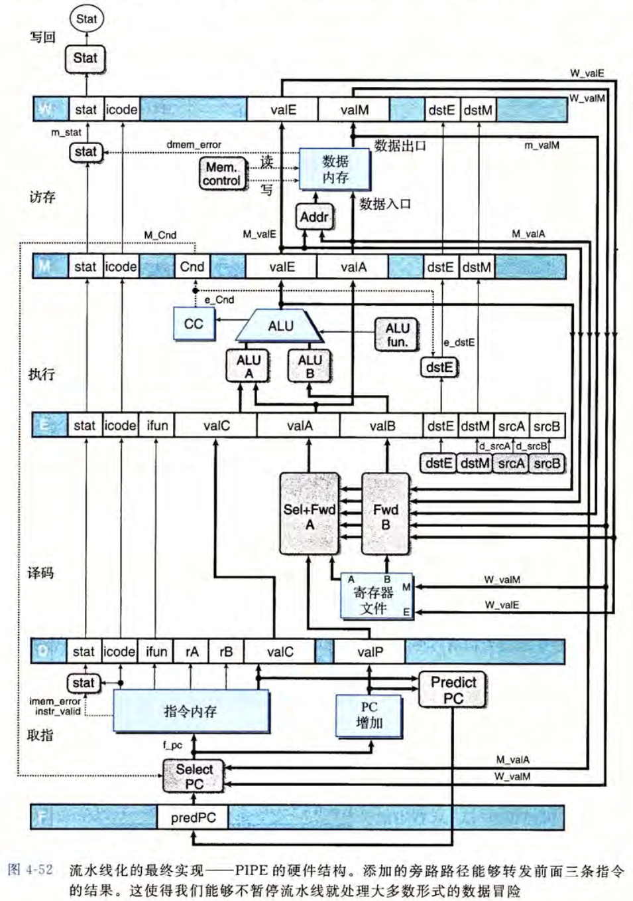
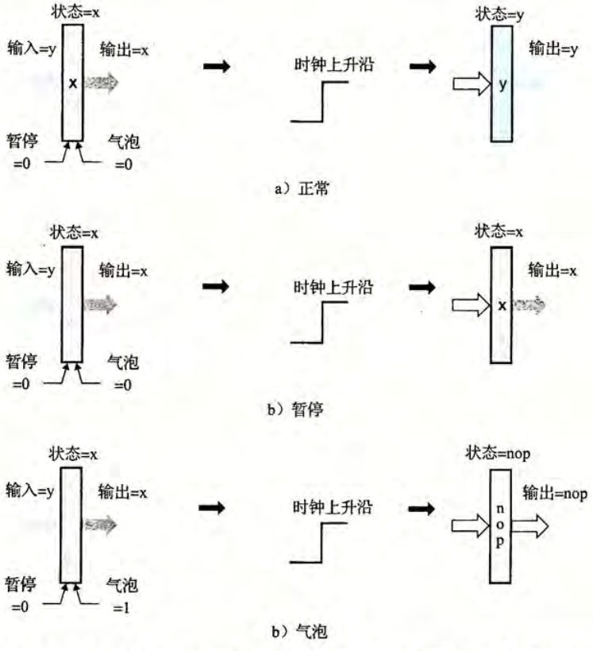
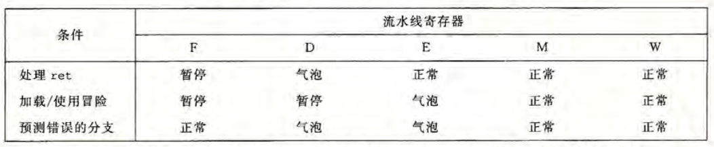

# 第4章 处理器体系结构

## `Y86-64` 指令集体系结构
### 程序员可见的状态
在 `Y86-64` 中定义有 15 个程序寄存器，每个寄存器存储一个 64 位的字。其中 `%rsp` 被用来记录入栈、出栈、调用和返回指令，作为栈指针，其它寄存器没有固定的含义。  
定义 ZF（零）,SF（符号） 和 OF（溢出） 三个一位的条件码，保存最近的算术或者逻辑信息。程序计数器 PC 存放当前正在执行指令的地址。  
使用虚拟地址来引用内存位置，即把内存认为是一个很大的字节数组。  
状态码 `Stat` 用于表明程序执行的总体状态，即是正常运行还是出现异常（如某条指令尝试读取非法的内存地址）。


### `Y86-64` 指令及其编码
`Y86-64`的指令集基本上是 `x86-64` 的子集，仅包含 8 字节的整数操作。下面是一些细节。

`movq` 指令被拆成了四个不同的指令：`irmovq,rrmovq,mrmovq,rmmovq`，前缀用于显式地指出源和目的地格式：立即数`i`，寄存器`r`和内存`m`。  
内存引用方式都是简单的基址和偏移量形式。不支持第二变址寄存器和任何寄存器值的伸缩，不允许从一个内存地址直接传送到另一个内存地址，不允许将立即数直接传送到内存。  
四个整数操作指令：`addq, subq, andq, xorq`。仅支持对寄存器数据进行操作，并能设置三个条件码。  
七个跳转指令：`jmp, jle, jl, je, jne, jge, jg`。条件与 `x86-64` 中一致。  
六个条件传送指令：`cmovle, cmovl, cmove, cmovne, cmovge, cmovg`。指令格式与 `rrmovq` 一样。  
`call` 指令将返回地址入栈，并跳转到目的地址。与之相配的`ret`指令从调用中返回。  
`pushq` 与 `popq` 实现入栈和出栈。  
`hall` 指令停止指令的执行。在 `x86-64` 中，对应的指令为 `hlt`，应用程序不允许使用这条指令，因为它会导致整个系统暂停运行。而在 `Y86-64` 中，`halt` 指令会导致处理器停止，并将状态码设置为 `HLT`。


每条指令需要 1 到 10 个字节不等的空间，其中第一个字节表明指令的类型。这一字节又分为两部分：高 4 位表示代码，低 4 位表示功能。代码给出指令所在的指令组，而功能则是指出具体是该指令组中的哪一个。


15 个寄存器也有对应的标识符，从 0 到 `0xE`。当需要指明不应访问任何寄存器时，用 `0xF` 来表示。


> 关于指令的补充说明：  
> 有些指令有附加的寄存器字节，称为 `rA, rB`，而只需要一个寄存器作为操作数的指令将另一个寄存器设置为 `0xF`。  
> 有些指令需要一个附加的 8 字节常数字，如 `irmovq` 的立即数数据、`rmmovq` 和 `mrmovq` 的地址指示符的偏移量以及分支指令和调用指令的目的地址。  
> 分支和调用指令的目的是一个绝对地址，而不是 `x86-64` 中的相对寻址方式。  
> 所有整数采用小端法编码。

`Y86-64` 指令集满足唯一解释。

### 异常
这里指的是状态码 `Stat`，它描述的是程序执行的总体状态。具体的可能值及意思如下。


当遇到异常时，我们简单地让处理器停止执行。但在更完善的设计中，处理器会调用一个异常处理程序。

### 有关 `pushq` 和 `popq` 的特殊情况
这两个指令都会对栈指针进行操作，但如果是 `pushq %rsp` 或者 `popq %rsp` ，会压入哪个值呢？  
`Y86-64` 采用与 `x86-64` 一致的规定，即对于 `pushq %rsp`，放入的是 `%rsp` 的原值（在执行 -8 之前的值）；而 `popq %rsp` 则是把 pop 出的值放到 `%rsp` 中。

## 逻辑设计和硬件控制语言 HCL

逻辑门是数字电路的基本计算单元。在 C 语言中用`&&,||,~`来表示，而不是用 `&,|,~`，因为逻辑门只对单个位的数进行操作，而不是整个字。下图中只给出了两个输入的版本，但 $n$ 路输入也是很常见的。  
逻辑门被认为是活动的，即一旦一个门的输入变化了，它的输出在很短的时间内也会相应地发生变化。


将很多逻辑门组合成一个网，就可以构建计算块，也称组合电路。

> 组合电路网的限制：  
> 每个逻辑门地输入必须连接到以下三个选项之一：系统输入（主输入），某个存储单元的输出，某个逻辑门的输出。  
> 两个或多个逻辑门的输出不能连接在一起。否则会导致线上的信号矛盾，可能导致不合法电压或电路故障。  
> 网必须是无环的。形成回路可能会导致歧义。

HCL 表达式能很清楚地表明组合逻辑电路与 C 语言中地逻辑表达式的对应之处。  
在 HCL 中，所有字级的信号都声明为 `int` ，不需要指定字的大小。 HCL 允许比较字是否相等，比如`bool Eq = (A == B);`，这里 A 和 B 都是 `int` 型的，比较判断则延用了 C 的定义。  
如下图所示，在画字级电路的时候，用中等粗度的线来表示携带字的每个位的线路，而用虚线表示布尔信号结果。


在 HCL 中，采用情况表达式来描述多路复用函数，其通用格式如下：

```json
[
    select1 : expr1;
    select2 : expr2;
    ...
    selectk : exprk;
]
```

在这个表达式中，前面的 `select` 用于指明什么时候应该选择这种情况，后面 `expr` 则指明应该得到的值。  
与 C 中 `switch` 语句不同的是，这里不要求选择表达式之间互斥。在逻辑上，这些选择表达式是顺序求值的，且第一个值为 1 的情况会被选中。  
当然在实际的硬件多路复用器中，信号必须是互斥的。

算术逻辑单元（ALU）是一种很重要的逻辑电路。它有三个输入：A 和 B 两个数据输入，以及一个控制输入。根据控制输入的设置，电路会对数据输入执行不同的算术或逻辑计算。  
可以看到，在下图中的 ALU 支持的四个操作分别对应 `Y86-64` 指令集支持的四种不同的整数操作。注意减法的操作数顺序，与 `subq` 指令的参数顺序一致。


有时需要判定某个信号是否属于一类信号，这时可以采用集合关系，其通用格式为 `iexpr in {iexpr1, iexpr2, ..., iexprk}`，其中每个 `iexpr` 都是一个整数表达式。

### 存储器与时钟
组合电路不存储任何信息，若加入存储信息的设备，就产生了时序电路。时钟是一个控制存储设备的周期性信号，它决定了什么时候把新值加入到设备中。

> 两类常见的存储器设备：  
> 时钟存储器（寄存器）：存储单个位或者字，并由时钟信号来控制寄存器是否加载输入的值。  
> 随机访问存储器（内存）：存储多个字，并由地址来决定读或者写哪个字。常见的具体例子有：处理器的虚拟内存系统，寄存器文件。

注意到寄存器这个名词在硬件和机器级编程时，其代表的意思有细微的差别。在硬件中，寄存器直接将它的输入输出线与电路的其他部分相连。而在机器级编程中，寄存器指的是 CPU 能够通过寄存器 ID 寻址的字，这些字通常都存储在寄存器文件中。为避免歧义，通常称前者为“硬件寄存器”，后者为“程序寄存器”。

硬件寄存器的工作方式：大多数时候，它保持稳定状态，产生与其当前状态相同的输出。而寄存器的输入与时钟跳变有关，当时钟是低电位时，寄存器不会关心输入的信号；但当时钟跳转到高电位时，寄存器会把输入信号加载进来，并更新输出信号。  
寄存器可以作为电路不同部分的组合逻辑之间的屏障，因为其只有在时钟跳变上升时，才把值从输入传送到输出。`Y86-64` 处理器用时钟寄存器保存程序计数器（PC）、条件代码（CC）和程序状态（Stat）。

随机访问存储器一般允许多个读和写操作，这里以某种寄存器文件为例。在下图所示的寄存器文件中，电路可以同时读取两个程序寄存器的值，并更新第三个寄存器的状态。每个端口都有一个地址输入（表示要操作哪个位置）和一个数据线（表示要输入的数据或者读出数据）。


寄存器文件是一个时序电路。在读出时，可以看作是输入一个地址，输出该地址上的寄存器的值。而在写入时，与时钟存储器一样，由时钟来控制何时会把输入的字存储到对应地址的寄存器上。  
若同时对一个寄存器读和写，会在读的地址看到从旧值到新值的转变，具体情况与电路设计有关。

一个更为抽象的随机访问存储器模型如下：


在我们设计的处理器中，还包含另外一个只读存储器，用来读取指令。

## `y86-64` 的顺序实现（SEQ）
我们首先描述一个`y86-64`的 SEQ 顺序实现。在每个时钟周期，SEQ 仅执行一条完整指令所需的所有步骤，这也导致时钟周期频率会很低。尽管如此，这是后面实现更高效模型的必经一步。  
即使不同指令之间，动作有着比较大的差异，但仍然能设计一个框架使得所有指令都能遵循统一的序列。我们把指令分为以下若干个阶段。  

1. 取指。从内存读取指令字节，地址为程序计数器（PC）的值。具体来说，我们将取出指令指示符，分成两个部分：icode（指令代码）和 ifun（指令功能）。随后根据指令代码的要求，可能取出一个或两个寄存器指示符 `rA` 和 `rB`，还可能取出一个 8 字节的常数 `valC`。同时计算当前指令的下一条指令地址 `valP`，这个是通过当前地址与指令的长度来确定的。
2. 译码。从寄存器文件中读入需要的操作数，具体情况与指令代码有关，通常是根据 `rA` 和 `rB`来读，也有的指令需要读取 `%rsp`。
3. 执行。算术逻辑单元（ALU）进行计算。这里的计算可以是指令指定的运算（`add, sub` 等），也可以是计算内存引用的有效地址（如 `rmov` 中对地址偏移的计算），还可以是增加或减少栈指针（如 `pushq, popq` ）。得到的值将被称作 `valE`。在计算时，根据指令的类型，也可能要设置条件码。对于条件传送指令和跳转指令，这个阶段会决定是否更新寄存器或进行跳转。
4. 访存。将数据写入内存，或是从内存中读出数据。读出的值称为 `valM`。
5. 写回。根据需要写入最多两个结果到寄存器文件。
6. 更新 PC。将 PC 设置为下一条要执行的指令的地址。

处理器将持续循环地执行这些阶段，直到遇到异常。

经过仔细地设计，所有地指令都可以分成这些阶段依次执行。最后总的抽象视图如下：


对应的硬件结构如下：


注意到 SEQ 中包括组合逻辑和两类存储器设备。对于组合逻辑，只要输入变化了，输出也就会跟着变化，其中的值会随着逻辑门传播。对于随机访问存储器，我们可以看作与组合逻辑类似的组件：根据地址输出对应的字。而对于剩下的时钟寄存器（包括程序计数器，条件码寄存器，数据内存和寄存器文件），它们通过时钟信号来进行控制，只有当时钟信号向上跳跃时才会进行写操作。  
具体来说，程序计数器只有在每个时钟开始时才会装载新的指令地址。条件码寄存器只有执行整数运算指令时才会装载。寄存器文件的写端口只在每个时钟周期更新的时候将值写入。只有在执行 `rmmovq, pushq, popq` 时才会写数据内存。

> 可以理解为，值或许已经算好了，在等待时钟周期。只有时钟周期发生跳变时，对应的存储器才会把值装载进去，具体是否装载可能还与其它状态控制有关。  
> 所有的状态更新都在同一时间发生，即时钟上升开始下一个周期时。  
> 这一等价性是由 `y86-64` 从不回读的性质保证的。从不回读指，处理器从来不需要为了完成一条指令的执行而去读由该指令更新的状态（比如整数指令会设置条件码，跳转指令会读取条件码，但是不会有指令同时需要读取和写入条件码）。

以下是 SEQ 各个阶段更为具体的模型。

在取指阶段，从 PC 位置取出 10 个字节，其中第一个字节并分成两个 4 位的数（`icode`, `ifun`），根据 `icode` 计算三个一位的信号：`instr_valid`（这个字节是否对应合法指令）,`need_regids`（这个指令是否包含寄存器指示符字节）和 `need_valC`（这个指令是否包含一个常数）。剩下的 9 个字节被根据上面三个信号进行处理，如读出两个寄存器指示符，或者读出包含的常数。然后对计算后一条指令的位置。


由于译码和写回阶段均要访问寄存器文件，故放在一起讨论。在这一阶段，根据 `icode` 值、两个寄存器指示符、或许还有 `Cnd` 值来确定读取或写入。


在执行阶段，`ALU` 单元根据计算出的 `ALUfun`, `ALUA` 和 `ALUB` 来进行计算，同时根据 `SetCC` 来决定是否要设定条件码。


在访存阶段，根据信号决定是对内存进行读操作还是写操作，并进行数据操作。


SEQ 最后会更新 `PC` 值，这一值的来源可能是 `valP` 计算得到的，也可能是跳转命令指示的值。


## 流水线的通用原理
流水线即是把一项工作拆成若干阶段，由不同的处理器同时处理不同阶段。在处理器的设计中，流水线能让处理器的不同部分都进入工作状态，而不是像 SEQ 中，一条指令要将所有阶段都执行完后再进行下一条指令。一个形象的表示如下：


流水线设计也有其局限性。首先是，这一设计要求划分出的不同阶段所需时间基本一致，因为运行速率是由最慢的部分决定的，如果划分不均的化，带来的延迟损失可能大于收益。另外，流水线过深的时候，经过的中间延迟可能会过多，收益反而下降。  
另外需要注意的一个问题是，当遇到控制相关（如跳转指令，条件传送指令）、数据相关（如相邻两条指令操作了同一个寄存器，一个读一个写）时，我们需要谨慎地设计流水线结构，否则流水线的行为可能与系统所希望的行为不一致。

## `Y86-64` 的流水线实现
### `SEQ+` 重新安排计算阶段
首先，调整更新 PC 的阶段到一个时钟周期开始时更新，而不是原来的结束时更新。这样对于流水线阶段中的活动的时序，能更好地工作。  
新的 PC 阶段会在时钟周期开始时活动，它计算当前指令的 PC 值。  
从 `SEQ` 到 `SEQ+` 这种改变被称为*电路重定时*，这一方法会改变一个系统的状态表示，但是不改变其逻辑行为。

> 值得注意的是，在 `SEQ+` 设计中， PC 并不是存放在硬件寄存器中的，而是每次根据前一条指令保存下来的状态信息动态地计算。  
> 我们并不需要按照与 ISA 定义的隐含模型一模一样的方式来实现处理器，只要保证程序员可见的状态是正确的即可。



### 插入流水线寄存器
在 `SEQ+` 的各个阶段之间插入流水线寄存器，并重新排列一些信号，得到一个初级的流水线处理器，称为 `PIPE-`，下面为其硬件结构。



其中，流水线寄存器的标号各有意义。`F` 保存程序计数器的预测值；`D` 保存关于最新取出的指令的信息，位于取指和译码阶段之间；`E`保存译码完成的指令和从寄存器文件中读出的值的信息，位于译码和执行阶段之间；`M` 保存最新执行的指令的结果，以及用于处理条件转移的分支条件和分支目标的信息，位于执行与访存阶段之间；`W` 位于访存和反馈路径之间，反馈路径将计算出来的值提供给寄存器文件，而对于 `ret` 指令，它还要向 PC 选择逻辑提供返回地址。  
由于分出了不同的阶段，之前在 `SEQ` 和 `SEQ+` 中的各个寄存器也在流水线的不同阶段处理不同的指令任务。在这里，我们用大写字母前缀表示存储在流水线寄存器中的值，用小写字母前缀表示在某个阶段内刚刚计算出的信号。  
以 `dstE` 和 `dstM` 两个信号为例，这两个信号指明了 `valE` 和 `valM` 两个值在写回阶段要写回的寄存器地址。在 `SEQ` 和 `SEQ+` 中，只需要直接将这两个信号连接到寄存器文件的写端口的地址输入即可，但在 `PIPE-` 中，这两个信号需要与流水线一起穿过执行和访存阶段，然后再送到寄存器。

> 注意到 `Select A` 模块只在 `PIPE-` 模型中出现，这是为了减少流水线寄存器中的状态数量，它将来自寄存器 D 的 `valP`和来自寄存器文件的 `valA` 合并。因为对于任何一个指令，这两个信号都不会同时需要。

### 预测下一个 PC
流水线要求在每一个周期都塞入一个新的指令开始各个阶段，但对于条件分支指令来说，下一条指令的地址是不确定的，需要通过执行阶段甚至访存阶段才能直到具体的地址。  
猜测分支的方向并开始取指，这一技术称为分支预测。在我们的设计中，我们总是预测选择了条件分支，即 PC 的新值为 valC。

### 流水线冒险
将流水线引入一个待反馈的系统，会导致两种相关问题：其一是数据相关，即下一条指令使用了当前指令计算出的结果；其二是控制相关，下一条指令的地址需要由当前指令来确定。与之相对的就有数据冒险和控制冒险两种冒险。以下是一些常用的处理冒险的方法。

1. 暂停。当发现冒险情况时，处理器将后一条指令阻塞在译码阶段甚至取指阶段，直到冒险条件不再满足。这一机制实现比较简单，但是严重牺牲了性能。
2. 转发。寄存器文件的写入在写回阶段才会进行，但其实值在更早的阶段就已经计算出来了。若要让后续指令能不停下来等待当前指令的写回，可以在内部将结果值直接从当前流水线阶段传送到一个更早的阶段，实现将数值从当前指令传送到后续指令，这便是*转发*。转发要求在基本的硬件结构中增加一些额外的数据连接和控制逻辑。

内存的读取在流水线中发生的比较晚，故对于内存的数据冒险，需要将暂停和转发一并使用，将受到影响的指令暂停至能够通过转发得到需要的值再继续执行。  
对于`ret`指令，我们希望流水线采用暂停的策略，直到`ret`指令前进到写回阶段，PC 选择逻辑部分才会将程序计数器设为程序返回地址。  
对于预测错误的分支，流水线在跳转指令的执行阶段会知道预测是否正确。如果错误，此时流水线中已经进入了两条错误的指令，不过并没有修改程序员可见的状态所以没有关系，接下来流水线插入气泡取消那两条指令的继续执行，并从正确的地址重新取指。



### 异常处理
在我们的设计中，有三种不同的内部产生的异常：`halt` 指令，非法指令和功能码的组合，访问非法内存。在流水线的系统中，异常处理有一些细节问题需要强调。  
首先，可能有多条指令会引起异常，在流水线的不同阶段可能同时产生异常，而我们必须确定处理器应该报告的是哪个异常。基本原则是，流水线中最深的指令引起的异常具有最高的优先级。  
其次，取出的带异常的指令可能是由错误的分支预测导致的，正确的分支不应该运行这条指令。这种异常是不应该出现的。  
最后，由于流水线使不同阶段更新系统的不同状态，可能会出现前一条指令发生异常，但后一条指令更改了某个状态的情况。这不是我们希望的，因为若发生异常，所有的系统状态应该保持原样，不被修改。  
处理这些问题需要两个方法。其一是，在每个流水线寄存器中包含一个状态码，若指令在某个阶段产生了异常，状态码就设置为对应的那一个，并与其它信息一起沿流水线传播，直到到达写回状态，流水线控制器在这里发现异常并停止整个程序的执行。其二是当处于访存或写回阶段的指令导致异常时，流水线控制逻辑必须禁止条件码寄存器或数据内存的更新。

### PIPE 的实现
很多部分都可以根据结构图写出，具体细节参照书本，这里只记录重要的几个点。

在转发时要注意优先级的问题。在流水线更深阶段的指令可能都操作了当前的寄存器，按照模型的原则，应选择除以流水线阶段中最早的那一个作为转发源。另外关于`popq %rsp`的相关问题，要求我们关注从访存或写回阶段返回的两个值的优先级问题。  
对于异常，为保证发生异常后，还在流水线中的指令不会修改程序员可见状态，那么对于这些状态的修改都要加入对`Stat`的判断。  
为实现流水线处理错误分支、发现`ret`后暂停还有内存读写时暂停的功能，需要向流水线寄存器引入两个控制输入：暂停和气泡。具体定义如下图。暂停时，流水线寄存器保护其已有的状态不改变；而气泡时则将其状态置为 `nop` 指令的状态。注意，当两个信号都为 1 是不合法的。



在流水线寄存器的基础上，使用逻辑块就可以设计出处理这些情况的模块了。



上面这些控制逻辑可能同时出现。对于我们的设计，只有当 加载/使用 与 `ret` 同时出现时会出现冲突，这意味着我们需要在逻辑中特殊处理这一部分的内容。

## 性能分析
在理想情况下，流水线应该在每一个周期都发射一条新的指令，但由于可能插入气泡和暂停，流水线的实际速度会被影响。  
通常，计算 PIPE 执行一条指令所需要的平均时钟周期数来量化这些惩罚对整体性能的影响，即 CPI（Cycle Per Instruction， 每指令周期数）。

## 未完成的工作
在实际的微处理器中，有一些 PIPE 中未涉及到的关键特性。

多周期指令。如乘法、除法等需要多个周期来执行的指令。若要实现，需要扩展现有设计，添加更多的整数和浮点计算单元，或是采用独立于主流水线的特殊硬件功能单元，并谨慎地设计好不同模块之间的通信与同步。  
与存储系统的接口。在我们的设计中，我们假设了取指和数据内存的读写都可以在一个时钟周期内完成，但存储系统还涉及多层的地址翻译传递，想要在一个周期内完成是不现实的。

## RISC 和 CISC 指令集
前者称为精简指令集计算机，后者称为复杂指令集计算机。下面是两者的简要对比。

|    项目     |                             CISC                             |                               早期 RISC                                |
| ----------- | ------------------------------------------------------------ | ---------------------------------------------------------------------- |
| 指令数量     | 很多，Intel 描述全套指令的文档有 1200 多页                      | 指令数量很少，通常少于 100 个                                            |
| 延迟        | 有些延迟很长，比如整块内存的复制，或多寄存器操作                 | 延迟短，有些甚至没有整数乘法指令（需用加法实现）                           |
| 编码长度     | 可变                                                         | 固定长度，通常为 4 字节                                                  |
| 内存操作     | 方式多样，支持多种组合，由偏移量、基址和变址寄存器以及伸缩因子组成 | 简单寻址模式，通常只有基址和偏移量寻址                                    |
| 运算的操作数 | 可以对内存和寄存器操作数进行算术和逻辑运算                       | 只能对寄存器操作数进行算术和逻辑运算，仅允许 `load` 和 `store` 两种内存操作 |
| 条件码      | 有条件码                                                      | 无条件码，需要明确的测试指令，结果存放在一个普通的寄存器中                  |
| 过程调用     | 栈密集的过程链接，用栈来保存过程参数和返回地址                   | 寄存器密集的过程链接，寄存器被用来保存过程参数和返回地址，有时能完全避免内存引用。通常有更多的寄存器     |