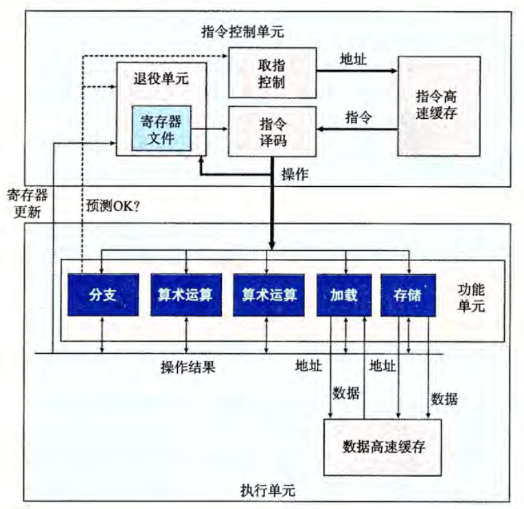

# 第5章 优化程序性能

编译器具有一定的优化能力，但这种能力是有限的。由于一些限制，编译器只能遵循很保守的优化策略，以保证程序在优化前后拥有相同的逻辑。这意味着程序员必须在代码层面编写编译器易于优化的代码。

在本章中，我们使用每元素的周期数（CPE）作为表示程序性能的度量标准

## 一些简单的优化方法

1. 消除循环的低效率。将在循环中不会变化的值提前计算出来，或者是要在循环中反复调用但返回值不变的函数提前调用并存储其值。
2. 减少过程调用。
3. 减少不必要的内存引用。将反复的内存引用提取出来，用临时的变量代替，减少内存寻址的次数。

这些技巧有的能极大地加速程序，有的只有极小的性能提升。在后面，我们会看到造成这一差异的原因。

## 理解现代处理器
为使程序的性能最大化，现代处理器能够同时对多条指令执行，即指令级并行。同时采用精细的设计使得多条指令并行的同时，程序结果与顺序语义模型一致。  
可以使用两种参数描述程序的性能下界。延迟界限，是关于下一条指令开始之前，这条指令必须结束；吞吐量界限则刻画的是处理及功能单元的原始计算能力。这两个界限是程序性能的终极极限。

以一个类似于 Intel 处理器的结构为例。现代处理器是超标量的，它可以在每个时钟周期执行多个操作，而且是乱序的。整个设计分为**指令控制单元(ICU)**和**执行单元(EU)**两部分，前者负责从内存中读出指令序列，并生成相应操作；后者负责执行操作。下面是一个简单的乱序处理器的框图。

ICU 从指令高速缓存（包含最近访问的指令的高速存储器）读取指令，进行译码，在遇到分支时采取分支预测和投机执行的策略，将指令转化为一组基本操作（微操作，如整数加法，内存数据读写），发送给 EU。EU 把指令分配给功能单元，执行实际的操作。不同的单元被用来执行不同的操作组合，这样设计使能同时执行多个同类型的操作。这些得到的结果并不会直接存储到程序寄存器或内存中，因为分支预测的存在，必须等到分支预测正确与否的结果出来之后才能确定，若分支正确，则相关修改会被记录，否则就会被丢弃。  
一个值得关注的是 ICU 中的退役单元，它记录正在进行的处理。译码的指令会进入一个先进先出的队列，当一条指令操作完成且关于它的所有分支预测均正确，这条指令就会被执行并退役，且它所有对程序寄存器的修改都会被实际执行；否则若某个分支点预测错误，该指令就会被清空，有关的计算结果会被丢弃。这一设计保证了处理器能遵循机器级程序的顺序语义。  
在 EU 中有个所有功能单元公用的操作结果区域，这其实就是我们在 `Y86-64` 流水线设计中的转发模块的更精细化实现，它负责在不同执行单元之间交换信息。与之相关的是一个名为**寄存器重命名**的技术，这一技术对每一个要操作的寄存器记录值和时间戳，使得不同指令的寄存器都能得到唯一标识，以便后续转发时能准确寻址。