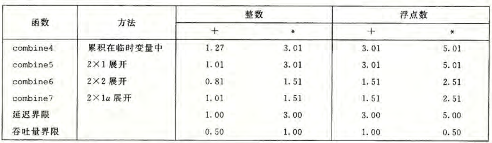

# 第5章 优化程序性能

编译器具有一定的优化能力，但这种能力是有限的。由于一些限制，编译器只能遵循很保守的优化策略，以保证程序在优化前后拥有相同的逻辑。这意味着程序员必须在代码层面编写编译器易于优化的代码。

在本章中，我们使用每元素的周期数（CPE）作为表示程序性能的度量标准。

我们会使用一个通用方式来评估运算时间，下面先给出一个生成向量、访问向量元素和确定向量长度的基本过程。

```c
#include <stdlib.h>
#include "combine.h"

/* $begin vec */
/* Create vector of specified length */
vec_ptr new_vec(long len)
{
    /* Allocate header structure */
    vec_ptr result = (vec_ptr) malloc(sizeof(vec_rec));
    data_t *data = NULL;
    if (!result)
        return NULL;  /* Couldn't allocate storage */
    result->len = len;
/* $end vec */
    /* We don't show this in the book */
    result->allocated_len = len;
/* $begin vec */
    /* Allocate array */
    if (len > 0) {
        data = (data_t *)calloc(len, sizeof(data_t));
	if (!data) {
	    free((void *) result);
 	    return NULL; /* Couldn't allocate storage */
	}
    }
    /* data will either be NULL or allocated array */
    result->data = data;
    return result;
}

/* Free storage used by vector */
void free_vec(vec_ptr v) {
    if (v->data)
	free(v->data);
    free(v);
}

/*
 * Retrieve vector element and store at dest.
 * Return 0 (out of bounds) or 1 (successful)
 */
int get_vec_element(vec_ptr v, long index, data_t *dest)
{
    if (index < 0 || index >= v->len)
	return 0;
    *dest = v->data[index];
    return 1;
}

/* Return length of vector */
long vec_length(vec_ptr v)
{
    return v->len;
}
/* $end vec */


/* $begin get_vec_start */
data_t *get_vec_start(vec_ptr v)
{
    return v->data;
}
/* $end get_vec_start */


/*
 * Set vector element.
 * Return 0 (out of bounds) or 1 (successful)
 */
int set_vec_element(vec_ptr v, long index, data_t val)
{
    if (index < 0 || index >= v->len)
	return 0;
    v->data[index] = val;
    return 1;
}


/* Set vector length.  If >= allocated length, will reallocate */
void set_vec_length(vec_ptr v, long newlen)
{
    if (newlen > v->allocated_len) {
	free(v->data);
	v->data = calloc(newlen, sizeof(data_t));
	v->allocated_len = newlen;
    }
    v->len = newlen;
}
```

我们使用一个基于上述向量实现的合并函数来刻画性能，具体合并方式可能是加法或乘法，使用的数据类型有整数和浮点数。  
作为基准，下面给出一个合并函数的朴素实现。

```c
void combine1(vec_ptr v, data_t *dest) {
    long i;
    *dest = IDENT;
    for (i = 0; i < vec_length(v); i++) {
        data_t val;
        get_vec_element(v, i, &val);
        *dest = *dest OP val;
    }
}
```

下面是其在参考机上的 CPE 度量值：


可以看到，在未作任何其它处理，仅开启命令行选项 `-O1` 就能实现基本的优化，显著地提高程序性能。在下面的测试中，均使用 `-O1` 或 `-O2` 来生成和测试程序。


## 我们已知的一些简单的优化方法
在前面若干章的学习中，我们已经了解到了一些优化方法，下面来分别进行测试。

### 消除循环的低效率
将在循环中不会变化的值提前计算出来，或者是要在循环中反复调用但返回值不变的函数提前调用并存储其值。在这里即是每次循环都要判断的 `vec_length(v)`。得到 `combine2`。

```c
void combine2(vec_ptr v, data_t *dest) {
    long i;
    long length = vec_length(v);
    *dest = IDENT;
    for (i = 0; i < length; i++) {
        data_t val;
        get_vec_element(v, i, &val);
        *dest = *dest OP val;
    }
}
```

测量得到的 CPE 值如下。


这种优化方法被称为*代码移动*，优化编译器通常会尝试着进行代码移动，但它们不能可靠地发现一个函数是否有副作用，因而会保守地假设函数都有副作用。程序员必须手动显示地帮助编译器完成代码移动的工作。


### 减少过程调用。
在 `combine2` 的循环体中，我们每次都调用了 `get_vec_element(v, i, &val);`来获得第 i 位的元素，而若阅读这个函数的代码，我们发现每次获取时都要对边界进行一次判断。考虑到在该向量的实现中，数据都是以数组形式存放的，我们猜想，若能直接按照数组方式访问，能否提高程序的执行效率。这样得到 `combine3`。

```c
void combine3(vec_ptr v, data_t *dest) {
    long i;
    long length = vec_length(v);
    data_t *data = get_vec_start(v);
    *dest = IDENT;
    for (i = 0; i < length; i++)
        *dest = *dest OP data[i];
}
```

测量得到的 CPE 值如下。


性能没有显著提升。这是因为，虽然在 `get_vec_element()` 函数中出现了条件分支，但该分支是高度可预测的。在现代处理器中，分支预测逻辑非常善于辨别出有规律的模式和长期的趋势，这使得 `get_vec_element()` 函数中的分支预测带来的错误惩罚几乎可以忽略。反而改成数组形式访问时，循环体中的其它操作成了瓶颈。

### 减少不必要的内存引用
将反复的内存引用提取出来，用临时的变量代替，减少内存寻址的次数。

观察 `combine3` 的汇编代码，我们会发现，累计变量 `dest` 在循环体中反复从内存中取出、计算和再写入，而从逻辑上来看，这一内存读写是完全没必要的。我们引入临时累计变量 `acc`，得到 `combine4`。

```c
void combine4(vec_ptr v, data_t *dest) {
    long i;
    long length = vec_length(v);
    data_t *data = get_vec_start(v);
    data_t acc = IDENT;
    for (i = 0; i < length; i++)
        acc = acc OP data[i];
    *dest = acc;
}
```

测量得到的 CPE 值如下。


可以看到，性能有了显著的提升。

## 理解现代处理器
为使程序的性能最大化，现代处理器能够同时对多条指令执行，即指令级并行。同时采用精细的设计使得多条指令并行的同时，程序结果与顺序语义模型一致。  
可以使用两种参数描述程序的性能下界。延迟界限，是关于下一条指令开始之前，这条指令必须结束；吞吐量界限则刻画的是处理及功能单元的原始计算能力。这两个界限是程序性能的终极极限。

### 整体架构与乱序执行
以一个类似于 Intel 处理器的结构为例。现代处理器是超标量的，它可以在每个时钟周期执行多个操作，而且是乱序的。整个设计分为**指令控制单元(ICU)**和**执行单元(EU)**两部分，前者负责从内存中读出指令序列，并生成相应操作；后者负责执行操作。下面是一个简单的乱序处理器的框图。


ICU 从指令高速缓存（包含最近访问的指令的高速存储器）读取指令，进行译码，在遇到分支时采取分支预测和投机执行的策略，将指令转化为一组基本操作（微操作，如整数加法，内存数据读写），发送给 EU。EU 把指令分配给功能单元，执行实际的操作。不同的单元被用来执行不同的操作组合，这样设计使能同时执行多个同类型的操作。这些得到的结果并不会直接存储到程序寄存器或内存中，因为分支预测的存在，必须等到分支预测正确与否的结果出来之后才能确定，若分支正确，则相关修改会被记录，否则就会被丢弃。  
一个值得关注的是 ICU 中的退役单元，它记录正在进行的处理。译码的指令会进入一个先进先出的队列，当一条指令操作完成且关于它的所有分支预测均正确，这条指令就会被执行并退役，且它所有对程序寄存器的修改都会被实际执行；否则若某个分支点预测错误，该指令就会被清空，有关的计算结果会被丢弃。这一设计保证了处理器能遵循机器级程序的顺序语义。  
在 EU 中有个所有功能单元公用的操作结果区域，这其实就是我们在 `Y86-64` 流水线设计中的转发模块的更精细化实现，它负责在不同执行单元之间交换信息。与之相关的是一个名为**寄存器重命名**的技术，这一技术对每一个要操作的寄存器记录值和时间戳，使得不同指令的寄存器都能得到唯一标识，以便后续转发时能准确寻址。

### 功能单元的性能
通常用以下三种数值来刻画运算的性能：延迟（完成运算所需要的总时间），发射时间（两个连续的同类型运算之间所需的最小时钟周期数）和容量（能执行该运算的功能单元数量），下表是参考机（Intel Core i7 Haswell）的性能。


从表中可以得到以下一些结论：

1. 从整数运算到浮点运算，延迟均是增加的。
2. 加法和乘法运算的发射时间都是 1，这是用流水线方式实现的，如一个典型的浮点加法器可能包括三个阶段（处理指数，将小数相加，对结果舍入）。发射时间为 1 的功能单元也被称为*完全流水线化的*。
3. 除法不是完全流水线化的，并且其延迟和发射的时间是以范围的形式给出，这是因为某些除数与被除数的组合与其它的相比需要更多的步骤。

也可以用**最大吞吐量**来表达发射时间，其定义为发射时间的倒数。对于一个容量为 $C$，发射时间为 $I$ 的操作来说，处理器可能获得的吞吐量为 $\frac{C}{I}$。  
综合延迟、发射时间和容量的影响，我们可以给出每个运算的 CPE 值的两个基本界限来描述。


### 处理器操作的抽象模型与关键路径
为更好地分析机器级的程序性能，我们将程序数据流化，即通过展示不同操作之间的数据关联，找出指令之间的执行顺序限制。这些限制形成了约束指令时间周期数的下界。  
具体来说，首先画出各个数据流在寄存器之间的流动以及指令的调用情况，去除掉不影响循环执行的寄存器，得到数据流图和数据相关链，再根据指令的执行时间找出关键路径。  
当然，由数据流中关键路径提供的数据只是程序所需周期数的下界，可能仍有其它的因素会限制性能，

这里以 `combine4` 为例，其基本参数计算或测量如下。


其循环体部分汇编代码如下：

```x86asm
# data_t = double, OP = *
# acc in %xmm0, data+i in %rdx, data+length in %rax
.L25
    vmulsd (%rdx), %xmm0, %xmm0
    addq $8, %rax
    cmpq %rax, %rdx
    jne .L25
```

转化为图形化表示如下。


可以将涉及到的寄存器分为四类：只读（只作为源值，不会被修改，如这里的 `%rax`），只写（是数据传送操作的目的），局部（只在循环内部被修改和使用，在迭代与迭代之间不相关，如这里的条件码寄存器），循环（在循环中，既作为源值，又作为目的，一次迭代中的值会在另一次迭代中用到，如这里的 `%rdx` 和 `%xmm0`）。循环寄存器之间的操作链决定了限制性能的数据相关。  
将图像化表示进一步改进，只留下影响程序执行性能的操作和数据相关，得到更清晰的数据流如下。


最后，将若干个迭代连接起来，找出关键路径。在这一示例中，程序有两条数据相关链，分别对应 `mul` 和 `add`，而浮点乘法的延迟是要比加法更大的，故关键路径为乘法所在的数据链。


## 循环展开与并行优化
### 循环展开
在每次循环体中增加操作次数，以此来减少循环次数，这一方法称为*循环展开*。  
理论上，循环展开至少有两个优化程序性能的优点。其一，减少了不影响程序结果的指令数量，如对循环索引的计算和由循环终止条件判断所带来的条件分支。其二，循环展开提供了一种代码变换的方式，让我们能进一步减少关键路径上的操作数量。

在 `combine4` 的基础上引入循环展开，得到 `combine5`。下面展示的 `combine5` 实际上是展开 2 次的，对于此种展开 $k$ 次的我们简称为 $k \times 1$ 展开。注意到这里使用了一种通用的方法处理尾部剩余的数据，对于任意的 $k$ 都是可以的。

```c
void combine5(vec_ptr v, data_t *dest) {
    long i;
    long length = vec_length(v);
    long limit = length - 1;
    data_t *data = get_vec_start(v);
    data_t acc = IDENT;
    for (i = 0; i < limit; i += 2)
        acc = (acc OP data[i]) OP data[i+1];
    for (; i < length; i++)
        acc = acc OP data[i];
    *dest = acc;
}
```

测量得到的 CPE 值如下。


可以看到，所有的 CPE 都接近了延迟界限，这是 $k \times 1$ 能做到的最好结果。可以证明的是， $k \times 1$不能超过延迟界限。因为尽管在一次循环中能处理两个操作，但在关键路径上仍然有两个顺序的加法或乘法操作。想要进一步提升性能，我们需要提高程序的并行性。

### 提高并行性
在经过 `combine5` 上的循环展开优化后，程序的性能瓶颈在运算单元的延迟上。在参考机中，我们有多个加法和乘法单元，但我们并不能够完全利用起来，因为在 `combine5` 中，同一次循环的两次运算都是使用的一个单独的变量 `acc`，在完成前面的运算之前，后面的计算都不能进行。想要获得更好的程序性能，我们必须要打破这种顺序相关性。  
注意到整数的加法和乘法是具有交换律和结合律的，我们便可以改变程序逻辑，在两次循环展开的基础上加入双路并行计算，使用两个累计变量分别计算序数为偶数和奇数的计算结果。我们将这样的优化记作 $2 \times 2$循环展开。得到 `combine6` 。

```c
void combine6(vec_ptr v, data_t *dest) {
    long i;
    long length = vec_length(v);
    long limit = length - 1;
    data_t *data = get_vec_start(v);
    data_t acc0 = IDENT;
    data_t acc1 = IDENT;
    for (i = 0; i < limit; i += 2) {
        acc0 = acc0 OP data[i];
        acc1 = acc1 OP data[i+1];
    }
    for (; i < length; i++)
        acc0 = acc0 OP data[i];
    *dest = acc0 OP acc1;
}
```

测量得到  CPE 值如下。


所有的情况都有改善，特别是我们打破了延迟界限的下限。  
造成这一巨大优化的，就是循环体中的两个操作之间不再数据相关，编译器便可以将指令翻译成对两个不同的操作器的读写操作，原来长度为 n 的关键路径被分为两条长度为 $\frac n 2$的关键路径。

值得注意的一点是，不同于整数的加法和乘法，浮点加法和乘法是不满足结合律的，这意味着上述程序变换可能会改变程序的逻辑行为。我们需要根据实际情况来判断是否能够使用某种优化。

### 重新结合变换
在 `combine5` 中，我们使用 `acc = (acc OP data[i]) OP data[i+1]` 来实现合并。在此基础上，更改合并方式为 `acc = acc OP (data[i] OP data[i+1])`得到 `combine 7`。两者的差别仅有结合顺序，称为 $2 \times 1 a$循环展开。

```c
void combine7(vec_ptr v, data_t *dest) {
    long i;
    long length = vec_length(v);
    long limit = length - 1;
    data_t *data = get_vec_start(v);
    data_t acc = IDENT;
    for (i = 0; i < limit; i += 2)
        acc = acc OP (data[i] OP data[i+1]);
    for (; i < length; i++)
        acc = acc OP data[i];
    *dest = acc;
}
```

测量得到的 CPE 如下。



下面以浮点乘法为例分析其优化的原因。在 $2 \times 1$展开中，关键路径上有两个 `mul` 操作，但是在 $2\times1a$ 展开中，关键路径上只有一个 `mul` 操作，因为另一个是对两个内存中取出的数的 `mul`，这同样也有利于提高并行性。


由于这一优化同样也改变了元素合并的顺序，对于不支持结合律的浮点运算，我们同样需要评估这种变换是否会严重影响结果。

## 程序优化中的限制因素
下面给出制约程序在实际机器上性能的因素。

### 寄存器溢出
循环并行性受汇编代码描述计算的能力的限制，若并行度 $p$ 超过了可用的寄存器数量，编译器会溢出，将某些寄存器存储到内存中，这会带来更大的开销。以 $10 \times 10$ 和 $20 \times 20$ 两种循环展开为例，对比如下。


$20\times20$ 的循环展开并没有改善 CPE，反而更差了，这是因为 `x86-64` 有 16 个寄存器，超过的部分就都要存放到内存中，而反复读写内存会带来更多的性能损失，循环展开带来的优势便不复存在。

### 分支预测和预测错误惩罚
现代处理器对于分支预测有着比较复杂的计算规则，以最小化错误惩罚。我们不会研究其细节，但有两条原则是通用的。

其一，不需要过分关心可预测的分支。比如从 `combine2` 到 `combine3` 的变换，我们注意到 CPE 基本没有变化，这是因为其中蕴含的条件语句是检查索引是否在范围内，而在我们的代码中，这一条件总是符合的。处理器能够预测出这一趋势，所以不会对程序的关键路径产生过大的影响。  
其二，尽量书写适合用条件传送的代码。由于条件传送并不会带来分支，故若能使用条件传送而不是条件分支能带来客观的程序优化。

## 理解内存性能
这里仅考虑所有数据都存储在高速缓存上的情况。

在前面的测试中，我们仅访问了少量的内存。这里会进一步研究设计加载和存储操作的程序的性能。现代处理器有专门的功能单元来执行加载和存储操作，这些单元有内部的缓冲区来保存未完成的内存操作请求。  
在参考机上，有 2 个加载单元和 1 个存储单元，前者每一个可以保存 72 个未完成的读请求，而后者可以保存 42 个写请求。这些单元被设计为可以每个时钟周期开始一个操作。

### 加载的性能
在参考机上，我们注意到 CPE 不能突破 $0.5$ 的下界，这一下界就是由内存加载限制的，因为每个时钟周期只能启动一条加载操作。  
通过对一个遍历链表的程序的测定，我们可以测得内存加载的延迟为 4 周期，这是因为遍历链表需要在每个循环中得到下一个元素的地址才能继续。这个测试结果与参考机的 L1 级 cache 的 4 周期访问时间是一致的。

### 存储的性能
与加载一样，在大多数情况下，存储操作也是完全流水线化的。在下面所示的程序中，测得 CPE 等于 1，这已经是只有一个存储功能单元的最佳情况。

```c
void clear_array(long *dest, long n) {
    long i;
    for (i = 0; i < n; i++)
        dest[i] = 0;
}
```

存储操作不会操作寄存器的值，这意味着一系列的存储操作并不会产生数据相关。唯一会影响的只有加载操作。

存储单元包括一个存储缓冲区，它包含已经被发送到存储单元但还未完成的存储操作的地址和数据，当加载操作发生时，需要先检查缓冲区内的条目。这样能够不需要等待写入完成就能执行后续相关指令。


## 性能瓶颈识别与提升
在 `unix` 系统中有 `gprof` 程序可以用来剖析程序性能。具体来说，它能统计每个函数花费的时间，被调用的次数以及按照被调用的函数分类统计。这些信息能更好地帮助我们理解程序的动态行为。借此，我们可以找出限制程序性能的瓶颈并进行相关优化。