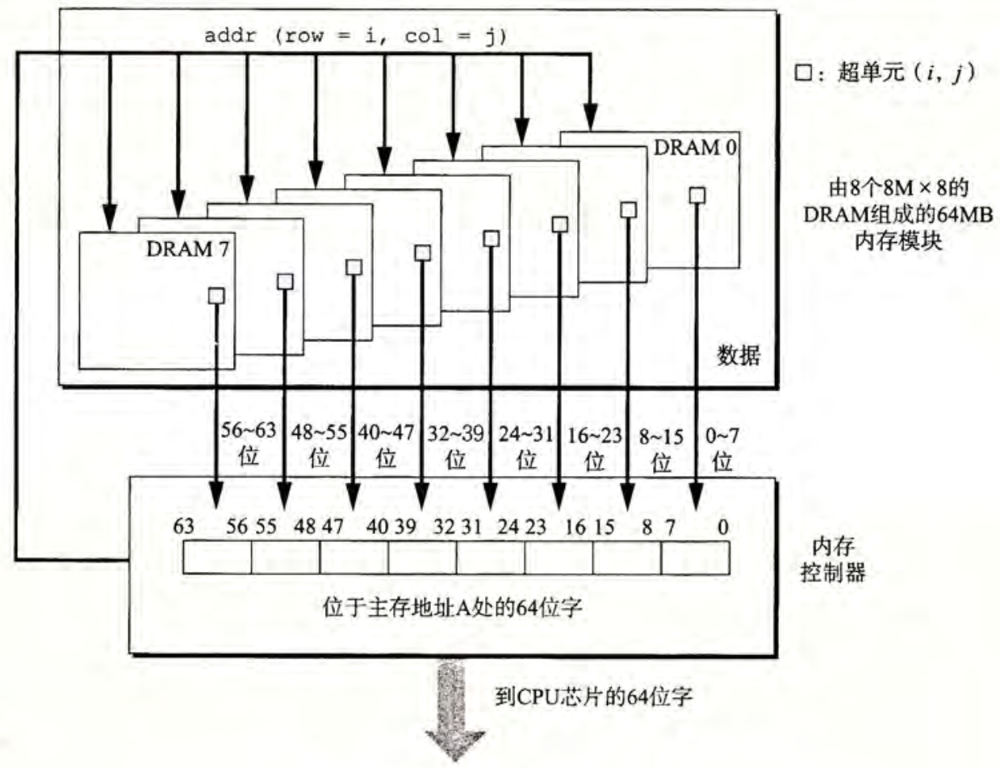
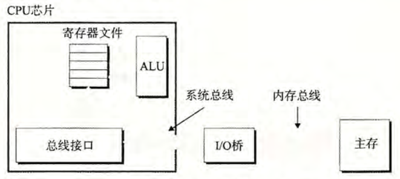
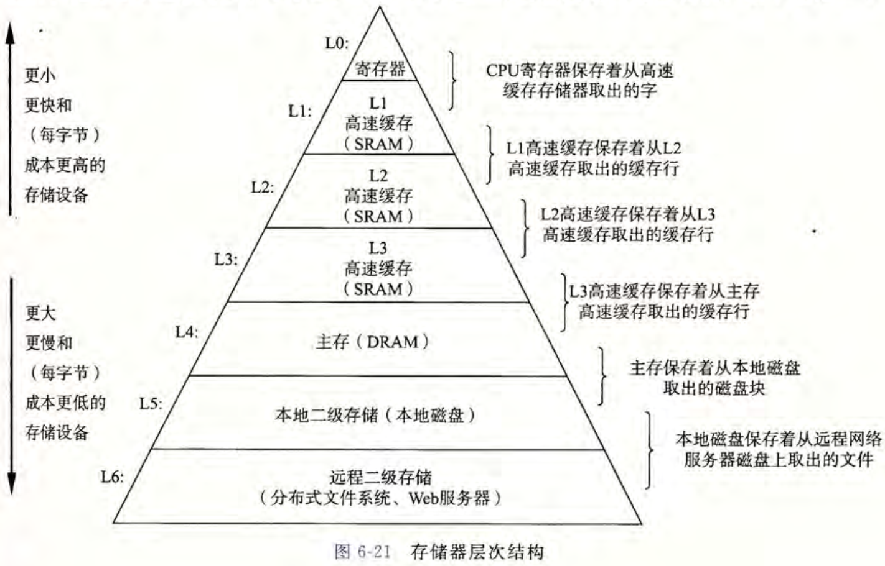

# 第6章 存储器层次结构

## 存储技术
### 随机访问存储器
#### SRAM 和 DRAM
分为静态（SRAM）和动态（DRAM）两类，前者比后者更快但也更贵。在现代计算机中，SRAM 通常用于高速缓存存储器，而 DRAM 常用于主存和图形系统的帧缓冲。  
SRAM 将每个位存储在一个双稳态存储器单元中，每个单元需消耗 6 个晶体管。这一电路能够无限时长地保持两种稳态中的一种，而其他不稳定的状态都会非常快速地转化为两种稳态中的一种。这一特性也被称为双稳态特性。  
DRAM 将每个位存储在一个电容中，每个单元只需要 1 个电容和 1 个晶体管，这也意味着 DRAM 可以很密集地制造。但 DRAM 对干扰非常敏感，且被干扰后无法恢复原状，在通常地情况下， DRAM 在 10~100 毫秒时间内就会失去电荷，这意味着内存系统必须周期性地对 DRAM 读出并重新刷写。在另一些系统中，会额外增加纠错位来及时发现并纠正错误。  
传统 DRAM 芯片中的单元被分为 d 个超单元，而每个超单元由 w 个 DRAM 单元组成。一般的 DRAM 都会被设计成二维 $r \times c$ 的阵列（而不是线性数组，因为这样可以减少引脚数量），这里 $r \times c = d$ 。DRAM 芯片通过引脚来传输数据，例如地址引脚获得行列地址、数据引脚读写数据。  
多个 DRAM 芯片被连接到内存控制器，由内存控制器来向 DRAM 芯片发送地址请求。 DRAM 收到请求后，先将对应行的整行内容复制到一个内部缓冲区，再从中选出需要的列单元发送回内存控制器。在二维设计中，内存控制器需要分两次向 DRAM 芯片发送行地址（RAS）和列地址（CAS），它们共享同一个地址引脚。  
现代计算机将 DRAM 芯片集成在内存模块中，下面是一个简单的示例。

在该示例中，模块上总共有 8 块 DRAM 芯片，每个超单元存储主存的一个字节，用 8 块芯片上 $(i, j)$ 位置的超单元组合起来表示主存上对应地址处的 64 位字。当向内存请求某个地址的字时，内存控制器将地址翻译为超单元地址，然后发送给内存模块，内存模块再将地址广播给所有的 DRAM 芯片，每个 DRAM 芯片收到地址后返回相应超单元的信息，内存模块将 8 个信息合并成 64 字并返回给内存控制器。  
将多个内存模块连接到内存控制器即可组建成主存。当有多个内存模块时，内存控制器还需要选择包含请求对应地址的内存模块进行询问。

> 增强的 DRAM。  
> 快页模式 DRAM（FPM DRAM）。传统 DRAM 将超单元的一整行复制到内部缓冲区，仅取出其中一个超单元就丢弃。FPM DRAM 允许对同一行连续地访问而不需要每次重新将该行超单元复制到缓冲区，改进了这一点。  
> 扩展数据输出 DRAM （EDO DRAM）。在 FPM DRAM 的基础上进一步改进，允许各个 CAS 信号在时间上靠得更紧密。  
> 同步 DRAM （SDRAM）。上面提到的传统 DRAM， FPM DRAM 和 EDO DRAM 都是异步的。 SDRAM 用与驱动内存控制器相同的时钟信号来作控制，最终能更快地输出超单元的内容。  
> 双倍数据速率同步 DRAM （DDR DRAM）。在 SDRAM 的基础上进一步增强，使用两个时钟沿作为控制信号，将 DRAM 速度翻倍。  
> 视频 RAM （VRAM）。主要用于图形系统的帧缓冲区，与 FPM DRAM 类似。

#### 非易失性存储器
SRAM 和 DRAM 在断电后会时区信息，而 ROM 在断电后信息也不会丢失。通常来说， ROM 都是只读的，但也有少量 ROM 是能进行写操作的。  
PROM 可进行一次编程，其每个存储器单元有一种熔丝，可以进行一次高电流熔断。  
EPROM（可擦写可编程ROM）允许多次擦除和写入，借助紫外光的照射和一些特殊设备来进行写和擦除的操作，擦写次数可以达到 1000 的数量级。EEPROM（电子可擦除 ROM）与 EPROM 类似，但不需要独立的编程设备，可以直接在印刷电路卡上编程，擦写次数可以达到 $10^5$ 的数量级。  
闪存是一种基于 EEPROM 的非易失性存储器，固态硬盘（SSD）就是基于山村。

#### 访问主存
数据流通过总线（bus）这一共享电子电路在处理器和 DRAM 主存之间来回，这些数据传送通过一系列步骤完成，这些步骤总称为总线事务，其中读事务从主存传送数据到 CPU，而写事务从 CPU 传动数据到主存。  
总线是一组并行的导线，能携带地址、数据和控制信号。两个及以上的设备能够共享同一条总线。控制线携带的信号能同步事务，并标识出当前正在执行的事务的类型。  
下图是一个计算机系统的简化图，这张图中标出的主要部件有 CPU 芯片、I/O 桥接器（包括内存控制器）和组成主存的 DRAM 内存模块。这些部件由一对总线连接起来：系统总线连接 CPU 和 I/O 桥，内存总线连接 I/O 桥和主存。 I/O 桥负责将系统总线的信号翻译成内存总线的信号，同时还负责其它存储系统的连接。

以指令 `movq A, %rax` 为例，当 CPU 执行到该指令时，CPU 中总线接口的电路会在总线上发起一个读事务，这一事务分为三个步骤：首先 CPU 将地址 A 放到系统总线上， I/O 桥将信号传递到内存总线；随后，主存接收到内存总线上的地址信号，从内存总线读地址，从 DRAM 取出数据字，并将数据字写入内存总线， I/O 桥收到后将其转化为系统总线信号并传递到系统总线上；最后 CPU 从系统总线读取数据并复制到寄存器 `%rax`。相应的，写事务也有三个步骤。

### 磁盘存储
磁盘存储容量更大，但相应的读取速度更慢。  
磁盘由盘片构成，每个盘片的两面成为表面，每个表面覆盖磁性记录材料。盘片中央是一个以固定旋转速率旋转的主轴，磁盘通常包括一个或多个盘片，并封装在密封的容器中。  
在典型的磁盘结构中，每个表面由一组被称为磁道的同心圆组成，而每个磁道被划分为一组扇区，每个扇区包含相等数量的数据位。扇区之间由一些间隙分隔开，这些间隙不存储数据位，而是用来标识扇区的格式化位。  
磁盘制造商通常用*柱面*来描述多个磁盘驱动器的构造，柱面是指所有盘面上到主轴中心距离相等的磁道的集合。  
磁盘容量是能记录的最大位数，由记录密度（磁道每单位距离可以放入的位数）、磁道密度（从盘片中心出发每单位距离的段内可以放入的磁道数）和面密度（记录密度与磁道密度的乘积）决定。

> 早期的磁盘将每个磁道分为数目相同的扇区，也就是说扇区的数量由最内侧的磁道决定，这也意味着外部的磁道扇区之间会分隔较远。当面密度提升后，间隙带来的损耗变得不能接受，故现代磁盘均采用了多区记录的技术。在这一技术中，柱面的集合被分为不相交的子集，成为记录区，每个区包含一组连续的柱面，而一个区内的每个柱面的每条磁道都有相同数量的扇区，具体数量由该区最靠内的磁道决定。

磁盘用读/写头来进行读写，读/写头在一个机械臂上，可以移动定位到盘面上的任意磁道，这一过程成为*寻道*。当有多个盘片时，每个盘片都配有一个独立的读/写头，但是机械臂是一致行动的。  
磁盘以扇区大小的块来进行读写，可以将磁盘的读写时间分为三个部分：寻道时间，传动臂将读/写头定位到包含目标扇区的磁道上，通常为 3~9ms，最高可达 20ms；旋转时间，传动臂到达指定位置后等待目标扇区的第一个位置旋转到读/写头下；传送时间，驱动器对扇区内容读写的时间。

现代磁盘构造复杂，为了隐藏这一复杂性，现代磁盘将呈现一个简单的抽象构造，即一个 B 个扇区大小的逻辑块序列，当操作系统要对磁盘执行 I/O 操作时，只需指定逻辑块编号，然后由磁盘中的磁盘控制器翻译为（盘面，磁道，扇区）的三元组，然后进行访存。

### I/O 设备
图形卡、监视器、鼠标、键盘和磁盘这类 I/O 设备通过 I/O 总线连接到 CPU 和主存（如在 Intel 中是 PCI）。I/O 总线比系统总线和内存总线都慢，但能兼容非常多的第三方 I/O 设备。通常包括下面几种类型。

> 通用串行总线（USB）。连接到 USB 总线的设备，这是一种广泛使用的标准。  
> 图形卡。负责在显示器上绘制像素。  
> 主机总线适配器。使用主机总线接口定义的通信协议，最常用的是 SCSI 和 SATA 。

### 访问磁盘与 I/O 设备
CPU 采用内存映射 I/O 的技术来向 I/O 设备发送命令，在这一技术中，地址空间中有一块地址是为与 I/O 设备通信保留的，每一个这样的地址被称为一个 I/O 端口。  
CPU 对磁盘发起读的操作可以分为三个部分。首先 CPU 发送一个命令字，告知磁盘要发起一个读，并发送其它参数（如读完成时是否中断 CPU）；然后 CPU 指明应该读的逻辑块号；最后是指明存储的主存位置。随后 CPU 去执行其它的任务，磁盘能独立完成读的内容，并将数据直接传送给主存（直接内存访问）。

### 固态硬盘
一种基于闪存的存储技术，其行为被设计为与磁盘基本一致。其结构是闪存芯片和闪存翻译器，前者类似磁盘中的机械驱动器，后者则类似磁盘中的磁盘控制器。SSD 的读比写快，因为数据是以页的单位来写的，只有一个页所属的整个块都被擦除后才能写这一页。这意味着写操作如果试图修改一个包含已有数据的块，需要进行整块的复制擦写。  
SSD 的擦写有次数限制，但制造商在翻译层中用复杂的逻辑尽可能抵消擦写块的高昂代价，最小化写的次数。

## 局部性
局部性包括时间局部性和空间局部性两部分，前者指引用的某个内存位置在不久的将来又会被多次引用，后者指引用的内存附近的位置可能在将来会被引用。  
有良好局部性的程序运行的更快，因为现代计算机系统的各个层次都应用了局部性进行设计。

### 对程序数据引用的局部性
在一个连续向量中，每隔 k 个元素进行一次访问，这称为步长为 k 的访问模式。步长为 1 时也称为顺序引用模式。程序的空间局部性随着步长的增加而下降。  
一个具体的例子是 C 语言中对二维数组的扫描，按照行优先比按照列优先差异很大，这是因为前者步长为 1 空间局部性好，而后者步长为 n 空间局部性差。

### 取指令的局部性
指令需要被 CPU 从内存中取出才能执行，这意味着连续的指令也具有更好的空间局部性，比如多次执行的循环体。

## 存储器层次结构
下图是一个典型的存储器层次结构，从上往下，存储设备变得更慢、更大也更便宜。

### 缓存
在计算机存储器层次结构中，第 k 层的存储设备作为第 k+1 层设备的缓存。具体来说，第 k+1 层的存储器被划分成连续的数据对象组块，每个块有唯一的地址或名字。块可以是固定大小的（通常），也可以是不固定的（Web 服务器上的远程文件）。同时，第 k 层的存储器也划分为同样大小的块的集合，但数量更少。在任何时刻，第 k 层的缓存块都是第 k+1 层的块的子集。   
数据总是以块为基本单位在第 k 层和第 k+1 层来回复制。相邻层次之间块大小是固定的，但不同的相对层次之间块大小可以不同。一般而言，更低层的设备访问时间更长，其块大小通常更大以弥补访问时间。