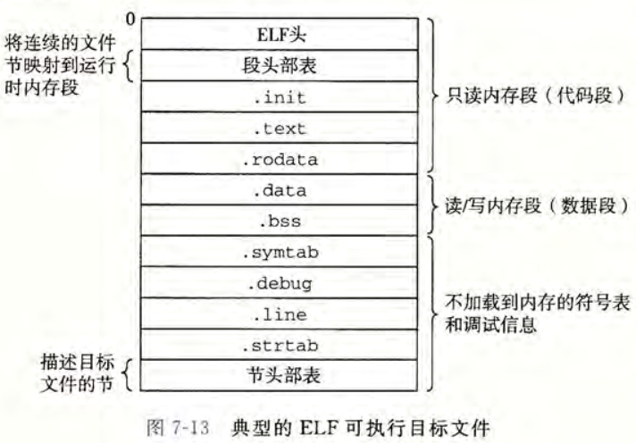

# 第7章 链接

**链接**是将代码和数据组合成单一文件的过程，这一文件可以被加载到内存并执行。  
链接可以在编译时（源代码被翻译为机器代码）、加载时（程序被加载器加载到内存中）、运行时（即由应用程序来执行）进行。早期的链接是手动执行的，而在现代系统中，链接由**链接器程序**自动执行。  
链接器使分离编译变得可行，能把程序分成更小的模块以便于管理，因为这样以来可以独立地修改和编译这些模块。

## 编译器驱动程序
大多数编译系统提供了**编译器驱动程序**，以在需要的时候调用语言预处理器、编译器、汇编器和链接器。下图展示了一个从源文件翻译为可执行目标文件的行为。


具体而言，驱动程序首先运行 C 预处理器（在有些版本的 GCC 中，被集成到编译器驱动程序中），将 C 的源程序 `main.c` 翻译成 ASCII 码中间文件 `main.i`。然后运行 C 编译器，将 `main.i` 翻译为 ASCII 汇编语言问价 `main.s`。然后运行汇编器，将 `main.s` 翻译为**可重定位目标文件** `main.o`。对于 `sum.c` 也要通过上述步骤得到 `sum.o`。最终由链接器程序将 `main.o` `sum.o` 以及一些必要的系统目标文件组合起来，创建**可执行目标文件**。  
对于可执行目标文件的运行，`shell` 会调用操作系统中名为**加载器**的函数，将可执行文件中的代码和数据复制到内存，然后控制转移到这个程序的开头。

## 目标文件和可重定位目标文件
目标文件分为三种形式：

> 可重定位目标文件。包含二进制代码和数据，可以在编译时与其他可重定位目标文件合并，组合创建出一个可执行目标文件。  
> 可执行目标文件。包含二进制代码和数据，可以被直接复制到内存中执行。  
> 共享目标文件。一种特殊的可重定位目标文件，可以在加载或运行的时候被动态地加载进内存并链接。

在分工上，编译器和汇编器生成可重定位目标文件，而链接器生成可执行目标文件。  
目标文件是按照特定地格式来组织地，现在 `x86-84` 的 `Linux` 和 `Unix` 使用可执行可链接格式 ELF。

### 可重定位目标文件
下图展示了一个典型的 ELF 文件格式。


其中，ELF 头包括一个 16 字节的序列，用于描述生成该文件的系统的字大小和字节顺序，并包含帮助连接器语法分析和解释目标文件的信息，如 ELF 头的大小、目标文件的类型（可重定位、可执行或者共享的）、机器类型（如 `x86-64`）、节头部表（描述不同节的位置和大小）的文件偏移、节头部表中条目的大小和数量。  
一个典型的 ELF 可重定位目标文件通常包括以下一些节。

1. `.text`：已编译程序的机器代码。
2. `.rodata`：只读数据（如 `printf` 语句的格式化字符串，`switch` 语句的跳转表）。
3. `.data`：已初始化的全局和静态 C 变量。
4. `.bss`：未初始化的全局和静态 C 变量，以及所有被初始化为 0 的全局或静态变量。这个节在目标文件中不占据实际的空间，仅是一个占位符，这样是为了提升空间效率，这些变量在运行时才被分配到内存中，且初始值为 0 。
5. `symtab`：符号表，存放在程序中定义和引用的函数和全局变量的信息。这一节不需要在编译时增加 `-g` 选项。
6. `.rel.text`：一个 `.text` 节中位置的列表，存放的是当链接器把该目标文件与其他文件组合时需要修改的位置，一般包括对外部函数的调用或是引用全局变量的指令。
7. `.rel.data`：存放所有被模块引用或定义的全局变量的重定位信息，一般包括初始值是全局变量地址或外部定义函数的地址的全局变量。
8. `.debug`：调试符号表，其条目是程序中定义的局部变量和类型定义，程序中定义和引用的全局变量，以及原始的 C 源文件。只有开启 `-g` 选项才会包括该节。
9. `.line`：原始 C 源程序的行号与 `.text` 节中机器指令之间的映射。只有开启 `-g` 选项才会包括该节。
10. `.strtab`：字符串表，内容包括 `.symtab` 和 `.debug` 节中的符号表，以及节头部中的节名字，是以 `null` 结尾的字符串序列。

> C 的局部变量在运行时保存在栈中，既不会出现在 `.data` 节，也不会出现在 `.bss` 节中。  
> 每个可重定位目标文件在 `.symtab` 中都有一张符号表，但与编译器中的符号表不同的是，这里不包含局部变量的条目。  
> `.rel.text` 和 `.rel.data` 包含重定位条目，可执行目标文件中通常省略（因为不需要重定位信息），除非用户显式地指示。

### 符号与符号表
目标文件定义并引用符号，每个符号对应与一个函数、一个全局变量或一个静态变量。  
每个可重定位目标模块 m 都有符号表，包含 m 定义和引用的符号的信息。在上下文中，通常有三种符号。

1. 由模块 m 定义且能被其它模块引用的全局符号。对应 C 中非静态的函数和全局变量。
2. 由其它模块定义且能被 m 引用的全局符号，即外部符号。对应 C 中在其它模块定义的非静态函数和全局变量。
3. 只被模块 m 定义和引用的局部符号。对应 C 中带 `static` 属性的 C 函数和全局变量。这些符号在 m 中任何位置可见，但对其它模块隐藏。

符号表由汇编器构造，这张表包含一个条目的数组，条目格式的定义如下：

```c
typedef struct { 
    int   name;      /* String table offset */ 
    char  type:4,    /* Function or data (4 bits) */ 
	  binding:4; /* Local or global (4 bits) */ 
    char  reserved;  /* Unused */  
    short section;   /* Section header index */
    long  value;     /* Section offset or absolute address */ 
    long  size;      /* Object size in bytes */ 
} Elf64_Symbol; 
```

其中，`name` 是字符串表中的字节偏移，指向该符号的字符串名字（以 `null` 结尾）。`value` 是符号的地址，对于可重定位的模块来说，是距离定义目标的节的起始位置的偏移，而对于可执行目标文件则是绝对运行时地址。`size` 是目标的大小（单位字节）。`type`要么是数据要么是函数。`binding` 字段表示符号是本地的还是全局的。符号表还可以包含各个节的条目，以及对应原始源文件的路径名的条目。  
每个符号被分配到目标文件的某个节，由 `section` 字段来表示，该字段也是到节头部表的索引。  
有三个特殊的伪节，在节头部表中是没有条目的：

1. `ABS` 代表不该被重定位的符号。
2. `UNDEF` 代表未定义的符号，即在本目标模块中引用但定义在其它地方的符号。
3. `COMMON` 表示还未分配位置的未初始化的数据目标。

> `COMMON` 和 `.bss` 区别比较细微，下面是 GCC 的分配原则：  
> 未初始化的全局变量分配到 `COMMON` 中。  
> 未初始化的静态变量、初始化为 0 的全局或静态变量分配到 `.bss` 中。

## 静态链接
静态链接器以一组可重定位目标文件和命令行参数作为输入，生成一个完全链接的、可以加载和运行的可执行文件作为输出。  
输入的可重定位目标文件由各种不同的代码和数据节组成。为构造可执行文件，链接器必须完成两个主要任务：

1. 符号解析。在目标文件会有符号的定义和引用，符号解析的目的即是把每个符号引用正好与一个符号定义关联起来。
2. 重定位。编译器和汇编器生成的代码和数据节是从地址 0 开始的，而链接器因为把每个符号定义与一个内存位置关联，所以要重定位这些节，并修改所有对这些符号的引用到这些新的内存地址。值得注意的是，链接器不加甄别地使用编译器产生地成功定位条目。

### 符号解析
链接器解析符号引用，将每个引用与它输入地可重定位目标文件地符号表中确定地符号关联起来。  
对于与定义在统一模块地引用，符号解析是清晰明了的。  
对全局符号的引用会比较麻烦。首先，编译器遇到不在当前模块定义的引用时，会假定其是在其它模块定义的，生成一个链接器符号表条目，然后由链接器处理。若链接器找不到这个定义，则抛出一条错误信息。对全局符号解析的麻烦之处还在于，多个目标文件可能会定义相同名字的全局符号，此时链接器要么抛出一个错误，要么以某种原则选择其中某个定义。

> C++ 和 Java 中的符号重整：  
> 这两种语言允许重载，使用重整策略来区分在源代码中有相同名字但参数列表不同的函数。重整策略包括名字中字符的证书数量、每个参数单字母编码还有类名。

#### 多重定义的全局符号
编译器和汇编器将全局符号分为两类，强的和弱的。函数和已初始化的全局变量是强符号，未初始化的全局变量是弱符号。  
`Linux` 采用如下规则来处理多重定义的符号名：

1. 不允许有多个同名的强符号。
2. 若有一个强符号和多个弱符号同名，则选择强符号。
3. 如果有多个弱符号同名，则任意选择一个弱符号。

这一规则与 GCC 将符号分为 `COMMON` 和 `.bss` 的原则是相对应的。实际上，当编译器遇到一个弱全局符号 `x` 时，由于其并不知道其它模块是否也定义了 `x` ，所以将 `x` 分配成 `COMMON`，把决定权留给链接器。而如果 `x` 初始化为 0 ，则它是一个强符号，所以编译器可以自信地将其分配到 `.bss` 中。同理，由于静态符号的构造必须唯一，所以可以直接分配到 `.data` 或 `.bss` 中。

### 静态库
编译系统提供一种机制，把所有相关的目标模块打包成一个单独的文件，称为**静态库**。静态库可以用作链接器的输入，而链接器构造可执行文件时，仅复制静态库中被应用程序引用的目标模块。这样可以显著减少可执行文件的体积。  
在 `Linux` 系统中，静态库以**存档**的特殊文件格式存放在磁盘中。存档是一组连接起来的可重定位目标文件的集合，有一个头部来描述每个成员目标文件的大小和位置。

在符号解析阶段，链接器从左至右按照在命令行参数中出现的顺序扫描所有可重定位目标文件和存档文件。链接器维护一个可重定位目标文件的集合 E（其中的文件会合并起来形成最终的可执行文件），一个未解析符号集合 U（即已有引用但未定义的符号），一个在前面的输入文件中一定义的符号集合 D。三个集合在初始时都是空的。  
对于每个输入文件 f ，编译器会判断是目标文件还是存档文件。若是目标文件，链接器会把 f 添加到 E，并维护 U 和 D。若是存档文件，链接器会尝试匹配 U 中未解析的符号，若某个存档文件的成员 m 定义了 U 中的某个引用，m 会加入到 E 中，并维护 U 和 D，直到 U 和 D 不再发生变化，不包含在 E 中的 f 的剩余都会被直接丢弃。处理完所有文件后，若 U 仍是非空的，链接器会抛出一个错误并终止，否则继续后面的合并和重定位，构建最终的可执行文件。  
链接器的这一算法，要求命令行参数中库和目标文件的顺序非常重要。定义一个符号的库必须出现在引用这个符号的目标文件的后面，否则链接就会失败。一般的准则是，将库放在参数的末尾。另外也可以通过在参数中重复的方式满足依赖要求。

### 重定位
完成符号解析后，代码中的每个符号引用和唯一的符号定义对应起来了，链接器开始重定位步骤。这一步骤将合并输入模块，并为每个符号分配运行时地址。包括两个步骤：

1. 重定位节和符号定义。链接器将所有相同类型的节合并为同一类型的聚合节，然后再将运行时内存地址赋给这些聚合节。这样一来，程序中的每条指令和全局变量就都有唯一的运行时内存地址了。
2. 重定位节中的符号引用。链接器修改代码节和数据节中对每个符号的引用，使它们指向正确的运行时地址。

#### 重定位条目
链接器重定位节中的符号引用需要以来重定位条目，这一条目是由汇编器生成的。当汇编器遇到任何最终位置位置的目标引用时，就会生成一个重定位条目。代码的重定位条目在 `.rel.text` 中，已初始化数据的重定位条目在 `.rel.data` 中。 ELF 重定位条目的格式如下：

```c
typedef struct { 
    long offset;    /* Offset of the reference to relocate */ 
    long type:32,   /* Relocation type */ 
	 symbol:32; /* Symbol table index */ 
    long addend;    /* Constant part of relocation expression */
} Elf64_Rela; 
```

其中，`offset` 是需要被修改的引用的节的偏移。`symbol` 表示被修改引用应该指向的符号。`type` 告知链接器要如何修改新的引用。`addend` 用于对被修改引用的指的偏移调整。  
ELF 定义了 32 种不同的重定位类型，这里我们只关注两种：

1. `R_X86_64_PC32`：重定位一个使用 32 位 PC 相对地址的引用。
2. `R_X86_64_32`：重定位一个使用 32 位绝对地址的引用。

这两种类型支持的是 `x86-64` 小型代码模型，即假设可执行目标文件中的代码和数据总体大小小于 2GB，故用 32 位寻址。大于 2GB 的程序用 `-mcmodel=medium` 和 `mcmodel=large` 来编译。

下面是重定位算法的伪代码，其中前两行表示对于每个节 s 和每个节相关联的重定位条目 r 上迭代执行。假定每个节 s 是一个字节数组，而每个重定位条目 r 是一个类型为 `Elf64_Rela` 的结构：

```python
foreach section s {
    foreach relocation entry r {
        refptr = s + r.offset;
        if (r.type == R_X32_64_PC32) {
            refaddr = ADDR(s) + r.offset;
            *refptr = (unsigned)(ADDR(r.symbol) + r.addend - refaddr);
        }
        if (r.type == R_X32_64_32)
            *refptr = (unsigned)(ADDR(r.symbol) + r.addend);
```

## 可执行目标文件
链接器成功执行后，得到的便是多个目标文件合并成的可执行目标文件。下图是一个典型的 ELF 可执行文件的各类信息。

