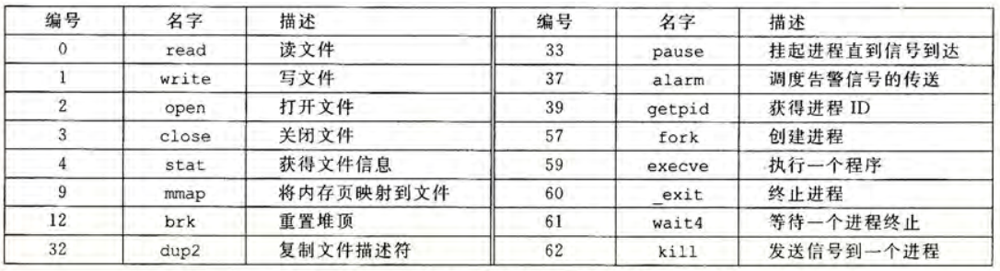

# 第8章 异常控制流
通常的程序控制都是按照一个序列执行若干指令，这一过程被称为**控制流**。但偶尔也需要使控制流发生突变以应对某些特殊情况，这些突变称为**异常控制流**。  
异常控制流可以发生在计算机的各个层次。在硬件层，硬件检测到某些事件会立刻将控制转移到异常处理程序；在操作系统层，内核通过上下文切换将控制从一个进程转移到另一个进程；在应用层，进程可以发送信号到另一个进程，接受信号的进程会立即转移到对应的信号处理程序；在应用程序，程序可以回避栈的调用原则，跳转到其它函数中的任意位置来对错误作出反应。

## 进程
进程是一个执行中的程序的实例，系统中的每个程序都运行在某个进程的**上下文**中。上下文指的是程序运行所需的各种状态，包括存放在内存中的程序代码和数据、程序的栈、寄存器内容、程序计数器、环境变量等。当用户通过 `shell` 运行一个新的程序时，就会创建一个新的进程，并在新进程的上下文中运行。  
进程提供给应用程序两个抽象：独立的逻辑控制流（即好像程序独占处理器），私有的地址空间（即好像程序独占内存系统）。

### 逻辑控制流和并发流
程序运行时 PC 值变化的序列被称为**逻辑控制流**或简称**逻辑流**。实际上，进程是轮流使用处理器的，每个进程执行它的流的一部分，然后被**抢占**，轮到其它进程执行。  
当一个逻辑流的执行在时间上与另一个流重叠时，称为**并发流**，称两个流并发地运行。多个流同时执行地现象被称为并发。  
并发流与流运行的处理器核数或机器数无关。若两个流并发地运行在不同的处理器核或机器上。则称为**并行流**，并行流是并发流的子集。

### 用户模式和内核模式
这一机制用于限制应用可以执行的指令集以及可以访问的地址空间范围。用户模式不允许执行一些特权指令，也不允许直接引用地址中内核区的代码和数据。用户需要调用系统提供的接口来间接地访问内核代码和数据，这一机制即使异常。当异常发生时，控制传递给异常处理程序，同时处理器从用户模式切换到内核模式，执行相关内容，最后返回时再切换回用户模式。  
在处理器设计中，通常提供了**模式位**来区分两个模式。当设置了模式位时，进程就运行在内核模式，否则在用户模式。  
Linux 系统提供了 `/proc` 文件系统使用户模式进程也能访问内核数据结构中的内容，这一文件系统将许多内核数据结构输出为用户可读的文本内容。

### 上下文切换
操作系统使用一种更高层的抽象——**上下文切换**——来实现多任务和各种异常机制。  
内核为每一个进程维护上下文，在进程执行的某些时刻，内核可以决定抢占当前进程，并切换到一个先前被抢占的进程。这一决策被称为**调度**，由内核中的**调度器**处理。当决定抢占时，执行三个步骤：保存当前进程的上下文，恢复另一个上下文，传递控制。

## 异常
异常是控制流中的突变。这里称处理器状态发生变化为**事件**，事件可能与当前正在执行的指令有关（如内存缺页，除零错误等），也可能与当前指令无关（如定时器的信号，I/O请求完成等）。  
当处理器检测到有事件发生时，会通过**异常表**进行跳转，进行一个间接过程调用，执行一个专门处理该事件的异常处理程序。当异常处理程序结束后，可能会返回原来正在执行的指令，也可能返回原来指令的下一条指令，还有可能直接中断程序。  
系统中每一种可能的异常都分配了一个唯一的编号。由于异常机制是由硬件和操作系统共同实现的，这里编号的定义也分别由处理器和操作系统负责分配。系统启动的时候，操作系统会分配并初始化称为**异常表**的跳转表，其中的条目 k 包含对应编号为 k 的异常的处理程序的地址。  
异常在一些方面类似于过程调用，但也有重要的不同：

1. 根据异常的类型，返回地址可能是当前指令，也可能是下一条指令。
2. 有时处理器会把一些额外的状态压到栈里。这是为了能在处理程序返回后，重新开始执行被中断的程序。
3. 异常处理程序运行在内核模式下，对所有的系统资源都有完全的访问权限。

### 异常的类别
异常可分为四类：中断，陷阱，故障和终止。下表是一个简单的总结。

| 类别 |       原因       | 异步/同步 |      返回行为       |
| ---- | --------------- | -------- | ------------------ |
| 中断 | 来自I/O设备的信号 | 异步      | 总是返回到下一条指令 |
| 陷阱 | 有意的异常        | 同步      | 总是返回到下一条指令 |
| 故障 | 潜在可恢复的错误  | 同步      | 可能返回到当前指令   |
| 终止 | 不可恢复的错误    | 同步      | 不会返回            |

这里的异步/同步指的是是否于当前指令有关。硬件中断不是由特定的指令导致的，故是异步的。其它的异常则与当前执行的指令有关，故是同步的。

**中断**通常与各类 I/O 设备有关。这些设备通过向 CPU 的某个引脚发送信号，并把异常号放到总线上来触发中断。处理器在执行完当前指令后，首先检查引脚，发现中断引脚的电压升高（这意味着有设备发送了信号），然后从系统总线读取信号，并调用适当的中断处理程序。  
**陷阱**通常与系统调用有关，是*有意*的异常。这一异常通常用于用户程序向内核请求服务（如读写文件(read)，创建进程(fork)，加载新程序(execve)，终止当前程序(exit)）。这些是内核服务，运行在内核模式下，而普通的函数是运行在用户模式下的。陷阱为程序员提供了一种调用系统服务的便捷方法。  
**故障**由错误情况引起，处理器会尝试调用故障处理程序来进行修正，如果成功修正，则返回引起故障的指令并重新执行，否则进入 `abort` 例程终止程序。  
**终止**由不可恢复的致命错误引起，处理器会直接进入 `abort` 例程终止程序。

### Linux 中的异常实例
常见故障和终止

* 除法错误。试图除以0，或除法指令的结果对于目标操作数来说太大。不会尝试恢复，直接终止，报告为 `Floating exception`浮点异常。
* 一般保护故障。通常是程序引用了未定义的虚拟内存区域，或试图对只读文本段写。不会尝试恢复，直接终止，报告为`Segmentation fault`段错误。
* 缺页。处理程序将适当页面加载进内存，然后重新执行产生故障的指令。
* 机器检查。检测到致命的硬件错误，从不返回。

Linux 提供了几百种系统调用，下图给出了其中的一部分。与通常的函数调用类似，也使用六个寄存器包含最多六个参数（所有的系统调用都只需要通过寄存器传递参数），同时在 `%rax` 中存放系统调用号。返回时，`%rax` 中包含返回值，若返回的负数表明发生了错误。



#### 系统调用错误处理
系统级函数遇到错误时，通常会返回 -1，并设置全局整数变量 `errno` 记录信息。下面是一个 `fork` 检查错误的实例。

```c
if ((pid = fork()) < 0) {
    fprintf(stderr, "fork error: $s\n", strerror(errno));
    exit(0);
}
```

为了简化代码，可以将错误检查包装成同名的首字母大写函数，在下面将总是使用这种错误处理的包装函数。

## 进程控制

### 获取进程 ID
每个进程都有一个唯一的正 ID（PID），函数 `getpid()` 返回调用进程的 PID，函数 `getppid()` 返回它的父进程的 PID。

```c
#include <sys/types.h>
#include <unistd.h>

pid_t getpid(void);
pid_t getppod(void);
```

其中 `pid_t` 是整数类型，在 `Linux` 系统中定义为 `int`。

### 创建和终止进程
父进程通过调用 `fork()` 函数创建一个新运行的子进程。  
这一新的子进程几乎但不完全与父进程相同。子进程得到与父进程用户级虚拟地址空间相同的一份副本，但同时是独立的，这包括代码、数据段、堆、共享库和用户栈。子进程还获得父进程打开的文件描述符相同的副本，也就是可以读写父进程打开的任何文件。  
`fork()` 函数调用一次，返回两次。一次返回是返回调用进程（父进程），返回的是子进程的 PID；另一次返回是返回子进程，返回的是 0 。根据这一特性，可以方便地区分程序是在父进程还是在子进程中执行。下面是一个实例：

```c
int main() 
{
    pid_t pid;
    int x = 1;
    pid = Fork(); //line:ecf:forkreturn
        if (pid == 0) {  /* Child */
	    printf("child : x=%d\n", ++x); //line:ecf:childprint
	    exit(0);
    }
    /* Parent */
    printf("parent: x=%d\n", --x); //line:ecf:parentprint
    exit(0);
}
```

输出结果为

```plane
parent: x=0
child: x=2
```

有以下几点需要注意

* **并发执行**。父进程和子进程是并发运行的独立进程。上面的结果是父进程先完成 `printf` 语句，但在其它系统上可能正好相反。在编程时不能先验地假定指令的运行顺序。
* **独立的地址空间**。执行完 `fork()` 函数后，两个进程具有完全相同的地址空间，但是是相互独立的。这点可以从 `x` 的计算结果看出。
* **共享文件**。父进程调用 `fork()` 时，`stdout`文件是打开的，这意味着子进程也继承了这一文件，两个进程的输出都指向屏幕。

### 回收子进程
当进程由于某一原因终止时，内核并不立即将他从系统中清除。相反，被终止的进程被保持在已终止的状态，直到被它的父进程回收。父进程回收时，内核将子进程的退出状态传递给父进程，然后抛弃已终止的进程。  
如果父进程没有回收它的子进程就终止了，内核会安排 `init` 进程称为它的父进程，并负责回收。`init`进程的 PID 为 1，在系统启动时由内核创建，不会终止。  
进程通过调用 `waitpid` 函数来等待它的子进程终止或停止，该函数的声明如下：

```c
pid_t waitpid(pid_t pid, int *statusp, int options);
```

返回值的定义：若成功，则为子进程的 PID，如果出现 `WNOHANG` 则为 0 ，其它错误为 -1。

`waitpid` 函数有着比较复杂的逻辑。当 `options=0` 时为默认情况，`waidpid` 挂起调用程序的执行，直到它的等待集合中的一个子进程终止，而若集合某个子进程在调用该函数前就已经终止，则直接返回，返回值为已终止的子进程的 PID，同时已终止的子进程会被回收。  
参数 `pid` 决定等待集合。若 `pid > 0`，那么等待集合就是进程 ID 是 `pid` 的子进程；若 `pid = -1`，那么等待集合是父进程的所有子进程。  
如果调用进程没有子进程，那直接返回 -1，并设置 `errno` 为 `ECHILD`；如果 `waitpid` 本身被一个信号中断，那么也返回 -1，并设置 `errno` 为 `EINTR`。  
`wait()` 是其简化版本，调用 `wait(&status)` 等价于调用 `waitpid(-1, &status, 0)`。

#### 改变函数行为

修改`options`可以改变 `waitpid` 函数的行为，有以下几种参数可选。可以使用或运算将这些参数组合使用。

* **WNOHANG**：如果等待集合中的任何子进程都没有终止，那么立即返回，且返回值为 0。
* **WUNTRACED**：挂起调用进程的执行，直到等待集合中的一个进程变成已终止或被停止。注意默认行为是只检查已终止的子进程。
* **WCONTINUED**：挂起调用进程的执行，直到等待集合中一个正在运行的进程终止，或一个被停止的进程收到 `SIGCONT` 信号重新开始执行。

#### 检查已回收子进程的退出状态
若 `statusp` 参数非空，`waitpid` 函数会在 `statusp` 中放入关于导致返回的子进程的状态信息。以下几个宏可以用于解释 `status`。

* **WIFEXITED(status)**：若子进程是通过调用 `exit()` 或 `return` 返回的，则返回真。
* **WEXITSTATUS(status)**：仅当上面一项为真时有效，返回该子进程的退出状态。
* **WIFSIGNALED(status)**：若子进程是因为一个未被捕获的信号终止的，则返回真。
* **WTERMSIG(status)**：仅当上面一项为真时有效，返回引起子进程终止的信号的编号。
* **WIFSTOPPED(status)**：若导致返回的子进程当前是停止的，则返回真。
* **WSTOPSIG(status)**：仅当上面一项为真时有效，返回引起子进程停止的信号的编号。
* **WIFCONTINUED(status)**：若子进程收到 `SIGCONT` 信号重新启动，则返回真。

### 进程休眠
`sleep` 函数可以将一个函数挂起一段指定的时间。如果请求的时间已经到了，返回值为 0 ，否则返回还剩下的要休眠的秒数（这是因为有可能被一个信号中断而过早返回）。  
另一个是 `pause` 函数。它使进程休眠，直到收到一个信号唤起。  
两个函数的定义如下。

```c
unsigned int sleep(unsigned int secs);
int pause(void);
```

### 加载并运行程序
`execve` 函数可以在当前进程的上下文中加载并运行一个新程序。其定义如下。

```c
int execve(const char *filename, const char *argv[], const char *envp[]);
```

其中，`filename` 是要加载运行的可执行目标文件的文件名，`argv` 是参数列表，`envp` 是环境变量列表。  
只有发生错误（如找不到 `filename` 指称的程序文件）时，该函数才会返回到调用程序。这也意味着，`execve`调用一次并从不返回。  
下图展示的是参数列表和环境变量列表的基本结构。


`execve` 加载 `filename` 指定的文件，调用其启动代码，然后将控制传递给新程序的主函数，该主函数有下列原型。

```c
int main(int argc, char *argv[], char *envp[]);
```

> `fork` 与 `execve` 的区别：  
> 前者在新的子进程中运行相同的程序，即子进程是父进程的复制品，只是相互独立。  
> 后者是在当前进程的上下文中打开新的程序，它会覆盖当前进程的地址空间，且不会创建新的进程，新的程序 PID 不变，并继承了调用 `execve` 函数时已经打开的所有文件描述符。

#### 关于环境变量
环境变量都遵循 `name=value` 的字符串格式。`Linux` 提供了以下几个函数来方便地操作环境变量列表。

```c
char *getenv(const char *name);
int setenv(const char *name, const char *newvalue, int overwrite);
void unsetenv(const char *name);
```

其中  `getenv` 函数在环境数组中搜索 `name=value`，如果找到了就返回指向 `value` 的指针，否则返回 `NULL`。  
`setenv` 将 `name=newvalue` 添加到列表中，若 `overwrite` 非零则会覆盖原有的 `name`，否则原有的不会被覆盖。  
`unsetenv` 删除 `name` 对应的条目。

## 信号
**信号**可以认为是预先设定好的消息类型，用于通知进程，系统中发生了某种类型的事件。  
每种信号都对应于某种系统事件，能通知用户进程发生了哪种异常。下表是 `Linux` 中常见信号。


发送信号到目的进程需要经过两个步骤。

1. **发送信号**：内核通过更新目的进程上下文中的某个状态，传递信号给目的进程。一个进程可以发送信号给它自己。
2. **接收信号**：目的进程被内核强迫以某种方式对信号作出反应，可以是忽略、终止、或者执行**信号处理程序**捕获该信号（这是一个用户层的函数）。

一个已经发出但没有被接收的信号被称为**待处理信号**。在任何时刻，任意一类信号至多只会有一个。这也意味着，如果进程有一个类型为 k 的待处理信号，接下来发送到该进程的类型同样为 k 的信号都会被丢弃。而当一种信号被阻塞时，它仍可以被发送，但产生的待处理信号不会被接收。  
一个待处理信号最多只会被接收一次。在内核中，内核维护两个向量 `pending` 和 `blocked`，分别代表待处理信号和被阻塞的信号。

### 发送信号
向进程发送信号的机制基于 `Unix` 中关于**进程组**的概念。

> 关于进程组：  
> 进程组由正整数 ID 来标识，每个进程只属于一个进程组。函数 `pid_t getpgrp(void)` 返回当前进程所在的进程组。  
> 默认上，一个子进程与其父进程属于同一个进程组。  
> 函数 `int setpgid(pid_t pid, pid_t pgid)` 改变进程 `pid` 的进程组为 `pgid`。若 `pid` 为 0 ，则使用当前进程的 PID。若 `pgid` 为 0，那么就用 `pid` 指定进程的 PID 作为进程组 ID。比如 `setpgid(0, 0);`创建一个只有当前进程的新进程组。

有下面几种发送信号的方法。

#### 用 `/bin/kill` 程序发送信号
命令 `/bin/kill -id pid` 将信号 `id` 发送给进程 `pid`，若 `pid` 是负数则会发送给进程组 `pid` 的每个进程。  
这里使用完整路径的原因是，有些 `Unix shell` 会有自己内置的 `kill` 命令。

#### 从键盘发送信号
`Unix` 使用**作业**这一抽象概念来表示对命令求值所创建的进程。

> 关于作业：  
> 在任何时刻，至多只有一个前台作业和 0 个或多个后台作业。`shell` 会为每个作业创建独立的进程组。

在键盘上输入 `Ctrl+C` 会发送 `SIGINT` 信号到前台进程组中的每个进程，其默认情况是终止前台作业。类似有 `Ctrl+Z` 会发送 `SIGTSTP` 信号到前台进程组的每个进程，默认情况下是停止（挂起）前台作业。

#### 通过 `kill` 函数发送信号
`kill` 函数的定义如下：

```c
int kill(pid_t pid, int sig);
```

若 `pid` 大于 0 ，那么发送信号 `sig` 给进程 `pid`；若 `pid` 等于 0 ，那么发送信号给调用进程所在进程组的每一个进程（包括调用程序自身）；若 `pid` 小于 0 ，那么发送信号给进程组 `-pid` 的每个进程。

#### 通过 `alarm` 函数发送信号
`alarm` 函数的定义如下：

```c
unsigned int alarm(unsigned int secs);
```

该函数会安排内核在 `secs` 秒后发送 `SIGALRM` 信号给调用过程。如果 `secs` 为 0 则不会安排新的闹钟。  
任何时候只能最多有一个待处理的闹钟，如果有新的则会取消前一个，并返回前一个还剩下的描述，否则返回 0 。

### 接收信号
每一种信号都有相关联的默认行为。除 `SIGSTOP` 和 `SIGKILL` 之外，其它信号的默认行为可以通过以下函数修改。

```c
typedef void (*sighandler_t)(int);
sighandler_t signal(int signum, sighandler_t handler);
```

其中 `signum` 是信号编号。若 `handler` 是 `SIG_IGN` 则忽略该信号；若 `handler` 是 `SIG_DFL`，那么将对应信号的行为恢复为默认；否则是用户自定义的函数的地址，即信号处理程序。  
值得注意的是，信号处理程序也可能被其它信号处理程序中断。

### 阻塞和解除阻塞信号
`Linux` 提供有两种阻塞信号的机制：

* **隐式阻塞机制**：内核默认阻塞任何当前处理程序正在处理信号类型的待处理的信号。
* **显式阻塞机制**：应用程序使用相关函数明确阻塞和解除相关信号。

与显式阻塞机制有关的函数定义如下：

```c
int sigprocmask(int how, const sigset_t *set, sigset_t *oldset);
int sigemptyset(sigset_t *set);
int sigfillset(sigset_t *set);
int sigaddset(sigset_t *set, int signum);
int sigdelset(sigset_t *set, int signum);
int sigismember(const sigset_t *set, int signum);
```

返回值逻辑：在这些函数中，除最后一个以外，如果成功则返回 0 ，否则出错返回 -1；对于最后一个函数，若 `signum` 是 `set` 的成员则为 1，如果不是则为 0 ，如果出错返回 -1。  
`sigprocmask` 函数改变当前阻塞的信号集合。若 `oldset` 非空，原来的 `blocked` 会保存在其中。其具体行为依赖于 `how` 参数，具体如下：

* **SIG_BLOCK**：将 `set` 中的信号添加到 `blocked` 中，即 `blocked = blocked | set`。
* **SIG_UNBLOCK**：从 `blocked` 中删除 `set` 中的元素，即 `blocked = blocked & (~set)`。
* **SIG_SETMASK**：设置 `blocked` 为 `set`，即 `blocked = set`。

其它函数的功能：`sigemptyset` 将 `set` 初始化为空集合，`sigfillset` 把每个信号都添加到 `set` 中，`sigaddset` 将信号 `signum` 添加到 `set` 中，`sigdelset` 将信号 `signum` 从 `set` 中删除，`sigismember` 判断 `signum` 是否在 `set` 中。

### 编写信号处理程序
编写信号处理程序是件比较麻烦的事情，因为处理程序和主程序会并发地执行。  
首先是安全方面的，下面是一些保守的编写原则：

1. 处理程序尽量简单。比如，可能只是简单地设置全局标志就立即返回，相关处理由主程序的周期性检查负责。
2. 在处理程序中只调用**异步信号安全**的函数。要么它是可重入的（即只访问局部变量），要么它不能被信号处理程序中断。
3. 保存和恢复 `errno`。很多 `Linux` 异步信号安全的函数都会在出错返回时设置 `errno`，而在处理程序中调用这些函数可能会干扰主程序中其它依赖 `errno` 的部分，故在进入处理程序的时候提前保存好 `errno` 到局部变量中，返回时再恢复。
4. 阻塞所有的信号，保护对全局数据结构的访问，尤其是处理程序和其它程序（如主程序）共享一个全局数据时。
5. 用 `volatile` 声明全局变量，告诉编译器不要缓存变量，强迫其每次都从内存中读取。
6. 用 `sig_atomic_t` 声明标志，使得对它的读写都是**原子的**（即不可中断的）。

另一个需要注意的是，由于信号的性质，不会出现信号排队的情况，多余的信号会被直接丢弃，故如果需要对每一个信号个体都处理到，必须设计一种方式让所有信号都能处理到。

### 显式地等待信号
有时需要主程序显示地等待某个信号处理程序运行，这时可以使用 `sigsuspend` 函数，定义如下：

```c
int sigsuspend(const sigset_t *mask);
```

其功能为，用 `mask` 替换当前地阻塞集合，然后挂起该进程，直到收到一个信号。如果这个信号要求终止，则该进程不从 `sigsuspend` 返回就终止；如果这个信号是运行一个处理程序，那么 `sigsuspend` 从处理程序返回，并恢复调用前原有的阻塞集合。  
`sigsuspend` 函数等价与下述代码的原子化版本（即不可中断的），原子属性保证了这些调用总是一起发生的，不会被中断。

```c
sigprocmask(SIG_SETMASK, &mask, &prev);
pause();
sigprocmask(SIG_SETMASK, &prev, NULL);
```

## 非本地跳转
非本地跳转能将控制直接从一个函数转移到另一个当前正在执行的函数，而不需要经过正常的调用-返回序列。这一机制是通过 `setjmp` 和 `longjmp` 来提供的，两个函数的定义如下：

```c
int setjmp(jmp_buf env);
int sigsetjmp(sigjmp_buf env, int savesigs);
void longhjmp(jmp_buf env, int retval);
void siglongjmp(sigjmp_buf env, int retval);
```

其中，`setjmp` 函数在 `env` 缓冲区中保存当前的**调用环境**（包括程序计数器，栈指针和通用目的寄存器），以供后面的 `longjmp` 使用。`setjmp` 的返回值不能被赋值给变量，但可以使用在 `switch` 和条件语句的测试中。  
`longjmp` 从 `env` 缓冲区中恢复调用环境，然后触发一个从最近一次初始化 `env` 的 `setjmp` 调用的返回，然后 `setjmp` 返回，并带有非零的返回值 `retval`。  
值得注意的是，这一调准跳过了中间调用的所有过程，这意味着若函数分配了某些数据结构，而该跳转跳过了其释放阶段，这样就会产生内存泄漏。

> `setjmp` 调用一次但返回多次，`longjmp` 调用一次但从不返回（返回到 `setjmp`）。  
> 如何区分 `setjmp` 的返回是本身的返回还是从 `longjmp` 的返回？当返回值为 0 的时候是其自身的调用，而返回值非零的时候则是 `longjmp` 的返回。

带有 `sig` 前缀的是对应函数可以被信号处理程序使用的版本。