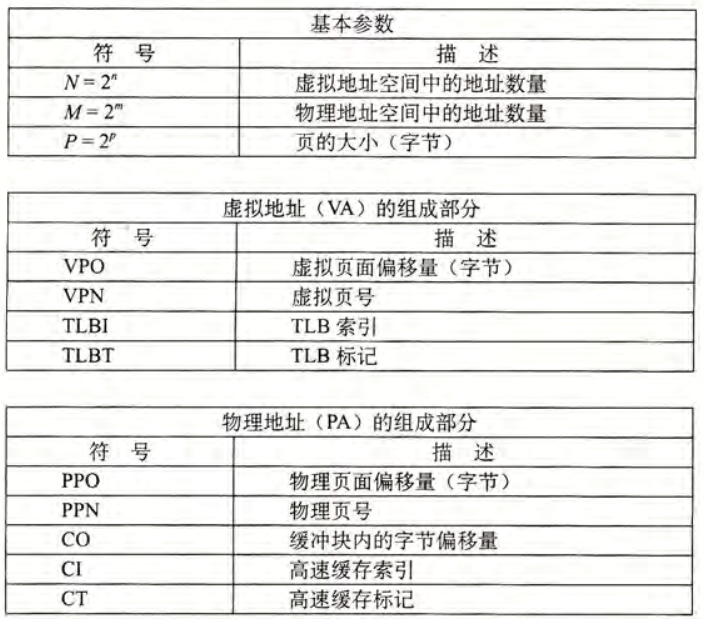
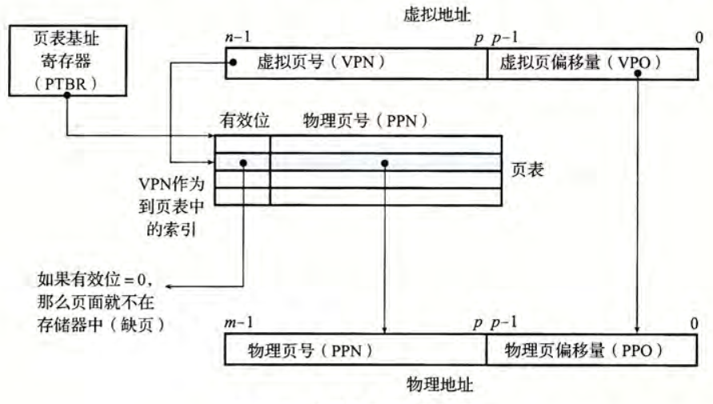
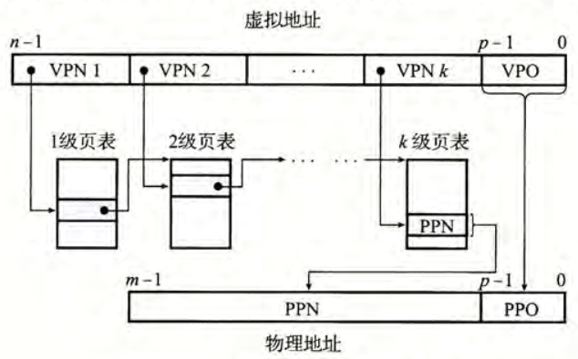
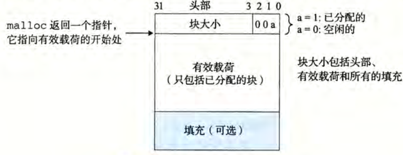
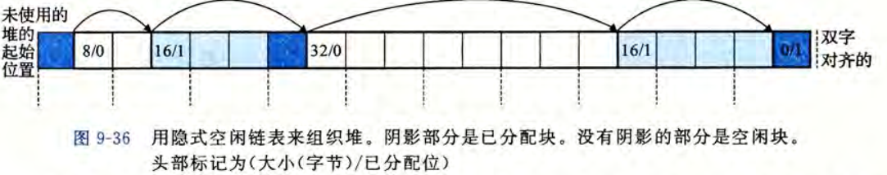
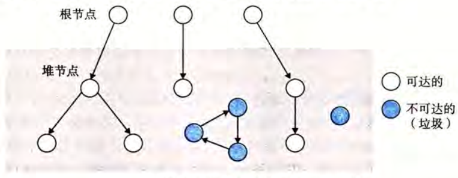

# 第9章 虚拟内存

## 一些基础概念
物理内存：将 CPU 的主存组组成简单的字节数组，即为物理内存  
虚拟内存：CPU 生成虚拟地址来访问主存，这个地址在被送到内存之前先被翻译为适当的物理地址。翻译的专用硬件为**内存管理单元（MMU）**，该表的内容由操作系统管理。  
对应的有虚拟地址空间和物理地址空间，通常用 $2^N, 2^M$ 来表示大小。

虚拟内存可以形象的理解为一个存放在磁盘上的连续的 N 个的字节的数组，每个字节都有唯一的虚拟地址。

### 页
VM 系统将虚拟内存分割为大小固定的**虚拟页**，每个虚拟页大小为 $2^p$，对应的有物理内存被分割为**物理页**，大小与虚拟页一样。  
在任意时刻，虚拟页面的集合被分为三个互不相交的子集：

* **未分配的**：VM 系统还未分配或创建的页，没有任何数据与这些页相关联，因此也就不必占用磁盘空间。
* **缓存的**：已缓存在物理内存中的分配页。
* **未缓存的**：未缓存在物理内存中的分配页。

#### 页表
**页表**是存放在物理内存中的数据结构，用于将虚拟页映射到物理页。它能够支持判定某个虚拟页是否缓存在 DRAM 中的某个位置，若是还可以确定这个具体位置。  
页表是软硬件联合维护的（包括操作系统，MMU）。每次 MMU 将虚拟地址转化为物理地址时都会读取页表，而操作系统负责维护页表的内容，并负责在磁盘与 DRAM 之间传递页。

页表的每一项叫做**页表条目（PTE）**，PTE 与虚拟内存中的每个页是一一对应的。一般认为 PTE 是由一个有效位和一个 n 位地址组成的，前者标注该虚拟页是否缓存在 DRAM 中，后者记录相应物理页的起始地址。

#### 页命中与缺页
当 CPU 读取虚拟内存中的字时，若所需要的页已经在物理内存中，那么此时称**页命中**，否则称为**缺页**。  
如果发生缺页，地址翻译硬件就会触发一个缺页异常，选择一个牺牲页进行替换，然后重新启动相关指令。

## 虚拟内存
操作系统为每个进程提供了独立的页表，也就是独立的虚拟地址空间。  
将按需页面调度和独立的地址空间两种方法结合，能简化链接和加载、代码和数据共享以及应用程序的内核分配。

> 加载器将目标文件加载到进程中时，仅为其分配虚拟页，并标记为未缓存的，这意味着加载器并不从磁盘复制任何数据到内存。  
> **内存映射**能将一组连续的虚拟页银蛇到任意文件的任意位置。Linux 系统调用 mmap 允许程序自己做内存映射。  
> 在 PTE 中添加控制位能方便地控制内存的访问权限，这样可以保护内存

## 地址翻译
形式化的，地址翻译即是将虚拟地址空间的元素映射到物理地址空间中的元素。下面是一些需要用到的符号。



CPU 中有一个**页表基址寄存器**指向当前页表，便于查找。n 位的虚拟地址包括两个部分：一个 p 位的虚拟页面偏移，和一个 n-p 位的虚拟页号，下图展示了 MMU 利用页表实现映射的过程。



当 CPU 需要访问某个地址时，CPU 会将虚拟地址传递给 MMU，由 MMU 生成 PTE 地址，并从高速缓存或主存中得到，MMU 再构造物理地址传送给高速缓存或主存，将请求的字返回给处理器。若出现不命中，则调用触发异常，进行缺页处理，然后再接着执行。

> 现代系统通常使用物理寻址来访问 SRAM 高速缓存，这意味着多个进程共享和权限保护都比较好处理。

### TLB 加速地址缓存
MMU 有着自己的关于 PTE 的小缓存，被称为**翻译后备缓冲器（TLB）**。TLB 的每一行都保存着单个 PTL 的块，且有着高度的相联度。  
加入 TLB 后，与 MMU 有关的修改仅有在查询 PTE 时先在 TLB 中查询是否有需要的 PTE 项，若有则直接使用，否则向主存请求。  
所有的地址翻译步骤都是在 MMU 中执行的，因此速度非常快。

### 多级页表
在实际系统中，为节省空间，页表通常是多级的，前一级页表指向的是后一级页表在内存中的位置，而只有最后一层指向的是真正的数据地址。  
这样做在两个方面减少了内存需求：其一是，若一级页表的某一项是空的，那么对应的二级页表就不会存在，这能极大地节约空间使用；其二是，只有一级页表是常驻主存地，二级页表只需要在必要地时候创建、调入和调出，减少了主存的压力。  
当使用 k 级页表时，虚拟地址被划分为 k 个 VPN 和 1 个 VPO ，每个 VPN 负责一级页表的索引，图示如下。



TLB 能将不同层次的 PTE 缓存起来，使得多级页表的翻译速度也很快。

## 内存映射
内存映射：将虚拟内存区域与磁盘上的对象关联起来，以初始化这片虚拟内存区域的内容。虚拟内存可以映射到下面两种类型中的一种：

* 普通文件：比如可执行目标文件。当区域比文件区大时，上下的部分用 0 来填充。
* **匿名文件**：匿名文件是由内核创建的，包含的全是二进制 0 。当 CPU 第一次引用这样一个页面时，会用二进制 0 覆盖牺牲页面。注意到磁盘与内存之间并没有实际的数据传输，所以这一方法也叫做请求二进制零的页。

无论是哪种情况，一旦一个虚拟页面被初始化了，它就在一个由内核维护的**交换文件（交换空间）**中移动。在任何时候，交换空间都限制着当前运行的进程能够分配的虚拟页面的总数。

### 共享对象
一个对象可以被映射到虚拟内存的一个区域，且要么是**共享对象**，要么是**私有对象**，相应的有共享区域和私有区域。正如其定义，一个进程对共享对象的操作会影响到其它关联到这个共享对象的进程，而若修改的是私有对象则对其它是不可见的。  
这一机制能非常有效地管理多个进程的公共内容。由于每个对象都有唯一的文件名，当新的进程建立时，内核可以迅速地判定其它进程是否已经加载了新进程所需的共享内容，如果有则直接将其与对应的物理内存绑定，否则将其载入。  
对于私有对象也是类似的，这里使用的技术被称为**写时复制**，即私有对象开始时与共享对象一样，在物理内存中仅有一份副本，两个进程可以将一个私有对象映射到它们自己的虚拟内存中，且只要进程均不写这些私有区域，都会一直保持不变。而当只要有一个进程试图写这个私有区域的某个页面时，就会触发一个保护故障。保护故障的处理程序注意到这是由于进程试图写私有区域引起的，就会在物理内存中创建这个页面的新副本，并更新页表条目的相关内容。

### `fork` 函数
当 `fork` 函数被当前进程调用时，内核会为新进程创建相关的数据结构，并分配唯一的 PID。它将两个进程中每个页面标记为只读，并将两个进程中的每个区域结构都标记为私有的写时复制。当两个进程中任何一个在后面进行写操作时，相关机制就会创建新页面。

### `execve` 函数
运行 `execve` 函数会执行以下几个操作

1. 删除已存在的用户区域：删除当前进程虚拟地址的用户部分的已存在的区域结构。
2. 映射私有区域：为新的程序创建相关区域结构，标记为私有的、写时复制的。代码和数据区域被映射到 `.text` 和 `.data` 区，`.bss` 设置为请求二进制零区（即映射到匿名文件），栈和堆区域也是映射到匿名区域。
3. 映射共享区域：将涉及到的动态链接映射到地址空间的共享区域内。
4. 设置程序计数器：设置当前进程上下文中的程序计数器，使之指向代码区域的入口点。

### `mmap` 函数
Linux 进程可以使用 `mmap` 函数创建新的虚拟内存区域，并将对象映射到这些区域中，该函数的定义如下：

```c
void *mmap(void *start, size_t length, int prot, int flags, int fd, off_t offset);
```

若成功则返回指向映射区域的指针，否则为 `MAP_FAILED`（值为 -1 ）。  
该函数要求内核创建一个新的虚拟内存区域，最好是从地址 `start` 开始的，并将文件描述符 `fd` 指定的对象的一个连续的片映射到这个新的区域，连续片大小为 `length` 字节，从距离文件开始偏移 `offset` 字节的地方开始。`start` 通常设置为 `NULL`。  
参数 `prot` 设置新区域内页面的访问权限位，有以下选择：

* `PROT_EXEC`：页面由可被 CPU 执行的命令组成
* `PROT_READ`：页面可读
* `PROT_WRITE`：页面可写
* `PROT_NONE`：页面不能访问

参数 `flags` 描述被映射对象类型的位组成。如果设置了 `MAP_ANON` 标记位，那么被映射的对象就是一个匿名对象；`MAP_PRIVATE` 表示被映射的对象是一个私有的、写时复制的对象；`MAP_SHARED` 则表示是一个共享对象。

与之相对的函数 `munmap` 删除虚拟内存的区域，其定义为 `int munmap(void *start, size_t length)`。

## 动态内存分配
C 语言中通常使用更高抽象级别的**动态内存分配器**来对额外的虚拟内存操作。这一分配器维护着的是一个被称为**堆**的虚拟内存区域，一般假设堆是一个请求二进制零的区域，且紧接在未初始化的数据后，向上生长（指更高的地址）。对每个进程，内核维护指针 `brk` 指向堆的顶部。  
分配器将堆视为一组不同大小的**块**来维护，每个块即是一组连续的虚拟内存片，且块要么是**已分配的**、要么是**空闲的**。已分配的块保留供应用程序显式使用，而空闲的块可以用于分配。  
分配器有两种类型，这两种的区别是由应用程序还是分配器自身负责释放已分配的块，前者称为显式分配器，后者称为隐式分配器（垃圾收集）。  
C 语言中提供了 `malloc` 和 `free` 以及相关函数来操作堆，以便于程序员能动态地分配内存。

出于现实情况的考虑，分配器必须在以下一些严格的约束下正常工作：

* 能够处理任意请求序列：即不能对应用程序的分配和释放请求顺序作任何假设。
* 立即响应请求：不允许分配器为提高性能重新排列请求或缓冲请求。
* 只使用堆：保证分配器是可扩展的，分配器使用的任何非标量数据都必须保存在堆里。
* 对齐要求：保持块对齐，使得可以保存任何类型的数据结构。
* 不修改已分配的块：只能操作空闲块，已被分配的块不能修改或移动，诸如压缩已分配块的技术是不允许使用的。

分配器的设计有两个互相冲突的目标：最大化吞吐量和最大化内存利用率。通常我们用**峰值利用率**来量化一个分配器对堆的利用情况，若记 $P_k$ 为已分配块的有效载荷，$H_k$ 表示堆的有效大小，那么峰值利用率 $U_k$ 的计算公式为 $U_k = \frac{\max{P_i}}{H_k}$，分配器的目标就是最大化 U 。

### 碎片
碎片是影响堆利用率的一个重要因素，即虽然还有未使用的内存但已经无法满足分配请求。根据产生的原因，可分为**内部碎片**和**外部碎片**。

* 内部碎片：当已分配块比有效载荷大时出现，比如分配器设定的可行的最小块大小比需求的有效载荷大，也或许可能是为了满足对齐需要。内部碎片的量化：已分配的块大小与有效载荷大小之差的和。
* 外部碎片：当空闲内存合计起来足够满足分配请求但没有单独的空闲块足够大到处理该请求。外部碎片的量化比较困难，因为它既取决于之前请求的模式和分配的实现方式，还取决于将来请求的模式。

由于外部碎片是难以量化的，分配器通常采用启发式策略来试图维持少量的大空闲块，而不是位置大量的小空闲块。

形式化的，设计一个分配器需要考虑以下几个问题：

* 空闲块组织：如何记录空闲块
* 放置：当有分配请求时，如何选择合适的空闲块来放置新分配的块
* 分割：新分配块后，如何处理空闲块的其余部分
* 合并：如何处理刚刚释放的块

### 隐式空闲链表
下图是一个简单的堆块的格式。在这种格式下，一个块由头部、有效载荷和可能的额外填充组成。由于总是有对齐要求，块大小的低位可以被用于标记这个块是否已被分配。



这样一来，整个堆可以组织为一个连续的已分配块和空闲块的序列，由每个块的头部链起来。特别地，需要一个特别标记的结束块，在下面的图示中，这个块被标记为已分配且大小为 0 。



隐式空闲链表非常简单，但任何操作都要求对整个链表进行搜索。且由于对块有对齐要求，对块大小有最小要求。

放置策略指的是分配器在遇到分配请求时，如何选择合适的空闲块来相应请求，常见的放置策略是首次适配、下一次适配和最佳适配。

* 首次适配：从头开始搜索空闲链表，选择第一个合适的空闲块。趋向于将大的空闲块保留在链表后面，但会在靠近链表起始处留下小空闲块的碎片，这意味着对大空闲块的搜索时间会增加。
* 下一次适配：从上一次查询结束的地方开始向后搜索空闲链表，选择第一个合适的空闲块。这一方法的内存利用率没有首次适配高。
* 最佳适配：检查每一个空闲块，选择适合所选大小最佳空闲块。这一方法要求对堆作彻底的搜索。

当找到匹配的内存块后，分配器要决定如何对着一个块进行分割。一般而言，分配器会将这个空闲块分割为两部分，前一部分变为分配块，后一部分保留为空闲块。  
而若编译器无法找到合适的空闲块，会尝试合并在物理内存中相邻的空闲块；若仍不行，分配器会尝试调用 `sbrk` 函数向内核请求额外的堆内存。若申请成功，分配器会将这个额外的内存标记为一个大的空闲块，并插入到链表中。  
下面讨论合并。当有相邻的空闲块时，分配器会尝试对它们进行合并以得到更大的空闲块。为了简单起见，在下面的讨论中我们都认为合并是立即进行的，即块被释放后立即与相邻空闲块合并。但在实际的分配器设计中，都会选择延迟合并的模式，因为这样可以避免反复申请和释放带来的抖动。  
在隐式空闲链表中，合并后面的块是显然的，只需要检查后一个块的标记位是否为空闲，但合并前面的块需要遍历整个链表才能做到。对于空闲的块，我们在其尾部再维护一个与头一样的信息，这样就可以形成一个类似双向链表的结构。为了节约空间，仅有空闲块需要维护尾部而已分配的块不需要，同时对于空闲块，我们还需要其头部和尾部标记其上一个块是否分配的信息。

### 显式空闲链表
将空闲块显式地组织成某种数据结构，比如双向链表，这样寻找空闲块的复杂度旧仅与空闲块的数量而不是块总数相关。而释放块的复杂度与释放的方式有关。一种方法是将新释放的块放到链表的开始处，此时若同时使用了边界标记技术，那么合并也可以在常数时间内完成；另一种是按照地址顺序维护链表，释放的块需要线性时间寻找正确的位置。后者的优势在于，它的内存利用率更高，更接近最佳适配的利用率。

### 分离的空闲链表
这是一种常用的减少分配时间的方法，即**分离存储**，维护多个链表，每个链表的块有大致相等的大小。一般是把所有可能的块分为若干等价类，也叫做**大小类**。当分配器要分配时，选择合适的链表进行搜索。具体的分离链表有多种不同的设计，这里仅介绍常见的三种。

* 简单分离存储：每个大小类的空闲链表包含大小相等的块，每个块的大小就是这个大小类中最大元素的大小。当要分配某个指定大小的块时，首先检查相应的空闲链表。若非空，则分配其中第一块的全部；否则，分配器会向操作系统申请固定大小的额外内存片（通常是页大小的整数倍），将这个片分成大小相同的块，然后链接为新的空闲链表。而分配的时候只需要简单地将这个块插入到相应空闲链表的头部。这一方法不需要分割合并，也不需要标记和头部，但容易造成碎片。
* 分离适配：分配器维护一个空闲链表的数组，每个空闲链表关联一个大小类，并组织成某种类型的隐式或显式链表。分配块的时候，首先确定对应的大小类，然后在相应链表中查找。若找到了，则（可选地）分割它，将剩余部分插入到合适的空闲链表中；否则若找不到，则向操作系统申请新的堆空间，从中分割出一部分用于分配，剩下的部分插入到合适的空闲链表中。释放的时候，执行合并操作，并将结果插入到合适的空闲链表。这一方法的搜索时间与简单的显式或隐式空闲链表相比大大缩小了，因为搜索的范围被限制在堆的某部分。
* 伙伴系统：这一方法假设堆的大小为 $2^m$，每个大小类都是 2 的幂，并为每个 $2^k$ 维护一个分离空闲列表。请求分配时，将请求的大小向上到最接近的 2 的幂，假设为 $2^k$，然后找到第一个可用的、大小为 $2^j$ 的块，其中 $k \le j \le m$，若 $j = k$，则直接分配这个块，否则每次减半地递归这个块，将剩下地一半加入对应的空闲列表，直到 $j = k$，这些半块被称为伙伴。而释放的时候则不断合并相邻的空的伙伴。这一方法的优点是能够快速的搜索和合并，但缺点是可能导致显著的内部碎片。

## 垃圾收集
**垃圾收集器**是一种特别的动态内存分配器，它能自动释放程序不再需要的分配块。应用程序只需要显式地分配堆块，而不需要显式地释放它们。  
垃圾处理器将内存视为一张有向的**可达图**，如下图。图中有根节点和堆节点，前者是程序运行中不在堆中的指向堆中的指针（可以是寄存器或栈里的变量，或是虚拟内存中读写数据区域内的全局变量），后者则对应堆中的已分配块。有向边 $p \to q$ 对应 p 中某个位置指向了 q 中的某个位置。



若节点 p 能从某一个根节点到达，则称 p 是可达的，否则是不可达的。不可达的节点就是垃圾收集器应该回收的。对于 `ML` 和 `Java` 而言，能够维护可达图的精确表示来回收所有垃圾。但 `C` 和 `C++` 的收集器不能维持可达图的精确表示，被称为保守的垃圾收集器，即每个可达块都被正确标记为可达，但有一些不可达块可能被错误标记位可达。