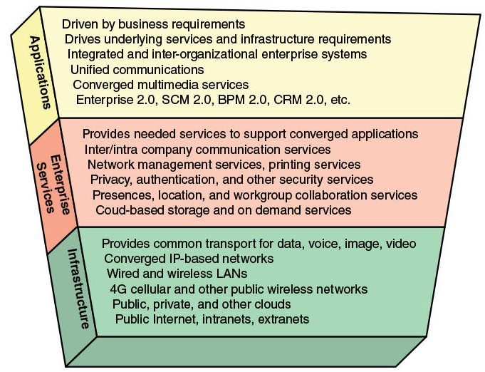
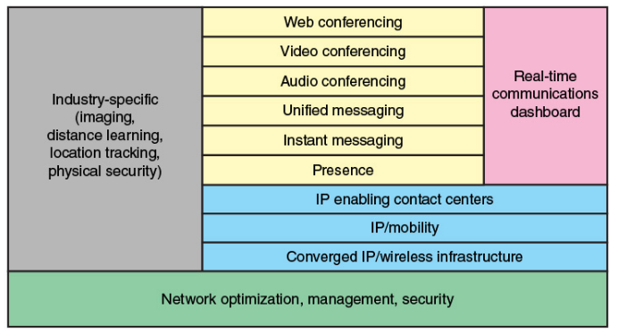

# 第1章 现代网络的组成
## 网络生态系统
现代网络生态系统：

端用户：计算平台上的应用程序、数据和服务的最终消费者  
网络提供商：经过通常是大地理区域传递通信服务的组织。提供、维护并管理网络设施和公共或专用的网络  
应用提供商：生产、销售在用户平台上运行的用户应用程序的实体  
应用服务提供商：在自己的设施中支撑软件应用程序的组织机构，提供了网络易于接入的应用程序，如电子邮件、网络托管、银行业务和基于云的服务  
内容提供商：生成包括教育或娱乐内容的信息，并经过因特网或企业网分发的组织或个人

数据中心网络：由大量互联服务器组成，通常多达80%的数据流量位于数据中心网络之中，仅有20%的数据流量依赖外部网络到达用户  
IoT 或雾网络：由企业网部署的物联网可以由数百、数千甚至数百万设备组成，往返于这些设备的流量是机器到机器而不是用户到机器

## 网络体系结构的例子
全球性网络的体系结构

IP 主干网，核心路由器  
边缘路由器，汇聚路由器

> 多协议标签交换 MPLS
> 由 IETF 研发的一种协议，在广域 IP 网络或其它 WAN 中用于引导分组，MPLS 为每一个分组增加一个 32 位的标签，以改善网络效率，使路由器引导分组沿着符合要求的服务质量的预定路由前行。

典型的网络层次结构

企业通常将其网络设施设计为三个层次：接入、分发和核心。

> 第 3 层 L3 交换机  
> 用于网络路由选择。非常类似路由器，主要差异是用硬件代替某些路由器软件逻辑，以提供更好的性能。

## 以太网
以太网是占主导地位的有线网络技术。

在家庭应用中的扩展：电力线载波 PLC 和以太网供电 PoE。  
电力线调制解调器利用现有的电力线，使用电线作为通信信道在电源信号之上传输以太网分组。  
PoE 使用现有的以太网电缆向网络上的设备供电，简化了设备布线。

以太网的巨大优势是，能够使用相同的以太网协议和相关的服务质量以及安全标准扩展网络，这既包括距离也包括数据率的扩展。

在数据中心，高速以太网光纤链路和交换机提供了位于相同位置的服务器和存储单元所需的网络基础设施。运行在铜制跳线上的背板 backplane 以太网能在很短的距离上提供高达 100Gbps 的速率，对于刀片服务器 blade server 十分理想，因为这些服务器上多个服务器模块都位于同一块背板上。

## Wi-Fi
Wi-Fi 在无线网络中占据支配地位。

在家庭使用环境，WiFi 提供了一个便捷的中心连接设备，大大地简化了转接需要。WiFi 是今天家庭计算机网络的默认方案。  
公共 WiFi、卫星 WiFi 和企业 WiFi 也得到了很大的发展，在企业中大概有一半的流量是经由 WiFi 而不是传统以太网发送的。得益于无所不在的覆盖，企业开始接收并鼓励一种称为“带你自己的设备 BYOD”的需求，员工可以在任何地方使用相同的设备和应用进行工作。  

Wi-Fi 的成功在于互操作性。相关标准保证了 WiFi 使能的设备必须能与 WiFi 接入点通信。

IEEE 802.11ad 是一个工作在 60GHz 频段的 802.11 版本，提供比 5GHz 频段更宽的信道带宽，使得具有相对简单的信道编码和天线特征的高数据速率成为可能，可能作为一种短距离、低功耗无线 LAN 能力出现在市场上。

## 4G/5G 蜂窝网
1G 提供模拟流量信道，被设计为公共交换电话网络的扩展。   
2G 则是纯数字的，并提供了加密、差错检测和纠错功能，并在信道接入上更为灵活。1G 的每个蜂窝支持多个信道，但在任何给定时间，一个信道仅分配给一个用户，而 2G 则允许每个信道动态地由若干用户共享。  
3G 在语音之外还支持多媒体、数据和视频，3G 将信道使用限制为 5MHz，支持的目标速率为 144kbps 和 384kbps。3G 还支持多速率，这一技术支持为一个用户提供多个固定数据速率的逻辑信道，其中不同的数据速率提供给不同的逻辑信道，且每个逻辑信道上的流量能够独立地通过无线和固定网络切换到不同的目的地。  
4G 是基于全 IP 的分组交换网络，对高移动性的接入支持高达 100Mbps 的峰值数据速率，对本地移动接入的低移动性支持高达 1Gbps 数据速率。4G 系统不支持传统的电路交换电话服务，仅提供 IP 电话服务。

## 云计算
云计算的概念可以追溯到 20 世纪 50 年代，但云计算的服务开始应用则是在 21 世纪初。

云计算：指通过因特网提供接入处理能力、存储、软件或其它计算服务的任何系统。

云计算的特征

* 广泛的网络接入：借助网络等机制接入可供使用的能力  
* 快速的弹性：允许根据特定服务需求扩展或减少资源的使用，并且允许按时间申请和释放资源。  
* 可测量的服务：自动地控制和优化资源使用，监控、控制和报告资源的使用，对提供商和使用服务的消费者提供透明性。  
* 按需自助服务：消费者根据需求自动地单方面留出计算能力，不要求人与每个服务器提供商交互。  
* 资源池：提供商的计算资源被池化，使用多租户模式服务多个消费者

云计算能提供规模经济、专业的网络管理和专业的安全管理。个人或公司仅需对他们所需的存储能力和服务付费，无需为如何建立、管理要求的服务的硬件设备、数据备份等工作烦恼。

## 物联网
物联网指的是智能设备的扩展互联（经过因特网的各种各样的传感器、执行器和其它嵌入式系统的扩展）。这些设备无需人类用户就可以全自动地进行交互。  
今天的因特网支持数十亿个工业和个人的物体进行互联。这些物品传递传感信息，并根据它们的环境而行动，甚至在某些需要的情况下修改自己。  
IoT 设备的主要特征是，由内部嵌入式设备驱动，这些设备低带宽、低重复数据复活和低带宽数据使用。通常是间歇的传递数据分组。

商业公司和技术文献通常将物联网分为两个要素，被连接的物体和连接它们的互联网。从更广义的系统角度，我们可以将物联网分为五个层次：

* 传感器和执行器：都是物体。前者关注并报告周围的环境，后者则在环境中行动或进行操作。  
* 连接性：设备通过有线或无线的方式连接到网络中，将数据信息发送给适当的数据中心或控制站点。  
* 容量：物联网必须能够处理潜在的大量数据流以支撑这些设备的功能。  
* 存储：大型存储设施用于存储和维护所有收集到的数据备份。  
* 数据分析：对于收集到的大数据的数据分析能力。

## 网络汇聚
网络汇聚：在一个单一的网络中，电话、视频和数据通信服务的供给。  
我们可以从企业通信 3 层模型的角度来认识这种汇聚。

* 应用汇聚：这是商业的端用户看到的。将通信应用（语音呼叫、电子邮件等）和商业应用（工作组协同、客户关系管理等）集成。  
* 企业服务：管理者根据所用的服务处理信息网络，以保证用户能够顺利利用他们要求的应用。常见的有适当的隐私机制和鉴别服务。  
* 基础设施：通信链路、LAN、WAN 和对企业可用的互联网连接等组成网络和通信的基础设施，今天也更多的开始包括到达数据中心专用或公有的云连接。

下图是一个上述三层结构的图示。简单的来说，汇聚涉及将一个机构的语音、视频和图像流量迁移到单一的网络基础设施上。  
通常涉及将完全分开的语音和数据网络综合成单一的网络基础设施，并进一步扩展以支持移动用户。

汇聚使得网络管理更加简化，提高了效率，并使得应用层更加灵活。  
下面简单列举了 IP 网络汇聚的三个主要好处：

* 节省费用：可观的减少网络管理、维护和运行成本（两位数百分比）。这是因为将传统网络汇聚到单一 IP 网络能够更好地使用现有的资源，实现集中式能力规划、资产管理和策略管理。  
* 有效性：能灵活地向用户提供服务。其中比较重要的一点是，允许公司有更多的移动员工。使用虚拟专用网络 VPN 远程访问公司网络的业务，VPN 将业务流量与其它因特网流量分离以帮助维护企业网的安全性。  
* 转换：汇聚 IP 网能快速适应新功能和特色，无需安装新的基础设施。

汇聚技术也存在的巨大的缺陷：单一网络意味着单一故障。今天的汇聚企业网络基础设施通常包括冗余的组件和备份系统以增加网络恢复力。

## 统一通信
统一通信 UC 关注的是实时通信服务的集成，从而优化业务过程。IP 是构建 UC 系统的基石。  
UC 提供统一的用户接口，以及跨越多个设备与媒体的一致性用户体验。UC 将实时通信服务（即时通信、语音、视频会议等）与非实时服务（话音邮件、电子邮件、传真等），和业务过程应用程序相融合。

下图列出了构成统一通信的要素

