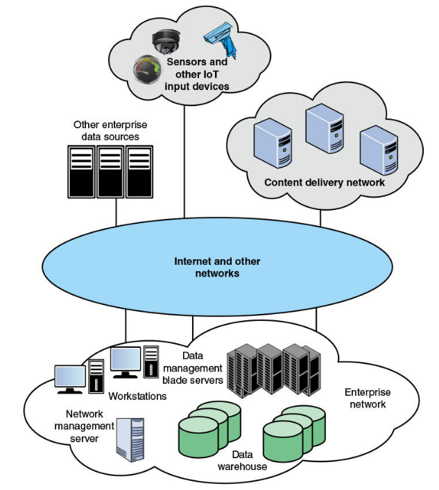
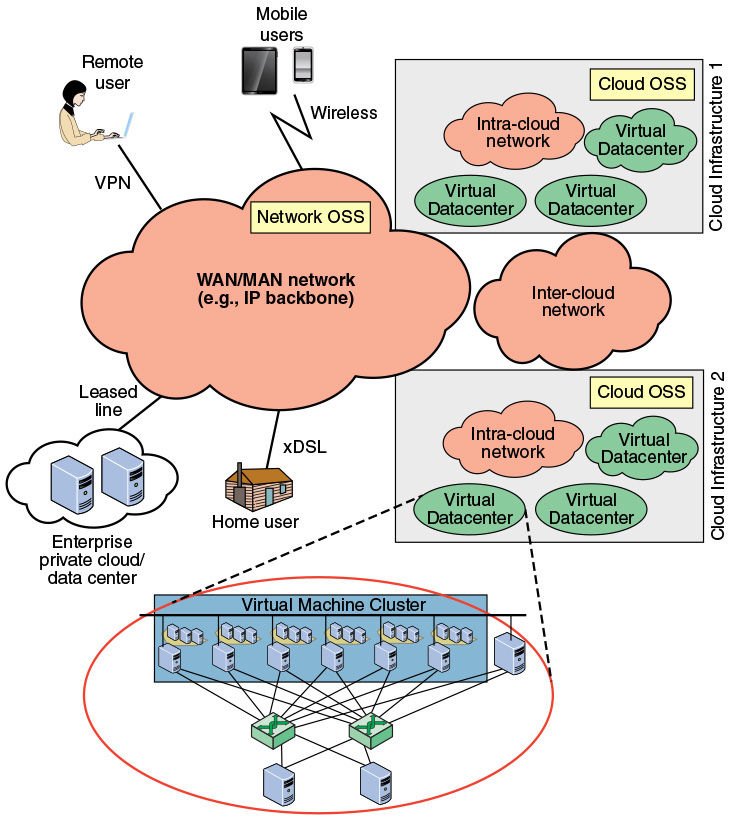

# 第2章 需求和技术

## 网络和互联网流量的类型
可以简单的分为两类：弹性的和非弹性的。  

### 弹性流量
弹性流量：在很宽的范围内调整，以改变跨越互联网的时延和吞吐量，并仍满足应用程序的需求。是基于 TCP/IP 的传统类型流量。常见的应用包括文件传输 FTP、电子邮件 SMTP、远程注册 Telnet 和 Web 等。不同的应用对于时延变化和吞吐量的变化的敏感度不一。  

应用程序并非对单个分组的时延都感兴趣。用户感受到的服务质量 QoS 与传输当前应用单元所经历的总时间相关。  
对于非常小的传输单元，总时间主要由跨越因特网所需的时延决定；而对于较大的传输单元，总时间取决于 TCP 滑动窗口的性能。

### 非弹性流量
非弹性流量：难以适应时延和吞吐量的变化。常见的应用包括音频、视频流等多媒体传输、交互式仿真应用。这些应用通常对最低吞吐量、最低时延及其抖动和丢包率都有要求。

下表简单总结了不同类别的流量的丢包、时延和时延抖动特性。

下表简单总结了不同媒体应用的 QoS 需求例子。

这些需求在排队时延和丢包不断变化的环境中是难以满足的，故非弹性流量对互联网体系结构提出了新的需求。  
其一是，需要以某种方式为有更多需求的应用优先提供服务；其二是，不能排挤弹性流量，保证公平性，避免非弹性流量独占或大量占用服务资源。

### 实时流量特征
实时应用通常关注与时间相关的问题以及丢包。  
在大多数情况下，数据以固定的速率传输；每个数据块与特定时间期限关联，在达到期限后数据失效。

通常我们认为实时流量的分组大小是相等的，且以固定的速率生产出来，然后发送。  
但也存在不满足该特征的该类流量。下图几个例子说明了实时流量在几种情况下的流量特征：

## 需求：大数据、云计算和移动流量
大数据、云计算和移动这三个领域会给网络资源和管理带来很大的压力。  
这些领域都建议采用软件定义网络 SDN 和网络功能虚拟化 NFV 等工具来更为有效地对网络进行运维和管理。

### 大数据
创建、控制和管理非常大的数据集的所有相关事务。  
分布式数据中心、数据仓库以及云存储。

下图是一个简单的示例

大数据主要关注以下几个领域：网络容量、时延、存储容量、处理能力和安全的数据访问（敏感信息源，需要授权访问）。

### 云计算
云服务提供商维护一个或多个本地或区域的云基础设施，由网络将基础设施的各个部分连接起来（数据库服务器、存储阵列、防火墙、负载均衡等）。  
云内部网络可能还包括由 IP 路由器组成的众多局域网。  
在基础设施内部，数据库服务器构成了虚拟机，以为不同用户提供虚拟化的、相互隔离的计算环境。

下图是一个简单的云网络模型

云对网络功能的关注要求：可扩展性（给寻址、路由、拥塞控制带来巨大挑战）、性能（云内部网络的高速直通点对点信道，而目前广泛采用的数据中心三层拓扑——接入层、汇聚层和核心层——不能很好的满足这些要求，需要更灵活和动态的数据流控制方法以及网络功能的虚拟化）、敏捷性和灵活性（对云资源高度动态的特征进行响应和管理，虚拟机迁移，对数据中心里数据路由实施细粒度的控制）  
需要明确的是，SDN 和 NFV 结合能够很好地满足这些需求。

### 移动流量
多种无线网络接入模式：Wi-Fi，蓝牙，3G，4G。  
无线通信的关注点已经从语音转向数据。  
在企业网中，尽管移动流量是几类企业网流量（移动数据流量、托管的 IP 流量、因特网流量）中最少的，但其增长速度远高于其他两类。  
企业网需要足够灵活以承担快速增长的移动数据负载（动态改变物理接入点，流量类型由大量弹性和非弹性流量组成）。  
后面我们将会看到，SDN 和 NFV 将能比较好地处理这一类具有高动态性地负载。

## 需求：QoS 和 QoE
服务质量 quality of service QoS 和体验质量 quality of experience QoE。这两个度量能定量评价企业所希望达到的网络性能。

服务质量 QoS：定义为某个网络服务可测量的端到端性能。常见的度量有：最小/平均吞吐量、最小/平均时延、时延抖动、误码率、丢包率、优先级、可用性、安全性。  
体验质量 QoE：依赖用户的个人体验，是由用户上报的主观性能测量。是传统 QoS 度量的扩展，提供了从端用户角度服务的有关信息。包括感知上的（视频的清晰度、亮度、失真等）、心理上的（使用的难易度、兴奋度等）和交互方面的（响应性、交互是否自然）等。

提供 QoE 保证的最大困难在于如何设计一个有效的方法将 QoE 特性转化为可定量化的特性。  
QoS 目前可以很容易地在网络层和应用层、端系统和网络端进行测量。而 QoE 目前还难以进行管理。

## 路由选择和拥塞控制
常见拥塞控制技术：  

* 反向压力：从发生拥塞的节点开始，反向地向发送源方向上地每一跳进行流量限制。特定链路上的流量反向压力由数据链路层协议的流控制机制自动激活。也允许对特定逻辑链路进行限制（即从某一结点到另一节点的链路上只有某些连接的流量会受到限制）。  
* 阻塞分组：由发生阻塞的节点产生的控制分组（报文），发送给源节点来限制流量。通常在发生缓存溢出从而不得不进行丢包时发送阻塞分组，但一些系统也被设计为当缓存接近能力上限时提前发送阻塞分组。  
* 隐式拥塞信号：时延显著增加或者出现丢包是网络出现拥塞的间接证明。  
* 显示拥塞信号：网络在拥塞程度不断增加时向端系统提出警告，而端系统采取一定的措施来降低施加到网络的负载。信号可以向前向和后向两个方向发送。常见的信号类型有标识是否拥塞的二元信号、基于信用的信号（信用值用于表示源可以发送多少字节或分组，当信用值用完时，源必须等待新的信用值才能继续发送数据）和基于速率的信号。

## SDN 和 NFV
软件定义网络 SDN，网路功能虚拟化 NFV

与路由器转发分组相关的功能被分为控制功能和数据功能两个部分。  
其中控制功能负责决定数据流的路由、各流的相对优先级；数据功能负责根据控制功能的决策来转发数据。  
传统的网络通过路由和网络控制协议来实施控制，这需要在每个网络节点中实现相关功能。这种方式并不灵活，比如要求所有的网络节点都必须使用相同的协议。  
而在 SDN 中，中央控制器负责完成所有的复杂功能（路由、命名、策略声明和安全性检查）。

服务器虚拟化的日益普及是驱动 SDN 的一个重要因素。  
服务器虚拟化本质上隐蔽了服务器资源，但给传统网络体系结构带来了很多问题。  
比如配置虚拟局域网 VLAN，虚拟机迁移后管理员需要对 VLAN 进行重配置，而动态增加、取消和改变网络资源结构在传统网络交换机上难以实现。  
另一个不同是流量模式与传统的客户机/服务器模式的不同，再加上移动设备日益广泛的使用，对网络资源的快速响应和分配提出了更高的要求。

网络功能虚拟化：将路由、防火墙、入侵检测、网络地址转换等功能从专用硬件平台分离出来，并在软件上实现了相关功能。

NFV 和 SDN 有许多共有的特征：

* 将功能迁移到软件中实现  
* 使用商用硬件平台代替专有平台  
* 使用标准化或开放的应用程序编程接口 API  
* 支持更高效的网络功能演化、部署和位置调整
