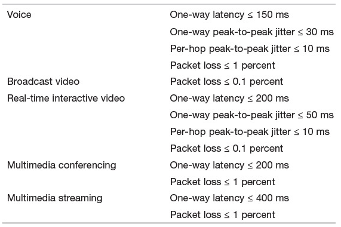

# 第2章 需求和技术

## 网络和互联网流量的类型
可以简单的分为两类：弹性的和非弹性的。  

### 弹性流量
弹性流量：在很宽的范围内调整，以改变跨越互联网的时延和吞吐量，并仍满足应用程序的需求。是基于 TCP/IP 的传统类型流量。常见的应用包括文件传输 FTP、电子邮件 SMTP、远程注册 Telnet 和 Web 等。不同的应用对于时延变化和吞吐量的变化的敏感度不一。  

应用程序并非对单个分组的时延都感兴趣。用户感受到的服务质量 QoS 与传输当前应用单元所经历的总时间相关。  
对于非常小的传输单元，总时间主要由跨越因特网所需的时延决定；而对于较大的传输单元，总时间取决于 TCP 滑动窗口的性能。

### 非弹性流量
非弹性流量：难以适应时延和吞吐量的变化。常见的应用包括音频、视频流等多媒体传输、交互式仿真应用。这些应用通常对最低吞吐量、最低时延及其抖动和丢包率都有要求。

下表简单总结了不同类别的流量的丢包、时延和时延抖动特性。

下表简单总结了不同媒体应用的 QoS 需求例子。

这些需求在排队时延和丢包不断变化的环境中是难以满足的，故非弹性流量对互联网体系结构提出了新的需求。  
其一是，需要以某种方式为有更多需求的应用优先提供服务；其二是，不能排挤弹性流量，保证公平性，避免非弹性流量独占或大量占用服务资源。

### 实时流量特征
实时应用通常关注与时间相关的问题以及丢包。  
在大多数情况下，数据以固定的速率传输；每个数据块与特定时间期限关联，在达到期限后数据失效。

通常我们认为实时流量的分组大小是相等的，且以固定的速率生产出来，然后发送。  
但也存在不满足该特征的该类流量。下图几个例子说明了实时流量在几种情况下的流量特征：

## 需求：大数据、云计算和移动流量
