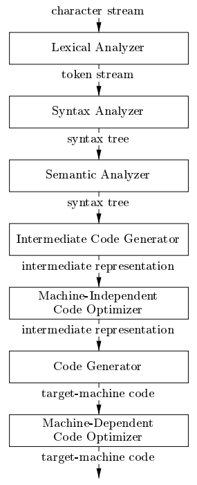
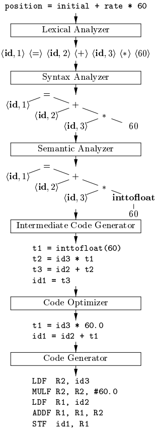

# 第1章 引论

## 语言处理器
编译器阅读某一种语言编写的程序，并把该程序翻译为一个等价的、用另一种语言编写的程序。  
解释器是另一种语言处理器，直接利用用户提供的源程序进行操作，而不需要通过翻译的方式生成目标程序。

> Java 语言处理器结合了编译和解释的过程，Java 源代码先被翻译为字节码这一中间表示形式，然后由一个虚拟机对字节码加以解释执行。  
> 一些即时 JIT 编译器在运行时的前一刻将字节码翻译为机器语言，然后再执行程序。

源程序可能被分为若干个模块，使用**预处理器**将源程序聚合起来，预处理器还负责宏转换。链接器解决可重定位、库文件带来的外部内存地址问题，而加载器在最后把所有的可执行目标文件放到内存中执行。

## 编译器的结构
编译器这一映射过程分为两个部分：分析部分和综合部分。这两者也被称为前端和后端。

分析：将源程序分解为多个组成要素，并在之上加上语法结构，使用这些结构创建一个中间表示。分析部分还负责检查源代码是否按照正确的语法构成，并在错误时提供信息以便用户更正。另外，分析部分也负责生成符号表。符号表和中间表示被发送给综合部分。  
综合：使用中间表示和符号表构造用户期待的目标程序。

有一些编译器在前端和后端之间存在一个与机器无关的优化步骤，这一步骤在中间表示上进行转换，使得后端能生成更好的目标程序。

一个典型的编译器步骤如下图所示

词法分析读入源程序字节流，组织成有意义的词素序列，并对每个词素产生一个词法单元作为输出：`<token-name, attribute-value>`  
随后是语法分析，使用词法单元，其中`token-name` 是由该步骤使用的抽象符号，而`attribute-value`则指向符号表中关于这个词法单元的条目。这一步骤使用词法单元的第一个分量来创建树形的中间表示。常见的表示方式是语法树，书中的每个内部节点表示一个运算，其余节点表示分量。  
语义分析使用语法树和符号表中的信息检查源程序是否和语言定义的语义一致，并收集类型信息放到这两个结构中。这其中包含的重要部分有类型检查和自动类型转换等。  
接下来，很多的编译器生成一种明确的低级的类机器语言的中间形式，可以看作是某个抽象机器的程序。它易于生成，且能够被轻松地翻译为目标机器上的语言。在之后我们将考虑一种称为三地址代码的中间表示形式，类似汇编代码，每个指令具有三个运算分量，每个运算分量像是一个寄存器。  
代码优化试图改进中间代码以生成更好的目标代码，这里的更好可以是更快、更短或能耗更低等不同的需求。  
最后是代码生成，将中间表示映射到目标语言。比如对于机器代码，需要为程序使用的每个变量选择寄存器或内存位置。

一个编译步骤的例子如下：

在实际的编译器中，多个步骤可能可以组合成一趟 pass，每趟读入一个输入文件并产生一个输出文件。

## 编译技术的应用

高级程序语言：聚合类型，高级控制流；面向对象；类型安全检查；动态编译技术  
体系结构：并行性，内存层次结构

## 程序设计语言基础
