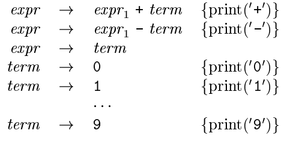

# 第2章 一个简单的语法制导翻译器
本章的重点是编译器的前端，即词法分析、语法分析和中间代码生成。

## 语法定义

### 文法定义
上下文无关文法。包含以下四个元素：

1. **终结符号**集合，也称为词法单元，是该文法所定义的语言的基本符号的集合  
2. **非终结符号**集合，也称为语法变量，每一个非终结符号表示一个终结符号串的集合  
3. **产生式**集合，其中每个产生式包含一个称为产生式头或左部的非终结符号，一个箭头，和一个称为产生式体或右部的由终结符号及非终结符号组成的序列。  
4. 指定一个非终结符号为开始符号

例子，`if-else` 语句通常的形式为：`if (expression) statement else statement`。如果我们用变量 `expr` 表示表达式，用变量 `stmt` 表示语句，那么这个构造规则可以表示为 `stmt -> if ( expr ) stmt else stmt`。这就是产生式，`if` 和括号这类的词法单元称为终结符号 terminal，`expr` 和 `stmt` 这样的变量表示终结符号的序列，称为非终结符号 nonterminal。

描述文法：列出该文法的产生式，并且首先列出开始符号对应的产生式。下面的例子描述了由数位和 `+,-` 符号组成的表达式，称为由 `+,-` 号分割的数位序列。

```plain
list -> list + digit
list -> list - digit
list -> digit
digit -> 0 |1 |2 |3 |4 |5 |6 |7 |8 |9
```

前三行也可以等价地组合为 `list -> list + digit | list - digit | digit`。由于 `list` 的产生式最先被列出，所以 `list` 是此文法的开始符号。  
如果某个非终结符号串是某个产生式的头部，则称该产生式是该非终结符号的产生式。  
一个终结符号串是由零个或多个终结符号组成的序列，零个终结符号组成的串称为空串，记作 $\epsilon$ 。

### 推导
从开始符号出发，不断将某个非终结符号替换为该非终结符号的某个产生式的体。  
可以从开始符号推导得到的所有终结符号串的集合称为该文法定义的语言。

语法分析的任务：接受一个终结符号串作为输入，找出从文法的开始符号推导出这个串的方法。若不能找出，则报告该终结符号串中包含的语法错误。

语法分析树：从文法的开始符号推导出相应语言中的符号串的过程，具有以下几个性质：  

1. 根节点的标号为文法的开始符号  
2. 每个叶子节点的标号为一个终结符号或 $\epsilon$  
3. 每个内部节点的标号为一个非终结符号  
4. 设 A 为任意内部节点，X1..Xn 为其从左到右的子节点，则必然存在产生式 `A -> X1X2...Xn`，其中 Xi 既可以是终结符号也可以是非终结符号。

下面是一个语法分析树的例子


语法分析树的叶子节点从左到右构成了树的结果。

### 二义性
一个文法可能有多棵语法分析树能够生成同一个给定的终结符号串，这称为具有二义性。

### 运算符的结合性
使用一些规则来确定，当一个运算分量两边都存在运算符时，哪个运算符被应用于该运算分量。  
比如运算符 `+` 是左结合的，因为当一个运算分量左右两侧都有 `+` 时，它属于左边的运算符。加减乘除在大多数程序语言中都是左结合的。相应的，指数运算、C 语言中的赋值运算符 = 则是右结合的。

### 运算符的优先级
不同的运算符需要设定优先级来解决二义性。下面是一个关于加减乘除的例子。注意到这四个运算符都是左结合的，并且乘除比加减具有更高的优先级  
创建两个非终结符号 `expr` 和 `term` 来分别对应两个优先级层次，非终结符号 `factor` 则表示表达式中的基本单元，得到的文法为

```plain
expr -> expr + term | expr - term | term
term -> term * factor | term / factor | factor
factor -> digit | (expr)
```

将上述表达式文法推广，对于 n 层优先级的情况，我们需要 n+1 个非终结符号。

## 语法制导翻译
通过向一个文法的产生式附加一些规则或程序片段得到语法制导翻译。

将属性和文法的非终结符号及终结符号相关联，然后给文法的各个产生式附加上语义规则。  
对于语法分析树上的某个节点，如果它和它的子节点符合某个产生式，那么该产生式对应的规则就描述了如何计算这个节点上的属性。

### （简单）语法制导定义
语法制导定义把每个文法符号和一个属性集合相关联，并且把每个产生式和一组语义规则相关联，这些规则用于计算与该产生式中符号相关联的属性值。  
在语法分析树上，若对每个节点标记了相应的属性值，则称为注释语法分析树。下面是一个例子。


如果某个节点上的属性的值是由其子节点及自己的属性值确定的，则这个属性称为综合属性。只需要对语法分析树进行一次自底向上的遍历就可以计算出综合属性。后面我们还会介绍继承属性。

下面是将由 `+,-` 分割的数位序列从中缀表示到后缀表示的翻译的语法制导定义


这种只需要将产生式体中各非终结符号的翻译结果按照它们在非终结符号中出现的顺序连接起来，并穿插一些附加的串来得到代表产生式头部的非终结符号的翻译结果的字符串，这样的语法制导定义也称为简单语法制导定义。

### 翻译方案
语法制导翻译方案在文法产生式中附加一些程序片段来描述翻译结果。  
被嵌入到产生式体中的程序片段称为语义动作，使用花括号括起来，并写入产生式的体中。如 `rest -> + term {print('+')} rest1`。对应的语法分析树如下，注意到为语义动作构造了一个额外的子节点，并使用虚线将它与该产生式头部对应的节点相连。


下图则是把 9 - 5 + 2 翻译为 9 5 - 2 + 的语义动作


下图是把表达式翻译成后缀形式的语义动作



## 语法分析
语法分析决定如何使用一个文法生成一个终结符号串。

大多数语法分析方法可以归入自顶向下和自底向上两类，其意指语法分析树节点的构造顺序。

### 自顶向下分析方法
自顶向下方法反复地执行以下两个步骤：

1. 在标号为非终结符号 A 的节点 N 上，选择一个 A 的产生式，并为该产生式体中的各个符号构造出 N 的子节点  
2. 寻找下一个节点来构造子树，通常是语法分析树最左侧尚未扩展的非终结符。

下图是一个从左到右扫描的示例


一般而言，为一个非终结符号选择产生式是一个尝试并犯错的过程，先选择的产生式可能在之后发现并不合适，此时就需要回溯进行另外的尝试。但在下面的预测分析法中并不需要。

### 预测分析法
在预测分析法中，各个非终结符号对应的过程中的控制流可以由前向看符号无二义地确定。

下图是一个预测分析器的伪代码


定义 `FIRST(a)` 为可以由 a 生成的一个或多个终结符号串的第一个符号的集合。预测分析法要求，对于两个产生式 `A->a` 和 `A->b`，当不考虑空$\epsilon$ 时，`FIRST(a)` 和 `FIRST(b)` 不相交，那么就可以用向前看符号确定应该使用哪个产生式。

通过预测分析器也可以构造语法制导的翻译器。

### 左递归
形如 `expr -> expr + term` 这样的产生式可能进入无限循环。  
通过改写有问题的产生式可以消除左递归。  
以 `A->Aa | b` 为例，这个产生式中包含左递归。引入一个新的非终结符号 R，将该产生式改写为 `A -> bR` 和 `R -> aR | \epsilon` 就可以消除左递归。  
消除左递归必须确保消除后的结果保持语义动作的顺序。

## 简单表达式的翻译器
首先需要将原本的翻译动作改成不包含左递归的，最终的翻译方案如下


注意到引入了一个新的非终结符号 rest 用于消除左递归。

然后是语法制导翻译方案的伪代码，注意到其中的顺序，特别是 `match` 会改变 `lookahead` 的值，在 `term` 函数中，我们得先保存 `lookahead` 的值以便于输出，一个可能的解决办法是在调用 `match` 前先调用 `print` 打印输出，但改变语义动作和文法符号之间的顺序是有风险的，我们在进行这类优化时必须谨慎。


然后是翻译器的简化，由两个部分可以简化。首先是，过程 `rest` 可以展开到过程 `expr` 中，这样可以减少使用的过程数目；其二是，注意到 `rest` 的 `if` 在处理 `+,-` 两个符号时是尾递归的，可以替换为一个简单的循环，减少递归调用带来的开销。

## 词法分析
词法分析器从输入中读取字符，并将它们组成词法单元对象。词法单元对象包含用于语法分析的终结符号，还包含以属性值出现的附加信息。  
词法分析器使得语法分析器不需要考虑词法单元的词素表达方式，词素是构成词法单元的输入字符序列。

作为扩展，本节中的词法分析器允许在表达式中出现数字、标识符和空白字符（空格、制表符和换行符），扩展后的编译方案如下，其中符号 num 具有属性 `num.value`，对应 num 的整数值，终结符号 `id` 具有字符串类型的属性 `id.lexeme`，假设这个字符串就是这个 `id` 实例的实际词素：


### 剔除空白和注释
尽管可以修改文法使得语法中包含空白，但更方便的方法是由词法分析器来消除程序中的空白和注释。下面是一个简单的例子：


### 预读
词法分析器可能需要预先读入一些字符来决定向语法分析器返回哪个词法单元。一个常见的例子是，在读到 `>` 时必须读取下一个字符以判断是 `>=, >`。  
一个常见的做法是使用缓冲区。缓冲区对效率的提升也是有意义的。  
通常只需要预读一个字符，且只在必要时才进行预读。

### 常量
创建一个代表整型常量的终结符号 `num` 或者将整数常量的语法加入到文法中，使得表达式中可以出现整数常量。  
词法分析器通常负责将字符组成整数并计算它的数值。当在输入流中出现数位序列时，词法分析器将向语法分析器传送一个词法单元，包含终结符号 num 以及根据数位得到的整数值作为属性。下面是一个使用十进制的简单例子：


### 识别关键字和标识符
这里处理的包括程序语言预先占用的作为标点符号的固定字符串，以及为变量、数组、函数等命名的标识符。  
为了简化语法分析器，通常把标识符当作终结符号来处理。  
通常将关键字作为保留字，以便于区分字符串何时组成关键字何时组成标识符。

## 符号表
信息在编译器的分析阶段被逐步收集并放入符号表，在综合阶段用于生成目标代码。  
符号表中的每一个条目包含一个与标识符相关的信息，比如字符串（词素）、类型、存储位置等。  
符号表通常需要支持同一标识符在一个程序中的多重声明。为每个作用域（程序块）建立一个单独的符号表可以实现作用域。

一般而言，词法分析器仅向语法分析器返回一个词法单元，由语法分析器决定是使用之前已经创建的符号表条目，还是创建一个新的条目。

块的符号表实现可以利用作用域的最近嵌套规则，嵌套结构确保可应用的符号表形成一个栈。一些编译器维护一个散列表来存放符号表条目，同时维护一个辅助的栈来跟踪对散列表进行的修改。

符号表的作用是将信息从声明的地方传递到实际使用的地方。

## 生成中间代码
两种重要的中间表示形式：树型结构（语法分析树，抽象语法树），线性表示形式（三地址代码）

下表是一个简单的翻译方案，为表达式和语句构造抽象语法树


抽象语法允许将相似的运算符分为一组，分组的要求是根据编译器后期处理的需求来确定的。

静态检查是编译过程中的各种一致性检查，以确保程序被顺利地编译，而且在程序运行之前发现编程错误。包括语法检查（比文法中的要求更多，比如同一个标识符在一个作用域内只能声明一次，`break` 语句必须在循环或 `switch` 语句内），类型检查（保证运算符或函数被应用到类型和数量都正确的运算分量上，必要时插入类型转换）

### 三地址吗

三地址代码是形如 `x = y op z` 这样的指令组成的序列，其中 `x, y, z` 可以是名字、常量或由编译器生成的临时量，`op` 表示运算符。  
数组由变体 `x[y] = z` 和 `x = y[z]` 表示。  
使用 `ifFalse x goto L, ifTrue x goto L, goto L`三类指令来控制程序流，其中 L 为标号，可以附着到任意一条指令上，同一指令可以拥有多个标号。  
拷贝指令 `x = y`。
