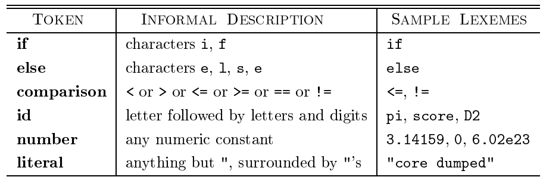
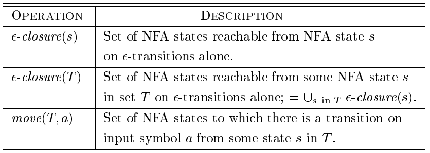

# 第3章 词法分析

## 词法分析器的作用
词法分析是编译的第一步，其主要任务是读入源程序的输入字符，组成词素，生成并输出一个词法单元序列，其中每个词法单元对应一个词素。  
词法分析器还负责与符号表交互，将标识符词素添加到符号表中，或者根据符号表中标识符种类的信息确定向语法分析器传送哪个词法单元。  
下图是一个简单的交互流程示意图

除了识别词素，词法分析器还负责过滤注释和空白、将编译器生成的错误信息与源程序的位置联系起来、宏的扩展等。

### 词法单元、模式和词素

* 词法单元：由词法单元名和可选的属性值组成。  
* 模式：描述了一个词法单元的词素可能具有的形式。  
* 词素：源程序的字符序列，与某个词法单元的模式匹配，并被词法分析器识别为该词法单元的一个实例。  

下表给出了一些常见词法单元的例子

### 词法单元的属性
词法分析器向语法分析器返回词法单元的名字，以及描述该词法单元的词素的属性值。其中，名字影响语法分析过程中的决定，而属性影响翻译。  
例如对于标识符，我们需要记录词素、类型、第一次出现的位置等信息，这些信息都保存在符号表中，故标识符的属性值可能是一个指向符号表中该标识符对应条目的指针。

### 词法错误
如果没有其它组件的帮助，词法分析器很难发现源代码中的错误。

当所有的词法单元模式都无法和剩余输入的某个前缀匹配时，词法分析器不能继续处理输入，需要一些错误恢复策略。  
最简单的策略是“恐慌模式”恢复，从剩余的输入中不断删除字符，直到词法分析器唔够在剩余输入的开头发现一个正确的词法单元。这一技术可能会给语法分析器带来混乱，但在交互计算环境中已经足够了。另外也有删除、插入、交换、替换字符的方法来尝试进行错误修复。

## 输入缓冲
### 缓冲区对
利用两个交替读入的缓冲区来减少用于处理单个输入字符的时间开销。  
通常而言，每个缓冲区的容量是 N 个字符，N 是磁盘块的大小。系统一次性将 N 个字符读取到缓冲区中，若不足 N 个则使用特殊字符 EOF 标记文件结束。  
维护两个指针：指针 `lexemeBegin` 指向当前词素的开始处，即我们当前正在确定的词素；指针 `forward` 一直向前扫描，直到匹配某个模式。   
在移动 `forward` 指针时，需要检查是否超出了当前缓冲区，如果是则需要更新缓冲区读入新的字符序列。N 的长度需要保证，在识别到词素之前，缓冲区中的数据不会被覆盖。

### 哨兵标记
在上一节的方法中，我们每次移动 `forward` 指针涉及两次判断，一次是判断是否到达缓冲区末尾，一个是确定读入的字符是什么。  
引入一个特殊字符，放到扩展缓冲区的末尾，作为哨兵标记，就可以将两个测试合二为一。

## 词法单元的规约
### 正则表达式
首先给出语言上的一些运算符定义  

一个语言 L 的 Kleene 闭包记作 $L^*$，即将 L 连接 0 次或多次后得到的串集；定义正闭包 $L^+$ 为 Kleene 闭包不包括 $L^0$ 。注意到 $\epsilon \in L^*$，而除非 $\epsilon \in L$ 否则 $\epsilon \notin L^+$。

正则表达式可以由较小的正则表达式按照一定的规则递归地构建。每个正则表达式 r 表示一个语言 L(r)。给定一个字母表 $\Sigma$，下面给出了定义在其上的正则表达式及其语言的规则

* 归纳基础：$\epsilon$ 是一个正则表达式，且 $L(\epsilon) = \{\epsilon\}$，即该语言仅包含空串；如果 $\alpha$ 是 $\Sigma$ 上的一个符号，那么 $\mathbf a$ 是一个正则表达式，并且 $L(\mathbf a) = \{\alpha\}$  
* 归纳步骤：假定 r,s 都是正则表达式，分别表示语言 L(r) 和 L(s)，那么有如下几种归纳步骤：$(r)|(s), (r)(s), (r)^*, (r)$ 均是正则表达式，且分别表示语言 $L(r)\cup L(s), L(r)L(s), (L(r))^*,L(r)$。

注意到上述表述中可能包含不必要的括号，采用如下的约定去掉一些括号

1. 一元运算符 $*$ 具有最高的优先级，并且是左结合的。  
2. 连接运算优先级次高，并且是左结合的。  
3. $|$ 的优先级最低，并且是左结合的。

可以用正则表达式定义的语言叫做正则集合。  
若两个正则表达式 r 和 s 表示相同的语言，则称 r 和 s 等价，记作 r = s。  
正则表达式遵循一下一些代数定律，每个定律都断言两个具有不同形式的表达式等价

### 正则表达式的扩展
下面介绍一些被广泛使用的正则表达式的扩展语法

1. 一个或多个实例：类似 $*$ ，单目后缀运算符 $+$ 表示一个正则表达式及其语言的正闭包。  
2. 零个或一个实例：单目后缀运算符 $?$ 表示零个或一个出现，即 $r?$ 等价于 $r | \epsilon$，与运算符 $+$ 和 $*$ 具有相同的优先级和结合性。  
3. 字符类：正则表达式 $a_1 | a_2 | \dots | a _ n$ 可以缩写为 $[a_1a_2\dots a_n]$。进一步的，对于连续的字母、数字可以用第一个和最后一个符号来表示，如 $[a_1-a_n]$。

## 词法单元的识别
这一节中解决根据需要识别的词法单元的模式构造代码的问题。下面是在该节中使用的一个分支语句和条件表达式的简单例子。其文法为

词法单元模式为

为了简单起见，关键字作为保留字使用，不能作为标识符。  
另外还引入了一个负责消除空白符的词法单元 $ws \rightarrow (blank | tab | newline)^+$，这一单元不会被返回给语法分析器，而是对这之后的字符进行词法分析。

下表总结了词法分析器的目标。该表总结了，对于词素或词素的集合，应该返回给语法分析器哪个词法单元，以及属性值。

### 状态转换图
一下是状态转换图的一个示例，表示的是上述例子中与 `relop` 词法单元匹配的词素的状态转换图。

值得指出的有以下几点：

1. 某些状态被称为接受状态或最终状态，表示已经找到了一个词素。使用双层的圈来表示，并把附加的动作写在后面。  
2. 有些时候，相应的词素并不包含哪个在最后一步使我们到达接受状态的符号，此时需要将 `forward` 回退一个位置。在这样的接受位置的附近加上一个 $*$ 来表示，如果需要回退多步则加上对应个数的 $*$。  
3. 存在一个特殊的状态，被称为开始状态、初始状态。在读入输入符号之前，状态图总是位于开始状态。

正如前面的章节所述，有两种方法来处理保留字和标识符的区别识别。其一是，使用相同的状态转换图，但是提前在符号表中填入保留字，由符号表中的条目知名这些串是否是保留字并指出其代表的词法单元。其二是，为每一个关键字建立单独的状态转换图，若使用这种方法需要注意最后检测后面是非字母或数字，即避免保留字是标识符的前缀的情况，还需要设定词法单元之间的优先级。

合并不同词素的状态转换图可以很好的完成任务，然后我们在其中取最长的和某个模式匹配的词素。但是，由于可能存在相同的开头，使得合并几个词法单元的状态转换图的问题会更加复杂。

## 有穷自动机
有穷自动机本质上与状态转换图类似，但有几点不同：  
首先是，有穷自动机是识别器，对每个可能的输入串简单地回答是或否。  
其次，有穷自动机分为两类：不确定的有穷自动机 NFA 对边上的标号没有限制，可以有多条也可以是空串；确定的有穷自动机 DFA 对每个状态和自动机输入字母表中的每个符号有且只有一条离开该状态、以该符号为标号的边。  
值得指出的是，两类自动机能识别的语言集合是相同的，且正好是能够用正则表达式描述的语言的集合。

可以使用与状态转换图类似的图来描述 NFA 或 DFA，但有两点不同：其一是，该图的同一个符号可以标记从同一状态出发的到达多个不同目标的多条边；其二是，一条边的符号可以是空符号串 $\epsilon$

下图是一个能够识别 `(a|b)*abb` 正则表达式的 NFA 转换图。

如果一个有穷自动机中没有对输入 $\epsilon$ 上的转换动作，并且对于每个状态 s 和输入符号 a 有且只有一条标号为 a 离开的边，那么就称为确定的有穷自动机 DFA。  
NFA 抽象表示用来识别某个语言中串的算法，DFA 是更加简单具体的表达。  
在构造词法分析器时，我们实际上使用的是 DFA。每个 NFA 都可以转化为等价的 DFA 。

## 从正则表达式到自动机

### 从 NFA 到 DFA 的转换
子集构造法：基本思想是让构造得到的 DFA 的每个状态对应于 NFA 的一个状态集合，即在读入输入 $a_1a_2\dots a_n$ 后 DFA 到达的状态对应于相应的 NFA 从开始状态出发沿着相同符号的路径到达的状态的集合。  
在有些情况下，DFA 的状态数有可能是 NFA 状态数的指数倍。但基于自动机的词法分析的处理方法，对于一个真实的语言，它的 DFA 和 NFA 的状态数量大致相同。

算法思路是输入一个 NFA N 输出一个接受相同语言的 DFA D，具体来说是构造出 D 的转换表 Dtran。 D 的每个状态是一个 NFA 状态集合。  
下图定义了一些函数，描述了在 N 的状态集上的一些基本操作。其中前两个与对 $\epsilon$ 的处理有关。

按照上述的说明，假设开始状态为 $s_0$，在读入第一个字符前，N 位于集合 $\epsilon-closure(s_0)$ 中的任意状态上。  
根据归纳法，假设现在读入了字符串 x，并处于集合 T 的状态上，下一个输入符号为 $a$，那么下一个状态集合应该是 $\epsilon-closure(move(T,a))$。  
下图是伪代码

D 的开始状态是 $\epsilon-closure(s_0)$，而 D 的接受状态为所有至少包含了一个 N 的一个接受状态的状态集合。

下面是对于 NFA 的任意状态集合 T 计算 $\epsilon-closure(T)$ 的伪代码，其核心思想为从状态集合 T 开始进行的图搜索，不过仅扫描标号为 $\epsilon$ 的边。

### NFA 的模拟
在许多情况，先根据正则表达式构造出相应的 NFA，然后用类似 on-the-fly 边构造边使用的子集构造法来模拟 NFA 的执行。  
一个模拟的伪代码如下，其中输入为以文件结束符 eof 结尾的字符串，NFA N 的开始状态为 $s_0$，接受状态集为 F，转换函数为 move：

这一模拟算法的时间复杂度与输入串的长度和转换图的大小（节点数加上边数）的乘积成正比。

使用模拟 NFA 的方式而不直接构造 DFA 是有意义的，因为在最坏的情况下，DFA 的状态个数可能会呈指数增长。此时就不得不采用模拟 NFA 的方式。

### 从正则表达式构造 NFA
这一算法（McMaughton-Yamada-Thompson算法）是语法制导的，即沿着正则表达式的语法分析树自底向上递归地进行处理。  
对于每个表达式，该算法构造一个只有一个接受状态的 NFA。记需要处理的正则表达式为 r，输出的 NFA 为 N，字母表为 $\Sigma$

首先对 r 进行语法分析，分解出组成它的子表达式。算法分为基本规则和归纳规则两个部分，前者处理不包含运算符的子表达式，后者则根据其直接子表达式的 NFA 递归地构建 NFA。

基本规则：对于表达式 $\epsilon$ 构造如下的 NFA，其中 i,f 都是新状态，且分别为开始和接受状态。对于字母表 $\Sigma$ 中的子表达式 a，的构造规则也是是类似的。

归纳假设：假设正则表达式 s 和 t 的 NFA 分别为 N(s) 和 N(t)，合成的正则表达式为 r，那么：  
对于 $r = s | t$，新建 i 和 f ，将 N(s) 和 N(t) 以类似并联的方式连接起来，新的 i 指向 N(s) 和 N(t) 的 i，同时 N(s) 和 N(t) 的 f 指向新的 f ；对于 $r = st$，将 N(s) 和 N(t) 以类似串联的方式连接起来，将 N(s) 的 f 与 N(t) 的 i 合并起来，并将 N(s) 的 i 作为新的 NFA 的 i， N(t) 的 f 作为新的 f；对于 $r = s^*$，新建 i 和 f，然后将 N(s) 包裹在其中，并增加几个 $\epsilon$ 的边表示循环；对于 $r=(s)$，那么直接有 $L(r)=L(s)$，可以直接把 N(s) 当作 N(r)。前三种情况的图示如下

由上述算法构造的 NFA 有一些性质：  

1. N(r) 的状态数最多为 r 中出现的运算符和运算分量总数的 2 倍，因为该算法构造的每一步最多引入两个新状态。  
2. N(r) 中有且只有一个开始状态和一个接受状态，前者没有入边，后者没有出边。  
3. N(r) 中除接受状态以外，每个状态要么有一条其标号为 $\Sigma$ 中符号的出边，要么有两条标号为 $\epsilon$ 的出边。

计算从正则表达式 r 构造 NFA 的时间代价的关键在于建立 r 的语法分析树的方法。可以证明，我们可以做到线性时间，而从语法分析树得到 NFA 的单步时间是常数的，故从正则表达式构造 NFA 的时间复杂度为 $O(|r|)$。

> 关于死状态的处理  
> 在构造一个用于词法分析器的 DFA 时，我们必须直到什么时候已经不可能识别到更长的词素了（即无法到达接受状态）  
> 一个可行的建议是，省略到达死状态的转换，并消除死状态本身。  
> 这一问题比看起来更加困难，因为从 NFA 转换到 DFA 时可能会产生多个不可能到达接受状态的 DFA 状态，我们必须知道何时到达了这样一个状态。

## 基于 DFA 的模式匹配器的优化
### 重要状态
如果一个 NFA 的状态有一个标号非 $\epsilon$ 的离开转换，则称这个状态是重要状态。  
两个 NFA 状态集合可以被认为是一致的，当且仅当：它们具有相同的重要状态且要么都包含接受状态要么都不包含。  
进一步的，如果该 NFA 是使用由前述算法从正则表达式生成的，那么每个重要状态对应于正则表达式中的某个运算分量，同时那个唯一的接受状态并不是重要状态。我们在正则表达式的右边增加一个特殊的结束标记符 `#` 使得 r 的接受状态增加一个在 `#` 上的转换，使之成为`(r)#`在 NFA 中的重要状态。在构造结束后，任何在 `#` 上有离开转换的状态必然是一个接受状态。

抽象语法树的叶子节点对应运算分量，内部节点表示运算符，下图是一个示例。

抽象语法树的叶子节点可以标号为 $\epsilon$。对于每个标号非 $\epsilon$ 的叶子节点，我们给予其一个唯一的整数编号。下图展示了与上面抽象语法树对应的正则表达式的 NFA，很快将解释 NFA 的编号状态和抽象语法树中的位置是如何对应的。

### 根据抽象语法树计算得到的函数
现在我们要从正则表达式直接构造出 DFA，首先要如上构造出抽象语法树，然后计算下列四个函数：

1. `nullable(n)` n 是抽象语法树节点，当且仅当 n 的子表达式的语言中包含空串 $\epsilon$，即这个子表达式可以生成空串或本身就是空串。  
2. `firstpos(n)`定义以 n 为根的子树中的位置集合，对应于以 n 为根的子表达式的语言中某个串的第一个符号。  
3. `lastpos(n)`定义以 n 为根的子树中的位置集合，对应于以 n 为根的子表始的语言中某个串的最后一个符号。  
4. `followpos(p)` 定义一个和位置 p 相关的、抽象语法树中的某些位置的集合。具体而言，一个位置 q 在 `followpos(p)` 中，当且仅当存在 `L((r)#)` 中的某个串 $x=a_1a_2\dots a_n$，使得我们在解释为什么 x 属于 `L((r)#)` 时，可以将 x 中的某个 $a_i$ 和抽象语法树中的位置 p 匹配，并且将位置 $a_{i+1}$ 和 q 匹配。

可以使用递归的方式来计算上述的四个函数，下表总结了前两者的递推规则。

值得指出的是，表示 `followpos` 函数的有向图几乎就是相应的正则表达式的不包含 $\epsilon$ 转换的 NFA。

利用上述信息，结合抽象语法树，我们就可以按如下的方法构造 DFA。

### 最小化 DFA 的状态数
任何正则语言都有一个唯一的（不计同构，如果两个自动机仅通过改变状态名字就可以互相转换则称为同构）状态数目最少的 DFA，而且从任意一个接受相同语言的 DFA 出发，通过分组合并等价的状态，我们总是可以构建得到这个状态数最少的 DFA。  
对于状态 s 和 t，如果同时沿着标号为 x 的路径到达的状态中只有一个是接受状态，那么称串 x 区分状态 s 和 t。如果存在能够区分状态 s 和 t 的串，则称这两个状态是可区分的。  
DFA 最小化算法的基本思路是，将一个 DFA 的状态集合划分为若干个组，每个组中的各个状态互相不可区分，然后将每组合并得到状态最少的 DFA 。

在算法流程上，最开始仅存在两个组，接受状态组和非接受状态组。每次选择一个状态组并计算是否存在这样一个符号 a，使得这些状态在 a 上的转换是否落入到当前划分的两个或多个组中，我们就把当前这个状态组划分为这么多个组。直到所有的状态组都不能再继续划分成更小的组了。
