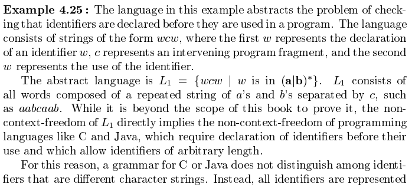

# 第4章 语法分析
每种程序语言都有一组精确的规则来描述良构 well-formed 程序的语法结构。这些语法可以使用上下文无关法或 BNF 表示法来描述。

## 引论
在编译器模型中，语法分析器从词法分析器获得一个由词法单元组成的串，并验证这个串可以由源语言的文法生成。  
在此之上，我们希望还能够语法分析器以易于理解的方式报告可能的语法错误，并能从常见的错误中恢复以继续处理程序的剩余部分。  
对于良构的程序，从概念上，语法分析器应该能够构造出一棵语法分析树，并将其传递给编译器的其它部分继续处理。（当然在实际中我们可能并不需要显示地构造出这棵树，只需动态地完成）

### 语法错误的处理
程序可能有不同层次的错误

* 词法错误：标识符、关键字或运算符的拼写错误，或者是字符串文本上没有正确地加上引号。  
* 语法错误：如分号、花括号位置错误、多余或缺失。  
* 语义错误：如运算符和运算分量之间类型不匹配。  
* 逻辑错误：因程序员的错误推理而引起的任何错误。这样的错误可能是良构的，但是没有准确反映出程序员的意图。

语法分析器中的错误处理程序的目标：

* 清晰精确地报告出现的错误。  
* 能很快地从各个错误中恢复，以继续检测后面的错误。  
* 尽可能少地增加处理正确程序时的开销。

### 错误恢复策略
以下策略并没有被普遍接受的，但是已经有了比较广泛的使用。  

* 恐慌模式的恢复：语法分析器一旦发现错误就不断丢弃输入中的符号，依次丢弃一整个符号，直到找到同步词法单元集合中的元素。这一集合中的元素通常是界限符，因为它们在源程序中的作用通常是清晰且无二义的。这一方法简单且不会陷入无限循环。   
* 短语层次的恢复：语法分析器在发现错误后尝试在余下的输入上作局部性修正，即可能将余下输入的某个前缀替换为另一个串（常见的有逗号替换为分号，删除或插入分号等），以继续分析。必须谨慎地局部纠正方案，以避免出现无限循环。  
* 错误产生式：预测可能遇到的常见错误，在当前语法的文法中加入特殊的产生式（含有错误的构造，即语法分析器中本身包含错误构造，所以能够识别出来）。语法分析器对这类预期的错误生成适当的诊断信息，并给出建议。  
* 全局纠正：编译器通过最少的改动将一个输入的错误串转化为语法正确的串，这是理想的情况。存在一些算法能够选择一个最小的改动序列，得到全局开销最小的纠正方案。但从时间和空间的角度来看，这类方法的实现开销巨大，目前仅具有理论价值。值得指出的是，一个最接近正确的程序可能并不是程序员想要的程序。

## 上下文无关文法
### 推导
将产生式看作推导规则。下面是一些记号。

如果有产生式 $E \rightarrow -E$，则将 E 替换成 -E 的过程写作 $E \Rightarrow -E$，其中符号 $\Rightarrow$ 表示一步推导出。如果存在推到序列 $a_1 \Rightarrow a_2 \Rightarrow \dots \Rightarrow a_n$ 将 $a_1$ 替换为 $a_n$，那么我们说 $a_1$ 推导出 $a_n$。使用符号 $\overset{*}\Rightarrow$ 表示经过零步或多步推导出，类似的有 $\overset{+}\Rightarrow$ 表示经过一步或多步推导出。  
如果 $S\overset{*}\Rightarrow \alpha$，其中 S 是文法 G 的开始符号，我们说 $\alpha$ 是 G 的一个句型。一个句型可能既包含终结符号又包含非终结符号，也可能是空串；而文法 G 的句子是不包含非终结符号的句型。一个文法生成的语言是它的所有句子的集合。  
可以由文法生成的语言被称为上下文无关语言。如果两个文法生成相同的语言，则这两个文法是等价的。

在推导的过程中，每一步都需要作出两个选择，其一是选择替换哪个非终结符号，其二是选择以此非终结符号作为头的产生式。我们考虑两种选择策略：最左推导，总是选择每个句型最左的非终结符号，对于 $\alpha \Rightarrow \beta$ 简单记为 $\alpha \underset{lm}\Rightarrow\beta$；对应的有最右推导，记为 $\alpha \underset{rm}\Rightarrow\beta$。

### 语法分析树与推导
语法分析树是推导的图形表示形式，每个内部节点表示一个产生式的应用，而其子节点则从左到右组成了在推导中替换的产生式。  
语法分析树去掉了符号之间顺序的关联，在分析的时候有很多优点。每一棵语法分析树都和唯一的最左推导和唯一的最右推导相关联。

### 二义性
如果一个文法可以为某个句子生成多棵语法分析树，则称其为二义的。下图是一个例子，在这个例子中没有区分加法符号与乘法符号的优先级。

大部分的语法分析器都期望文法是无二义性的。不过也存在精心选择二义性文法带来方便的例子，在这种情况下，需要确定消二义性规则来为每个句子留下唯一的一棵语法分析树。

### 验证文法生成的语言
验证分为经典的两步：对于文法 G 和语言 L，证明 G 生成的每个串都在 L 中，同时证明 L 中的每个串都确实能由 G 生成。  
尽管从编译器设计的角度，很少会对整个程序设计语言的文法作这样的验证，但在研究棘手的构造时，我们可以写出该构造的一个简单、抽象的文法，并研究该文法生成的语言。

### 上下文无关文法与正则表达式
可以采用如下机械的方法构从一个不确定有限状态机 NFA 构造出识别相同语言的文法：

1. 对于 NFA 的每个状态 i，创建一个非终结符号 $A_i$  
2. 如果状态 i 有一个在输入 a 上到达状态 j 的转换，则加入产生式 $A_i \rightarrow aA_j$。类似的，如果状态 i 在输入 $\epsilon$ 上到达状态 j ，那么加入产生式 $A_i \rightarrow A_j$。  
3. 如果状态 i 是一个接受状态，则加入产生式 $A_i \rightarrow \epsilon$  
4. 如果状态 i 是 NFA 的开始状态，令 $A_i$ 为所得文法的开始符号。

可以证明，每个可以使用正则表达式描述的构造都可以使用文法来描述，但是反过来不成立。  
一个典型的例子是，有相同数量的 a 和 b 组成的串的集合，语言 $L = \{a^nb^n | n \ge 1\}$，这一语言无法用正则表达式来描述但是可以用文法描述。  
通俗地说，有穷自动机不能计数，文法可以对两个个体进行计数但无法对三个及以上的物体计数。

## 设计文法
### 词法分析与语法分析
并不存在一个严格的指导方案来规定哪些东西应该放到词法规则中。  
正则表达式通常是和描述诸如标识符、常量、关键字、空白这样的语言构造的结构，而文法则适合描述嵌套结构（比如对称的括号对，if-else 结构）。

通常使用正则表达式来定义一个语言的词法语法有很多的原因。比较主要的是，和文法相比，正则表达式更加简单且足够用，并且自动构造得到的词法分析器的效率比基于文法自动构造的更高。

### 消除二义性
二义性文法可以被改写为无二义性的文法。一个经典的例子是 `if if else`悬空 else 结构。该文法如下：

串 `if E1 then if E2 then S1 else S2` 有两棵语法分析树

程序设计语言中的惯例做法是使用最近匹配原则，选择上述的第一棵语法分析树。  
在理论上，该规则可以用一个文法直接表示，但是在实践中很少用产生式来表示该规则。

下图是其无二义的改写方法，基本思想是，在一个 `then` 和一个 `else` 之间出现的语句必须是“已匹配的”，即中间的语句不能以一个尚未匹配（或者说开放）的 `then` 结尾。

### 左递归的消除
对于非终结符号 $A$，如果存在某个串 $\alpha$ 满足推导 $A \overset{+}\Rightarrow A\alpha$，则称其为左递归的。自顶向下方法不能处理这种左递归的文法，所以需要对其进行改写以消除左递归。  

对于立即左递归，有如下的处理办法。  
对于 A 的全部产生式 $A \rightarrow A\alpha_1 | A\alpha_2 | \dots | A\alpha_m | \beta_1 | \beta_2 |\dots|\beta_n$，要求 $\alpha_i$ 均不为 $\epsilon$ 且 $\beta_i$ 不以 A 开头。那么将上述产生式替换为 $A \rightarrow \beta_1A' | \beta_2A' | \dots | \beta_nA', A' \rightarrow \alpha_1A | \alpha_2A | \dots | \alpha_mA | \epsilon$。

对于多步产生的左递归，则需要更为复杂的算法。当文法中不存在环（即形如 $A\overset{+}\Rightarrow A$）或者 $\epsilon$ 产生式（即形如 $A \Rightarrow \epsilon$）时，就能消除左递归。而环和 $\epsilon$ 产生式都是可以提前从文法中系统地消除掉的。下图是算法过程

上述这一算法的基本思想是，在处理过后，任何产生式 $A_k \rightarrow A_l\alpha$ 必然满足 $l > k$ ，由此消除了任何可能的递归重复过程。

### 提取左公因式
一般而言，如果 $A \rightarrow \alpha\beta_1 | \alpha\beta_2$ 是两个 A 的产生式，当输入开头是从 a 推导得到的非空串时，我们无法选择将 A 展开为前者还是后者。我们可以在这里采用推迟决定的办法，即将 A展开为 $\alpha A'$，在之后再决定将 $A'$ 展开为 $\beta_1$ 或 $\beta_2$。这称之为提取左公因式方法。

### 非上下文无关语言的构造
在常见的程序设计语言（如 C 和 Java）中存在着少量的不能仅用文法描述的语法构造。下面简述了两个例子。其中第一个是检查标识符在程序中先声明后使用的问题，第二个是检查函数声明中的形式参数个数是否等于该函数的某次使用中的实际参数的个数。

## 自顶向下的语法分析
在自顶向下的语法分析的每一步中，最关键的问题是确定对一个非终结符号应用哪个产生式。这一选择一旦确定，语法分析过程的剩余部分将相应产生式体中的终结符号和输入相匹配。

递归下降语法分析是自顶向下的通用形式，这种方法可能需要进行回溯以找到正确匹配的产生式。  
前文中提到过的预测分析技术是递归下降的一种特例，在这一特例中，不需要进行回溯，只需要向前看固定多个符号就看也i选择正确的产生式。

### 递归下降的语法分析
递归下降的本质即对每个非终结符号的产生式枚举比对，然后递归地向下判断是否匹配成功，如果是则接受这一个产生式，否则寻找另外的产生式进行尝试。如果在尝试了所有可能后依然没有结果，则抛出错误。在代码实现上，每个非终结符号对应一个过程，从开始符号对应的过程开始执行。下面是某个非终结符号对应的过程的伪代码。在此之上，添加关于 A 的产生式的选择即可完成回溯的过程。

由于需要回溯，在一些情况下可能并不是很高效。  
由上我们也可以看出，一个左递归的文法会导致递归下降语法分析器进入一个无限循环。

### FIRST 和 FOLLOW
与文法 G 相关的两个函数 FIRST 和 FOLLOW 可以用来构造自顶向下和自底向上的语法分析器。

$FIRST(\alpha)$ 被定义为，可以从 $\alpha$ 推导得到的串的首符号的集合，其中 $\alpha$ 是任意的文法符号串。另外，如果 $\alpha\overset{*}\Rightarrow\epsilon$，那么 $\epsilon \in FIRST(\alpha)$。  
$FOLLOW(A)$ 被定义为在某些句型中，紧跟在 A 右边的终结符号的集合，其中 A 是非终结符号。另外，如果 A 是某些句型的最右符号，那么 `$` 也在 $FOLLOW(A)$ 中，其中 `$` 是我们之前定义的特殊的结束标记符号，我们假设它不是任何文法的符号。

重复使用以下规则来构建 $FIRST(X)$，直到没有新的终结符号或 $\epsilon$ 可以被加入到任何 $FIRST$ 集合中为止。

1. 如果 X 是一个终结符号，那么 $FIRST(X) = X$  
2. 如果 X 是一个非终结符号，对于产生式 $X \rightarrow Y_1Y_2\dots Y_k$。对所有满足条件的 $i$，$\alpha$ 在 $Y_i$ 中且 $\epsilon$ 在所有的 $FIRST(Y_1), FIRST(Y_2), FIRST(Y_{i-1})$ 中，则将 $\alpha$ 加入 $FIRST(X)$。若对于所有 $Y_1,Y_2,\dots ,Y_k$ 的 $FIRST$ 都包含 $\epsilon$，则将 $\epsilon$ 加入 $FIRST(X)$ 中。  
3. 如果 $X \rightarrow \epsilon$ 是一个产生式，则将 $\epsilon$ 加入 $FIRST(X)$ 中。

对于 $FIRST(X_1X_2\dots X_n)$ 的计算也是类似的，同样是讨论 $\epsilon$ 在前缀中连续出现的情况即可。

重复使用以下规则来构建 $FOLLOW(A)$，直到没有新的终结符号可以被加入到任何 $FOLLOW$ 集合中为止。

1. 将 `$` 放到 $FOLLOW(S)$ 中，S 是开始符号。  
2. 若存在产生式 $A\rightarrow\alpha B\beta$，那么 $FIRST(\beta)$ 中除 $\epsilon$ 之外的所有符号都在 $FOLLOW(\beta)$ 中。  
3. 若存在产生式 $A\rightarrow B$，或存在产生式 $A\rightarrow \alpha B \beta$ 且 $FIRST(\beta)$ 中包含 $\epsilon$ ，那么 $FOLLOW(A)$ 中的符号均包含在 $FOLLOW(B)$ 中。

### LL(1) 文法
LL(1) 中的第一个 L 代表从左向右扫描输入，第二个 L 代表产生最左推导，1 则表示在每一步中只需向前看一个输入符号来决定语法分析动作。  
这类文法可以直接使用预测分析器，不需要回溯的递归下降语法分析。  
一个文法 G 是 LL(1) 的，当且仅当 G 的任意两个不同的产生式 $A \rightarrow \alpha | \beta$。

1. 不存在终结符号 a 使得 $\alpha$ 和 $\beta$ 都能够推导出以 a 开头的串。  
2. $\alpha$ 和 $\beta$ 中最多只有一个可以推导出空串  
3. 如果 $\beta \overset{*}\Rightarrow\epsilon$，那么 $\alpha$ 不能推导出任何以 $FOLLOW(A)$ 中某个终结符号开头的串，反之亦然。这一条件等价于说，若 $\epsilon$ 在 $FIRST(\beta)$ 中，那么 $FIRST(\alpha)$ 和 $FOLLOW(A)$ 是不相交的集合，对于 $\epsilon$ 在 $FIRST(\alpha)$ 中时也有类似的结论。

接下俩是把上述的 $FIRST, FOLLOW$ 放入到预测分析表 $M[A, \alpha]$ 中，其中 A 是一个非终结符号，$\alpha$ 是一个终结符号或特殊符号 `$`。  
对于文法 G 的每个产生式 $A\rightarrow \alpha$ 进行如下处理：

1. 对于 $FIRST(\alpha)$ 中的每个终结符号 $\alpha$，将 $A\rightarrow\alpha$ 加入到 $M[A,\alpha]$ 中  
2. 若 $\epsilon$ 在 $FIRST(\alpha)$ 中，那么对于 $FOLLOW(A)$ 中的每个终结符号 b ，将 $A\rightarrow\alpha$ 加入到 $M[a,b]$ 中。  
3. 若 $\epsilon$ 在 $FIRST(\alpha)$ 中且 `$` 在 $FOLLOW(A)$ 中，也将 $A\rightarrow\alpha$ 加入到 `M[A, $]` 中。
4. 若在完成上述所有产生式的插入后，如果 $M[A, \alpha]$ 中没有产生式，那么将 $M[A, \alpha]$ 设置为 `error`。

对于 LL(1) 文法，分析表中的每个条目都唯一地指定了一个产生式（或一个错误）。  
上述算法可以用于任何文法 G，但对于有些文法， M 中可能会有一些多重定义的条目。

### 非递归的预测分析
本质上是将原本递归隐式的栈结构显式地维护，来模拟最左推导的过程。

### 预测分析中的错误恢复
考虑一个由分析表驱动的预测分析器的栈，因为这个栈明确地显示了语法分析器期望用哪些终结符号及非终结符号来匹配余下的输入。  
当栈顶的终结符号和下一个输入符号不匹配，或者栈顶是非终结符号但对应下一个输入符号的语法分析表条目为空时，出现一个语法错误。

恐慌模式：语法分析器忽略输入中的一些符号，直到输入中出现由设计者选定的同步词法单元集合中的某个词法单元。  
这一方法的有效性取决于同步词法单元集合，下面是一些启发式的规则：  

1. 将 $FOLLOW(A)$ 中的所有符号放到非终结符号 A 的同步集合中。这一规则的思想是，如果碰到了 $FOLLOW(A)$ 中的某个元素，此时将 A 从栈中弹出，那么语法分析过程比较可能能够继续下去。  
2. 程序语言构造中的层次结构，比如 C 语言中的分号。我们可以将较高层构造的开始符号加入到较低层构造的同步集合中去。  
3. 将 $FIRST(A)$ 中的符号加入到非终结符号 A 的同步集合中，那么当遇到这样的符号时，我们就有可能根据 A 继续进行语法分析。  
4. 如果一个非终结符号可以生成空串，那么将推导出 $\epsilon$ 的产生式当作默认值来使用，这样可能会延迟对一些错误的检测，但是不会使错误被漏检。这一方法还能减少我们在处理错误恢复时需要考虑的非终结符号的数量。  
5. 如果栈顶的终结符号不能和输入匹配，一个简单的想法是将该终结符号弹出栈，并发出消息表示该终结符号已经插入。

除此之外，还应该考虑错误信息，描述相应的错误并引导人们注意到错误被发现的地方。

短语层次：短语层次的恢复，是在预测语法分析表的空白条目中填写指向处理例程的指针。这些例程可以改变、插入或删除输入中的符号，甚至执行栈操作，并发出适当的错误信息。  
必须谨慎地设计上述更改符号或是栈的例程。首先，由语法分析器执行的动作可能根本不对应语言中任何句子的推导过程；其次，例程必须保证不会进入无限循环，一个好办法是保证任何恢复动作最终都会消耗掉某个输入符号（若是输入结尾，则保证栈中的符号会减少）。

## 自底向上的语法分析
本节介绍移入-归约语法分析的自底向上语法分析的通用框架。

### 归约
我们可以将自底向上语法分析过程看成将一个串 w 归约为文法开始符号的过程。  
在每个归约步骤中，一个与某产生式体相匹配的特定字串被替换为该产生式头部的非终结符号。  
在上述过程中，关键问题是何时进行归约以及应用哪个产生式进行归约。

### 句柄剪枝
对输入进行从左到右的扫描，并在扫描过程中进行自底向上语法分析，就可以反向构造出一个最右推导。

正式上，如果有 $S \overset{*}{\underset{rm}\Rightarrow} \alpha A\omega\Rightarrow \alpha\beta\omega$，那么紧跟着 $\alpha$ 的产生式 $A\rightarrow\beta$ 是 $\alpha\beta\omega$ 的一个句柄。注意到这里强调的是一个句柄而不是唯一一个，因为文法可能是有二义性的。如果文法是无二义性的，那么该文法的每个右句型都有且只有一个句柄。

通过句柄剪枝，可以得到一个反向的最右推导。推导的最终流程为 $S=\gamma_0\underset{rm}\Rightarrow\gamma_1\underset{rm}\Rightarrow\dots\underset{rm}\Rightarrow\gamma_n\omega$，其中 $\omega$ 是当前文法的句子，而 $\gamma_n$ 是某个未知最右推导的第 n 个最右句型，我们需要由相反的顺序重构这个推导。从 $\omega_n$ 开始寻找句柄 $\beta_n$ 并将 $\beta_n$ 替换为相关产生式 $A_n\rightarrow\beta_n$ 的头部，得到最右句型 $\gamma_{n-1}$。重复上述流程，直到最后得到只包含开始符号 S 的最右句型。  
上述流程的关键在于如何寻找句柄，下面很快就会介绍寻找句柄的方法。

### 移入-归约语法分析技术
这一技术使用一个栈来保存文法符号，并用缓冲区来存放要进行语法分析的其余符号。  
句柄在被识别之前总是出现在栈的顶部。  
在对输入串的一次从左到右的扫描过程中，语法分析器将零个或多个输入符号移到栈的顶端，直到它可以对栈顶的一个文法符号串 $\beta$ 进行归约为止。然后将 $\beta$ 归约为某个产生式的头，直到检测到语法错误或者栈中包含了开始符号且输入串缓冲区为空。

在归约的过程中，被归约的串的右端必然是栈顶，语法分析器在栈中确定这个串的左端，然后决定用哪个非终结符号来替换这个串。

### 移入-归约语法分析中的冲突
有些上下文无关文法不能使用移入-归约语法分析技术，在这些文法中，可能会出现无法判断应该进行移入还是归约操作的冲突，或者无法在多个可能的归约方法中选择正确的归约动作。  
这类文法同样不在 $LR(k)$ 定义的文法类中。一个常见的例子是二义性的文法。

## LR 语法分析技术介绍：简单 LR 技术
目前最流行的自底向上语法分析器都基于所谓的 $LR(k)$ 语法分析的概念。其中 L 表示对输入从左到右进行扫描，R 表示反向构造出一个最右推导序列，k 表示作出语法分析决定时需要向前看 k 个输入符号。  
在实际情况下，一般只考虑 $k \le 1$ 的情况。下文中若省略了 k 则认为 $k=1$。

### 为什么使用 LR 语法分析器
LR 语法分析器是表格驱动的（与前文中提到的非递归 LL 语法分析器类似）。  
从直观上来说，只要存在一个从左到右扫描的移入-归约语法分析器，这个语法分析器总能在某文法的最右句型的句柄出现在栈顶时识别出这个句柄，那么这个文法就是 LR 的。

LR 语法分析器具有很大的吸引力，有以下几点原因： 

* 对于几乎所有的程序语言，只要能够写出该构造的上下文无关文法，就能构造出识别该构造的 LR 语法分析器。虽然存在非 LR 的上下文无关文法，但通常可以避免在程序设计语言中使用这样的文法。  
* LR 语法分析是已知的最通用的无回溯移入-归约分析技术，并且非常高效。  
* 一个 LR 语法分析器可以在对输入进行从左到右扫描时尽早检测到错误。  
* LR 语法分析能够运用的文法类是预测方法或 LL 方法的真超集

LR 方法也存在一些缺点。其中最主要的是，手工为典型的程序设计语言文法构造 LR 分析器的工作量很大，所以一般我们会使用 LR 语法分析器生成工具，比如 Yacc。这一工具输入一个上下文无关文法，自动生成一个该文法的语法分析器，同时该工具还能对存在二义性或其它问题的文法进行定位，并给出诊断信息。

### 项和 LR(0) 自动机
这一小节解决如何决定移入和归约的问题。  
一个 LR 语法分析器通过维护一些状态，用这些状态来表明我们在语法分析过程中所处的位置，从而作出移入-归约的决定。  
这些状态代表了项 item 的集合。  
一个文法 G 的一个 LR(0) 项（简称为项）是 G 的一个产生式再加上一个位于它的体中某处的点。  
例如产生式 $A\rightarrow XYZ$ 能够产生四个项 $A\rightarrow \bullet XYZ,A\rightarrow X\bullet YZ, A\rightarrow XY\bullet Z, A\rightarrow XYZ\bullet$ 。而相应的 $A\rightarrow \epsilon$ 只有一个项 $A\rightarrow\bullet$ 。  
一个项可以用一对整数来表示，其中第一个整数是产生式的编号，而第二个整数是点的位置。  
项实质上指明了我们在分析的过程中已经看到了一个产生式的哪些部分。比如对于 $A\rightarrow X\bullet YZ$ 表明我们已经在输入中看到了一个可以由 X 推导得到的串并希望接下来看到一个能从 YZ 推导得到的串。

一个称为规范 LR(0) 项集族的一组项集提供了构建一个确定自动机的基础，该自动机可以用于做出语法分析决定，这样的有穷自动机又称为 LR(0) 自动机（必须指出，由于我们没有定义空项集的死状态，所以这个自动机并不是严格定义的确定自动机，有一些状态-输入对没有后继状态）。  
下图是某个表达式文法以及其对应的自动机。

下面开始构造 LR(0) 项集族。定义增广文法为：若 G 是一个以 S 为开始符号的文法，那么 G 的增广文法 G' 就是在 G 中加上新开始符号 S' 和产生式 $S'\rightarrow S$，引入的目的是告知语法分析器要使用规则 $S'\rightarrow S$ 进行归约时停止语法分析并宣称接受输入符号串。  
另外我们定义两个新的函数 CLOSURE 和 GOTO，下面将给出详细定义。

项集的闭包 CLOSURE。设 $I$ 是文法 G 的一个项集，下面给出 $CLOSURE(I)$ 的构造方法：

1. 将 $I$ 中的各个项加入到 $CLOSURE(I)$ 中。  
2. 如果 $A\rightarrow\alpha\bullet B\beta$ 在 $CLOSURE(I)$ 中，$B\rightarrow\gamma$ 是一个产生式，并且项 $B\rightarrow\bullet\gamma$ 不在 $CLOSURE(I)$ 中，那么就将这个项加入其中，直到没有新的项可以加入。

值得指出的是，我们可以看到，如果点在最左边的某个 B 的产生式被加入到 I 的闭包中，那么必然所有 B 的产生式都会加入。  
我们可以将感兴趣的项分为两类：  

* 内核项：包含初始项 $S'\rightarrow\bullet S$ 以及点不在最左端的所有项。  
* 非内核项：除了 $S'\rightarrow\bullet S$ 以外的点在最左端的所有项。

我们感兴趣的每个项集都是某个内核项集合的闭包。非内核项可以通过闭包运算重新生成。

$GOTO(I, X)$ 其中 $I$ 是一个项集而 $X$ 是一个文法符号。这一函数被定义为 $I$ 中所有形如 $[A\rightarrow \alpha\bullet X\beta]$ 的项所对应的项 $[A\rightarrow \alpha X\bullet\beta]$ 的集合的闭包。  
从直观的角度，$GOTO(I, X)$ 对应 LR(0) 自动机中的一次转换，描述了当输入为 X 的时候离开状态 I 的转换。

下面我们给出一个构造增广文法 G' 的规范 LR(0) 项集族 C 的算法，伪代码如下：

简单 LR 语法分析技术 SLR 的中心思想即是构造出上述 LR(0) 自动机。这一自动机的状态是规范 LR(0) 项集族中的元素，而转移则由 GOTO 函数给出。在此基础上也可以对移入-归约作出选择。  
不妨假设文法符号串 $\gamma$ 使 LR(0) 自动机从开始状态 0 运行到某个状态 j ，下一个输入符号为 $\alpha$。如果在状态 j 下有一个 $\alpha$ 的转换，那么就移入 $\alpha$，否则选择归约动作，状态 j 的项会表明应该选择哪个产生式进行归约。
