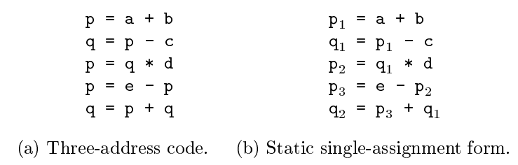
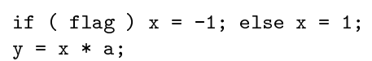
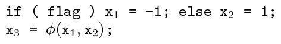
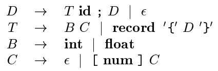
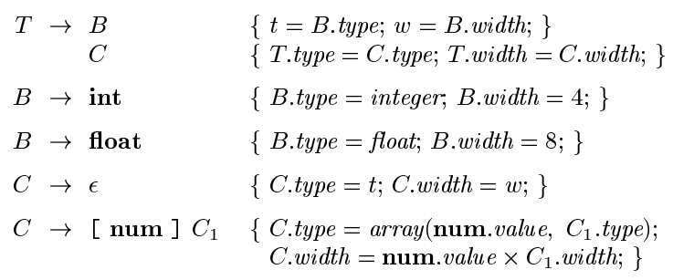
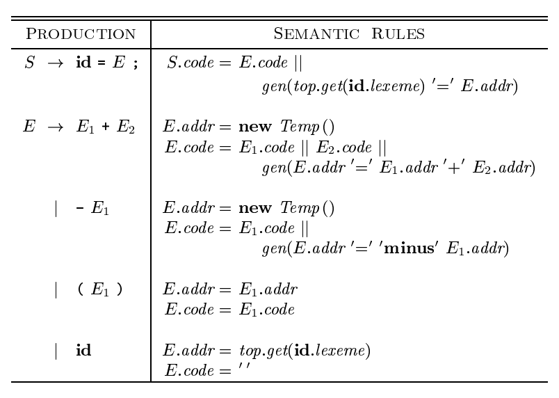
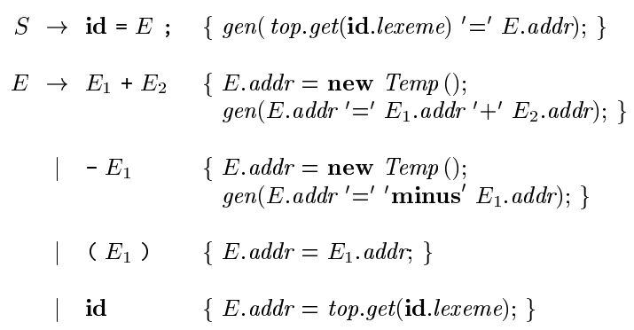

# 第6章 中间代码生成
本节主要涉及中间代码表示、静态类型检查和中间代码生成。

静态检查：包括类型检查（保证运算符被应用到兼容的运算分量），和在语法分析之后进行的所有语法检查。  
中间表示：抽象语法树和三地址代码。

## 语法树的变体
语法树中的各个节点代表了源程序中的构造，那么一个节点的子节点就反应了该节点对应构造的有意义部分。   
注意到这里可以是一个 DAG，因为表达式中可能存在公共的子表达式。  

### 表达式的有向无环图
与表达式树类似，叶子节点对应原子运算分量，内部节点对应运算符。  
但是在 DAG 中，一个节点可能有多个父节点，这意味着原本在语法树中重复的部分变为公共。

对于之前的构造语法树的算法，只需要在新建节点前判定一下之前是否已经生成了相同的子表示即可。如果之前生成过则直接使用，否则再生成一个新的。

## 三地址代码
在三地址代码中，一条指令的右侧最多有一个运算符，不允许出现组合的算术表达式。  
其基本概念是地址和指令。  
地址可以是名字（源程序中的名字，而在实现中，通常是替换为指向符号表条目的指针），常量（处理很多类型的常量和变量），编译器生成的临时变量（在每一次需要一个新的临时变量时生成一个，在后续优化的过程中也能发挥作用；而在为变量分配寄存器的时候我们则需要尽可能地合并这些临时变量）。  
下面则是常用的几种三地址指令的形式

* 形如 `x = y op z` 的赋值指令，其中 op 是双目运算符或逻辑运算符，`x,y,z` 是地址。  
* 形如 `x = op y` 的赋值指令，其中 op 是单目运算符（单目减、逻辑非、转换运算如整数和浮点数的转换）。  
* 形如 `x = y` 的复制指令。  
* 形如 `goto L` 这样的无条件转移指令。  
* 形如 `if x goto L` 或 `if False x goto L` 这样的条件转移指令，其中 x 为真或假。  
* 形如 `if x relop y goto L` 这样的条件转移指令。对 x 和 y 运用一个关系运算符，若为真则进行标号为 L 的跳转。  
* 一组用于过程调用和返回的指令：`param x` 进行参数传递，`call p, n` 和 `y = call p, n` 分别用于过程调用和函数调用，`return y` 用于返回且返回值为 `y`。  
* 带有下标的复制指令 `x = y[i]` 或 `x[i] = y`。  
* 形如 `x = &y, x = * y, *x = y` 这样的地址和指针赋值指令。

关于过程调用相关的补充，对于过程 $p(x_1, x_2, \dots, x_n)$ 的调用是如下的三地址指令序列

```plain
param x1
param x2
...
param xn
call p, n
```

值得指出的是，这里 `call` 中的参数 n 并不是冗余的。这是因为考虑到嵌套调用的情况。

如何选择合适的运算符是中间表示形式设计的一个重要问题。  
这个运算符的集合必须足够丰富使得能够表示源语言中的所有运算。  
但是前端也不能能生成过长的指令序列，不然后期的优化和代码生成器就要花费更多的时间去重新发现程序的结构。

### 四元式表示
四元式和间接三元式是将上述的三地址表示法具体实现、或者说表示为具体数据结构中的方法。

一个四元式包括四个字段 `op, arg1, arg2, result`。下面是一些例子

| 三地址表示     | `op`    | `arg1` | `arg2` | `result` |
| :------------ | :------ | :----- | :----- | :------- |
| `x = y + z`   | `+`     | y      | z      | x        |
| `x = minus y` | `minus` | y      | NULL   | x        |
| `param x`     | `param` | x      | NULL   | NULL     |

对于条件或非条件转移指令，目标标号放到 `result` 字段中。

### 三元式表示
三元式包括三个字段 `op, arg1, arg2`。  
注意到与上述四元式的区别在于没有 `result`字段。在三元式表示中，我们直接使用运算的地址来表示结果，而不需要一个显式的临时名字来表示。

在优化编译器时，指令的位置可能会发生变化，此时直接使用三元式需要修改大量的引用位置。  
在三元式的基础上引入一个包含指向三元式的指针的列表，而不是列出三元式序列本身。此时，优化编译器的重新排列会移动指令的位置，但是不会影响三元式本身。

### 静态单赋值形式 SSA
SSA 是另一种中间表示形式，有利于实现某些类型的代码优化。  
SSA 与三地址代码的区别：首先是，SSA 中所有赋值都是针对具有不同名字的变量而言的。下图是三地址代码和 SSA 的对比。



其次，SSA 对于不同控制流后合并的处理也有规定。SSA 使用一个称为 $\varphi$ 函数的表示规则将不同控制流后的结果合并。下图是一个例子。



对于上图的分支控制流，其 SSA 如下



## 类型和声明

* 类型检查：使用一组逻辑规则来推理一个程序在运行时刻的行为，保证运算分量的类型和运算符的预期类型相匹配。  
* 翻译：根据一个名字的类型，编译器可以确定这个名字在运行时刻需要多大的存储空间。另外还有计算数组引用、显式类型转换、正确的算术运算符等等都与类型翻译有关。

### 类型表达式
注意到类型本身也是存在结构的，我们使用类型表达式来表示这种结构。  
可以是基本表达式，以及类型构造算子这种运算符作用于类型表达式。具体定义如下

* 基本类型是类型表达式：`boolean, char, integer, float, void`
* 类名是一个类型表达式。  
* 算子 `array` 作用于一个数字和一个类型式得到一个类型表达式。  
* 记录 `record` 将字段名和相应的类型表达式合成得到类型表达式。  
* 构造算子 `->` 构造函数类型的类型表达式。`s->t` 表示类型 s 到类型 t 的函数。特意标记出函数的类型，这在后面讨论类型检查时是有用的。  
* 如果 `s, t` 是类型表达式，那么其笛卡尔积 `s×t`也是类型表达式。引入笛卡尔积是为了保证定义的完整性，可以用于描述类型的列表或元组（如函数参数）。补充设定 `×` 具有左结合性，且优先级高于 `->` 。  
* 类型表达式可以包含取值为类型表达式的变量。后面会提到类型变量。

类型等价的判定。两个类型之间结构等价当且仅当下面所述的某个条件为真

* 是相同的基本类型。  
* 是相同的类型构造算子应用于结构等价的类型而构造得到。  
* 一个类型是另一个类型表达式的名字。

当类型名仅仅代表它自己时，前两个条件定义了类型表达式中的名等价关系。

下面是一个可以用于声明类型的简单文法



在考虑局部变量的存储问题时，需要考虑到类型占据的空间。首先受到目标机器的寻址格式的制约，可能有地址对齐的要求；在空间比较宝贵时，编译器可能会对数据进行压缩，但是这同时意味着在运行时刻执行额外的指令重新定位数据。  
然后需要计算的是类型的宽度。像是整数、浮点这些基本类型需要整数多个字节的地址，数组和类则是需要分配连续的存储字节块。  
下面是一个能够计算类型及其宽度的语法制导翻译方案。



对于记录类型，注意到一个记录中的各个字段的名字必须是互不相同的，且字段名的偏移量在每个不同的记录中是互相独立的。  
具体实现的时候，通常是使用一个专用的符号表，对其各个字段的类型和相对地址进行编码。  
类似的存储方法可以推广到类。

## 表达式的翻译
首先考虑从表达式到三地址代码的翻译。

下面是一个简单的将包含加法和单目减运算符的赋值语句翻译成三地址代码的翻译方案



注意上面的翻译方案中，code涉及了多次赋值，这在具体实现的时候可能会涉及到长字符串的拼接。从效率的角度考虑，可以采用增量构造的方式。  
下图是一个例子，在这个例子中直接调用 `gen` 函数生成对应的指令，并直接添加到指令流中。指令流可以暂时放在内存中以便进一步处理，也可以增量地输出。



中间代码应该独立于目标机器，所以在计算类型宽度时，不应该直接使用关于类型的基本信息（比如占据的大小），而应该使用符号常量来进行替换。

## 类型检查
类型检查有两种方式：综合和推导。  
类型综合：根据子表达式的类型构造出表达式的类型。要求名字先声明再使用。  
类型推导：根据语言结构的使用方法来确定该结构的类型。

类型转换也需要仔细考虑。由编译器自动完成的隐式转换通常仅限于拓宽转换（如在 Java 中就区分了拓宽转换和窄化转换两种，前者可以保留所有信息而后者可能丢失信息）。  
手工为所有的情况编写隐式转换规则是不可接受的，通常的做法是根据两个运算数和结果数的类型进行综合判断，如果需要拓宽则自动增加转换相关的代码。

## 控制流
布尔表达式通常拥有两种功能：改变控制流和计算逻辑值。根据其语法上下文来确定具体的使用意图。  
在实现布尔表达式时，通常直接使用 goto 运算，而不是完整地按照定义将结果计算出来再进行判断，这样还可以方便地进行短路运算。

使用控制流穿越技术避免生成冗余的 goto 指令。

对于改变控制流的布尔表达式，生成对应的控制流即可；对于用于计算逻辑值的布尔表达式，在跳转代码的真假出口创建一个临时变量，将 `true` 和 `false` 的结果赋值。

## 回填
为布尔表达式和控制流语句生成目标代码时，关键问题之一是将一个跳转指令和该指令的目标匹配起来。  
在前文描述中，地址跳转是以继承属性方式向下传递的，需要在代码生成之后再遍历一趟将标号和具体地址绑定。  
回填技术使用一个由跳转指令组成的表，这一表是综合属性进行传递，再能够确定正确的目标标号时才去填充。这样可以一趟完成对布尔表达式或控制流语句的目标代码生成。

## Switch 语句
switch 语句是一个多路分支。当 case 的数目较少时（如少于 10 个）可以考虑用条件跳转指令序列的方式实现，可以使用一个对照关系表，编译器生成一个简单循环来依次比对。  
对于u更多的分支树，更高效的方式是为这些值生成散列表。  
对于表达式的值范围比较小的情况，还可以直接构造跳转表来实现。  

也可以选择翻译为包含 `case` 语句的三地址代码。这样更有利于被最终的代码生成器探测到，更好地进行一些优化。
