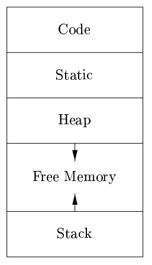
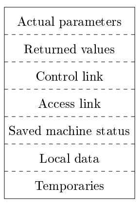

# 第7章 运行时刻环境

运行时刻环境：编译器准确实现源程序中抽象概念并与操作系统协作的组件。编译得到的目标程序运行在该环境中。  
处理很多事务：源程序中命名对象的分配和安排存储位置，过程连接，参数传递，与操作系统、输入输出设备的交互接口。

## 存储组织
下图是一个目标程序的逻辑地址空间示意图。一般可以分为数据区和代码区两个部分。

静态和动态分别表示编译时刻和运行时刻，前者编译器只需要通过观察程序文本就可以作出存储分配，而后者则需要观察程序在运行时做了什么。  
很多编译器使用栈式存储和堆式存储两种策略的组合来进行动态存储分配，前者主要涉及一个过程中局部名字的分配，后者主要涉及那些生命周期比创建它的过程调用更长的存储使用。

## 空间的栈式分配
许多编译器使用栈来管理过程、函数或方法的动作。当一个过程被调用时，用于存放该过程的局部变量空间被压入栈，而当过程结束时被弹出。  
这一安排不仅允许活跃时段不交叠的多个过程之间共享空间，而且允许我们以相对地址编译代码（与过程调用的序列无关）。

控制栈：管理过程调用和返回。  
每个活跃的活动都有一个位于控制栈中的活动记录（帧）。下图是一个示意图

调用代码序列：为一个活动记录在栈中分配空间  
返回代码序列：恢复机器状态，使得调用过程能够在调用结束后继续执行  
上述代码序列通常分配到调用者和被调用者中，不存在明确的界限，需要配合源语言、目标机器和操作系统的某些要求。  
我们希望将调用代码序列中的尽可能多的部分分配到被调用者中（不然，在每个调用者部分都要重复该代码）。

设计原则：  

* 在调用者与被调用者之间传递的值应该放在被调用者的开始部分，尽可能贴近调用者的活动记录（调用者不需要创建被调用着的全部布局，参数个数或类型可变）。  
* 固定长度的项被放置在中间位置。包括控制连、访问链和机器状态字段。如果每次调用中保存的机器状态成分相同，那么就可以使用同一段代码来保存和恢复每次调用的数据；进一步的，如果机器状态信息标准化，那么而当错误发生时，调试器也能更容易地将栈中的内容解码。  
* 早期不知道大小的项被放在活动记录的尾部（如动态数组）。  
* 小心地确定栈顶指针所指的位置。一般是指向活动记录中固定长度字段的末尾，这样固定长度的数据就可以通过该指针的偏移量来访问。

现代程序设计语言中，在编译时不能确定大小的对象将被分配在堆区。但是分配在栈中能够避免对它们的空间进行垃圾回收，以减小相应的开销。

## 栈中非局部数据的访问
对于没有嵌套过程的语言，变量的存储分配和访问是比较简单的：全局变量分配在静态区，其它变量则一定是栈顶活动的局部变量。  

允许嵌套过程时，数据访问变得复杂（只要一个过程 A 的声明包含在另一个过程 B 中，该过程 A 就可以使用 B 中定义的变量）。  
即使编译时刻我们能够确定两者的嵌套关系，但是我们不能确定它们的活动记录在运行时刻的相对位置。甚至有可能是递归的。

嵌套层数定义为，它处于多少个其它过程之中（注意这个指的不是调用栈的深度）。  
针对嵌套函数，在通常的静态作用域规则上增加一个访问链指针，指向嵌套层数恰好少 1 的调用者的活动。  
访问链形成了一条链路，从栈顶活动记录开始能够依次经过一系列活动的序列。这条链路上的活动就是当前正在运行的过程能够访问到的所有数据。  
编译器知道活动记录的布局，所以通过访问链跳到相应的活动记录中后，通过固定的偏移量就可以访问到需要的位置。

访问链的问题：若嵌套深度变大，访问到真正需要的数据需要沿着一段很长的访问链路询问。   
更高效的方式是使用显示表这一辅助数组，它为每个嵌套深度保存了一个指针。当调用过程导致显示表中某一项出现变化时，需要在栈中保存原值，以便在过程返回时恢复。

## 堆管理
存储管理器：跟踪堆区中的空闲空间。基本功能是分配和回收。  
存储管理器必须准备以任何顺序来处理任何大小的空间分配和回收请求。  
应该具有空间效率（使存储碎片最少）、时间效率和低开销。

## 垃圾回收概述
目标：重新收回那些存放了不能再被程序访问的对象的存储块。  
基本要求是类型安全：即必须知道任何给定的数据元素或其分量是否为一个指向某块已分配存储空间的指针。  
垃圾回收的性能度量指标：总体运行时间，空间使用，停顿时间，程序局部性。

根集：不需要对任何指针解引用就可以直接被程序访问的数据（如在 Java 中所有的静态字段成员和栈中的所有变量）。  
程序可以在任意时刻访问根集中的任何成员。如果对于一个对象，指向它的一个引用被保存在任何可达对象的字段成员或数组元素中，那么这个对象本身也是可达的。  
在编译器进行优化后，可达性问题会变得更加复杂（引用放在寄存器中，对地址的直接操作导致引用指向对象或数组的中间位置）。