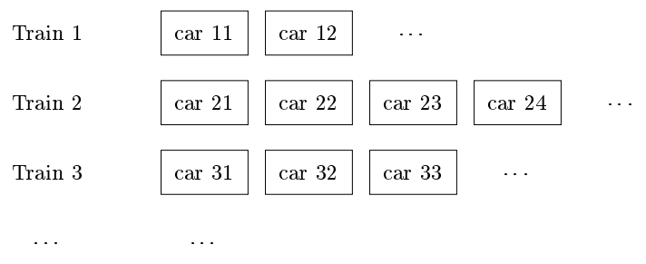

# 第7章 运行时刻环境

运行时刻环境：编译器准确实现源程序中抽象概念并与操作系统协作的组件。编译得到的目标程序运行在该环境中。  
处理很多事务：源程序中命名对象的分配和安排存储位置，过程连接，参数传递，与操作系统、输入输出设备的交互接口。

## 存储组织
下图是一个目标程序的逻辑地址空间示意图。一般可以分为数据区和代码区两个部分。

静态和动态分别表示编译时刻和运行时刻，前者编译器只需要通过观察程序文本就可以作出存储分配，而后者则需要观察程序在运行时做了什么。  
很多编译器使用栈式存储和堆式存储两种策略的组合来进行动态存储分配，前者主要涉及一个过程中局部名字的分配，后者主要涉及那些生命周期比创建它的过程调用更长的存储使用。

## 空间的栈式分配
许多编译器使用栈来管理过程、函数或方法的动作。当一个过程被调用时，用于存放该过程的局部变量空间被压入栈，而当过程结束时被弹出。  
这一安排不仅允许活跃时段不交叠的多个过程之间共享空间，而且允许我们以相对地址编译代码（与过程调用的序列无关）。

控制栈：管理过程调用和返回。  
每个活跃的活动都有一个位于控制栈中的活动记录（帧）。下图是一个示意图

调用代码序列：为一个活动记录在栈中分配空间  
返回代码序列：恢复机器状态，使得调用过程能够在调用结束后继续执行  
上述代码序列通常分配到调用者和被调用者中，不存在明确的界限，需要配合源语言、目标机器和操作系统的某些要求。  
我们希望将调用代码序列中的尽可能多的部分分配到被调用者中（不然，在每个调用者部分都要重复该代码）。

设计原则：  

* 在调用者与被调用者之间传递的值应该放在被调用者的开始部分，尽可能贴近调用者的活动记录（调用者不需要创建被调用着的全部布局，参数个数或类型可变）。  
* 固定长度的项被放置在中间位置。包括控制连、访问链和机器状态字段。如果每次调用中保存的机器状态成分相同，那么就可以使用同一段代码来保存和恢复每次调用的数据；进一步的，如果机器状态信息标准化，那么而当错误发生时，调试器也能更容易地将栈中的内容解码。  
* 早期不知道大小的项被放在活动记录的尾部（如动态数组）。  
* 小心地确定栈顶指针所指的位置。一般是指向活动记录中固定长度字段的末尾，这样固定长度的数据就可以通过该指针的偏移量来访问。

现代程序设计语言中，在编译时不能确定大小的对象将被分配在堆区。但是分配在栈中能够避免对它们的空间进行垃圾回收，以减小相应的开销。

## 栈中非局部数据的访问
对于没有嵌套过程的语言，变量的存储分配和访问是比较简单的：全局变量分配在静态区，其它变量则一定是栈顶活动的局部变量。  

允许嵌套过程时，数据访问变得复杂（只要一个过程 A 的声明包含在另一个过程 B 中，该过程 A 就可以使用 B 中定义的变量）。  
即使编译时刻我们能够确定两者的嵌套关系，但是我们不能确定它们的活动记录在运行时刻的相对位置。甚至有可能是递归的。

嵌套层数定义为，它处于多少个其它过程之中（注意这个指的不是调用栈的深度）。  
针对嵌套函数，在通常的静态作用域规则上增加一个访问链指针，指向嵌套层数恰好少 1 的调用者的活动。  
访问链形成了一条链路，从栈顶活动记录开始能够依次经过一系列活动的序列。这条链路上的活动就是当前正在运行的过程能够访问到的所有数据。  
编译器知道活动记录的布局，所以通过访问链跳到相应的活动记录中后，通过固定的偏移量就可以访问到需要的位置。

访问链的问题：若嵌套深度变大，访问到真正需要的数据需要沿着一段很长的访问链路询问。   
更高效的方式是使用显示表这一辅助数组，它为每个嵌套深度保存了一个指针。当调用过程导致显示表中某一项出现变化时，需要在栈中保存原值，以便在过程返回时恢复。

## 堆管理
存储管理器：跟踪堆区中的空闲空间。基本功能是分配和回收。  
存储管理器必须准备以任何顺序来处理任何大小的空间分配和回收请求。  
应该具有空间效率（使存储碎片最少）、时间效率和低开销。

## 垃圾回收概述
目标：重新收回那些存放了不能再被程序访问的对象的存储块。  
基本要求是类型安全：即必须知道任何给定的数据元素或其分量是否为一个指向某块已分配存储空间的指针。  
垃圾回收的性能度量指标：总体运行时间，空间使用，停顿时间，程序局部性。

根集：不需要对任何指针解引用就可以直接被程序访问的数据（如在 Java 中所有的静态字段成员和栈中的所有变量）。  
程序可以在任意时刻访问根集中的任何成员。如果对于一个对象，指向它的一个引用被保存在任何可达对象的字段成员或数组元素中，那么这个对象本身也是可达的。  
在编译器进行优化后，可达性问题会变得更加复杂（引用放在寄存器中，对地址的直接操作导致引用指向对象或数组的中间位置）。

引用计数垃圾回收器：不能回收不可达的循环数据结构，开销较大（延期引用计数）。优势在于以增量形式完成垃圾回收，不会造成长时间的停顿，且保持较低的空间使用量。

## 基于跟踪的回收的介绍
不再垃圾产生的时候就进行回收，而是周期性运行，寻找不可达对象并回收它们的空间。   
通常在空闲空间不足/低于阈值的时候启动。

标记-清扫式：找出不可达对象，放入空闲空间列表  
优化：使用一个列表记录所有已分配的对象，这样在寻找不可达对象时不需要扫描所有的内存堆区。  
标记并压缩：将所有可达对象放置在连续的位置上（减少内存空间碎片）。包括本地定位（较低的存储要求）和拷贝回收（移动到另一个区域）两种。

## 短停顿垃圾回收
增量式垃圾回收：首先以不可中断形式处理程序的根集，然后增变者动作与跟踪步骤交错进行  
当同时交替使用增量式垃圾回收和基本跟踪算法时，可能会出现将可达对象错误认为不可达的问题。通常有写关卡、读关卡和传递关卡三种解决方式。这三种凡是都不能找到最小的可达集合，但是能够保证不会删除任何可达的对象。写关卡通常认为时效率最高的（写比读通常而言少很多，对性能影响小）。  
写关卡：记录写运算发生的位置（被写对象，地址块，被写的位置所在的页）。

部分回收：观察到的现象，大部分对象在垃圾回收启动之前就已经不可达，频繁地对新对象进行垃圾回收有很高的性价比；同时，经历了一次垃圾回收的对象可能在多次回收后依然存在。  
世代回收频繁处理最年轻对象的堆区域，以较少的工作量回收大量的垃圾；列车算法有效限制因垃圾回收而造成的程序停顿时间。将两个策略合并：对年轻对象使用世代回收，而当一个对象变得成熟后，将其提升到一个由列车算法管理的独立堆区中。

世代垃圾回收：将堆分为 0,1,2,..,n 编号的部分，序号越小的区域存放的对象越年轻；对象先在 0 区域创建，当被填满后进行垃圾回收，其中可达对象移到 1 区域，重复上述类似过程。

列车算法：使用固定大小称为车厢的区域（当没有对象比磁盘块更大时，通常可以设为一个磁盘块大小），多节车厢组成列车。每次回收第一辆列车中的第一节车厢，或者当第一辆列车整个都没有外部引用时，将其整个删除。  
每节车厢有一个被记忆集，由指向该车厢中对象的引用组成（包括同一辆列车中序号更高的车厢，和序号较高的列车中的对象）。  
每辆列车有一个被记忆集，由来自较高序号列车中的引用组成。   
回收单节车厢（即第一辆车的第一节）：扫描后，对于不可达对象，由于整个车厢都会被回收，所以不需要处理；对于可达对象，若被记忆集中有一个来自其它列车的引用，则移动到该列车中（放到旧车厢或创建新车厢）；若来自根集或第一辆列车，则移动到对应的车厢（或空间不够时创建新车厢），尽量把循环结构放到同一个车厢中。  
恐慌模式：上述规则必须保证每一辆列车迟早都会变为第一辆列车。若遇到无效垃圾回收（在回收一节车厢时没有一个对象可以作为垃圾删除或移动到另一列车厢中），进入恐慌模式。若指向第一辆列车中的某个对象的某个引用被覆写，则将其保留为根集的一个新成员；若第一节车厢有一个对象有来自根集的引用，将其移动至另一列列车。这样能够保证必然存在一些对象从中移除，进而脱离恐慌模式。

## 垃圾回收中的高级论题
并行和并发垃圾回收：一个垃圾回收器使用多个线程（并行），回收器和增变者同时运行（并发）。   
部分对象重定位：使用并发跟踪来回收所有的不可达对象，同时只移动部分对象。  
弱引用：尽管存在一些引用指向某些对象，但程序员知道这些对象不会再被访问。使用弱引用，当垃圾回收器扫描一个对象时，不会沿着该对内的弱引用前进，也不会将其指向的对象设置为可达的。
