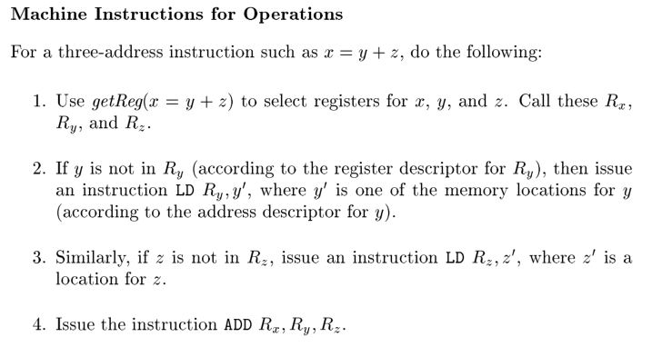
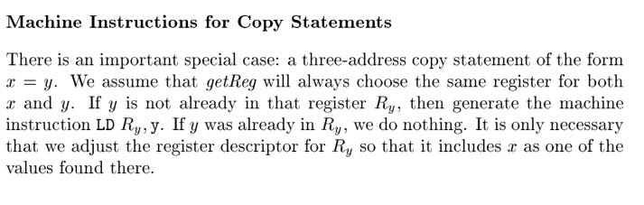
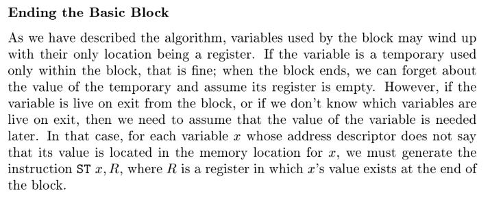
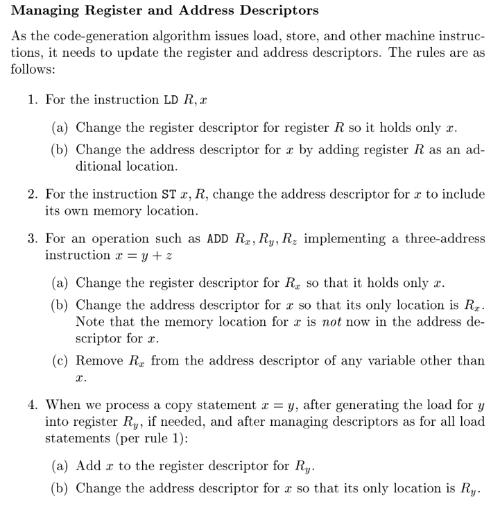
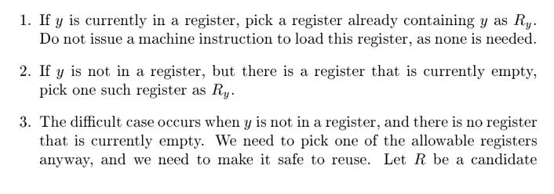
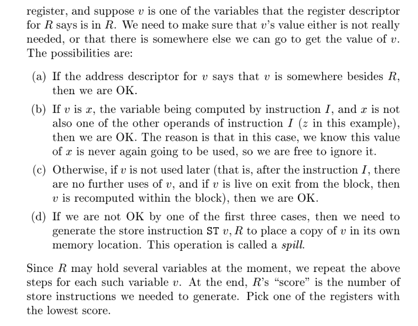
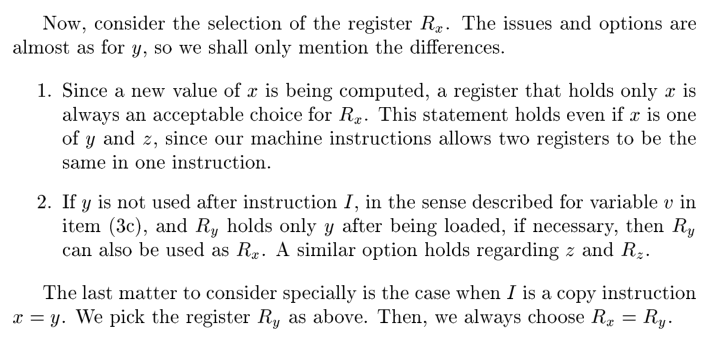

# 第8章 代码生成

代码生成器的主要工作：指令选择，寄存器分配和指派，指令排序

## 代码生成器设计中的问题
受到目标机器的指令集体系结构的很大影响。  
RISC 通常有很多寄存器、三地址指令、寻址简单和相对简单的指令集体系结构。  
CISC 通常具有较少寄存器、两地址指令、多种寻址方式、多种类型寄存器、可变长度指令、具有副作用的指令。  
基于栈的机器：通过把运算分量压入栈中，然后再对栈顶的运算分量进行运算。Java 虚拟机。  
使用绝对地址的机器语言：程序放在内存中的固定位置并能立即执行，很快地进行编译和执行。  
使用可重定位的机器语言程序（目标模块）：子程序可分别编译，但需要为链接和加载付出代价。  
输出汇编程序：代码生成过程更加简单，但需要增加额外的汇编步骤。

决定指令选择的因素：  

* IR 的层次：高层次 IR 通常使用代码模板将 IR 语句翻译为机器指令，但质量不佳；低层次 IR 反映了某些低层次细节，代码生成器利用这些细节生成更高效的指令。  
* 指令级体系结构本身的特性：统一性，以统一的方式支持每种数据类型（反面，浮点数运算使用单独的寄存器）  
* 目标代码质量：同一个 IR 程序可以用不同的代码序列实现，这些实现的代价有显著差别。  

寄存器分配：分配，在程序片段中，选择一组被存放在寄存器中的变量；指派，指定一个变量存放在哪个寄存器中。

求值顺序：在流水线计算机中会影响执行效率，这类计算机可以在一个时钟周期执行多个运算。

## 目标语言
目标机器：三地址机器，按字节寻址。类似常规 RISC 的加载和保存指令，允许多种寻址模式（直接寻址，寄存器偏移寻址，间接指针寻址，常数寻址），支持直接跳转和简单判断跳转。  
度量优化程序的指标：编译时间长短，目标程序的大小、运行时间和能耗。  
模型：一个指令的代价=1+与寻址模式相关的代价，对应指令中字的长度。寄存器为 0 ，涉及内存或常数的寻址则为 1。

## 目标代码中的地址
四个逻辑空间：静态代码区 Code （可执行目标代码），静态数据区 Static （常量和编译器生成的其他数据），动态堆区 Heap（程序运行时分配和释放的数据对象），动态栈区 Stack （过程的活动记录）。  

静态分配：将地址存放到一个确定的位置。每一个活动记录都静态地拥有一块空间，当 `call` 该记录时，将返回值 `ST` 到对应活动的位置，然后使用 `BR` 指令跳转，返回时读取该记录静态空间中存放的值，跳转回来。  
栈分配：在保存活动记录时，采用相对地址。使用寄存器 `sp` 指向栈顶的活动记录开始指针，使用关于 `sp` 的偏移来指向活动记录中的任意位置。  

名字的运行时刻地址：生成中间代码时，可能还不知道最终静态区域的位置，所以先用名字代替，这样能使编译器更易于移植。

## 基本块和流图
基本块：满足两个条件的最大连续指令序列：控制流只能从第一个指令进入（不能跳转到中间）；除了最后一个指令，控制流在离开该块前不会停机或跳转。  
流图：基本块构成了流图的节点，流图的边则指明控制流。

中断：中断会使控制流离开基本块，但这是无妨的。因为中断要么适当处理后返回引起中断的指令，要么程序中止并报错，两种情况都对基于基本块和流图的程序优化没有影响。

基本块的划分：先确定每个块的首指令（第一个指令，任意跳转的目标指令，任意跳转之后的指令），然后每个首指令对应一个从他开始到下一个首指令（不含）的基本块。

使用 use：三地址语句 i 给 x 赋值，如果语句 j 的一个运算分量为 x，且从 i 开始可以通过未对 x 赋值的路径到达 j，则 j *使用* 了在语句 i 处的 x 值。也称 x 在语句 i 处*活跃*。  
通过对每个基本块的反向遍历能确定*使用*的信息，这些信息可以存放到符号表中。

流图：基本块通过控制流组成流图，流图中的边有两种情况（无条件跳转和原来顺序的衔接）。  
流图中额外引入了入口和出口两个节点。入口指向流图的第一个可执行节点，而出口则被任何包含了可能是程序的最后执行指令的基本块指向。

循环：循环节点集合 L 的识别，存在一个循环入口，它是唯一的前驱可能在 L 之外的节点（从流图入口开始到 L 中的任意节点都必然经过它），且 L 中每个节点都有一个到达循环入口的非空路径，且该路径均在 L 内。  

## 基本块的优化
基本块的 DAG 表示：

* 每个变量在 DAG 中有一个节点表示初始值  
* 每个语句对应一个节点，其子节点是对应运算分量最后一次运算的语句或初始值对应的节点。  
* 存在一些输出节点，表示对应变量的值可能在流图的另一些基本块用到。

基本块上的代码优化：

* 消除局部公共表达式：当新的节点加入 DAG 中，检查是否有完全相同的节点（具有相同的运算符和子节点，且子节点顺序相同）  
* 消除死代码：在 DAG 上删除所有没有附加活跃变量的根节点。
* 代数恒等式：恒等式，局部强度消减（乘法变加法等），常量合并（编译时刻对常量表达式求值，必须使用和运行时刻相同的求值方法）。但需要注意，计算机算数可能不遵循数学上的恒等表达式。    
* 重新排序以降低一个临时变量需要保存在寄存器中的时间：  
* 用代数规则重排三地址指令中运算分量的顺序：

数组引用：注意到数组的引用比较特殊，一些公共子表达式可能并不成立。一个新的对数组的赋值，杀死前面所有的对数组的访问，使其无法成为公共子表达式，无法被复用。

如

```c
x = a[i]
a[j] = y
z = a[i]

//

b = 12 + a
x = b[i]
b[j] = y
```

指针赋值：一个通用的指针赋值可能杀死所有的 DAG 中节点，因为对指针的间接赋值和引用是任意的。但通常可以通过进行一些分析，把指针在代码中指向的位置限制在一个较小的子集内。  
过程调用：与指针类似，我们必须假设一个过程调用使用和访问了所有的数据，但如果有全局数据流信息，就可以把影响限制在较小的集合内。

从 DAG 重构基本块：指令的顺序遵循 DAG 中节点的顺序；对数组的赋值都得保持原来的顺序，同一个数组的求值可以交换顺序，但不能跨过赋值；一个变量的使用不能跨过在他之前和之后的过程调用和指针间接赋值。

## 简单代码生成器

假设的指令形式

```plain
LD reg, mem
ST mem, reg
OP reg, reg, reg
```

依次考虑每个三地址指令，决定需要哪些加载指令和保存指令。  
使用寄存器描述符，跟踪哪些变量的值存放在当前寄存器中；使用地址描述符，跟踪哪个位置上可以找到变量当前的值。

生成规则如下：









值得注意的是其中 `getReg` 的设计，它需要满足以下规则

对于 `getReg(x = y + z)`







## 窥孔优化
用于局部改进目标代码，窥孔即检查目标指令的一个滑动窗口。

* 冗余指令消除：比如加载后马上保存到同一位置。  
* 消除不可达代码：比如紧跟在无条件跳转后的不带标号的指令序列。  
* 控制流优化：比如跳转到跳转的指令，这些跳转指令是不必要的。  
* 代数化简和强度消减：比如把代价较高的运算替换为目标机器上代价较低的等价运算。  
* 硬件特有指令：比如一些机器允许的自增或自减寻址模式。

## 寄存器分配和指派
基本策略：分配固定多个寄存器来存放每个内部循环中最活跃的值，减少读写压力。

图着色方法：用于寄存器溢出时寻找可行的寄存器。该算法分为两趟，第一趟假定有无穷多个符号化处理器，将所有指令翻译为机器指令。第二趟则将符号化寄存器映射到物理寄存器，它构造了一个寄存器冲突图。该图中的每一个节点是一个符号化寄存器，对于任意两个节点，如果一个节点在另一个被定值的地方是活跃的，则两个节点之间就存在一条边。尝试在该图上进行 k 染色（没有相邻的两个点同色），k 是可指派的物理寄存器的数量。采用启发的方式进行这个染色，当无法再染时，则说明出现了溢出，对相应的寄存器引入保存和重新加载的代码。

## 通过树重写来选择指令
