# 第9章 机器无关优化

本章考虑的是全局代码优化问题，即考虑多个基本块。  
大部分全局优化方法是基于数据流分析技术实现的：对于程序中的每个指令，描述该指令每次执行时必然成立的一些性质。

## 优化的主要来源

编译优化必须保持源程序的语义。所以，通常编译器只能应用一些相对低层的语义转换。  
冗余：通常是高级程序设计语言的副产物（比如高层数据结构的访问，高维数组）。 

下面是一个例子：

快速排序算法：

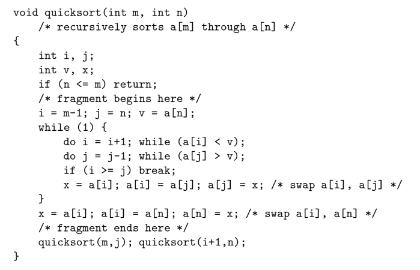

对应的直接生成的三地址运算序列及其流图

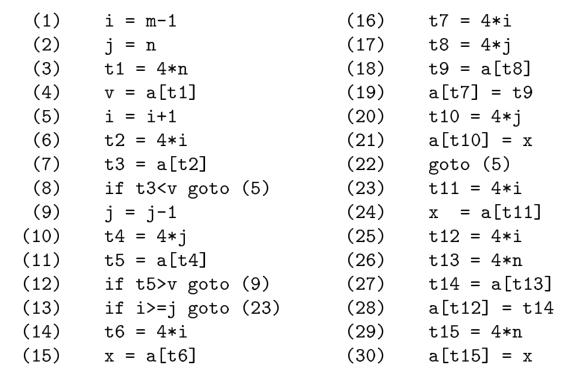

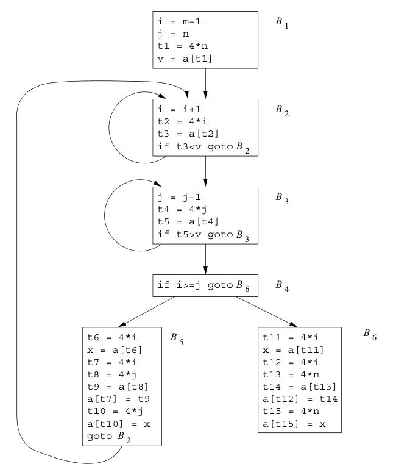

全局公共子表达式优化后（比如 B5 中的 t6, t7, t8, t10 和 B6 中的 t11, t12, t13, t15）：

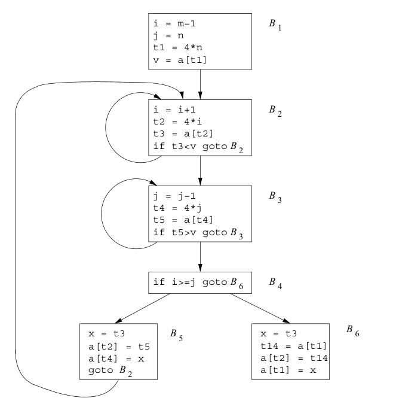

公共子表达式消除的同时，可能会引入额外的赋值语句，如下图：

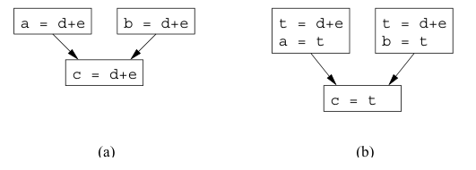

而赋值语句允许我们使用复制传播进一步优化。  
这里提到了一个观点，当出现赋值语句 `u=v` 后，尽可能用 v 来替代 u，这样能为后面的消除提供机会。  
下面是使用复制传播后，进一步优化的 B5。

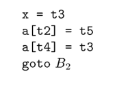

死代码消除：复制传播后，B5 可以进一步使用死代码消除来优化：

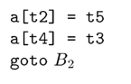

代码移动：主要针对循环，关注循环不变计算，将对它们的求值移动到循环之外，这样就以增加循环外代码的代价，减少了循环内的指令个数。

归纳变量和强度消减：归纳变量即循环中那个每次有规律地递增或递减的值。由于归纳变量是有规律地递增或递减的，所以循环内有关该变量的高代价运算（比如乘法）就可以替换为一个较低代价的运算（比如加法）。另外，如果有一组归纳变量的变化步调一致，我们可以进一步将其规约删减为一个。  
循环的优化处理通常是从里到外的。

下面是一个归纳变量的例子，关注到 B3 中的归纳变量 j 和与其相关的 t4。可以优化如下，注意到在循环入口增加了 t4 的初始赋值：

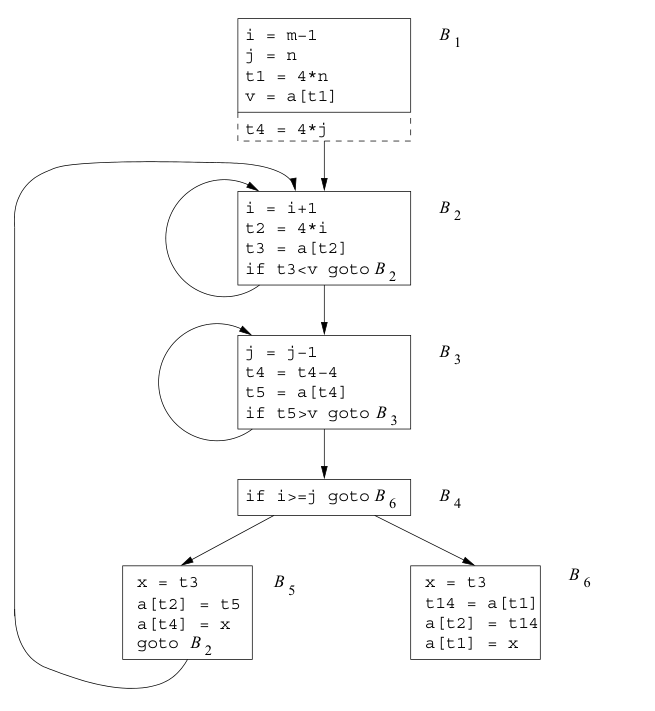

进一步的优化可以将 B2, B3, 中的 i,j 全部替换如下

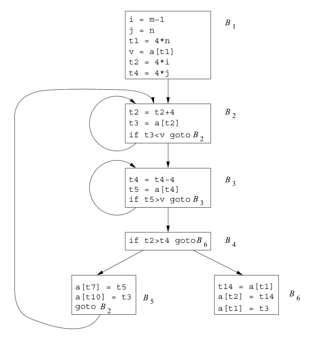

## 数据流分析简介

数据流抽象：将程序的执行看作是对程序状态的一系列转换。考虑经过一个语句的所有可能路径。一般来说，可能的执行路径也许有无穷多条，跟踪所有的程序状态也是不可能的。所以一般不区分路径之间的差异，也不跟踪整个状态，仅保留进行分析需要的数据。  
在数据流分析模式中，通常将每个**程序点**和一个**数据流值**关联起来。该值即为在该点可能观察到的所有状态的抽象表示。  

数据流问题：定义语句 s 之前和之后的数据流值为 $IN[s]$ 和 $OUT[s]$，数据流问题即是对一组约束求解，该约束限定了语句 s 的 $IN[s]$ 和 $OUT[s]$ 之前的关系。  
约束可以分为两类：基于语句语义（传递函数）的约束和基于控制流的约束。

在基本块上，由于内部的处理通常比较简单，所以可以节约相关分析的空间和时间。类似的，记基本块 B 的数据流值为 IN[B] 和 OUT[B]。

数据流方程通常没有唯一解，故其分析的目标是寻找一个最精确的满足两组约束的解。它能够支持有效的代码改进，但又不会导致不安全的转换。

下面给出几个例子。

### 到达定值

一种常见的数据流模式，当到达程序中的每个点时，每个变量 x 可能在程序中的哪些地方被定值。  
过程参数、数组访问和间接引用都可以有别名，故分析时需要保守。如果我们不知道一个语句是否给 x 赋了一个值，那么必须假定它可能对 x 赋值。本节中我们不考虑别名这样的情况。

传递方程：对于定值 $d: u = v + w$，该语句生成了一个变量 u 的定值 d，其传递函数可以表示为 $f_d(x) = gen_d \cup (x-kill_d)$，其中 $gen_d=\lbrace d \rbrace$，$kill_d$ 是程序中所有其他对 u 的定值。对于基本块的传递方程也是同理。  
控制流方程：对于基本块 B，有 $IN[B] = \bigcup_{P 是 B 的一个前驱基本块} OUT[P]$。  
我们采用迭代的方式来求解，记 $OUT[ENTRY]=\emptyset$，迭代地求解该方程组地最小不动点（即方程其他解所给出地值地子集）。算法流程是不断地向前传播各个定值，直到该定值被杀死。不断重复该过程，直到所有的值收敛。

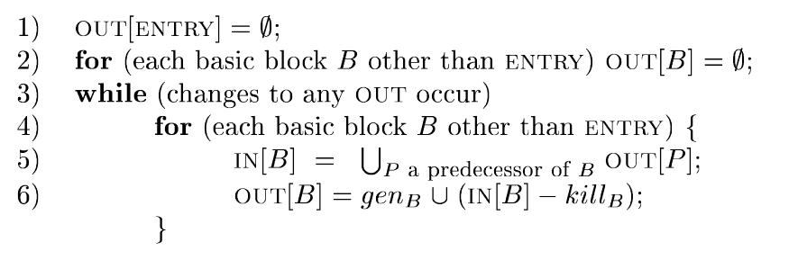

### 活跃变量分析

对于变量 x 和程序点 p ，x 在点 p 上的值是否会在流图中某条从 p 出发的路径中使用。该信息依赖程序控制流的相反方向进行计算。  
该分析可以用于寄存器分配。

定义 IN[B] 和 OUT[B] 分别为活跃变量集合。$def_B$ 为一个包含变量的集合，这些变量在 B 中的定值（赋值）先于任何使用；$use_B$ 则相反，是可能的使用先于定值。  
方程定义为 $IN[EXIT] = \emptyset$，$IN[B] = use_B \cup (OUT[B] - def_B), OUT[B]=\bigcup_{S 是 B 的后继}IN[S]$。  
使用上一节中迭代算法的类似版本，逆向传播即可求解最小不动点。

### 可用表达式

定义：从流图入口节点到程序点 p 的每条路径都对 x+y 表达式求值，且最后一个求值后没有对 x 或 y 重新赋值，则称 x+y 在 p **可用**。  
如果一个基本块对 x 或 y 赋值且之后没有再重新求 x+y，则称其杀死了表达式 x+y。  
如果一个基本块求 x+y 且之后未修改 x 或 y，则称其生成表达式 x+y。  
该信息主要用于寻找公共子表达式。  
方程为 $OUT[ENTRY]=\emptyset$, $OUT[B]=e\_gen_B \cup (IN[B]-e\_kill_B), IN[B]=\bigcap_{P 是 B 的前缀}OUT[P]$。  
与求解定值中相反的是，这里我们想要得到的是最大可用表达式集合的解，所以是先给出较大的近似值，然后逐步消减。

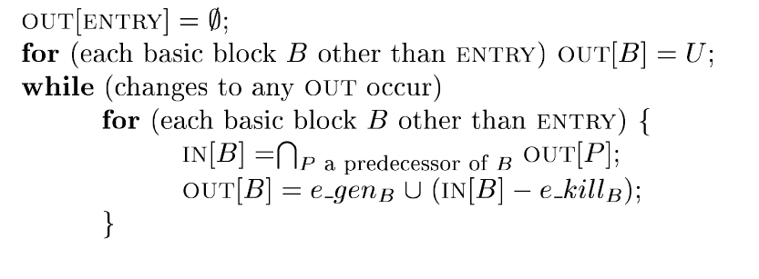

### 总结

下表展示了三个例子之间的区别

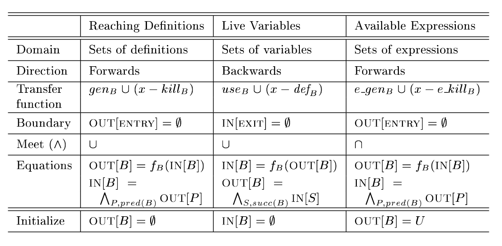

## 数据流分析基础

基本问题：迭代算法的正确性，解的精确程度，迭代算法是否收敛，解的含义。

定义**数据流分析框架** $(D, V, \wedge, F)$ 如下：

1. D 为数据流方向，取值包括 FORWARD 前向和 BACKWARD 逆向两种。  
2. 一个半格 semilattice，包含值集 V 和二元交汇运算 $\wedge$ 。  
3. 一个 V 到 V 的传递函数 F，其中必须包含可用于刻画边界条件的函数（即 ENTRY 和 EXIT 的常值函数）。  

### 半格

半格 semilattice 定义为：满足下列条件的集合 V 和一个二元交汇运算 $\wedge$ ，对于 V 中的所有 x,y 和 z：

1. 等幂： $x \wedge x=x$  
2. 可交换：$x \wedge y = y \wedge x$  
3. 结合律：$x \wedge (y \wedge z) = (x \wedge y) \wedge z$

半格包含一个**顶**元素 $\top$ 满足对于 V 中所有的 x 有 $T \wedge x=x$ ；可能有一个**底**元素 $\bot$ 满足对于 V 中所有的 x $\bot \wedge x=\bot$。

偏序：设 $\le$ 为 V 上的一个关系，如果对于 V 上所有的 x,y 和 z 都有：

1. 自反 $x \le x$  
2. 反对称： 如果 $x \le y$ 且 $y \le x$，则有 $x=y$  
3. 传递：如果 $x \le y$ 且 $y \le z$，则有 $x \le z$

二元组 $(V, \le)$ 就被称为偏序集，定义 $x < y$ 当且仅当 $x \le y$ 且 $x \neq y$ 。

一个半格的交汇运算定义了值域上的一个偏序。对于 V 中所有的 x 和 y ，定义 $x \le y$ 当且仅当 $x \wedge y=x$ .

最大下界。定义 域元素 $x, y$ 的最大下届是满足下列条件的元素 $g$：$g \le x$ 且 $g \le y$ 且如果 $z$ 满足 $z \le x, z \le y$ 那么 $z \le g$。  
注意到 x 和 y 的交汇运算值就是它们的唯一最大下界。

> 并函数、最小上界和格  
> 类似最大下界，也可以定义最小上界 $b$：$x \le b, y \le b$ 且如果 $z$ 满足 $x \le z, y \le z$ 都有 $b \le z$ 。可以证明，若最小上界 b 存在，则唯一。  
> 在一个真的**格**中有两个域上的运算，与我们讨论的 $\wedge$ 交汇运算对应，有并函数 $\vee$。并函数给出了两个元素的最小上界。  
> 我们讨论的半格其实是交半格，另外也可以使用并半格。 

格图：下图是一个例子。我们可以很方便地从该图上读出交汇值，此时 $x \wedge y$ 为最大下界。这个值总是最高的。

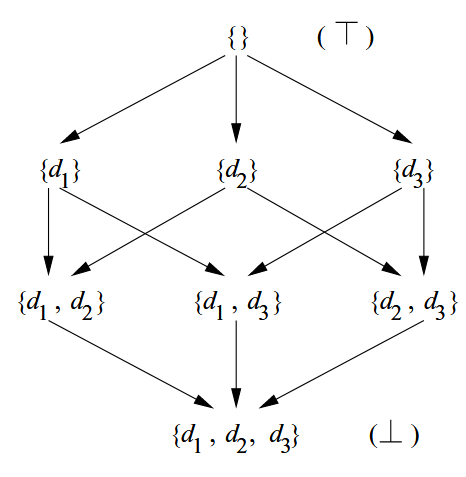

乘积格：假设 $\lbrace A, \wedge_A \rbrace$ 和 $\lbrace B, \wedge_B \rbrace$ 是两个半格，其乘积格定义如下：

1. 乘积格的域为 $A \times B$  
2. 乘积格的交汇运算定义为，如果 $(a, b)$ 和 $(a', b')$ 是乘积格域中的元素，那么 $(a, b) \wedge (a', b')=(a \wedge_A a', b \wedge_B b')$  
3. 乘积格的偏序定义为 $(a, b) \le (a', b')$ 当且仅当 $a \le_a a'$ 且 $b \le_b b'$

上述定义的格的乘积，是一个满足结合律的运算，故上述定义可以扩展到多个格。

半格的高度：研究半格的高度，可以知道数据流分析算法收敛的信息。定义偏序集 $(V, \le)$ 中的一个**上升链**是一个满足 $x_1 < x_2 < \cdots < x_n$ 的序列，半格的高度即为所有上升链中 $<$ 关系个数的最大值。如果一个半格具有有穷的高度，就可以比较容易地证明其迭代数据流算法的收敛性。一些具有无穷多个值的格也可能具有有穷的高度。

### 传递函数

数据流框架中的传递函数族 $F: V \to V$ 具有下列性质：

1. 存在单元函数 I，使得对于 V 中所有 x 都有 $I(x)=x$  
2. 对函数组合运算封闭。即对于 F 中的任意函数 f 和 g，$h(x)=g(f(x))$ 也在 F 中。

单调框架：一个数据流框架是单调的，当且仅当对于所有 V 中的 x 和 y 以及 F 中的 f，$x \le y$ 蕴含 $f(x) \le f(y)$，也可以等价定义为 $f(x \wedge y) \le f(x) \wedge f(y)$  
可分配的框架：在单调上遵循一个更强的条件（可分配条件），对于 V 中所有的 x 和 y 和 F 中的 f，有 $f(x \wedge y)=f(x) \wedge f(y)$

### 通用框架的迭代算法

类似前文中给出的三个例子，我们可以将该算法推广，使之处理各种数据流问题

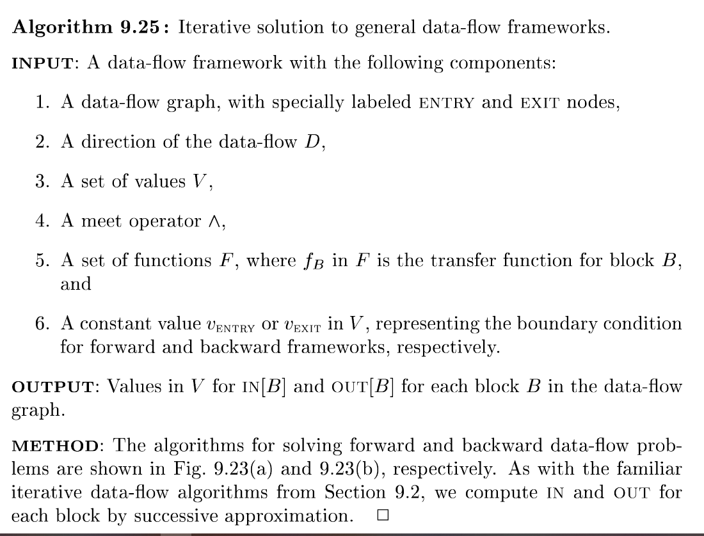

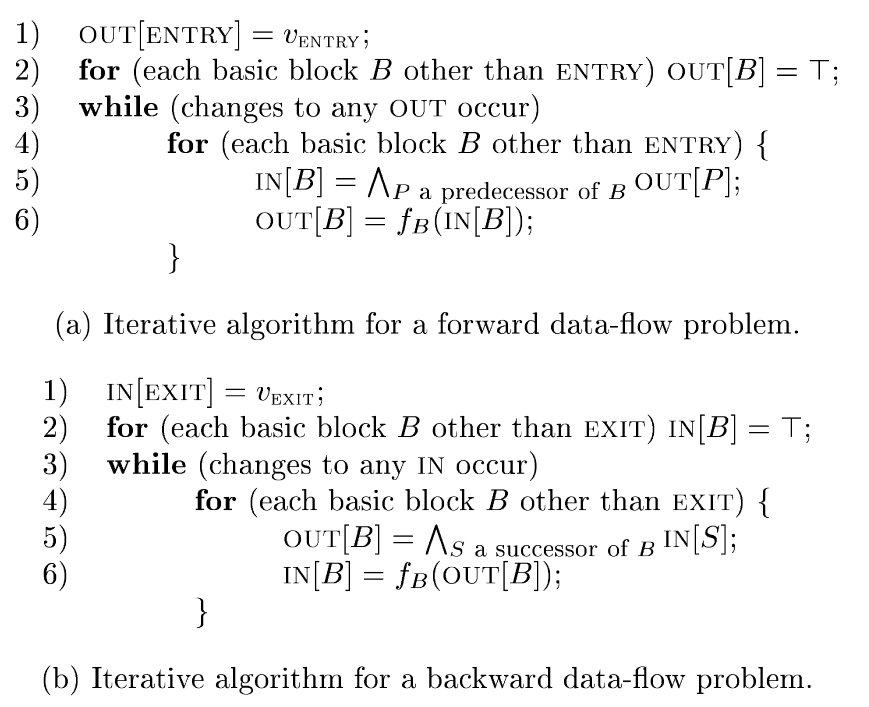

##  常量传播

常量传播：把每次运行时总是得到相同常量值的表达式替换为该常量值。  
不同之处：可能的数据流值集合是无界的；不是可分配的。

### 数据流值

其数据流值是一个乘积格，每个份量对应程序中的一个变量。  
一个变量的格的元素包括：所有符合该变量类型的常量值，NAC(not-a-constant)，UNDEF（未定义）。  
一个典型的半格如下所示

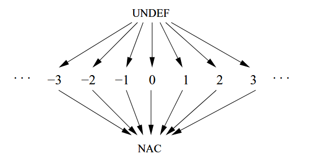

因此有 $UNDEF \wedge v=v, NAC \wedge v = NAC, c \wedge c=c$，对于两个不同的常量 $c_1, c_2$ 有 $c_1 \wedge c_2=NAC$

### 传递函数

下面假设一个基本块只包含一个语句（包含多个的可以将对应的传递函数组合起来构造得到）。  
函数集合 F 由一组传递函数组成，他们接收的输入是一个从程序变量到常量格中元素的映射，返回值也是这样一个映射。  
记变量 v 在映射 m 中的值为 $m(v)$。  

F 包含单元函数，返回与输入相同的映射。  
F 包含对应于 ENTRY 节点的常值传递函数，对于任意输入的映射都返回 $m_0$。 $m_0$ 定义为，对任意 v 都有 $m_0(v)=UNDEF$ 。

对于一般的情况，$f_s$ 为语句 s 的传递函数，令 $m, m'$ 表示满足 $m'=f_s(m)$ 的两个数据流值，用 $m, m'$ 的关系来描述 $f_s$：

1. 如果 s 不是一个赋值语句，那么 $f_s$ 为单元函数。  
2. 如果 s 是一个对变量 $x$ 的赋值，那么对于所有的变量 $v \neq x$，$m'(v)=m(v)$，而对于 $m'(x)$ 的定义为：a) 如果语句 s 的右部是一个常量 c ，那么 $m'(x)=c$ ；b) 否则，如果右部形如 $y+z$ 那么：i) m(y)+m(z)，若两者都是常量值；ii) NAC，m(y) 或 m(z) 为 NAC ；iii) UNDEF，其他情况；c) s 的右部是其他表达式（如函数调用，指针赋值），那么 $m'(x)=NAC$

常量传播框架是单调的，但不是可分配的。

## 部分冗余消除

目标：减少表达式求值的次数。  
考虑流图中可能的执行顺序，移动对 x+y 求值的位置，并在必要时将求值结果保存在临时变量中。

冗余的来源：公共子表达式，循环不变表达式和部分冗余表达式。下图展示了三种冗余，以及其优化后的代码。

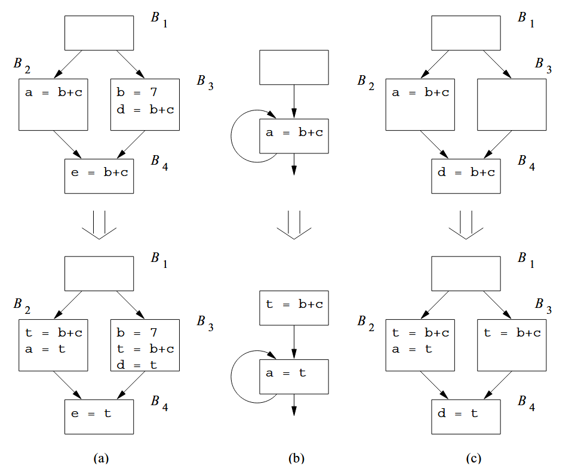

除非创建新的基本块来改变流图，否则我们不能消除各条路径上的所有冗余计算。下图是一个例子，其中我们可以选择在 B3-B4 这条路径上插入 B6 块，在其中添加 `t=b+c` 来消除 B4 中的冗余。像这种，从一个具有多个后继的节点，移动到另一个具有多个前驱的节点的边，定义为流图的关键边。

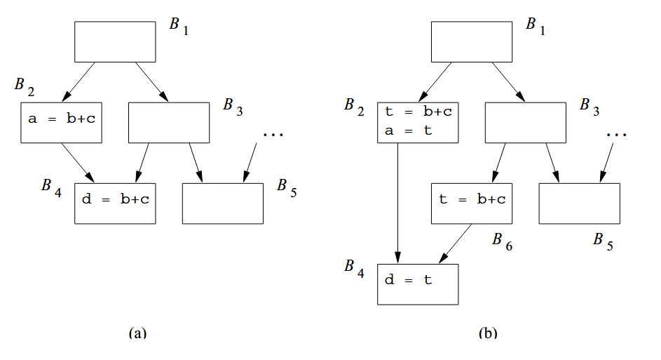

但这一复制也可能引入额外的开销。下图是一个例子，为了消除 B1-B2-B4-B6 中 B6 的冗余计算，需要额外复制一条路径出来。考虑到程序中路径数目与条件分支的指数关系，消除所有的冗余表达式可能会大大增加优化后代码的大小。

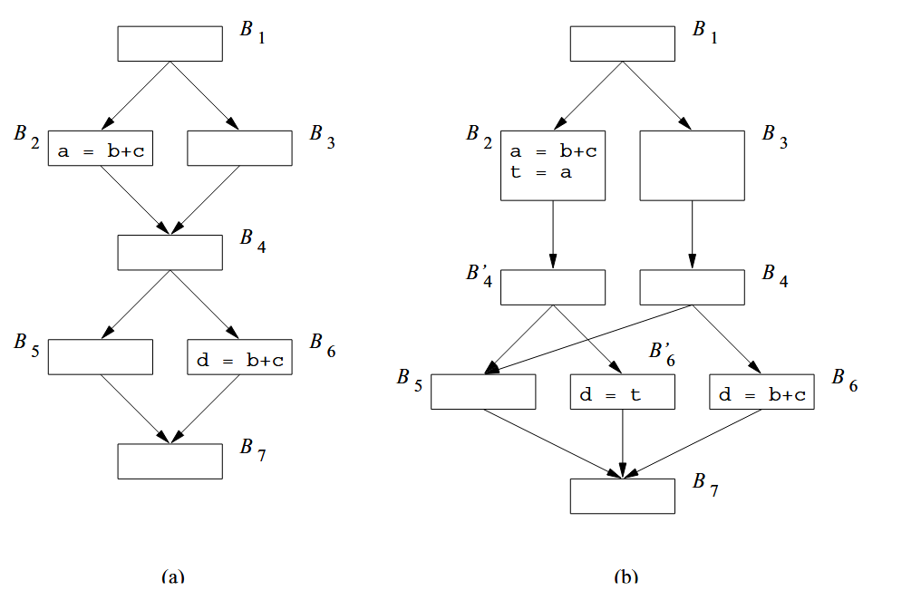

### 懒惰代码移动问题

期望优化后的程序具有以下性质

1. 所有不复制代码就可以消除的表达式冗余计算均被消除。  
2. 优化后的程序不会执行原来程序中不执行的任何计算。  
3. 表达式的计算时刻应该尽量靠后。

完全冗余：在到达基本块 B 的所有了路径中，表达式 e 已被求值且运算分量在之后不变，那么 B 中的 e 就是冗余的。令 S 是那些令 B 中 e 冗余且包含 e 的基本块的集合，所有从 S 出发的边必然形成一个割集，即把这些边删除会使基本块 B 与入口点分离。  
部分冗余：如果 e 仅是部分冗余，算法将在流图中放置 e 使其变成完全冗余。

### 表达式的预期执行

约束：保证优化后的程序不会执行额外的运算。  
一个表达式的各个拷贝，其防止的程序点必须**预期执行**该表达式。即，若原本存在路径经过该程序点，但它原本不执行该表达式，那么这里就不应该放置该表达式。  
预期执行限制了一个表达式最早可以被插入到何处。

考虑一个无环路径 $B_1 \to B_2 \to \cdots \to B_n$ ，假设表达式 e 仅在 $B_1$ 和 $B_n$ 求值，且其运算分量在中间不变。那么 e 在基本块 $B_i$ 肉蔻没有被预期执行，当且仅当存在 $i \le j < n$ 满足 $B_j$ 通向一条不适用 e 的值的执行路径。  
基于此，我们可以创建一个关于 $B_{i-1} \to B_i$ 的割集。如果 e 在 $B_i$ 入口可用或被预期执行，这个割集就使 e 在 $B_n$ 中冗余；如果 e 在 $B_i$ 入口处被预期执行却不可用，那么就需要在这条进入$B_i$ 的边上放置一个拷贝。   
流图中通常有多个割集满足该条件，而这里给出的则是一个在不引入冗余计算的条件下，尽可能使表达式的计算靠近对表达式使用的方案。

### 懒惰代码移动算法

该算法包含四个步骤。

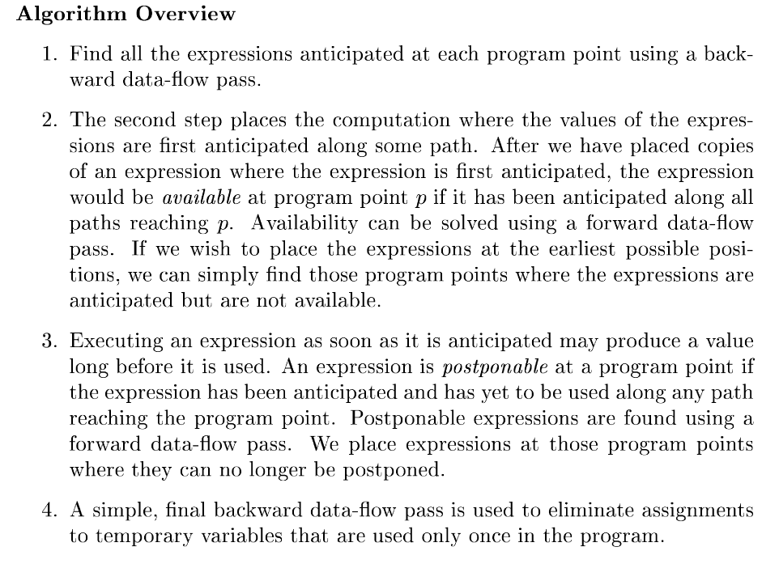

这是四个数据流分析问题。  

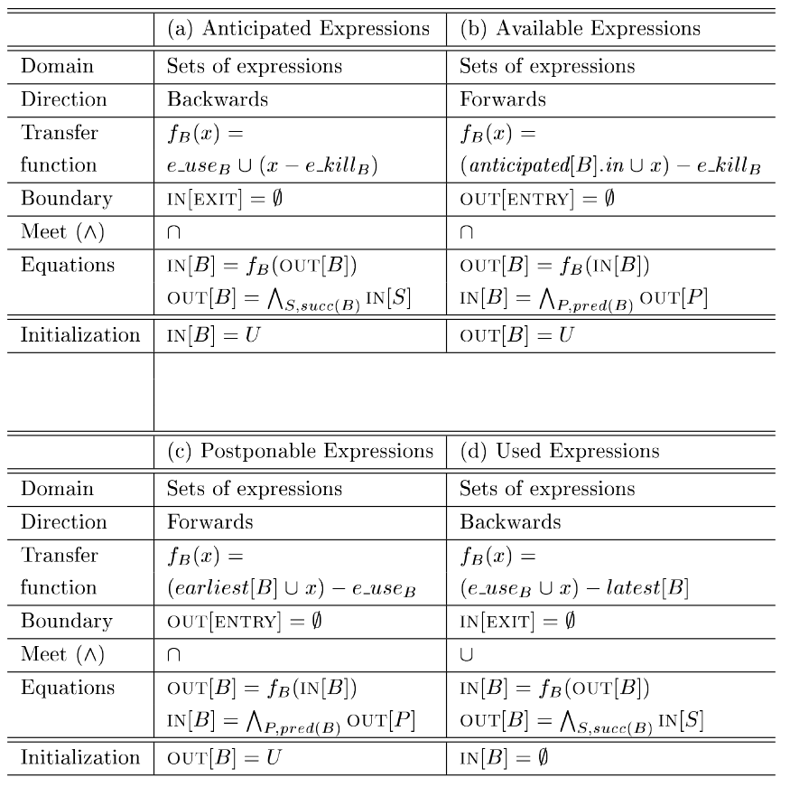

最终总的算法如下

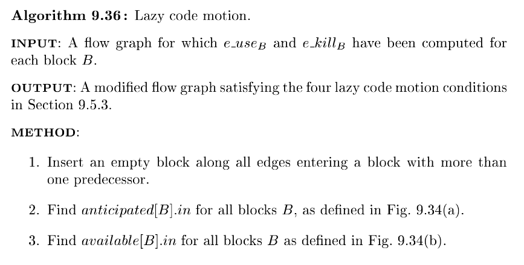

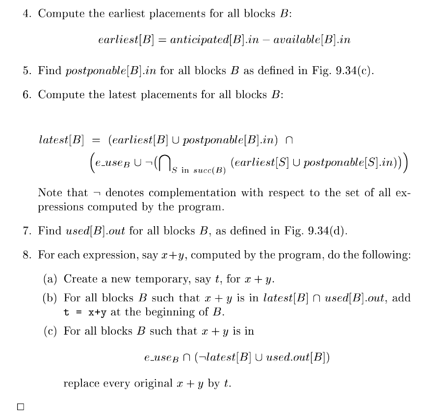

