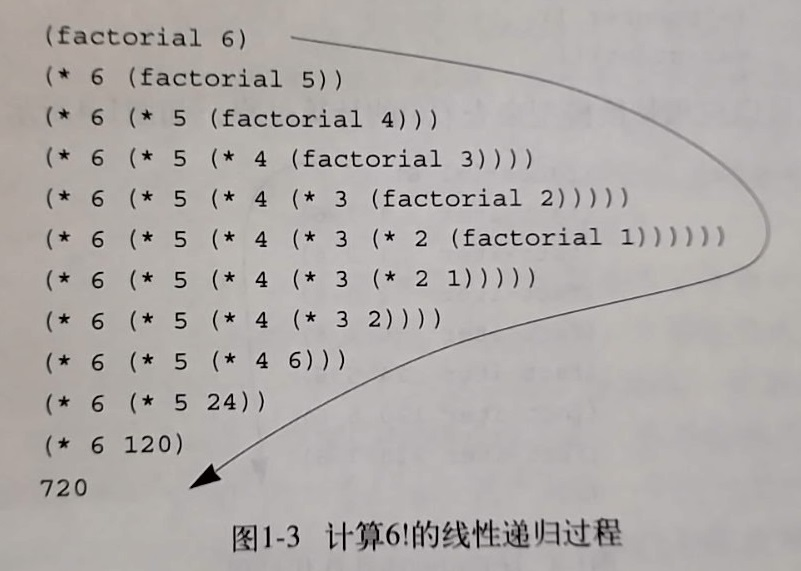
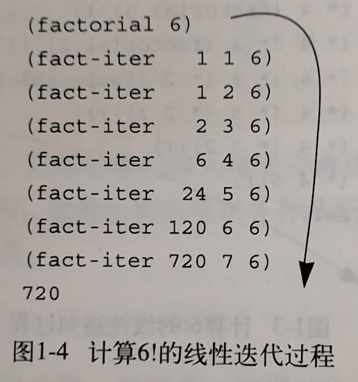

# 第1章 构造过程抽象

计算过程：存在于计算机内的一类抽象事物，去操作被称为**数据**的抽象事物。人们用**程序**来指导这类过程的进行。

使用 Lisp 编程：用 Lisp 表述过程性的思想，对某种特定形式的逻辑表达式（称为递归方程）的使用作推理。最早是一种数学记述形式，提供符号计算的能力并解决一些程序设计问题，包含称为原子和表的数据对象。  
Lisp 的独特特性：计算过程的 Lisp 表述（称为**过程**）本身又可以作为 Lisp 的数据来表示和操作。

## 程序设计的基本元素
一个好的程序设计语言，不仅要能指导计算机进行计算任务，还应该是便于人在其中组织计算过程思想的框架。对于每一种语言，我们将关心以下三个方面：

* 基本表达形式：用于表示语言所关心的最简单的个体
* 组合的方式：从较简单的东西出发构造复合元素
* 抽象的方法：为复合对象命名，并当作一般单元来操作

在程序设计中，我们关注过程和数据这两个元素（实际上这两者并无严格区分）。根据上述的定义，程序设计语言应该提供基本数据和过程的表达，以及对数据和过程进行组合和抽象的方法。

### 表达式
第一种基本表达式是数字，如给 Lisp 一个数 `1`，其解释器会返回 `1`。  
使用括号括起一些表达式，形成一个表来表示过程应用，这样的表达式被称为**组合式**，其基本形式为 `(运算符 运算对象若干)`，如 `(+ 1 2 3)`。这一定义将运算符放在所有运算对象的左边，故被称为**前缀表示**，它能方便地适用于任意个实参的过程。  
组合式的元素本身也可以是组合式，即允许嵌套，如 `(+ (* 1 2) (- 3 4))`。在写很长的组合式时，可以将其中的各个运算对象垂直对齐，以直观地显示出表达式的结构。  

### 命名与环境
任何一种程序设计语言都必须有这样一种设计，即它需要提供一种方式通过名字去使用计算对象。在 Lisp 中，将名字标识称为**变量**，使用 `define` 的方式来定义，如 `(define size 2)`。  
`define` 即是一种最简单的抽象。构造一个复杂的程序就是用逐步的抽象，从简单的对象开始创造更复杂的计算性对象。一个 Lisp 程序通常是由很多相对简单的过程组成的。  
我们可以将值与符号相关联，而后又能从符号中提取出值，这意味着解释器必须提供一种**环境**来存储有关名字-值的关系。环境用于确定表达式中各个符号的意义，它为求值过程的进行提供了一种上下文。

### 组合式的求值
解释器在求解一个组合式时，会进行步骤：

1. 求该组合式的各个子表达式
2. 将作为最左子表达式（运算符）的值的那个过程应用于相应的实际参数，即其它子表达式（运算对象）的值

这一规则从定义上要求对一个组合式的求值过程是**递归**的。我们可以用一棵树的形式来表示组合式的求值过程，而递归是处理这一层次性结构强有力的技术。这种计算过程被称为**树形积累**。运用递归的方式，我们总可以走到求值的某一点是基本表达式，比如数、内部运算符或其它名字，对基本表达式的处理是自然的。我们甚至可以将内部运算符也堪称名字，只需要将像 `+` 和 `*` 一类的运算符也包含在全局环境里，并将相应的指令序列作为与之关联的“值”。

值得注意的是，上述规则中并没有处理定义，即 `(define x 2)` 并不是组合式。这被称为**特殊形式**，后面还会接触到其它特殊形式，每个特殊形式都有其自身的求值规则。Lisp 有着比较简单的语法，对各种表达式的求值规则可以描述为一个简单的通用规则和一组少量特殊形式的规则。

### 复合过程
**过程定义**是对操作的抽象，它为复合操作提供名字，然后我们就可以将这一操作作为单元来使用。其一般形式为 `(define (<name> <formal parameters>) <body>)`，比如计算平方的过程定义可以是 `(define (square x) (* x x))`。  
解释器在解释复合过程时，也是按照一般组合式的求值办法来计算，即首先对组合式的各个元素求值，然后将得到的过程应用于实际参数。  
将复合过程应用于实际参数，就是将过程体中的每个形参用相应的实参取代之后，对这一过程体求值。这一过程被称为**代换模型**。值得强调的是，代换仅仅是帮助我们理解过程调用的情况，而不是对解释器实际工作方式的具体描述，实际上，通常的解释器采用提供形式参数的局部环境的方式。  
从原理上，解释器有两种方式来对表达式求值，我们称之为**应用序**和**正则序**，前者先求值而后应用，后者先完全展开而后归约。可以证明，对于那些可以通过替换去模拟并能产生出合法值的过程应用，两种序将得到相同的值。但也有不同的例子，这些例子可以用来检测解释器究竟是使用哪种方式来求值。在这里，Lisp 采用应用序求值，部分因为这样可以避免对表达式的重复求值从而提高效率。更重要的原因是，当超出了能采用替换的方式模拟的范围后，正则序的处理会变得更复杂。

### 条件表达式和谓词
在 Lisp 中针对分情况分析的特殊形式，有特殊语法 `cond`，其形式如下：

```lisp
(cond (<p1> <e1>)
      (<p2> <e2>)
      ...
      (else <en>))
```

其中最后的 `else` 是可选的。这一定义中，首先包含符号 `cond`，后面跟着若干**子句**表达式对偶。每个对偶的第一个表达式是**谓词**，其值被解释为真或假。  
条件表达式求值时，首先求谓词 `p1` 如果是 `false` 则求 `p2` 一直进行直到某个谓词的值为 `true`，此时解释器返回对应子句中**序列表达式**`e` 的值，以这个值作为整个条件表达式的值。  
谓词可以是基本谓词`< = >`，也可以是逻辑复合运算符`and or not`，其中前两个是短路的，比如对于 `and` 解释器从左至右一个个求值，如果遇到一个假，那么后面的表达式便不再求值。由于 `and or` 的子表达式不一定都求值，所以这两个都是特殊形式而不是普通的过程。

> 注：在 `Scheme` 中存在两个特殊值 `#t, #f`，当解释器检查谓词的值时，将 `#f` 解释为假，其它的解释为真。为方便理解，这里用 `true` 和 `false` 代替，分别关联 `#t` 和 `#f`。

另外一种特殊形式是 `if`，它是条件表达式的一种受限形式，适用于仅有两种情况时，其定义为 `(if <predicate> <consequent> <alternative>)`，首先求值 `<predicate>`，若为真则求值 `<consequent>` 并返回否则求值 `<alternative>`并返回。

### 过程作为黑箱抽象
过程定义隐去了实现的细节，过程的使用者可以不必弄清楚具体的实现，只需要当作一个黑箱来使用。

为保持黑箱的功能，即不影响外部环境，过程的形式参数发挥了重要作用。形式参数的具体名字是什么与其功能无关，这样的名字被称为**约束变量**，一个过程的定义**约束**了它的所有形式参数。反之，如果一个变量不是被约束的，则称其是自由的。

在构造复杂过程时，我们可能会需要构造很多子过程来辅助，很多时候，这些子过程只是在这一复杂过程中使用，为防止与其它复杂过程中的子过程重名，可以采用过程局部化的方式，将子过程放置在嵌套的块中，比如：

```lisp
(define (sqrt x)
    (define (good-enough? guess x)
        (< abs (- (square guess) x)) 0.001))
    (define (improve guess x)
        (average guess (/ x guess)))
    (define (sqrt-iter guess x)
        (if (good-enough? guess x)
            guess
            (sqrt-iter (improve guess x) x)))
    (sqrt-iter 1.0 x))
```

这样定义在**内部块**中就能将名字包装在内部。这一方法的另一好处是，可以通过改变约束情况来简化调用。比如在上例中的 `x`，其定义域约束在 `sqrt` 内，而内部的 `good-enough improve sqrt-iter` 等函数也都在内，那么就不必要显式地在这些函数之间传递了，可以让 `x` 称为内部定义中的自由变量。这一方法被称为**词法作用域**，要求过程中的自由变量实际引用外围定义中所出现的约束，即应该在定义本过程的环境中去寻找。

```lisp
(define (sqrt x)
    (define (good-enough? guess)
        (< abs (- (square guess) x)) 0.001))
    (define (improve guess)
        (average guess (/ x guess)))
    (define (sqrt-iter guess)
        (if (good-enough? guess)
            guess
            (sqrt-iter (improve guess))))
    (sqrt-iter 1.0))
```

## 过程及其产生的计算
下面我们将了解程序设计中有用的常见模式，以及有关的价值、执行效果判断。  
一个过程就是一种模式，描述了计算过程的局部演化方式，即一计算过程中的每个步骤是怎样基于前面的步骤建立起来的。下面讨论一些典型的计算模式。

### 线性的递归和迭代
一个计算阶乘的递归

```lisp
(define (factorial n)
    (if (= n 1)
        1
        (* n (factorial (- n 1)))))
```

一个计算阶乘的迭代

```lisp
(define (factorial n)
    (fact-iter 1 1 n))
(define (fact-iter product counter max-count)
    (if (> counter max-count)
        product
        (fact-iter (* counter product)
            (+ counter 1)
            maxcount)))
```

两个程序都是计算阶乘，但计算过程的“形状”却大不相同。下面两张图分别形象地展示了递归和迭代的计算“形状”



在递归模型中，使用代换的方式揭示出一个先逐步展开后收缩的形状。在展开的过程中，形成一个推迟进行操作的链条，而在收缩阶段再对这些运算实际执行。解释器需要为这类计算过程维护以后返回时执行操作的轨迹，在这个例子中，需要保存的信息量随着 n 值线性增长，故也称这样的计算过程为线性递归过程。



在迭代模型中，计算过程中不存在增长或收缩，在轨迹中始终只有 `product, counter max-count` 的当前值需要保存。一般化的，迭代计算过程指的是其状态可以用固定数目的状态描述变量描述的计算过程，并定义了一套规则来描述从迁移状态转移到下一状态时，各变量的更新方式，同时一般还有对计算结束的检测。在这个例子中，所需要的计算步骤随着 n 线性增长，故也称这样的计算过程为线性迭代过程。

> 注：递归计算过程与递归过程的区别：
> 前者指的是计算过程具有某种模式，而后者指的是语法上一个过程的定义中直接或间接地引用了自身。
> 很多语言的实现中，对递归过程的解释要求其消耗的资源与调用数目成正比，但 `Scheme` 的实现保证了能在常量空间中执行迭代型计算过程，即使代码上是用递归实现的。具有这一特性的实现又称为尾递归的。

### 树形递归
考虑斐波那契数列的计算过程

```lisp
(define (fib n)
    (cond ((= n 0) 0)
          ((= n 1) 1)
          (else (+ (fib (- n 1))
                   (fib (- n 2))))))
```

在这一计算过程中，除了最下层以外的每层分裂出两个分支。我们可以看到，这样的递归做了太多的冗余计算，更具体地可以算出计算步骤数将随着输入规模的增长而指数型增长，但其需要的空间仅仅是线性增长的。  
具体到斐波那契数列的例子，我们当然可以简单地改写成线性迭代的方法。

```lisp
(define (fib n)
    (fib-iter 1 0 n))
(define (fib-iter a b count)
    (if (= count 0)
        b
        (fib-iter (+ a b) a (0 count 1))))
```

### 增长的阶
不同的计算过程在消耗计算资源的速率上可能存在巨大的差异，为描述这一差异，可以采用**增长的阶**的记法。  
对于某一问题，我们给出参数 n 作为问题规模的一个度量，并记 $R(n)$ 为该计算过程在处理规模为 n 的问题时所需的计算量。若存在 $f(n)$ ，存在与 `n` 无关的整数 $k_1, k_2$ 使得 $k_1f(n) \le R(n) \le k_2f(n)$ 对任何足够大的 n 都成立，则称 $R(n)$ 具有 $\Theta(f(n))$ 的增长阶，记为 $R(n) = \Theta(f(n))$

## 用高阶函数做抽象
在前面，我们仅将数作为参数，下面将把过程本身作为参数或返回值，这类能操作过程的过程被称为**高阶过程**。

### 过程作为参数
考虑求和、求平方和、求立方和或是一般化的求某个函数的若干规律性取值的和这类计算过程，我们可以从数学上抽象出一种公共模式 $\sum _ {i = a} ^ b f(i)$。这种抽象能够让我们去处理求和这一概念本身，而不是只关注于一个特定的求和过程。在 lisp 中，我们可以定义这样一个抽象的求和计算过程。

```lisp
//递归
(define (sum term a next b)
    (if (> a b)
        0
        (+ (term a)
           (sum term (next a) next b))))
//迭代
(define (sum term a next b)
    (define (iter a result)
        (if (> a b)
            result
            (iter (next a) (+ result (term a)))))
    (iter a 0))
```

在这里 `term` 相当于数学中的 `f(i)`，而 `next` 定义了参数变量的增长方式。而定义了 `sum` 后，我们就可以很方便地将它作为基础构建去定义其它概念。  
上述 `sum` 还可以进一步抽象，比如将其中的加法操作抽象为一般性的组合运算，将 `next` 进一步抽象为对某一指定类型参数的过滤器（如质数）。

### 用 `lambda` 构造过程
使用 `lambda` 方法能直接构造需要的计算过程而不需要提前定义其名字，其基本形式为 `(lambda (<formal-parameters>) (<body>))`，类似于不需要给出名字的 `define`。  
比如对于上面的 `sum`，假设需要构造一个计算平方和的计算过程，可以用`lambda`这样定义。

```lisp
(define (square-sum a b)
    (sum (lambda (x) (* x x))
         a
         (lambda (x) (+ x 1))
         b))
```

在这个例子中，使用 `lambda` 构造过程避免了需要另外定义 `term` 和 `next` 的具体辅助过程。

`lambda` 的另一个应用是创建局部变量，这一形式被记作 `let`，其一般形式是

```lisp
(let ((<var1> <exp1>)
      (<var2> <exp2>)
      ...
      (<varn> <expn>)
     <body>)
```

这里前一部分是名字-表达式的对偶表，这些名字的作用域就是该 `let` 的体，这样定义能使局部变量约束的定义尽可能接近使用位置。需要注意的是，变量的值是在 `let` 之外计算的，比如若 `x` 的值是 2，那么下面的表达式中 y 的值是 4 而不是 5，继而 `let` 体计算出的值应该是 12。

```lisp
(let ((x 3)
      (y (+ x 2)))
     (* x y))
```

### 过程作为返回值
既然过程能作为参数传递，那自然也可以作为返回值本身，即一个过程的返回值也是一个过程，下面是一个平均阻尼的例子。


```lisp
(define (average-damp f)
    (lambda (x) (average x (f x))))
```

注意到这个例子中，传入的参数 f 是一个过程，返回的 `lambda` 表达式也是一个过程。

### 抽象和第一级过程
从上面我们可以看出吗，复合过程是一种非常重要的抽象，它能使我们将一般性的计算方法，用程序设计语言中提供的元素准确地描述出来。高阶函数能操作这些一般性方法，以建立进一步的抽象。  
一般而言，程序设计语言都会对计算元素的使用方式加上某些限制，其中限制最少的元素被称为具有**第一级**的状态。第一级元素通常具有以下特殊之处：

* 可以用变量命名。
* 可以提供给过程用作参数
* 可以由过程作为结果返回
* 可以包含在数据结构中

在 Lisp 中，过程拥有完全的第一级状态，并由此获得了惊人的描述能力。
