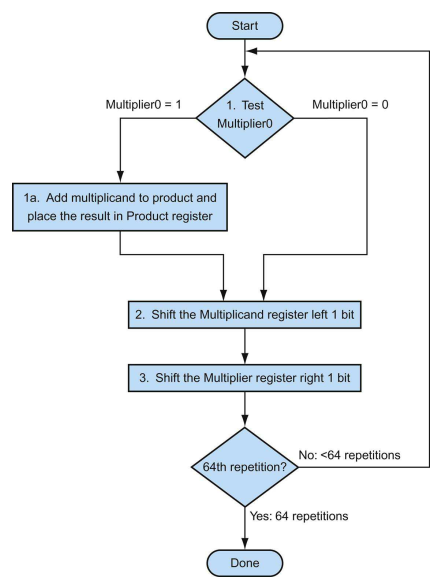

# 第 3 章 计算机的算术运算

## 加减法与溢出
对于有符号整数的加减法，若两个正数相加得到负数、或者两个负数相加得到正数，则说明出现了加法溢出。正数与负数的加法不会发生溢出。若正数减负数得到负数结果或者负数减正数得到正数结果，则说明出现了减法溢出。  
对于无符号数的加减法，如果总和小于加数中的任何一个，则出现加法溢出；如果差大于被减数，则出现减法溢出。

饱和操作：当计算溢出时，结果设置为最大正数或者最小负数（而不是采用二进制补码的取模计算）。更适合于多媒体操作，标准指令系统的多媒体扩展通常提供饱和计算。

加法的速度取决于向高位进位的计算速度。可以用多种方式预测进位，但通常预测信号越快，需要的门也就越多。

## 乘法
串行版本：模仿手工计算，将被乘数每一轮向左移动一位，根据乘数对应位决定是否累加到最终的结果积中。可以通过将操作并行执行使得每一步只花费一个时钟周期。

一些编译器会将短常数的乘法运算替换为一系列的位移和加法运算。  
对于带符号的乘法，在移位时对带符号的数进行符号扩展即可。

快速乘法：在乘法运算开始时检查 64 个乘数位，以此来判断是否要将被乘数加上。这样为每一位上的被乘数提供一个 64 位加法器，然后通过并行树将所有计算结果加和。这样就能在 6 次 64 位长加法时间内完成乘法。使用进位保留加法器，能作到比 6 次加法更快。同时，该设计能方便地流水化，这以同时支持多个乘法。

在 RISC-V 中，有关乘法的有 4 条指令：`mul` 是整数 64 位乘法，`mulh` 是取 64 位有符号乘法的 128 位结果的高 64 位，`mulhu` 对应无符号版本，`mulhsu` 对应两个操作数一个有符号一个无符号的版本。  
软件可以利用取乘法高位的指令判断乘法是否溢出。若 `mulhu` 的结果为 0 ，则 64 位无符号乘法无溢出；若 `mulh` 的结果的所有位都是 `mul` 结果的符号位，则 64 位有符号乘法没有溢出。

## 除法

除法的模拟计算与乘法类似，每次迭代将除数右移一位，然后通过减法比较除数是否小于被除数。若是，则在商的对应位商置 1 ；否则将除数加上余数来恢复原来的被除数，并在商的对应位置 0 。

有符号除法：复杂之处是必须设置余数部分的符号，需满足 被除数 = 商 $\times$ 除数+余数。商的绝对值会根据被除数和除数的符号而发生改变。通常的解决办法是让被除数和余数保持相同的符号，而不关心除数和商的符号如何。

快速除法：由于每一步依赖于高位减法结果的符号，所以除法的加速不能像乘法一样简单地计算 64 个部分积。SRT 除法技术试图根据被除数和余数的高位来查找表，以预测每步的多个商的位数，并依靠后续步骤来纠正错误的预测。

在 RISC-V 中，有四条与除法相关的指令：`div` 除，`divu` 无符号除，`rem` 余数和 `remu` 无符号余数。RISC-V 中的除法指令忽略了溢出，另一个异常是除数为 0 。一些计算机能区分这两种异常事件。RISC-V 软件必须进行这两种异常的检查。

## 浮点运算
RISC-V 浮点运算遵循 IEEE 754 浮点数标准。

对于浮点数的加减法，需要首先将指数较小的数与指数较大的数对齐。计算完成后，也需要对结果进行适当的移位以符合 IEEE 标准。

关于精确算数：IEEE 754 提供了几种舍入的方法，以提供需要的近似值。而为了满足多种舍入的需要，在中间计算时，需要保留额外的两个位（保护位和舍入位），用于提高舍入精度。  
浮点数的精度通常用有效数位中最低有效位的错误位数来衡量，即最后位置单位的数目 ulp。在没有上溢、下溢或无效操作的情况下，IEEE 754 标准保证误差在半个 ulp 以内。  
为了满足舍入到最接近的偶数的舍入规则，这一标准在保护位和舍入位之另增加了粘滞位。只要在舍入位的右边有非零的位，就将其设为 1，这使得计算机能在舍入时分辨 `0.50..00` 和 `0.50..01`。  
许多计算机指令架构（包括 RISC-V）都提供一条单独的 $a=a+(b\times c)$的指令，这条指令仅在加法之后进行一次舍入（而不是若用两条指令实现时的两次），以提高计算精度。这种操作被称为混合乘加。

RISC-V 设计者添加了独立的浮点寄存器 `f0,...f31`，故也有独立的浮点寄存器的取存操作。同时还需要注意到单双精度的指令区别。  
使用独立浮点寄存器的好处是，不需要增加指令位长就可以获得倍增的寄存器数目。  
分离的设计还有其历史原因。早期的微处理器没有足够的晶体管来将浮点单元和整点单元集成到同一芯片，故浮点单元（包括浮点寄存器）作为可选的辅助芯片。这样的可选加速器芯片被称为协处理器芯片。  
对于浮点数除法，除了 SRT 之外还有使用牛顿迭代的方式计算倒数从而加速的做法。这一方法要求计算额外多的位来保证正确的舍入。
