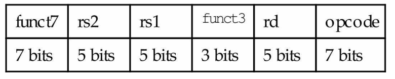
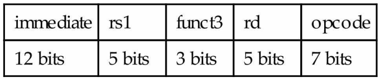
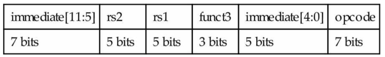
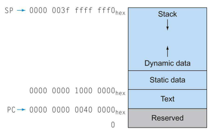
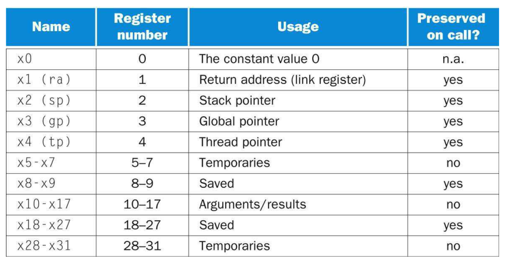
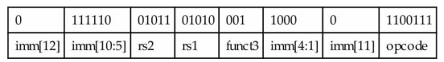
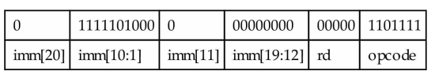
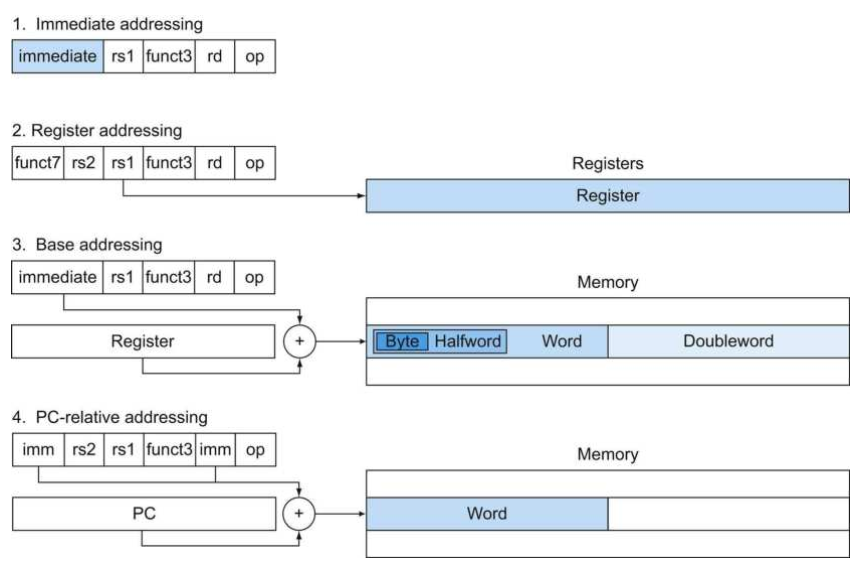

# 第2章 指令：计算机的语言

指令系统具有相似性：所有计算机基于相似基本原理的硬件构建。  
设计目标：让构建硬件和编译器容易，同时最大化性能且最小化成本和资源的语言。

硬件设计的基本原则：

* 简单源于规整：操作数数量可变的硬件比固定数量的硬件更复杂。  
* 更少则更快：数量过多的寄存器可能会增加时钟周期（电信号传输距离）。  
* 优秀的设计需要适当的折中

## RISC-V 基本指令结构

RISC-V 中的算术运算只能作用于寄存器，而寄存器是有限的，更多的数据存放在内存中，所以需要数据传输指令来在寄存器和内存之间传输数据。  
内存可以看作大型的一维数组。

在一些体系结构中，字的起始位置必须是 4 的倍数，而双字的起始位置必须是 8 的倍数。这一对齐限制能使数据传输更快。在 RISC-V 和 x86 中没有对齐限制，但在 MIPS 中存在。

RISC-V 字段：有用于寄存器的 R 型、用于立即数的 I 型和用于存储双字的 S 型，其原则是保持所有指令长度相同。

* `opcode`：操作码，指令的基本操作，表示指令操作和指令格式的字段  
* `rd`：目的操作数寄存器，存放操作结果  
* `funct3` 和 `func7` 操作码字段  
* `rs1`：第一个源操作数寄存器  
* `rs2`：第二个源操作数寄存器

值得注意的是立即数移位指令，虽然使用 I 型格式，但是由于对一个 64 位寄存器移动大于 63 位的操作并不适用，所以只有 12 位 immediate 字段中的低 6 位被使用，其余 6 位倍重新用作额外的操作码字段 funct6

## 分支预测与过程调用

分支判断跳转：

* RISC-V：使用 `beq, bne, blt, bge` 等指令来执行跳转。  
* MIPS：根据比较结果设置寄存器，然后仅使用 `beq, bne` 两个指令来执行跳转。使处理器数据通路更加简单，但需要更多的指令来表达程序。  
* ARM：使用额外的的位来记录执行期间发生的情况（条件代码，标志位），利用条件代码的组合来执行期望的判断。如果许多指令都要设置这些条件代码，会生成让流水线执行困难的依赖关系。

RISC-V 中对于过程调用的约定：

* `x10-x17` 共 8 个寄存器用于传递参数或返回值。（也记为 `a0-a7`）  
* `x1` 作为返回地址寄存器，用于返回到起始点  
* 一个仅用于过程的指令 `jal` ，跳转到某个地址同时将下一条指令的地址保存到目标寄存器 `rd`（通常是 x1），实际上是将程序计数器 PC +4 保存到指定寄存器中。  
* `x5-x7` 以及 `x28-x31` 为临时寄存器，在过程调用中不被被调用者保存；`x8-x9` 以及 `x18-x27` 为保存寄存器，在过程调用中必须被保存，一旦被修改使用则被调用者必须保存并在返回前恢复。

将寄存器内容换出到内存栈中以灵活地使用更多的寄存器。RISC-V 中保存栈指针的寄存器为 `x2`（也称为 `sp`）。按照惯例，栈以从高到低的地址顺序增长。  
栈同时还用于保存过程中的局部变量。栈中保存寄存器和局部变量的段称为过程帧或活动记录。帧指针 `x8`（或 `fp`）指向帧的第一个双字（通常是保存的参数寄存器），而栈指针 `sp` 则指向栈顶。栈指针在运行过程中可能会发生变化，而帧指针更加稳定，通过帧指针能更容易地引用变量。

## 内存结构与寄存器

C 语言中存在静态和动态两种类型。为简化静态数据的访问，一些 RISC-V 编译器保留一个寄存器 `x3` 用作全局指针 `gp`。

这一约定是 加速经常性事件 的另一个例子，大多数过程使用这些不用保存的寄存器以避免进入内存。

## 大立即数与分支地址优化
指令 `lui` 将 20 位的常数加载到寄存器的 31-12 位，第 31 位的值填充到最左边 32 位，而右边的 12 位则用 0 来填充。这一指令使用特殊的指令格式 U 型。这样就可以通过两个指令将 32 位常数加载进寄存器中。编译器或汇编程序通常都必须将大的常量分解为多个部分，组装到寄存器中。

RISC-V 中的分支指令使用的格式是 SB 型，以表示从 -4096 到 4094 的分支地址（以 2 的倍数表示）。该地址使用特殊的编码方式，简化了数据通路设计，但使组装变得更为复杂。

另一个特殊指令是无条件跳转-链接指令 jal，唯一使用 UJ 型格式。

这样将地址扩展到 $2^{20}$。如果需要更大的分支指令地址，可以通过寄存器内容+分支地址偏移量来实现。RISC-V 对条件分支和无条件跳转使用 PC 相对寻址，再使用双指令序列来长距离地跳转到任何 32 位地址。  
对于远距离的条件跳转（超过 12 位地址能表示的范围），汇编程序会插入无条件跳转到分支目标，并将条件取反来使用条件分支决定是否跳过该无条件跳转。

* 立即数寻址：操作数是指令本身的常量。  
* 寄存器寻址：操作数在寄存器中。  
* 基址或偏移寻址：操作数在内存中，其地址是寄存器和指令中常量之和。  
* PC 相对寻址：分支地址是 PC 与指令中常量之和。
