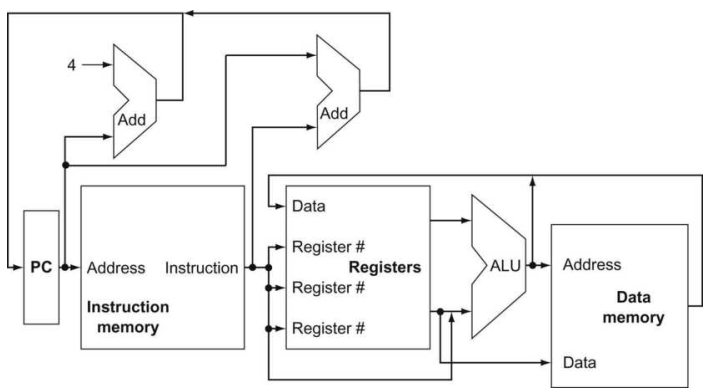
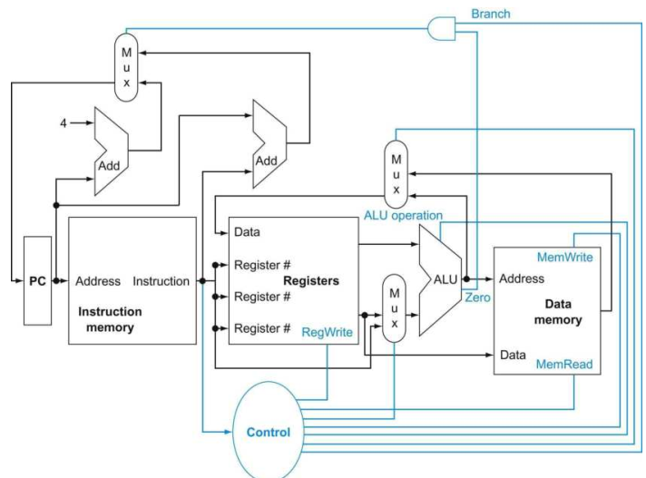
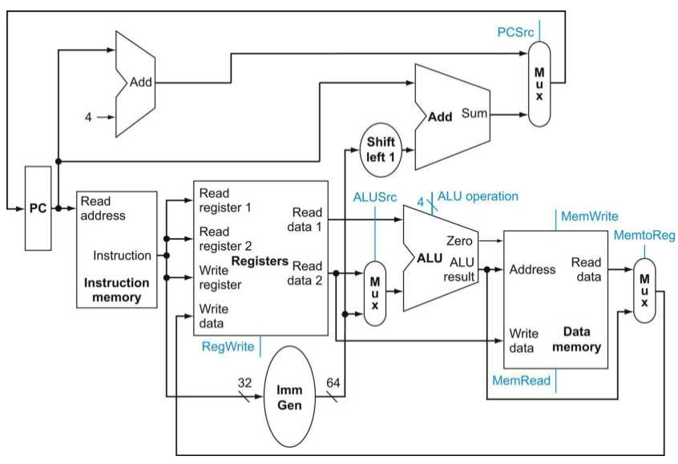
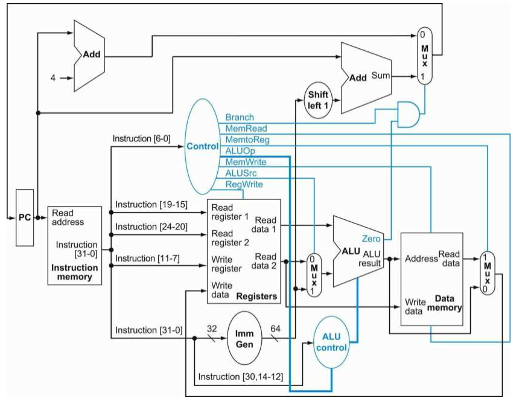
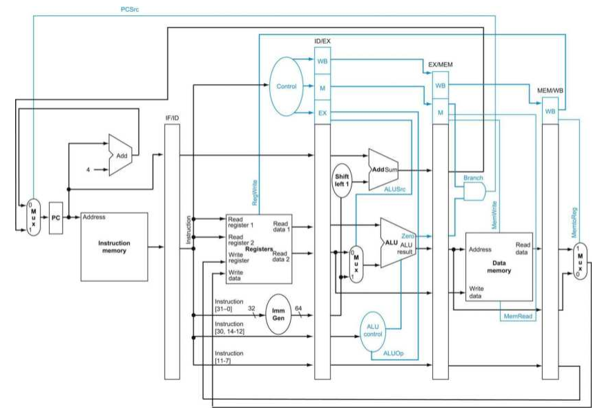

# 第4章 处理器

处理器的实现方式决定了时钟周期长度和 CPI 。

## RISC-V 核心子集的基本实现
考虑一个 RISC-V 的核心子集，包括：存储器访存指令（ld  和 sd），算术逻辑指令（add,sub and, or），条件分支指令（beq）。  
RISC-V 指令系统的简单性和规整性使不同类的指令具有类似的执行过程，从而简化了实现。

注意到图中多个数据指向同一个单元的情况，这是由于不同的指令类型可能导致不同的数据选择（而不是将这些多个数据混合）。通常需要使用多选器（数据选择器）来从多个数据源选择一个合适的发送给目标单元。  
同样也需要一些控制线来设置 ALU 的运算类型。  
增加了上述选择器和控制线的抽象图如下

## 数据通路单元
数据通路单元：用来操作或保存处理器中数据的单元（包括指令存储器，数据存储器，寄存器堆，ALU 和加法器）。  
在该精简 RISC-V 指令集架构中，需要考虑以下数据通路单元：

* 指令存储单元：存储程序指令，并根据给定地址提供指令。  
* 程序计数器 PC：保存当前指令的地址。  
* 加法器：用于增加 PC 的值以获得下一条指令的地址。  
* 寄存器堆：注意到 RISC-V 规范，需要 3 个寄存器号输入（2 个用于 read ，1 个用于 write），2 个寄存器数据输出和 1 个寄存器数据输入。寄存器号输入为 5 位宽（32个寄存器），而数据的输入和输出总线为 64 位宽。另外还需要一个附加的写信号来明确写控制有效。注意到写寄存器堆是边缘触发的，所以允许在同一个时钟周期内读写同一个寄存器（读操作立即读出原本存放的内容，而写操作的内容直到下一个周期才可读）。  
* ALU：读取两个 64 位输入并产生一个 64 位输出，另外还有一个附加的 1 位输出指示其结果是否为 0 。ALU 操作由 4 位的 ALU 控制信号控制。  
* 数据存储单元：包括一个地址输入和写数据输入，以及一个数据输出。读、写控制信号相互独立，但在任意一个时钟周期内仅有一个有效。  
* 立即数生成单元：包括一个 32 位的输入，扩展为 64 位输出。特别是用于计算分支指令所在地址的分支目标地址。

将上述数据通路单元组合起来，可以得到下面的图示

## 简单的实现方案
在 ALU 控制中，主控制单元生成一个两位的 ALUOp 信号作为 ALU 的控制输入信号，结合输入指令的 func7 和 func3 字段来输出一个 2 位的 ALU 控制信号。这种多级控制能有效减小主控制单元的规模，同时多个小控制单元可能潜在地减小控制单元地延迟。

## 流水线
使多条指令重叠执行以提报执行效率。并不会减少单独一条指令执行的时间，但是提高了吞吐率。  
流水线技术：指令间并行。

RISC-V 流水线包括以下几个步骤：

* 从存储器中取出指令  
* 读寄存器并译码地址  
* 执行操作或计算地址  
* 访问数据存储器中的操作数（如有必要）  
* 将结果写入寄存器（如有必要）

计算机流水线阶段的时间受限于最慢的阶段。  
假设写寄存器堆发生在时钟周期的前半段，读寄存器堆操作发生在时钟周期的后半段。

流水线冒险：

* 结构冒险：硬件不支持多条指令在同一周期内执行。若 RISC-V 中没有将存储器分开，则有可能出现两条指令一条取数据另一条取指令的问题。  
* 数据冒险：一条指令依赖于前面一条尚在流水线中的指令。使用前递或旁路的方式，添加硬件使得缺少的运算项能尽快地运送到需要的地方。但并不是所有数据冒险都能通过这种方式解决，有些时候仍然需要使用气泡来停下流水线，等待数据。  
* 控制冒险：需要根据一条指令的结果作出决定。有两种方法：其一是停顿，这一方法简单，但抛弃了流水线带来的性能提升；其二是预测，采用分支预测的技术，预取并执行之后的指令，若预测正确，则流水线继续运行，否则抛弃预测错误的指令执行的状态，重新执行正确的指令。值得注意的是，不论是采取停顿还是预测的办法，较长的流水线都会恶化相关性能。另外还有一种需要编译器合作的方式是延迟决定，由编译器负责在延迟转移指令后放置一条不受该分支影响的指令，在该指令执行之后再执行分支，这是 MIPS 架构使用的解决方案，其中编译器的这一指令重排对于程序员而言是不可见的（很少有处理器使用超过一个时钟周期的延迟转移）。

## 流水线数据通路和控制
引入寄存器来保存数据，使得部分数据通路可以在多个阶段间共享。  
在每个阶段之间引入流水线寄存器，指令在流水线中推进的同时，流水线寄存器中的数据也前进到下一个阶段的流水线寄存器。值得注意的是，最后一个阶段（写回）后没有流水线寄存器，因为所有的指令都必须更新处理器中的某些状态，在最后阶段没有必要再引入一个流水线寄存器来冗余地存放数据。

## 控制冒险

动态分支预测：常见的方法是使用分支预测缓存或分支历史表。使用一个按照分支地址的低位定位的小存储器，包含一个或多个比特用于指示该分支最近是否发生了跳转（通常是两位）。需要指出的是，分支预测器仅是对条件分支是否跳转的预测，具体跳转的位置仍然需要进行计算，在五级流水线中，这需要一个时钟周期的时间，解决办法是使用一个分支目标缓存来保存目标地址。  
相关预测器：组合使用局部分支和最近执行分支的全局行为信息，然后进行预测。对于每一个分支提供两个两位预测器，预测器之间的选择基于分支上一次执行时跳转还是不跳转（相当于在上述预测查找表中额外添加了一位索引）。  
锦标赛预测器：对于每个分支使用多种预测器，最终给出最佳的预测结果。典型的一般包括一个基于全局信息的预测器和一个基于局部信息的预测器。

还有一种减少分支的方法是使用条件移动指令，即根据条件改编移动的目标寄存器。

## 例外
硬件和操作系统协同操作来处理例外。按照规范，硬件暂停引发例外的指令的执行，将流水线之前的指令执行完，并清除掉之后的指令。同时硬件还负责设置寄存器来记录例外的原因，保存引发例外的地址，并最终将控制流转向例外处理程序的入口。由操作系统来作出具体的相应动作。

## 指令间的并行性
提高指令并行度的办法：增加流水线级数；增加流水线内部的功能部件数量（多发射）。

关于多发射处理器：主要有两种实现方法，区别在于编译器和硬件的不同分工，指令发射的判断在编译时完成称为静态多发射，在动态执行过程中由硬件完成称为动态多发射。  
主要关注：将指令打包并放入发射槽（指令数量，发射哪些指令）；处理数据和控制冒险。

推测：另一种深度挖掘指令级并行的方法。允许编译器或处理器猜测指令的行为，并提前执行。难点在于猜测的正确率和猜测错误后的恢复。

循环展开：专门针对循环体提高程序性能的编译技术。将循环体展开多遍，寻找可以重叠执行的指令来挖掘指令级并行性。

动态调度流水线：由硬件选择后续执行的指令，并对指令进行重排避免流水线停顿。流水线被分为三个部分：取指和发射单元（取指令，译码并分配给功能单元），多功能部件，提交单元。在每个功能单元前都有若干缓冲区（保留站）用于存放指令的操作和所需的操作数，当缓冲区的指令所需的操作数准备好且功能单元准备就绪，就可以执行该指令。最后由提交单元保存已完成指令的执行结果，并在指令真正提交时用于更新寄存器或写入内存（这一缓冲区被称为重排序缓冲，同时也负责前递）。

乱序执行：处理器在不违背程序原有数据流顺序的前提下以某种顺序执行指令。
